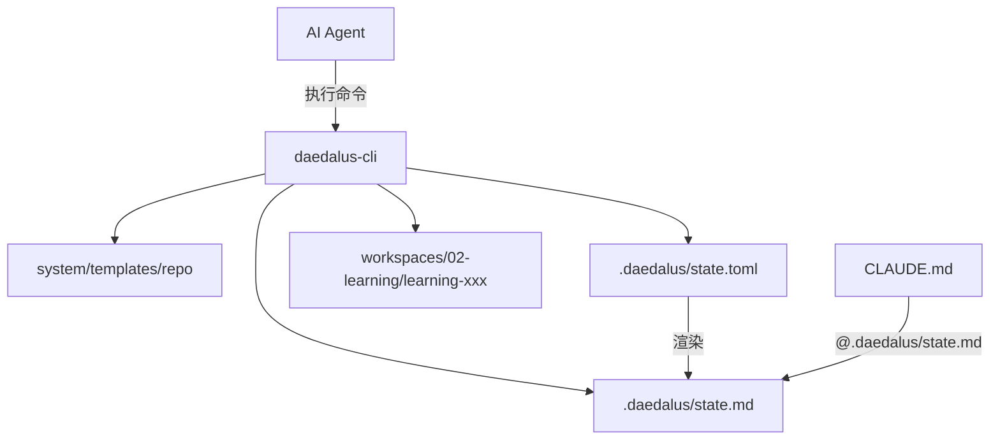

# daedalus-cli 技术实现方案

## 目标

`daedalus-cli` 负责把容易出错的状态操作从 Agent 手里拿出来，变成可重复、可校验、可测试的确定性逻辑。第一版不做教学判断，只做文件系统初始化、`.daedalus/state.toml` 状态更新、`.daedalus/state.md` 渲染和 workspace 校验。

## 架构



## Crate 结构

在 [`crates`](crates) 下创建 Rust workspace：

```text
crates/
  Cargo.toml
  daedalus-cli/
    Cargo.toml
    src/
      lib.rs
      bin/
        daedalus.rs        # Agent-friendly CLI
        daedalus-tui.rs    # Human-friendly TUI
      domain/
        mod.rs
        stage.rs
        learning_task.rs
        transition.rs
        artifact.rs
        error.rs
      application/
        mod.rs
        init_task.rs
        transition_stage.rs
        validate_workspace.rs
        render.rs
      infrastructure/
        mod.rs
        state_toml.rs
        template_fs.rs
        workspace_fs.rs
        clock.rs
      interfaces/
        mod.rs
        agent_cli/
          mod.rs
          args.rs
          presenter.rs
        tui/
          mod.rs
          app.rs
          screens.rs
          presenter.rs
```

第一版就在一个 package 里做两个 bin，而不是拆多个 crate。`src/lib.rs` 暴露共享的领域逻辑、应用服务和基础设施适配器；`src/bin/daedalus.rs` 提供 Agent-friendly CLI；`src/bin/daedalus-tui.rs` 提供 Human-friendly TUI。二者共享同一套 use case，差异只在输入/输出层。

DDD 分层边界：

- `domain`：学习任务、阶段、状态、transition、artifact、业务错误，不依赖文件系统和 UI。
- `application`：编排 use case，例如初始化任务、阶段流转、校验、渲染 state.md。
- `infrastructure`：读写 `.daedalus/state.toml`、复制模板、检查文件、获取时间。
- `interfaces/agent_cli`：面向 Agent 的命令、文本输出、JSON 输出和退出码。
- `interfaces/tui`：面向人的 ratatui 页面、键盘事件和状态展示。

核心原则：UI 层不能直接改 `state.toml`；所有状态变化都必须调用 application use case。

## 依赖

依赖保持克制，优先选择稳定、常见、容易维护的 crate：

- `clap`：命令行参数解析。
- `anyhow`：CLI 顶层错误处理。
- `thiserror`：需要领域错误时再引入。
- `toml_edit`：更新 `.daedalus/state.toml`，同时尽量保留注释和格式。
- `chrono` 或 `time`：为 transitions 生成时间戳。
- `walkdir` 或标准库 `fs`：复制模板和检查产物。
- `camino` 可选：如果路径处理变复杂，再用 UTF-8 path 降低心智负担。
- `ratatui`：实现 human-friendly TUI。
- `crossterm`：作为 ratatui 的终端 backend 和键盘事件来源。

v1 不使用 serde 对 `state.toml` 做完整反序列化再序列化，因为这样会丢失注释。

## 可执行文件设计

### `daedalus`

`daedalus` 是 Agent-friendly CLI。它的主要调用者是 Cursor Agent、Claude Code、Codex 或其他自动化脚本。

要求：

- 非交互优先。
- 输出稳定，适合 Agent 解析。
- 默认文本简洁，支持 `--format json`。
- 错误包含下一步建议。
- 退出码明确。

### `daedalus-tui`

`daedalus-tui` 是 Human-friendly TUI。它的主要调用者是用户本人，用于快速查看和操作学习任务状态。

要求：

- 使用 `ratatui` 展示学习任务总览、当前阶段、缺失产物、todo 和 transitions。
- 所有状态变化仍然调用 application use case，不直接写文件。
- TUI 是同一套能力的可视化外壳，不引入第二套业务逻辑。
- 可以晚于 `daedalus` 实现，但架构从一开始为它保留接口层。

## Agent CLI 命令设计

### `daedalus init repo-learning <name>`

在 `workspaces/02-learning/<name>` 下创建新的学习任务目录，并初始化：

```text
CLAUDE.md
.daedalus/task-card.md
.daedalus/state.toml
.daedalus/state.md
.daedalus/todo.md
.daedalus/long-context.md
.daedalus/artifact-index.md
.daedalus/decision-log.md
source/.gitkeep
demo/.gitkeep
notes/.gitkeep
```

职责：

- 默认强制 WIP = 1，除非显式传入 `--allow-existing-active`。
- 从 `system/templates/repo` 复制模板。
- 填充简单占位符，例如任务名、创建时间、初始阶段。
- 创建 `.daedalus/state.toml` 后立刻渲染 `.daedalus/state.md`。

### `daedalus state enter <stage-id>`

更新 `.daedalus/state.toml`：

- `current_phase = <stage-id>`
- 当前阶段 `status = "active"`。
- 上一个 active 阶段必须变成 `done`、`blocked`，或者在显式允许时保持 active。
- 追加 `[[transitions]]`，记录 action `enter`、timestamp、reason、actor。
- 重新生成 `.daedalus/state.md`。

### `daedalus state complete <stage-id>`

完成一个阶段：

- 检查阶段存在。
- 检查 required artifacts 是否存在；如果缺失，需要 `--force --reason`。
- 设置阶段 `status = "done"`。
- 追加 transition action `complete`。
- 重新生成 `.daedalus/state.md`。

`--force` 必须被视为受控逃生门，而不是常规流程。Agent 只有在以下情况之一成立时才能使用：

- 用户在对话中明确同意强制完成或跳过某个缺失条件。
- 缺失 artifact 有可追溯替代证据，例如内容已存在于另一个文件，并且 `--reason` 中写明位置。
- 当前阶段被明确标记为不适用，并且后续阶段不会依赖该产物。

禁止 Agent 因为“想继续推进”而自行使用 `--force`。

### `daedalus state block <stage-id> --reason <reason>`

标记阶段阻塞：

- 设置阶段 `status = "blocked"`。
- 在 transition metadata 中记录阻塞原因。
- 重新生成 `.daedalus/state.md`。

### `daedalus state resume <stage-id>`

恢复 blocked 或 paused 阶段：

- 设置阶段 `status = "active"`。
- 更新 `current_phase`。
- 追加 transition action `resume`。
- 重新生成 `.daedalus/state.md`。

### `daedalus state render [task-dir]`

读取 `.daedalus/state.toml`，写入 `.daedalus/state.md`。

`state.md` 要面向 Agent 阅读优化：

- 当前 phase、step、status、next action。
- 阶段进度列表。
- 缺失产物。
- 阻塞项。
- 最近 transitions。

### `daedalus validate [task-dir]`

检查 workspace 一致性：

- 必需的 `.daedalus` 文件存在。
- `state.toml` 可以解析。
- 最多只有一个 active stage。
- `current_phase` 指向一个真实存在的 stage。
- `state.md` 相对于 `state.toml` 是新鲜的，或者可以重新生成。
- 已完成阶段的 required artifacts 存在。
- `workspaces/02-learning` 下满足 WIP 约束。

## `state.toml` 更新策略

使用 `toml_edit::DocumentMut` 作为编辑入口：

- 解析现有文档。
- 每个命令只更新必要字段。
- 尽量保留注释和字段顺序。
- 追加新的 `[[transitions]]`，不要重写 transition 历史。
- 避免对整个文档做格式归一化。

关键辅助函数：

- `load_state_doc(path) -> DocumentMut`
- `save_state_doc(path, doc)`
- `set_current_phase(doc, stage_id)`
- `set_stage_status(doc, stage_id, status)`
- `append_transition(doc, transition)`
- `collect_missing_artifacts(doc, task_dir)`

## `state.md` 渲染契约

`state.md` 是生成文件，开头应固定为：

```markdown
# Learning State

> Generated from `.daedalus/state.toml`. Do not edit manually.
```

渲染器必须是确定性的：同一份 `state.toml` 应生成同一份 `state.md`，除了 `state.toml` 中已经存在的时间戳。

推荐章节：

- `Current`
- `Stage Progress`
- `Missing Artifacts`
- `Blockers`
- `Recent Transitions`
- `Next CLI Suggestions`

## 输出层策略

这个项目可以在一个 crate 内同时提供两套输出层：Agent-friendly CLI 和 Human-friendly TUI。二者共享 domain、application、infrastructure，只在 `interfaces` 层分叉。

### Agent-friendly CLI

- 输出稳定：同一个错误尽量输出同样的结构和措辞，方便 Agent 识别。
- 退出码明确：成功为 `0`，校验失败、参数错误、状态冲突使用不同错误路径。
- 错误可行动：每个错误都给出下一步建议。
- 避免交互式 prompt：默认不要求用户在终端里选择，必要时通过显式参数传入。
- 支持 `--json` 或 `--format json`：后续让 Agent 更可靠解析结果。
- 默认文本输出简洁：适合人类扫一眼，也不会干扰 Agent。
- 对 `--force`、`--skip`、`--allow-existing-active` 这类绕过型参数给出额外警告，并要求填写 `--reason`。
- 输出建议应优先引导 Agent 补齐缺失信息或询问用户，而不是默认建议强制通过。

建议输出示例：

```text
error: missing required artifact
artifact: .daedalus/task-card.md
stage: 01-clarify-goal
next: complete the artifact, ask the user for confirmation, or rerun with --force --reason <reason> only if explicitly approved
```

如果加 JSON 输出：

```json
{
  "ok": false,
  "error": "missing_required_artifact",
  "artifact": ".daedalus/task-card.md",
  "stage": "01-clarify-goal",
  "next": "complete the artifact, ask the user for confirmation, or rerun with --force --reason <reason> only if explicitly approved",
  "force_requires_user_approval": true
}
```

### Human-friendly TUI

TUI 用 `ratatui` 做人类友好的状态浏览和轻量操作。它不是 Agent 调用入口，也不需要追求输出可解析。

第一版 TUI 可以只做只读总览：

- 当前 active learning task。
- 当前阶段和状态。
- 缺失 artifacts。
- `todo.md` 摘要。
- 最近 transitions。
- 可执行的下一步 CLI 建议。

第二版再考虑交互式操作：

- 选择阶段并执行 enter/complete/block/resume。
- 查看 artifact index。
- 浏览 decision log。
- 打开或复制建议命令。

TUI 不应该绕过 application 层直接修改文件。任何写操作都必须复用和 `daedalus` 相同的 use case。

## 模板策略

长期方案使用 CLI 初始化模板，而不是 bash `cp`。

原因：

- CLI 可以在创建任务前强制 WIP = 1。
- CLI 可以生成唯一任务目录。
- CLI 可以稳定填充占位符。
- CLI 可以初始化 `state.toml` 并立刻渲染 `state.md`。
- CLI 可以校验生成的根目录 `CLAUDE.md` 引用的是 `@.daedalus/state.md`，而不是 `@.daedalus/state.toml`。

第一版使用纯文本模板和简单占位符替换。没有真实需求前，不引入模板引擎。

## 错误处理

错误必须明确、稳定、可行动：

- `NoActiveWorkspace`
- `TaskAlreadyActive`
- `StateFileMissing`
- `InvalidStageId`
- `MultipleActiveStages`
- `MissingRequiredArtifact`
- `StateMarkdownStale`
- `ForceRequiresApproval`

CLI 输出要告诉 Agent 下一步该做什么，例如：

```text
missing required artifact: .daedalus/task-card.md
next: complete task-card.md, ask the user for approval, or rerun with --force --reason <reason> only if explicitly approved
```

强制通过类 option 的处理规则：

- `--force` 必须搭配 `--reason`。
- `--reason` 不能是空泛描述，例如 `continue`、`skip`、`not needed`。
- 如果 CLI 可以检测到缺少 `--reason`，应直接失败。
- 如果 Agent 使用 `--force`，transition metadata 必须记录 reason、actor 和 approval source。
- approval source 可以是 `user-confirmed`、`artifact-equivalent`、`stage-not-applicable`。
- 默认错误建议应该先引导 Agent 补齐 artifact 或询问用户，而不是直接建议使用 `--force`。

## 测试计划

在 crate tests 下准备 fixture 目录：

```text
daedalus-cli/tests/fixtures/
  valid-task/
  missing-artifacts/
  commented-state/
```

优先测试：

- `enter` 和 `complete` 后，`toml_edit` 能保留注释。
- `state render` 生成稳定的 markdown。
- `validate` 能发现缺失的 `.daedalus` 文件。
- WIP = 1 时，`init` 拒绝创建第二个 active task。
- 缺少 required artifacts 时，`complete` 拒绝完成，除非显式 `--force`。
- `--force` 缺少 `--reason` 时必须失败。
- `--force --reason` 成功时必须记录 approval source。

## 分阶段实现

### 阶段 1：脚手架

- 创建 Rust workspace 和 `daedalus-cli` package。
- 在同一个 package 中创建 `daedalus` 和 `daedalus-tui` 两个 bin。
- 建立 DDD 分层目录：`domain`、`application`、`infrastructure`、`interfaces`。
- 添加 `clap`、`anyhow`、`toml_edit`、时间戳依赖，并预留 `ratatui`/`crossterm`。
- 实现 Agent CLI 命令骨架和路径解析。

### 阶段 2：初始化

- 实现 `init repo-learning <name>`。
- 复制 `.daedalus` 模板。
- 创建 `source`、`demo` 和 `notes` 目录。
- 渲染初始 `state.md`。

### 阶段 3：状态流转

- 实现 `enter`、`complete`、`block`、`resume`。
- 追加 transitions。
- 保留 TOML 注释。
- 每次状态变化后重新生成 `state.md`。

### 阶段 4：校验

- 校验 workspace 结构、state 一致性、artifacts 和 WIP。
- 返回 Agent-friendly 的错误信息。

### 阶段 5：TUI 只读总览

- 实现 `daedalus-tui` 的只读页面。
- 展示 active task、当前阶段、缺失产物、todo 摘要和最近 transitions。
- TUI 读取 application 查询结果，不直接读取或修改底层文件。

### 阶段 6：测试和收尾

- 添加 fixtures 和类似 snapshot 的 `state.md` 断言。
- 添加 agent CLI presenter 测试，确保文本和 JSON 输出稳定。
- 添加 TUI smoke test 或最小组件测试，不追求复杂终端交互测试。
- 添加 README 使用示例。
- 如有需要，后续再接入 `system/bin/setup.sh`。

## V1 不做

- 完整 telemetry dashboard。
- 自动评分用户学习质量。
- 超出简单占位符替换的模板引擎。
- book/paper/course 等多材料学习。
- MCP server 集成。
- 自动 git 操作。
- 复杂 TUI 写操作、交互式向导或终端美化细节。

## 验收标准

- 可以用一条 CLI 命令初始化新的 repo learning task。
- CLI 更新后，`.daedalus/state.toml` 仍保留注释并保持人类可读。
- `.daedalus/state.md` 可以从 `state.toml` 生成，并可被根目录 `CLAUDE.md` 通过 `@` 引入。
- 阶段流转是确定性的，并记录在 `[[transitions]]` 中。
- `validate` 能发现 state 缺失、阶段引用错误、required artifacts 缺失和 WIP 违规。
- `daedalus` 提供稳定的 Agent-friendly 文本输出，并预留 JSON 输出。
- `daedalus-tui` 至少能只读展示当前任务、阶段状态、缺失产物和最近 transitions。
- 强制通过类 option 受到约束：必须有明确 reason 和 approval source，且 CLI 输出默认引导 Agent 先补齐信息或询问用户。
