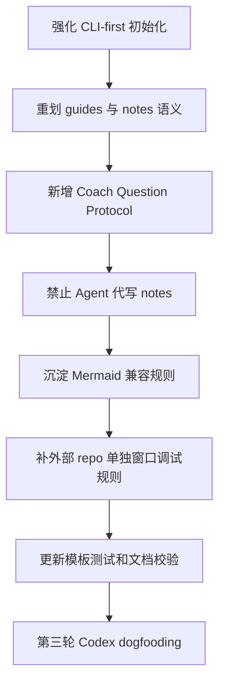

# daedalus 教练式交互改进计划

## 问题判断

第二轮实践比第一轮已有明显进步：Agent 使用了 CLI、停在 03 等待用户回答、要求用户亲自运行命令。但截图和对话记录也暴露出新的核心问题：daedalus 仍然更像“帮用户推进学习任务的自动化 Agent”，还不够像“持续激发用户思考和实践的教练”。

当前最需要改的不是更多自动化，而是把“用户亲自思考、回答、运行、观察、总结”变成流程里的硬约束。

## 观察到的不足

### 1. 初始化仍不够 CLI-first

截图显示 Agent 先检查 `.daedalus/state.toml`、搜索 README 和源码，最后才决定用 `daedalus init repo-learning`。这说明它虽然最终用了 CLI，但流程意识仍然不够坚定。

需要改成：当用户开启新的 repo learning 任务时，Agent 应立即判断是否存在 active task；如果没有，就直接使用 `daedalus init repo-learning <name>` 创建任务。不要先尝试读模板、手写结构或自行推断初始化方式。

### 2. `guides/` 与 `notes/` 语义还不彻底

用户指出 `repo-selection.md` 不适合放在 `notes/`。这是正确的：repo selection 更多是 Agent 帮用户做的选择评估、风险提示和行动建议，应该属于 `guides/`。

`question-roadmap.md` 可以留在 `notes/`，但应该更像用户学习记录，而不是 Agent 友好的完整分析文档。它只需要保留：当前目标、本轮问题、用户回答。

### 3. 提问不应该只属于 03 阶段

daedalus 的 coach 能力不应该集中在 `03-socratic-coach`。每个阶段、每个重要节点都应该用问题引导用户：为什么要这么做、你预期会看到什么、如果结果不符合预期说明什么、下一步应该验证什么。

当前缺少一套统一的“提问协议”，导致 Agent 有时直接开始解释、整理笔记和推进阶段，而不是先激发用户形成假设。

### 4. Agent 仍会替用户生成学习笔记

截图中最关键的问题是：用户没有经历对应的学习过程，Agent 却已经整理好了 notes。这会让最终产物看起来完整，但学习主体变成了 AI。

需要明确：`notes/` 是用户理解的证据，不是 Agent 输出能力的展示。Agent 可以生成 `guides/`、草稿、问题和提示，但不能在用户没有回答、观察或实践前，把“学习结论”写入 `notes/` 并当作阶段成果。

### 5. Mermaid 规则需要沉淀到 daedalus 自身

第二轮实践里出现了 Mermaid 兼容问题：`
`、` `、Typora 对保留字和 sequenceDiagram alias 的支持差异。这类规则不应该只存在于某个学习任务或对话里，应沉淀到 daedalus 的 prompt/docs 中，指导后续所有 notes/guides 画图。

## 改进方案一：强化 CLI-first 初始化规则

### 修改目标

让 Agent 在新学习任务开始时形成稳定动作：先用 CLI 初始化，不手写模板。

### 修改文件

- [`system/prompts/repo/phase1-exploration/01-goal-aligner.md`](system/prompts/repo/phase1-exploration/01-goal-aligner.md)
- [`system/templates/repo/CLAUDE.md`](system/templates/repo/CLAUDE.md)
- [`README.md`](README.md)

### 具体方案

- 在 01 prompt 中新增 `Initialization Rule`：
  - 如果用户开启新的 repo learning，先检查 WIP，再运行 `daedalus init repo-learning <task-name>`。
  - 不要手写 `.daedalus`、`state.toml`、`todo.md` 等模板文件。
  - 如果 CLI 不可用，先报告阻塞原因，不要自动 fallback 到手写模板。
- 在 `CLAUDE.md` 模板中补充：当前任务目录已经存在时才读 `.daedalus/state.md`；创建新任务必须回到 daedalus 根目录用 CLI。
- 在 README 的常用流程中强调新任务创建必须通过 CLI。

## 改进方案二：重新定义 01-03 产物归属

### 修改目标

让 `guides/` 和 `notes/` 的职责更严格，避免 Agent 把自己的分析伪装成用户笔记。

### 修改文件

- [`system/templates/repo/.daedalus/state.toml`](system/templates/repo/.daedalus/state.toml)
- [`system/templates/repo/.daedalus/artifact-index.md`](system/templates/repo/.daedalus/artifact-index.md)
- [`system/prompts/repo/phase1-exploration/02-repo-scout.md`](system/prompts/repo/phase1-exploration/02-repo-scout.md)
- [`system/prompts/repo/phase1-exploration/03-socratic-coach.md`](system/prompts/repo/phase1-exploration/03-socratic-coach.md)
- [`crates/daedalus-cli/tests/cli_workflow.rs`](crates/daedalus-cli/tests/cli_workflow.rs)

### 具体方案

- 将 `02-repo-scout` 的 required artifact 从 `notes/repo-selection.md` 调整为 `guides/02-repo-selection-guide.md`。
- `repo-selection` 由 Agent 生成，内容包括候选 repo、选择理由、风险和源码拉取建议。
- `notes/` 不再要求存在 `repo-selection.md`，除非用户自己想记录选择过程中的思考。
- 保留 `notes/question-roadmap.md`，但模板语义改成极简用户记录：
  - 当前目标
  - 本轮问题
  - 用户回答
- 复杂的问题设计、验证路径、文件入口和假设清单放到 `guides/03-question-roadmap-guide.md`。

## 改进方案三：建立全阶段 Coach Question Protocol

### 修改目标

让提问成为 daedalus 的核心能力，而不是 03 阶段的一次性动作。

### 新增文件

- `system/prompts/common/coach-questioning.md`

### 协议内容

定义 daedalus 提问的三个层次：

- 第一性原理问题：为什么这个问题重要？如果没有这个机制会失败在哪里？
- 现实约束问题：真实工程环境中有哪些不确定性、权限、成本和风险？
- 验证假设问题：你预期源码/运行结果会怎样证明或推翻你的理解？

定义什么时候提问：

- 开启新学习主题时。
- 进入每个 stage 前。
- 用户要求 Agent 解释复杂机制前。
- Agent 准备写 notes 前。
- 用户说“我懂了”或“继续”时。
- 阶段完成前。

定义提多少问题：

- 默认每次 1-3 个。
- 用户在操作中卡住时，只问 1 个最关键问题。
- 进入新阶段时最多 3 个。
- 不把问题变成考试，必须服务于下一步实践或验证。

定义如何引导用户回答：

- 允许用户用粗糙答案、猜测、列表回答。
- Agent 先复述用户假设，再指出哪些可验证、哪些需要源码/运行证据。
- Agent 不直接给最终答案，而是给提示路径、观察点或最小实验。
- 用户回答后，才能把内容写入 `notes/`。

## 改进方案四：禁止 Agent 直接替用户写学习 notes

### 修改目标

让 `notes/` 成为用户学习证据，而不是 Agent 自动生成的知识库。

### 修改文件

- [`system/templates/repo/CLAUDE.md`](system/templates/repo/CLAUDE.md)
- [`system/prompts/repo/phase2-learning/04-debugger-guide.md`](system/prompts/repo/phase2-learning/04-debugger-guide.md)
- 后续 05-10 prompts 也应逐步同步

### 具体方案

- 在 `CLAUDE.md` 中新增 `Notes Ownership Rule`：
  - Agent 不得在用户没有回答、观察或实践前，把结论写入 `notes/`。
  - Agent 可以写 `guides/`，也可以在 `notes/` 中创建待用户填写的轻量模板。
  - 若 Agent 帮忙整理用户口述内容，必须保留“用户原始回答”和“待验证假设”。
- 在 04 prompt 中要求：运行结果、调试发现、bug 记录必须来自用户实际操作；Agent 只能协助整理。
- 对后续 code reading notes 增加规则：先让用户说出理解，再由 Agent 校正和补图。

## 改进方案五：沉淀 Mermaid 兼容规则

### 修改目标

让所有由 daedalus 生成的 guides/notes 图示更稳定，适配 Typora 和常见 Mermaid renderer。

### 修改文件

- 新增或更新 `system/prompts/common/diagram-guidelines.md`
- 在需要画图的 repo prompts 中按需引用
- 更新 [`crates/docs/repo-learning-stage-state-flow.md`](crates/docs/repo-learning-stage-state-flow.md)

### 规则建议

- Mermaid 节点 ID 不使用保留字，例如 `loop`、`end`、`graph`。
- `sequenceDiagram` participant alias 使用大写或明确缩写，例如 `SUB`，展示名用引号。
- 消息文本中避免写容易被解析误判的 `->`。
- 图要简约，只画关键关系，不把所有细节塞进一张图。
- 如果图是写给用户理解的 notes，应优先表达用户已经验证过的链路。

## 改进方案六：单独窗口学习外部 repo 的指导

### 修改目标

第二轮实践中调试配置路径出错，原因是 daedalus 假设 Cursor workspace 是 daedalus 根目录，而用户实际应该单独打开被学习 repo。

### 修改文件

- [`system/prompts/repo/phase2-learning/04-debugger-guide.md`](system/prompts/repo/phase2-learning/04-debugger-guide.md)
- [`system/templates/repo/source/README.md`](system/templates/repo/source/README.md)
- [`README.md`](README.md)

### 具体方案

- 明确推荐：学习外部 repo 时，daedalus 负责保存学习状态；实际运行/调试应在外部 repo 根目录或其实际 workspace 根目录单独打开 Cursor 窗口。
- `guides/04-run-debug-guide.md` 中的 `launch.json`、断点配置和路径示例必须以被学习 repo 的 workspace root 为基准。
- daedalus 任务目录只保存说明、笔记、复盘和拉取脚本，不强行把所有调试配置都放在 daedalus 根目录语境下。

## 推荐实施顺序

## 验收标准

完成本轮优化后，第三轮 Codex 实践应满足：

- Agent 在初始化时直接使用 `daedalus init repo-learning`，没有手写模板冲动。
- `02-repo-scout` 的 Agent 评估材料位于 `guides/`，不是 `notes/`。
- `notes/question-roadmap.md` 简洁记录当前目标、本轮问题、用户回答。
- 任意阶段开始或深入新机制前，Agent 都会提出 1-3 个高质量问题。
- 用户未回答、未运行、未观察前，Agent 不会生成完整学习 notes。
- 复杂链路 notes 会按需使用简约 Mermaid，且兼容 Typora。
- 04 阶段的调试指南默认以被学习 repo 的独立 Cursor workspace 为基准。
