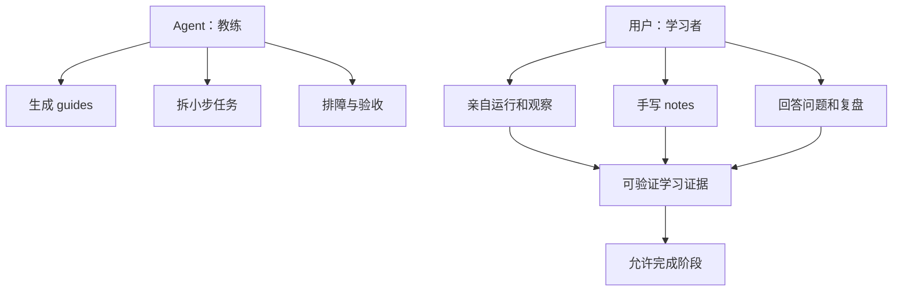
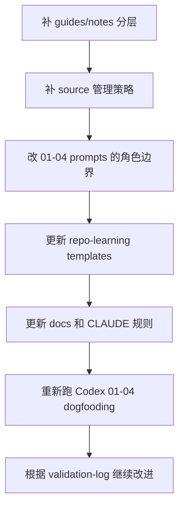

# daedalus 01-03 阶段改进计划

## 背景判断

这次 Codex 实践证明 daedalus 的 01-03 最小闭环已经能跑通：任务创建、状态推进、required artifacts、`state.md`、`todo.md`、CLI 校验都能协作。但它也暴露出更关键的问题：Agent 倾向于把学习流程“做完”，而不是持续引导用户亲自实践。

核心改进方向不是让 daedalus 更自动化，而是让它更像学习教练：Agent 负责拆任务、给指南、排障、验收、复盘；用户负责关键实践、手写笔记、做判断、形成理解。

## 主要问题

来自 [`crates/docs/dev-records/cursor_codex.md`](crates/docs/dev-records/cursor_codex.md) 和 [`crates/docs/instructions/stage-01-03-instructions.md`](crates/docs/instructions/stage-01-03-instructions.md) 的问题可以归纳为四类：

- 源码管理问题：Agent 直接 clone repo 到 `source/`，没有忽略源码、移除嵌套 `.git`、生成可复现拉取脚本，容易让 daedalus 仓库膨胀。
- 用户参与不足：Agent 快速创建任务、写卡片、选仓库、克隆源码、构建验证并推进阶段，用户更像旁观者。
- 阶段职责偏移：`debug-guide` 阶段本应指导用户自己启动和调试项目，但实践中变成 Agent 代跑命令并记录结果。
- 产物归属混乱：Agent 生成的建议和指南写入 `notes/`，但 `notes/` 更应该承载用户自己的手写理解；Agent 产物应放入 `guides/`。

## 设计原则



后续所有 01-10 阶段都应遵守这个原则，但本计划先聚焦 01-03 与紧邻的 04 入口，因为这次实践主要暴露的是前几阶段如何启动学习的问题。

## 改进一：引入 `guides/` 与 `notes/` 分层

### 目标

将 Agent 生成的教学材料和用户自己的学习笔记分离：

- `guides/`：Agent 生成的行动指南、问题引导、运行说明、验收清单。
- `notes/`：用户手写的观察、回答、理解、疑问和结论。

### 修改范围

- 更新 [`system/templates/repo`](system/templates/repo) 的任务目录模板，新增 `guides/.gitkeep`。
- 更新任务目录说明和 [`crates/docs/repo-learning-stage-state-flow.md`](crates/docs/repo-learning-stage-state-flow.md)，明确 `guides/` 与 `notes/` 的职责。
- 更新 `CLAUDE.md` 模板，让 Agent 默认把“指导用户怎么做”的内容写到 `guides/`，不要直接替用户写学习笔记。

### 产物建议

```text
learning-xxx/
  guides/
    01-goal-alignment-guide.md
    02-repo-selection-guide.md
    03-question-roadmap-guide.md
    04-run-debug-guide.md
  notes/
    goal-reflection.md
    repo-selection.md
    question-roadmap.md
    runbook.md
```

这里不要求一次性创建所有文件，模板只需要创建目录和说明；具体 guide 按阶段生成。

## 改进二：调整 01-03 阶段产物语义

### 目标

required artifacts 不能只代表“Agent 写了一个文件”，而要尽可能代表“用户参与后留下的学习证据”。

### 阶段调整

- `01-goal-aligner`：
  - Agent 可生成 `guides/01-goal-alignment-guide.md`，提出澄清问题和验收标准候选。
  - 用户应补充 `.daedalus/task-card.md` 或确认其中关键字段。
  - 阶段完成前，Agent 必须记录用户确认过的目标、边界和验收标准。

- `02-repo-scout`：
  - Agent 可生成 `guides/02-repo-selection-guide.md`，列出候选 repo、比较维度和建议。
  - 用户应在 `notes/repo-selection.md` 中确认选择理由、放弃理由和风险接受。
  - 阶段完成前，不能只因为用户最初说“学 Codex”就默认完成。

- `03-socratic-coach`：
  - Agent 可生成 `guides/03-question-roadmap-guide.md`，组织问题层次。
  - 用户应在 `notes/question-roadmap.md` 中回答或改写关键问题，形成自己的阅读假设。
  - 阶段完成前，至少要有一组“用户回答后要验证”的问题。

## 改进三：源码拉取与忽略策略

### 目标

`source/` 是学习原材料缓存，不应该让外部源码污染 daedalus 仓库。

### 修改范围

- 在 repo-learning 模板中为 `source/` 增加 `.gitignore`，默认忽略外部源码内容，但保留 `.gitkeep`、`README.md` 或 `pull_source.sh`。
- 新增 `source/pull_source.sh` 模板，用于可复现拉取源码。
- prompt 中明确：如果 Agent 帮用户准备源码，只能写脚本和说明；是否执行 clone 应优先交给用户。
- 如果确实由 Agent 执行 clone，需要删除拉下来的仓库自带 `.git` 目录，或确保不会被当前 daedalus 仓库纳入版本控制。

### `pull_source.sh` 应包含的信息

- repo URL。
- pinned commit 或 tag。
- shallow clone 策略。
- clone 后移除嵌套 `.git` 的说明或命令。
- 如果源码已存在，如何更新或跳过。

## 改进四：建立“用户实践门禁”

### 目标

阶段完成不能只看文件存在，还要让 Agent 明确区分：哪些由 daedalus 做，哪些必须由用户做。

### Prompt 层改进

在 01-03 和后续阶段 prompt 中加入固定小节：

```markdown
## Role Split

+- daedalus 应该做：
+- 用户必须亲自做：
+- daedalus 可以协助但不能代替：

- +## Before Completion
  +- 用户已经确认/回答：
  +- 用户已经亲自实践：
  +- 产物中留下的证据：
  +- 是否允许进入下一阶段：
```

### CLI 层可选增强

短期可以先靠 prompt 和模板约束，不急着做复杂 CLI 评分。但可以考虑在 `state complete` 的输出中提示：

- 完成前请确认 required artifacts 是用户参与后的产物。
- 如果只是 Agent 自动生成，应先让用户审阅或实践。

## 改进五：重写 04-debugger-guide 的行为边界

### 目标

04 阶段不是 Agent 帮用户启动项目，而是 Agent 指导用户自己启动、观察、记录和排障。

### 修改方向

- `guides/04-run-debug-guide.md`：由 Agent 生成启动步骤、预期输出、常见错误、观察点。
- `notes/runbook.md`：由用户记录自己执行命令的结果、错误、截图或关键输出。
- Agent 可以解释错误和提供下一步命令，但默认不直接代跑完整流程。
- 如果用户明确要求 Agent 代跑，应在记录中标注“由 Agent 执行”，避免误认为用户已经掌握。

虽然这超出 01-03，但本次实践已经进入 04 并暴露出该问题，所以应一并修正 04 的入口规则。

## 改进六：阶段复盘与 daedalus 自评

### 目标

每次 dogfooding 后都要沉淀 daedalus 自身的改进点，而不是只留下学习材料。

### 新增建议产物

在学习任务中增加：

```text
.daedalus/validation-log.md
```

或在 `decision-log.md` 中增加固定小节，用于记录：

- 本阶段 daedalus 哪些引导有效。
- 哪些地方 Agent 代替用户做太多。
- 哪些 prompt/template/CLI/docs 需要改。
- 是否应该继续进入下一阶段。

短期建议先用 markdown 模板实现，不急着让 CLI 管理。

## 实施顺序



## 验收标准

本轮 daedalus 改进完成后，应满足：

- 新建 repo-learning 任务时包含 `guides/` 目录和清晰说明。
- Agent 生成建议默认进入 `guides/`，用户理解和实践证据进入 `notes/`。
- 外部源码不会被当前 daedalus 仓库误提交，且有可复现拉取脚本。
- 01-03 阶段 prompt 明确区分 daedalus 做什么、用户做什么、完成前要验证什么。
- 04 阶段 prompt 明确要求用户亲自运行和记录，Agent 负责指导与排障。
- Codex dogfooding 再跑一轮时，用户参与度明显提升，阶段完成不再像 Agent 单方面推进。

## 不做的事

- 不在本轮实现复杂的 LLM 产物评分器。
- 不把所有 stage required artifacts 一次性大改，先以 01-04 为样板验证。
- 不让 CLI 强制判断“用户是否真的学习了”，短期由 prompt、template 和 validation log 约束。
- 不把 `guides/` 变成新的大而全知识库，它只服务当前学习任务的行动指导。
