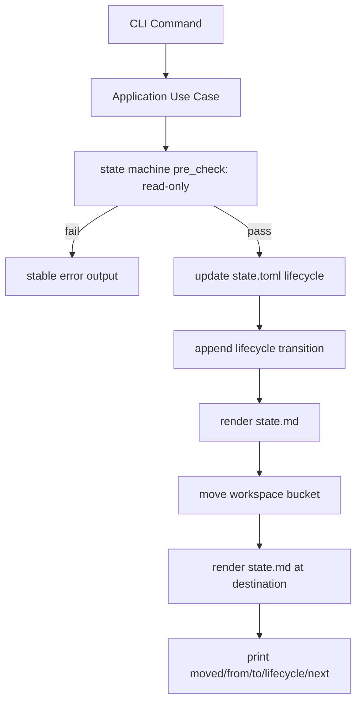

# 生命周期一致性修正方案

## 判断结论

你说得对。当前实现存在三类风险：

- `state.toml` 没有记录 task lifecycle，目录已经在 `03-completed`，但 `[task]` 仍然只知道 `current_phase` 和 `next_action`，无法自证“我已经 completed”。
- 目录 bucket、stage 状态、transition log 都可能表达 lifecycle，但没有唯一事实中心，长期会产生漂移。
- `task complete` / `state complete` 的前置校验分散在 execute 内部，缺少统一的 pre-check 模型，容易出现“先改状态、再发现不能移动”的半完成风险。

## 事实源规则

以 `.daedalus/state.toml` 作为唯一事实中心：

- `[task] lifecycle = "active" | "completed" | "abandoned"`
- `[task] workspace_bucket = "02-learning" | "03-completed" | "04-abandoned"`
- `[task] closed_at = "..."` 可选，仅 completed/abandoned 时写入
- `[task] close_reason = "..."` 可选，仅 completed/abandoned 时写入

目录位置是 lifecycle 的物理投影，不是事实源。CLI 每次涉及 lifecycle 或 validate 时，都要检查：

- `active` 必须位于 `workspaces/02-learning`
- `completed` 必须位于 `workspaces/03-completed`
- `abandoned` 必须位于 `workspaces/04-abandoned`

如果不一致，`validate` 报错，移动类命令拒绝继续并给出修复建议。

## 强类型状态机设计

daedalus 的状态机不是内存中的 UI 控件状态，而是持久化学习 workflow。状态来自 `.daedalus/state.toml`，流转会检查文件系统产物、workspace bucket、用户批准和任务生命周期。因此不直接采用 `Box<dyn State>` 形式的 OO state pattern；它会引入动态分发和运行时状态对象，但无法自然表达 `state.toml`、目录移动和产物校验这些持久化约束。

更适合的做法是借鉴 state pattern 的核心思想：把“哪些状态允许哪些动作”显式建模，但用 Rust enum、typed transition 和应用层 pre-check 来落地。

建议的领域类型：

```rust
pub enum TaskLifecycle {
    Active,
    Completed,
    Abandoned,
}

pub enum WorkspaceBucket {
    Learning,
    Completed,
    Abandoned,
}

pub enum StageStatus {
    Pending,
    Active,
    Blocked,
    Paused,
    Done,
}
```

状态流转用 trait 表达：

```rust
pub trait Transition {
    type Output;

    fn pre_check(&self) -> Result<()>;
    fn apply(self) -> Result<Self::Output>;
}
```

每种流转是一个明确的 struct，而不是靠字符串分支散落在 CLI 中：

```rust
pub struct EnterStageTransition { /* task_dir, stage_id, reason */ }
pub struct CompleteStageTransition { /* task_dir, stage_id, force, approval */ }
pub struct CompleteTaskTransition { /* task_dir, reason */ }
pub struct AbandonTaskTransition { /* task_dir, reason */ }
```

然后分别实现：

```rust
impl Transition for CompleteTaskTransition {
    type Output = CloseTaskOutput;

    fn pre_check(&self) -> Result<()> {
        // task lifecycle must be Active
        // bucket must be Learning
        // final artifacts must exist
        // destination must not exist
        // reason must be specific
        Ok(())
    }

    fn apply(self) -> Result<Self::Output> {
        self.pre_check()?;
        // update state.toml, append transition, move directory, render state.md
        todo!()
    }
}
```

关键原则：

- `pre_check` 与 `apply` 同属 application/domain 状态机边界。
- `pre_check` 必须只读，不写 `state.toml`，不渲染 `state.md`，不移动目录。
- CLI command 只组装 options，然后调用 application use case；不要在 CLI 层散落业务校验。
- 同一套 `pre_check` 要同时服务 `state complete 10-archivist` 和 `task complete`，避免两条入口行为漂移。
- 不追求把所有非法流转都变成编译期错误，因为状态来自运行时 TOML；目标是让可构造的 transition 类型有限，并把运行时前置校验集中到 `Transition::pre_check()`。

## 状态机前置校验

- Stage transition pre-check：
  - `enter`：任务必须是 `active`，且目录必须在 `02-learning`。
  - `block` / `resume`：任务必须是 `active`，且 reason 必须具体。
  - `complete <stage>`：任务必须是 `active`；阶段存在；缺失产物时必须满足受控 `--force` 规则。
  - `complete 10-archivist`：除普通 stage complete 校验外，还要满足 task close pre-check，包括目标目录不存在、最终产物存在、reason 具体。
- Task lifecycle pre-check：
  - `task complete`：任务必须是 `active`；所有 required stage 是否完成或明确允许 skip/force 要有清晰规则；目标 completed 目录不得存在；必须有 reason。
  - `task abandon`：任务必须是 `active`；目标 abandoned 目录不得存在；必须有 reason；不要求所有 stage 完成。
- `validate`：不修改状态，但检查 state lifecycle 与目录 bucket 是否一致。

## 状态更新顺序

移动任务时使用单一应用层流程：

1. application/domain 层 `pre_check()` 只读校验，不产生副作用。
2. 更新 `state.toml` 中的 `[task] lifecycle/workspace_bucket/closed_at/close_reason`。
3. 追加 `[[transitions]]`：`task-complete` 或 `abandon`。
4. 渲染 `state.md`。
5. 移动目录到目标 bucket。
6. 在目标目录再次渲染 `state.md`，确保路径和恢复入口正确。
7. CLI 输出 `from_task_dir`、`to_task_dir`、`lifecycle`、`moved`、`state_md`、`next`。

如果第 5 步前的目标目录已存在，必须在状态机 pre-check 阶段失败，避免写入半完成状态。

## 需要修改的文件

- [`crates/daedalus-cli/src/domain`](crates/daedalus-cli/src/domain)：补充 `TaskLifecycle`、`WorkspaceBucket` 和 transition 类型，减少字符串状态在应用层流动。
- [`crates/daedalus-cli/src/infrastructure/state_toml.rs`](crates/daedalus-cli/src/infrastructure/state_toml.rs)：新增 task lifecycle 读写 helper。
- [`crates/daedalus-cli/src/application/transition_stage.rs`](crates/daedalus-cli/src/application/transition_stage.rs)：用 typed transition 收拢 stage transition 的前置校验和 apply。
- [`crates/daedalus-cli/src/application/close_task.rs`](crates/daedalus-cli/src/application/close_task.rs)：改成 lifecycle 事实源驱动，用 `CompleteTaskTransition` / `AbandonTaskTransition` 承载 pre-check 与 apply。
- [`crates/daedalus-cli/src/application/validate_workspace.rs`](crates/daedalus-cli/src/application/validate_workspace.rs)：校验 lifecycle 与目录 bucket 一致性。
- [`crates/daedalus-cli/src/application/render.rs`](crates/daedalus-cli/src/application/render.rs)：在 `state.md` 显示 lifecycle、workspace bucket、closed reason。
- [`system/templates/repo/.daedalus/state.toml`](system/templates/repo/.daedalus/state.toml)：初始化 `[task] lifecycle = "active"` 和 `workspace_bucket = "02-learning"`，列出允许值。
- [`system/templates/repo/.daedalus/state.md`](system/templates/repo/.daedalus/state.md)：同步说明 lifecycle 字段。
- [`CLAUDE.md`](CLAUDE.md)：补充“state.toml 是任务 lifecycle 唯一事实源，目录是投影”。

## 测试补充

在 [`crates/daedalus-cli/tests/cli_workflow.rs`](crates/daedalus-cli/tests/cli_workflow.rs) 增加/调整测试：

- 初始化任务时 `lifecycle = "active"`、`workspace_bucket = "02-learning"`。
- `task complete` 后 state 中是 `completed` / `03-completed`，目录也在 completed。
- `task abandon` 后 state 中是 `abandoned` / `04-abandoned`，目录也在 abandoned。
- 手工制造 state lifecycle 与目录 bucket 不一致时，`daedalus validate` 失败。
- 目标目录冲突时，状态机 pre-check 失败，原 state 不应写入 completed/abandoned。
- 中间 stage complete 不移动目录。
- `state complete 10-archivist` 通过 pre_check 后自动 task complete。

## Mermaid



## 验证

- `cargo fmt --manifest-path crates/Cargo.toml --all`
- `make ci`
- `ReadLints` 检查改动文件
- 手工 smoke test：完成一个临时任务、放弃一个临时任务，并确认 WIP 释放与 state lifecycle 一致。
