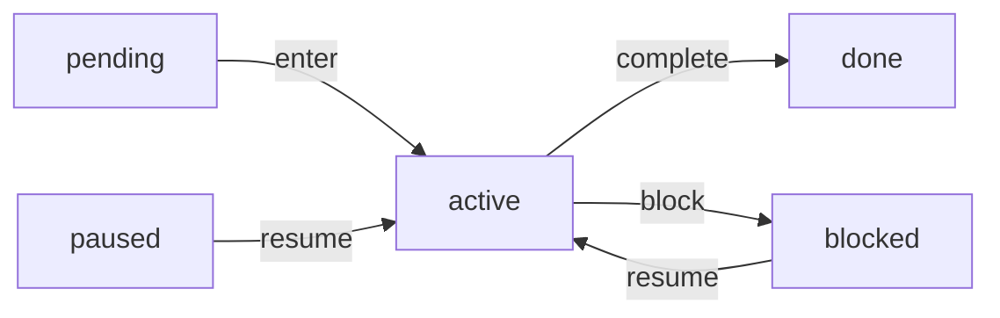

# 阶段状态机重构方案评估

## 目标

- 让 `StateTransition` 成为流转执行的统一模板，而不是只包一层 `pre_check/apply`。
- 让 `transition_stage.rs` 中的 `match StageAction` 只负责必要的动作分派，不再同时承担业务规则、校验、写入和审计记录。
- 明确阶段状态合法流转：`pending -> active`、`active -> done`、`active -> blocked`、`blocked|paused -> active`，`done` 作为终态不可继续阶段流转。
- 将 Rust 领域类型从 `StageStatus` 调整为 `StageState`。`StageState` 更强调这是阶段运行时状态；`.daedalus/state.toml` 中的字段名仍可保持 `status`，避免无意义地扰动已有模板和状态文件。

## 设计取舍

不采用完整 Rust typestate/state pattern。原因是阶段状态来自 `.daedalus/state.toml`，只有运行时读取后才能知道，编译期类型无法直接约束外部文件内容。更合适的做法是在领域层保留一个显式状态转移矩阵，再由应用层在执行流转时调用这些规则。

这里的 `StageState` 和 repo learning 的 10 个 stage 不是同一层概念。10 个 stage 是学习流程定义，回答“有哪些阶段、顺序是什么、每个阶段要产出什么”；`StageState` 是某个具体阶段在某个学习任务里的运行时状态，回答“这个阶段现在 pending、active、blocked、paused 还是 done”。由于这些状态枚举很少变化，预计后续新增概率和频率都很低，重构应优先追求清晰和稳定，而不是为高度扩展性预支复杂抽象。

## 方案一：轻量领域状态矩阵

这个方案保留 [`crates/daedalus-cli/src/application/transition_stage.rs`](crates/daedalus-cli/src/application/transition_stage.rs) 中单一的 `TransitionStageOptions`，不把每个动作拆成独立 struct。核心变化是将阶段合法流转下沉到领域层，并把 `StateTransition` 调整成模板方法。

- 更新 [`crates/daedalus-cli/src/application/state_machine.rs`](crates/daedalus-cli/src/application/state_machine.rs)：
  - 将 trait 调整为模板方法风格，例如 `pre_check()` + `commit()` + 默认 `apply()`。
  - 以后调用方只调用 `apply()`，保证所有流转默认先执行前置校验。

- 更新 [`crates/daedalus-cli/src/domain/stage.rs`](crates/daedalus-cli/src/domain/stage.rs)：
  - 增加领域动作类型，如 `StageTransitionKind`，只表达 `enter/complete/block/resume`，不携带 CLI 参数。
  - 将 `StageStatus` 重命名为 `StageState`，并增加合法流转判断和目标状态计算。
  - 补有意义的单测：覆盖关键合法/非法流转矩阵，不测试简单 `as_str/parse` 映射。

- 更新 [`crates/daedalus-cli/src/domain/error.rs`](crates/daedalus-cli/src/domain/error.rs)：
  - 增加稳定错误，例如 `InvalidStageStatusTransition`，让 Agent 能明确知道“阶段存在，但当前状态不允许执行该动作”。

- 更新 [`crates/daedalus-cli/src/infrastructure/state_toml.rs`](crates/daedalus-cli/src/infrastructure/state_toml.rs)：
  - 增加 `stage_state(doc, stage_id) -> Result<StageState>`，避免应用层靠 raw string 判断阶段状态。

- 重构 [`crates/daedalus-cli/src/application/transition_stage.rs`](crates/daedalus-cli/src/application/transition_stage.rs)：
  - 保留 `StageAction` enum 和一个 `impl StateTransition for TransitionStageOptions`。
  - `pre_check()` 统一读取当前阶段状态，并调用领域层合法流转矩阵。
  - `commit()` 中的 `match StageAction` 只负责必要写入分派，例如设置目标状态、更新 `current_phase`、追加 transition。
  - 将 `Complete` 的必需产物检查、`force + approval_source + reason` 校验收敛为单一 helper，避免前置校验和提交阶段重复实现。
  - `Resume` 恢复目标阶段时阻塞其他 active 阶段，避免产生多个 active 阶段。

### 方案一优点

- 改动幅度较小，代码跳转少，读者仍然可以在一个 use case 文件里看完整阶段流转。
- 保留 enum + match 的 Rust 常规表达方式，不为消除 `match` 引入额外类型层级。
- 领域规则集中后，最关键的业务不变量可以被单测覆盖。
- 更适合当前规模：只有 4 个阶段动作，动作差异还没有复杂到必须各自建模。
- 更符合状态枚举低频变化的现实，不为了极低概率的扩展牺牲当前可读性。

### 方案一缺点

- `transition_stage.rs` 里仍然会存在 `match StageAction`，视觉上不像“彻底对象化”的状态机。
- 如果后续每个动作的前置校验和提交逻辑继续膨胀，单一 use case 文件可能再次变大。
- `StateTransition` trait 的复用程度有限，主要保证执行顺序，而不是把每个动作都抽象成独立 transition 对象。

## 方案二：Action-Specific Transition

这个方案将 `enter/complete/block/resume` 拆成各自的 transition 类型，每个类型独立实现 `StateTransition`。`TransitionStageOptions` 只作为 CLI 输入 DTO，负责转换成内部 transition enum 或分发到具体 transition。

- 更新 [`crates/daedalus-cli/src/application/state_machine.rs`](crates/daedalus-cli/src/application/state_machine.rs)：
  - 将 trait 调整为模板方法风格，例如 `pre_check()` + `commit()` + 默认 `apply()`。
  - 每个具体 transition 都通过同一个模板执行前置校验和提交。

- 更新 [`crates/daedalus-cli/src/domain/stage.rs`](crates/daedalus-cli/src/domain/stage.rs)：
  - 同样将 `StageStatus` 重命名为 `StageState`，并增加 `StageTransitionKind` 和合法流转矩阵。
  - action-specific transition 只调用领域规则，不自行复制状态矩阵。

- 重构 [`crates/daedalus-cli/src/application/transition_stage.rs`](crates/daedalus-cli/src/application/transition_stage.rs)：
  - 保留 `TransitionStageOptions` 作为 CLI 输入 DTO，转换成内部 `StageTransition` enum。
  - 用 `EnterStageTransition`、`CompleteStageTransition`、`BlockStageTransition`、`ResumeStageTransition` 分别实现 `StateTransition`。
  - 每个 transition 自己负责：检查任务 active 且位于 `02-learning`、检查阶段存在、检查当前状态是否合法、处理自己的额外规则。
  - `CompleteStageTransition` 处理必需产物和 `force + approval_source + reason`；不再在 `pre_check` 与提交阶段重复同一段产物校验逻辑。
  - `ResumeStageTransition` 在恢复目标阶段时阻塞其他 active 阶段，避免产生多个 active 阶段。

### 方案二优点

- `StateTransition` trait 被利用得更充分：每个动作都是一个独立流转对象，职责边界更显性。
- 当动作规则变复杂时，每个 transition 可以独立演进，减少单个函数中的分支压力。
- 更容易在未来接入动作级别的审计、权限、dry-run、preview 或不同输出策略。
- 如果后续动作数量增加，按动作扩展会比继续扩充一个大 `match` 更清楚。

### 方案二缺点

- 对当前 4 个动作来说，类型数量和样板代码会明显增加。
- 读者需要在 `TransitionStageOptions`、内部 enum、多个 transition struct 之间跳转，局部可读性不一定更好。
- 很可能把简单分派包装成多层抽象，存在“为使用 trait 而使用 trait”的风险。
- 如果每个动作的差异长期保持较小，维护成本会高于方案一。

## 客观对比

- 简洁性：方案一更简洁；方案二更结构化但更重。
- 易懂性：当前代码规模下，方案一更容易从上到下读懂；方案二对熟悉 trait-based use case 的读者更清晰，但新读者需要更多跳转。
- 业务规则集中度：两者都能做到，关键在于领域层状态矩阵，而不是是否拆 struct。
- `StateTransition` 利用程度：方案二更充分；方案一只把 trait 用作统一执行模板。
- 扩展性：动作数量和动作差异增长后，方案二更有优势；但阶段状态枚举后续新增概率很低，当前阶段方案一更贴近实际复杂度。
- 测试价值：两者都应该把测试重点放在状态矩阵、非法流转、force 约束、最终阶段关闭路径，不应该测试简单枚举映射。
- 炫技风险：方案一低；方案二中等，除非能证明动作规则会继续增长。

## 建议判断

如果目标是修复当前问题并提升可维护性，优先选择方案一：`StageState` 领域状态矩阵 + `StateTransition` 模板方法 + 去重。它能解决真正的问题：规则散落、重复校验、状态合法性不明确，同时不会因为低频变化的状态枚举引入过重结构。

如果近期确定会继续增加更多阶段动作，或者每个动作会有明显不同的前置校验、审计策略、dry-run 预览和输出策略，再选择方案二。否则方案二更像架构预支，短期内可能让代码显得更“高级”，但未必更好维护。

## 共同修改项

- 同步 [`crates/daedalus-cli/src/application/close_task.rs`](crates/daedalus-cli/src/application/close_task.rs)：
  - 适配 `StateTransition` trait 的新模板方法。
  - `complete_final_stage` 复用同一套“最终阶段必须处于 active 才能完成”的规则，避免 `state complete 10-archivist` 绕过阶段状态机。

- 更新 [`crates/daedalus-cli/tests/cli_workflow.rs`](crates/daedalus-cli/tests/cli_workflow.rs)：
  - 调整现有测试中直接完成 pending 阶段的流程，先 `enter` 再 `complete`。
  - 新增或强化业务测试：完成 pending 阶段会失败、resume blocked 阶段后不会留下多个 active、最终阶段未 active 时不能直接关闭。
  - 保留 CLI 行为层测试，确保错误输出仍然 Agent-friendly。

## 验证

- 在 [`crates/daedalus-cli`](crates/daedalus-cli) 执行 `cargo fmt`。
- 在 [`crates/daedalus-cli`](crates/daedalus-cli) 执行 `cargo test`。
- 对改动文件运行 lints，确保没有新增诊断。
