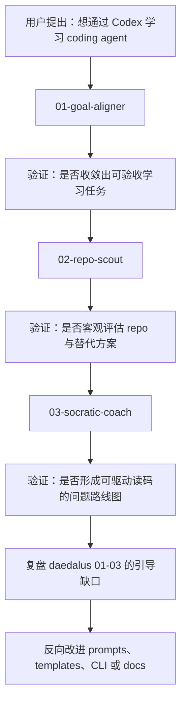
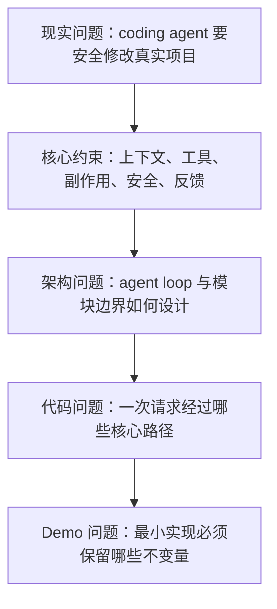
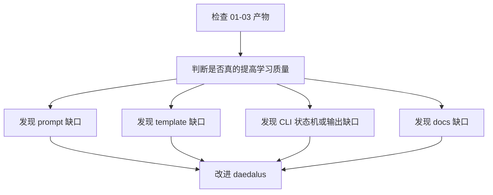

# validate-daedalus-stage-01-03-with-codex

## 实践目的

本次实践的核心对象不是 Codex，而是 daedalus。Codex 只是一个足够真实、足够复杂、与“coding agent 实现原理”高度相关的测试样本。

这次要验证的问题是：

- daedalus 的 01-03 阶段是否能把用户的模糊学习意图，逐步引导成可执行、可验收、可继续深入的学习任务。
- prompt、template、CLI 状态机、`state.md`、`todo.md`、产物约束是否真的能协同工作。
- Agent 在使用 daedalus 时，是否会被引导去思考、记录、校验，而不是直接跳到读代码或输出泛泛总结。
- 01-03 阶段完成后，用户是否真的更适合进入 04 阶段的本地运行与调用链验证。

## 测试样本

以 [`openai/codex`](https://github.com/openai/codex) 为测试 repo。它适合用于验证 daedalus 的原因：

- 主题真实：Codex 本身就是 terminal coding agent。
- 复杂度足够：涉及 CLI、Rust core、工具执行、事件流、sandbox、approval、SDK 等多个层面。
- 容易暴露问题：如果 daedalus 的前期引导不够强，Agent 很容易直接陷入“泛读文件树”或“输出概念总结”。
- 目标明确：用户希望学习 coding agent 的实现原理和关键工程要点。

## 总体路线



## 观察原则

实践过程中要有意区分两类结果：

- Codex 学习结果：我们对 Codex 的理解是否变深。
- daedalus 验证结果：daedalus 是否有效推动了这个理解过程。

本次更关注第二类。即使某个产物内容看起来不错，也要追问：这是因为 Agent 自己临场发挥得好，还是 daedalus 的阶段设计、模板和状态机真的提供了稳定引导？

## 初始化学习任务

在 daedalus 根目录创建真实学习任务：

```bash
daedalus init repo-learning codex-coding-agent
```

初始化后先观察，而不是马上填写内容：

- `workspaces/02-learning/codex-coding-agent/CLAUDE.md` 是否清楚说明了 Agent 应该读取哪些上下文。
- `.daedalus/state.toml` 是否明确 `01-goal-aligner` 为 `active`。
- `.daedalus/state.md` 是否足够 Agent-friendly，能让 Agent 快速知道当前阶段、下一步和枚举约束。
- `.daedalus/todo.md` 是否足以承载阶段内动态任务，而不是一次性 checklist。
- 目录中的 `notes/`、`demo/`、`source/` 是否让 Agent 明白后续产物应该放在哪里。

如果初始化后的上下文不能让 Agent 自然知道“现在该做 01”，这就是 daedalus 的缺口，而不是 Codex 学习本身的问题。

## 01-goal-aligner 验证

### 要验证的 daedalus 能力

01 阶段应该验证 daedalus 是否能阻止 Agent 直接跳进 repo，而是先完成学习目标对齐。

输入可以故意保持模糊：

> 我想通过 Codex 源码学习 coding agent 的实现原理和要点。

观察 Agent 是否会主动澄清：

- 学习 coding agent 的哪一类能力。
- 最终希望产出什么 mini demo。
- 当前背景和技术栈约束。
- 哪些主题暂时不学。
- 什么叫“学会”，验收标准是什么。

### 阶段产物

产物是 `.daedalus/task-card.md`。它不应该只是复述“学习 Codex”，而应该包含：

- 学习对象：Codex。
- 学习主题：coding agent 的实现原理。
- 现实问题：为什么用户需要理解 coding agent。
- 学习边界：先学 terminal coding agent，不扩展到 IDE extension 或云端 agent 平台。
- 可验收结果：能画调用链、解释 agent loop、说明工具执行与安全边界、设计 mini demo。

### 评价标准

01 阶段通过，不是因为文件存在，而是因为它满足这些条件：

- 目标足够具体，能指导 repo 选择和问题设计。
- 验收标准可被后续阶段验证。
- 明确了暂不学习的范围。
- Agent 没有替用户跳过关键选择。
- 用户读完 task-card 后知道“接下来为什么要选 Codex，选它要验证什么”。

### CLI 流转

只有当 `.daedalus/task-card.md` 达标后，才执行：

```bash
daedalus state complete 01-goal-aligner --task-dir workspaces/02-learning/codex-coding-agent --reason "Codex coding agent learning goal and acceptance criteria are defined."
daedalus state enter 02-repo-scout --task-dir workspaces/02-learning/codex-coding-agent --reason "Start selecting and validating the study repo."
```

## 02-repo-scout 验证

### 要验证的 daedalus 能力

02 阶段要验证 daedalus 是否能让 Agent 客观评估 repo，而不是因为用户说“学 Codex”就直接附和。

关键观察点：

- Agent 是否会说明 Codex 与学习目标的匹配关系。
- Agent 是否会提出至少 2 个替代候选，并说明为什么暂不选择。
- Agent 是否会识别 Codex 的阅读风险，例如 repo 较大、Rust core 复杂、SDK 不是主线。
- Agent 是否能给出初步阅读入口，而不是只给 GitHub 链接。

### 阶段产物

产物是 `notes/repo-selection.md`。它应该回答：

- 为什么 Codex 是首选 repo。
- 它覆盖哪些 coding agent 核心能力。
- 替代 repo 是什么，以及为什么本轮不选。
- 初步读码入口在哪里。
- 本地运行和调试有哪些风险。

建议比较对象：

- `openai/codex`：terminal coding agent，作为主线。
- `Aider`：更偏 Git/diff workflow，可作为对照。
- `Cline`：更偏 IDE extension agent，暂不作为主线。
- `OpenHands`：更偏平台化 agent，范围过大。

### 评价标准

02 阶段通过的标志：

- Codex 是被论证后选中，而不是被默认接受。
- 替代候选的放弃理由具体。
- 后续 03 阶段能基于 repo-selection 提出问题。
- 文档里包含“阅读入口假设”，方便 04 阶段验证。

### CLI 流转

```bash
daedalus state complete 02-repo-scout --task-dir workspaces/02-learning/codex-coding-agent --reason "Codex is selected as the primary repo and alternatives are recorded."
daedalus state enter 03-socratic-coach --task-dir workspaces/02-learning/codex-coding-agent --reason "Start building the question roadmap before reading Codex deeply."
```

## 03-socratic-coach 验证

### 要验证的 daedalus 能力

03 阶段要验证 daedalus 是否能把“我要读源码”转换成递进问题路线图，让后续 04-06 阶段有明确验证路径。



### 阶段产物

产物是 `notes/question-roadmap.md`。它应该包含四层问题：

- 最小 agent 闭环：用户输入、模型响应、工具调用、最终答复如何建模。
- 工具与安全边界：shell、patch、文件修改、approval、sandbox 如何协作。
- 上下文与事件流：instructions、history、tool result、terminal UI、SDK 如何连接。
- demo 映射：最小 coding agent demo 必须保留哪些不变量。

### 评价标准

03 阶段通过的标志：

- 问题不是百科式清单，而是有递进关系。
- 每个问题都能导向后续某个代码入口、实验或图示。
- 问题能暴露 trade-off，而不是只问“是什么”。
- 形成了进入 04-debugger-guide 的明确验证动作。

如果 `question-roadmap.md` 只是列出“agent loop 是什么、sandbox 是什么、SDK 是什么”，说明 daedalus 的 03 阶段还不够强；它需要更明确地迫使 Agent 生成可验证问题。

### CLI 流转

```bash
daedalus state complete 03-socratic-coach --task-dir workspaces/02-learning/codex-coding-agent --reason "Question roadmap for Codex coding agent internals is ready."
```

## 复盘方法

完成 01-03 后，不要马上进入 04。先复盘 daedalus 自身：



建议用以下问题评估：

- 如果没有 daedalus，这三个阶段的产物会不会明显更差？
- Agent 是否被 `state.md`、`CLAUDE.md`、prompt、template 明确引导？
- `todo.md` 是否在阶段内被动态维护，还是被忽略？
- CLI 的错误和输出是否让 Agent 明白下一步该做什么？
- required artifacts 是否真正阻止了“空转完成阶段”？
- 哪些内容需要沉淀回 prompt 或 template，而不是留在一次性对话里？

## 通过标准

这次实践不是以“读懂 Codex”为完成标准，而是以 daedalus 的 01-03 阶段是否通过验证为标准。

通过标准：

- 01 阶段让学习目标明显更具体、更可验收。
- 02 阶段能客观评估 repo，而不是默认附和。
- 03 阶段能产出可驱动后续运行和读码的问题路线图。
- 三个阶段的 CLI 状态流转自然，没有需要手改 `state.toml` 的地方。
- 每个阶段都暴露出可复用的改进点，可以反向增强 daedalus。

如果以上任一项不满足，就先改 daedalus 的 prompt/template/CLI/docs，再继续进入 04 阶段。
