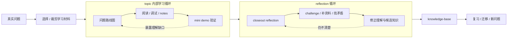
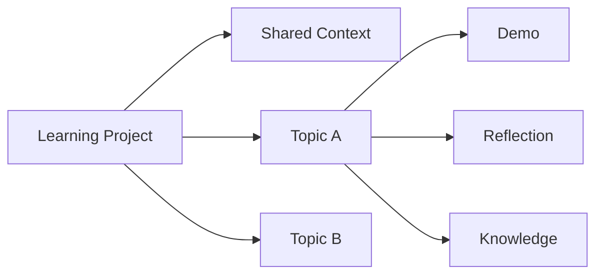

# daedalus

daedalus 是一个 filesystem-first 的深度学习 coach。

它不是自动摘要工具，也不是替你读书、读论文、读源码的笔记生成器。它更像一个长期陪你学习的工作台：帮你把一个真实问题拆成学习路径，引导你阅读材料、实现 mini demo、做迁移思考、完成主动回顾，并最终把真正掌握的内容沉淀进知识库。

名字来自希腊神话里的 Daedalus：那个造迷宫，也造翅膀的工匠。这个项目想做的事情也类似：帮学习者走进复杂系统的迷宫，再带着可迁移的能力飞出来。

## 为什么做

很多深度学习失败，不是因为材料不够好，而是因为学习过程缺少几个关键东西：

- 没有终点，不知道最后要产出什么。
- 没有证据，读完之后很难证明自己真的懂了。
- 没有实践，理解停留在“我知道它这么设计”。
- 没有主动回顾，知识没有经过自己的表达和摩擦。
- 没有迁移，学完之后不知道怎么用到自己的问题里。

daedalus 的判断是：

```text
学习不是收集材料，而是围绕真实问题构建可迁移能力。
```

## 它如何工作

一次学习不是直线推进。最外层是一条主线，内部有两个反复校准的小循环：



图里有两个反馈含义：

- `复习 / 迁移 / 新问题` 会成为下一轮学习的真实问题。
- 如果 reflection 发现范围过大、问题偏移或材料不合适，就回到 `选择 / 裁剪学习材料`。

这个结构里最重要的是三条角色边界：

- **你负责形成理解**：写 notes、做 demo、写 closeout、决定哪些知识值得留下。
- **daedalus 负责推进理解**：提问题、给 guide、challenge 模糊答案、补外部资料、帮你组织和校验。
- **knowledge-base 只存 reviewed understanding**：不是 AI 自动摘要，而是经过你主动回顾和确认后的长期知识。

## 学习对象

daedalus 不只服务 repo learning。它可以用于：

- 源码项目：例如 Codex、数据库、中间件、框架。
- 技术书：例如 DDIA、操作系统、编译原理。
- 论文：围绕一个问题拆解背景、方法、假设、实验与迁移价值。
- 课程：把课程内容变成练习、demo、复习计划和知识库。
- 真实业务问题：从现实约束出发，寻找可复用的工程模式。

当前跑通最完整的是 repo learning；第一个完整样本是 Codex CLI 的 `tools-permissions` topic。

## Project 与 Topic

daedalus 用 Project / Topic 来组织长期学习。




- **Project**：一个长期学习对象，例如一个 repo、一本书、一门课。
- **Topic**：Project 下一个可以闭环的专题，例如 Codex 的工具与权限系统。
- **Shared Context**：同一个 Project 下跨 Topic 复用的背景、术语、运行方式和证据。

目录大致是：

```text
workspaces/
  current-topic        当前正在学习的 topic 入口
  closeout-topic       等待回顾总结的 topic 入口
  backlog/             未来可能学习的候选项
  projects/
    <project>/
      shared/
      source/
      topics/
        <topic>/
          guides/      daedalus 给你的学习引导
          notes/       你的学习记录与证据
          demo/        用来验证理解的 mini demo
          reflection/  topic 收尾回顾
```

你平时最常点开的入口通常只有两个：

- `workspaces/current-topic`
- `workspaces/closeout-topic`

## 一次 Topic 会产出什么

一个 topic 不是“读完一些材料”就结束。它至少应该留下这些东西：

- `guides/`：下一步怎么学、怎么读、怎么实现。
- `notes/`：你在阅读、调试、实现中的理解和证据。
- `demo/`：一个可运行、可测试、可讲解的 mini demo。
- `reflection/closeout.md`：你对整个 topic 的主动回顾。
- `reflection/candidate-map.md`：学习过程中不断积累的知识候选。
- `knowledge-base/`：最终筛选后值得长期保留的可迁移知识。

其中最关键的是 `reflection/closeout.md`。它不是形式化总结，而是你把几周的源码、demo、争论、失败和设计取舍压缩成自己理解的过程。

## 知识库

`knowledge-base/` 是 daedalus 的长期知识层。

它不是固定模板，也不是自动摘要集合，而是一棵会随着学习不断演化的知识树。新的 topic 完成后，daedalus 会帮助你从 closeout、notes、guides、demo 和外部资料里挖掘高价值知识候选；但是否归档、如何归档、哪些忽略，最终要经过你的确认。

第一批知识来自 Codex `tools-permissions` topic，覆盖：

- Agent 本地命令执行安全
- ReAct 工具运行时
- Sandbox 的第一性原理
- Rust 流式 Agent 与 Tokio 运行时
- 终端 Agent UI 的事件循环

## 知识网页

Markdown 适合长期保存，但有些机制更适合做成交互式页面。

`apps/knowledge-web` 是 daedalus 的知识网页，用来把知识库里的复杂机制做成更容易复习的界面：状态机、流程图、场景切换、失败模式、代码落点和自测问题。

启动方式：

```bash
make web
```

网页不是 Markdown 的替代品。Markdown 是知识源，网页是理解界面。

## 当前样本

当前第一个完整样本是：

```text
Project: openai-codex-cli-deep-learning
Topic: tools-permissions
```

这个 topic 已经完成：

- Codex 工具、权限、sandbox、retry、事件和 ReAct loop 的源码学习。
- Rust mini demo。
- OpenAI-compatible 流式模型接入。
- Simulated sandbox runner。
- macOS `sandbox-exec` backed runner。
- 多 tool call 并发执行。
- ratatui Agent CLI。
- 用户 closeout reflection。
- knowledge-base 归档。
- knowledge web 策展。

完整进化报告见：

[docs/evolution/2026-06-14-daedalus-first-topic-evolution.md](docs/evolution/2026-06-14-daedalus-first-topic-evolution.md)

## 常用入口

日常使用时，你通常只需要关心这些：

```text
workspaces/current-topic
workspaces/closeout-topic
workspaces/backlog
knowledge-base
apps/knowledge-web
```

如果你只是想看当前学习状态，可以打开：

```bash
daedalus-tui
```

如果你想看知识网页：

```bash
make web
```

如果你要继续学习，就从当前 topic 的 guide、todo、outcome map 和 demo 开始；如果你要收尾，就进入 `reflection/closeout.md`。

## 目录结构

```text
apps/
  knowledge-web/       知识网页
crates/
  daedalus-cli/        daedalus 与 daedalus-tui
docs/
  plan/                重要设计方案
  changelog/           能力落地记录
  evolution/           daedalus 自身进化复盘
knowledge-base/        长期知识库
system/
  prompts/             学习协议
  templates/           workspace 模板
workspaces/            学习现场
```

## 当前状态

daedalus 已经完成第一次真实 repo-learning 闭环验证。

下一步不是继续堆功能，而是用更多学习材料继续压测它：新的 repo topic、一本书、一篇论文、一门课程，或者一个真实业务问题。每一次学习都应该反过来继续打磨 daedalus 自己。
