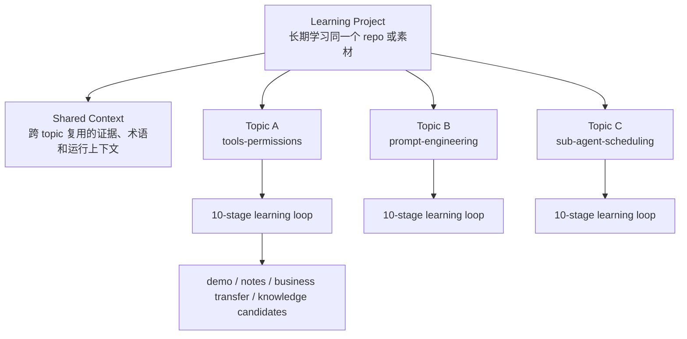
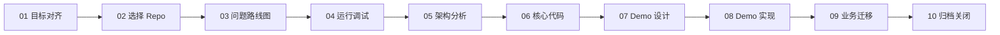
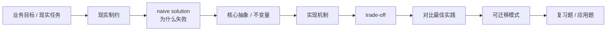
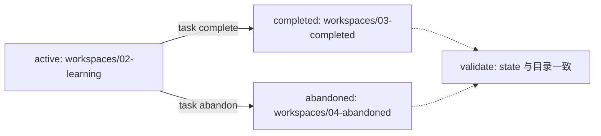
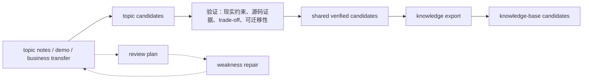
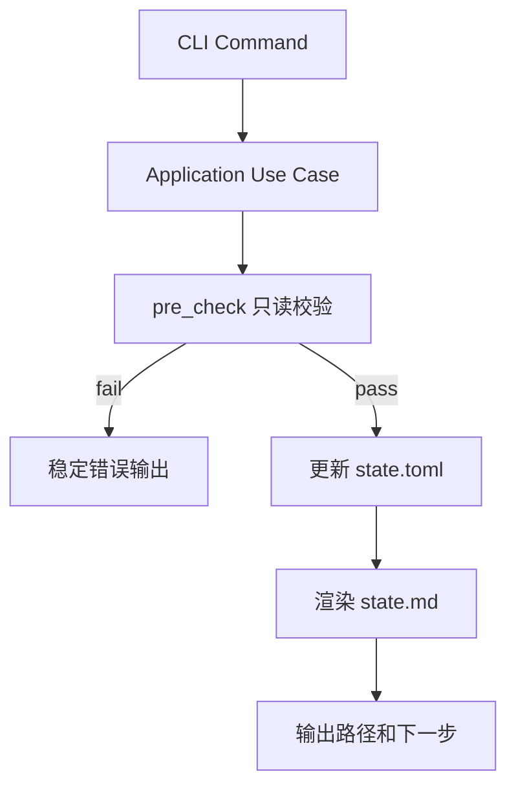

# daedalus

daedalus 是一个 filesystem-first 的深入学习教练 Agent。它以“输出带动输入”为核心，把一次真实学习/业务问题推进为可恢复的文件系统产物：目标卡片、问题路线图、运行记录、架构笔记、源码证据、mini demo、业务迁移方案、复习计划和知识库条目。

当前重点是 repo learning：围绕一个代码仓库建立长期学习 project，再把不同方向拆成多个 topic。每个 topic 都可以独立走完整 10-stage 学习闭环，同时复用 project 级 shared context。

## 核心理念

- 先解决现实问题，再选择学习材料。
- 先建立第一性原理、现实制约和 trade-off 框架，再阅读代码细节。
- 先跑通核心链路，再分析架构和逐行阅读。
- 先设计并实现 mini demo，再迁移到真实业务问题。
- 先沉淀可复用知识，再进入下一个学习 topic 或学习任务。
- 长期上下文以文件系统为准，聊天记录只作为临时交互，不作为事实源。
- Agent 是学习教练，不是代工执行器：Agent 负责拆解、指导、排障和验收，用户负责关键实践、观察和手写笔记。

## 学习模型

daedalus 现在把 repo learning 拆成三层：



- **Project**：长期学习同一个 repo 或素材，管理 lifecycle、active topic 和跨 topic 共享材料。
- **Topic**：一个可闭环的专题学习单元，每个 topic 自己走 10-stage。
- **Shared Context**：跨 topic 复用的 source index、runbook、architecture map、glossary、evidence registry 和 transfer patterns。

这样可以先学 Codex 的工具/权限系统，再继续学 prompt engineering、context engineering 或 sub-agent 调度，而不需要重建整个学习项目。

## Repo 学习流程

每个 repo-learning topic 都走同一条 10-stage 路线：

1. 对齐 Repo 学习目标，明确现实问题、输出物、验收标准和暂不学习范围。
2. 选择学习仓库，收敛到适合运行、阅读和抽取 mini demo 的 code repo。
3. 提出 Repo 递进问题，用问题驱动后续运行、架构分析和代码阅读。
4. 运行并调试 Repo，从入口走通核心链路。
5. 分析 Repo 架构，识别边界、数据流、控制流、扩展点和 trade-off。
6. 深读 Repo 核心代码，提取不变量、设计选择和可迁移模式。
7. 设计 Repo Mini Demo，保留原 repo 的关键架构决策。
8. 实现 Repo Mini Demo，用最小验证闭环复现核心能力。
9. 将 Repo 学习迁移到业务问题，形成可执行应用方案。
10. 闭环 Repo 学习任务，压缩上下文、归档知识并关闭 lifecycle。



## 终点产物驱动

daedalus 不鼓励开放式泛读源码。每一次阅读、提问、调试和实现，都必须说明它推进哪个最终产物：

- `guides/`：Agent 给用户的行动指南、问题引导、运行说明和验收清单。
- `notes/`：用户亲自回答、观察和实践后的学习证据。
- `demo/`：可运行、可测试、可讲解的 mini demo。
- `.daedalus/outcome-map.md`：当前 topic 的终点地图。
- `.daedalus/todo.md`：当前路径看板。
- review plans：已学内容的复习计划和复习 session。
- knowledge candidates：从 topic 到 shared，再到 knowledge-base 的知识萃取候选。

核心约束是：



## CLI 与 TUI

`crates/daedalus-cli` 提供两个可执行文件：

- `daedalus`：Agent-friendly CLI，负责初始化 project/topic、状态流转、校验、迁移、复习计划、知识萃取和 IDE 派生配置。
- `daedalus-tui`：human-friendly 只读 TUI，展示 active project/topic、阶段进度、缺失产物、下一步行动、review focus 和 knowledge focus。

常用命令：

```bash
make build

# 新建 repo-learning project，并创建初始 topic
daedalus init repo-learning <project-name> --topic <topic-slug> --title "<topic-title>"

# topic 管理
daedalus topic list --project-dir <project-dir>
daedalus topic new <topic-slug> --title "<topic-title>" --project-dir <project-dir>
daedalus topic activate <topic-slug> --project-dir <project-dir>
daedalus topic complete <topic-slug> --project-dir <project-dir> --reason "<reason>"
daedalus topic abandon <topic-slug> --project-dir <project-dir> --reason "<reason>"

# stage 流转，默认作用于 active topic
daedalus state render <project-dir>
daedalus state enter 08-demo-coder --project-dir <project-dir> --reason "<reason>"
daedalus state block 08-demo-coder --project-dir <project-dir> --reason "<reason>"
daedalus state resume 08-demo-coder --project-dir <project-dir> --reason "<reason>"
daedalus state complete 08-demo-coder --project-dir <project-dir> --reason "<reason>"
daedalus state rollback 06-code-reader --project-dir <project-dir> --reason "<reason>"

# 校验
daedalus validate <project-dir>
daedalus validate <project-dir> --all-topics --reviews --knowledge

# 复习计划
daedalus review start --project-dir <project-dir> --topic <topic-slug> --goal "<goal>"
daedalus review list --project-dir <project-dir>
daedalus review session start --project-dir <project-dir> <review-id>
daedalus review session complete --project-dir <project-dir> <review-id> --session-id <session-id> --reason "<reason>"

# 知识萃取
daedalus knowledge extract --project-dir <project-dir> --topic <topic-slug>
daedalus knowledge promote --project-dir <project-dir> --topic <topic-slug> --to shared
daedalus knowledge export --project-dir <project-dir> --to knowledge-base
daedalus knowledge validate --project-dir <project-dir>

# IDE 派生配置
daedalus ide sync-rust-analyzer

# 关闭 project
daedalus task complete <project-dir> --reason "<reason>"
daedalus task abandon <project-dir> --reason "<reason>"

# TUI
daedalus-tui
daedalus-tui <project-dir>
```

`daedalus` 只能在 daedalus 项目根目录或其子目录下运行。它会动态推导 repo root、project path 和 active topic；在非法目录运行时会拒绝服务并给出下一步建议。

## Workspace Lifecycle

学习任务的 lifecycle 以 project `.daedalus/state.toml` 为唯一事实源，目录 bucket 是状态的文件系统投影：



关闭 project 前必须先关闭 unfinished topics。`task complete` 会做只读 pre-check，确认 project 仍是 active、目标目录不冲突、reason 具体、topic 状态和必需产物满足规则；然后更新 `state.toml`、追加 `decision-log.md`、渲染 `state.md` 并移动目录。

## Workspace 结构

`daedalus init repo-learning <project-name> --topic <topic-slug> --title "<topic-title>"` 会生成 multi-topic project：

```text
workspaces/02-learning/<project-name>/
  CLAUDE.md
  .daedalus/
    state.toml              project lifecycle、active topic 和 topic 列表
    state.md                project 摘要，由 CLI 派生
    task-card.md            project 级学习目标和验收边界
    decision-log.md         project 级关键决策
    validation-log.md       project 级校验记录
  shared/
    README.md
    source-index.md
    runbook.md
    architecture-map.md
    glossary.md
    evidence-registry.md
    transfer-patterns.md
  source/
    README.md
    pull_source.sh
    .gitignore
  topics/
    <topic-slug>/
      CLAUDE.md
      .daedalus/
        state.toml          topic 10-stage 进度
        outcome-map.md      终点地图
        todo.md             路径看板
        artifact-index.md
        long-context.md
        reviews/
      guides/
        <stage-id>/
          README.md
      notes/
        <stage-id>/
          README.md
      demo/
```

根目录 `CLAUDE.md` 会引导 Agent 先定位 project、active topic、当前 stage 和当前 gap。topic 内的 `CLAUDE.md`、`outcome-map.md`、`todo.md` 和阶段 README 是恢复学习状态的主要入口。

`guides/` 和 `notes/` 的职责必须区分：`guides/` 保存 Agent 生成的行动指南、问题引导、运行说明和验收清单；`notes/` 保存用户亲自回答、观察、实践后的学习证据。用户没有回答或实践前，Agent 不应把完整学习结论写入 `notes/`。

学习外部 repo 时，daedalus 保存学习状态和复盘；实际运行、调试、断点配置建议在外部 repo 根目录单独打开 IDE，并以该 repo 的 `${workspaceFolder}` 为路径基准。

## Review 与 Knowledge System

daedalus 支持对已学完或正在学习的 project/topic 启动复习计划。复习不会重新打开 learning stage，而是作为独立 lifecycle 挂载在 project/topic 下。

复习计划关注：

- 从第一性原理重建问题。
- 从业务目标和现实约束解释设计选择。
- 复盘 naive solution 为什么失败。
- 重新推导核心抽象、不变量、实现机制和 trade-off。
- 生成 recall、rebuild、application、weakness-repair 等复习 session。

知识萃取采用 promotion pipeline：



只有经过验证、可迁移、能解释现实约束和 trade-off 的内容，才应该进入 `knowledge-base/`。

## 目录结构

```text
crates/
  daedalus-cli/          Rust CLI/TUI，一 crate 两个 bin
docs/
  plan/                  技术方案
  changelog/             能力落地报告
knowledge-base/          经过验证的长期知识库
system/
  bin/                   本地构建、启动、迁移和审计脚本
  config/                用户偏好与运行配置
  prompts/
    common/              跨学习材料复用的通用提示词
    repo/                代码仓库学习的分阶段提示词
  templates/             project、topic、review、knowledge 等模板
workspaces/
  01-backlog/            待学习候选任务
  02-learning/           进行中的学习 project，WIP = 1
  03-completed/          已闭环归档 project
  04-abandoned/          已放弃或暂停 project
```

## 状态机与一致性

阶段流转通过 application 层状态机执行：



关键约束：

- project `.daedalus/state.toml` 是 task lifecycle 和 active topic 的唯一事实源。
- topic `.daedalus/state.toml` 是 10-stage 进度的唯一事实源。
- `state.md` 是派生摘要，不手动编辑。
- `stage.status`、`transition.action`、`topic.lifecycle`、`approval_source` 等枚举值在模板和渲染输出中显式列出。
- `validate` 默认校验 project + active topic，`--all-topics` 校验所有 topics，`--reviews --knowledge` 额外校验复习和知识体系产物。
- `validate` 只证明结构和文件存在，不证明 `notes/` 已包含用户亲自回答、观察或实践后的学习证据。

## 开发与验证

```bash
make fmt
make check
make clippy
make test
make ci
make build
```

`make build` 会生成 release 版本的 `daedalus` 和 `daedalus-tui`，并高亮输出完整可执行文件路径。

常用专项验证：

```bash
system/bin/audit-daedalus-agent-instructions .
daedalus validate workspaces/02-learning/openai-codex-cli-deep-learning --all-topics --reviews --knowledge
```

## 当前状态

daedalus 已完成 repo-learning multi-topic project、topic lifecycle、stage state machine、review plan、knowledge extraction、TUI overview、IDE rust-analyzer 同步和迁移脚本的第一版闭环。

当前真实验证样本是 `openai-codex-cli-deep-learning` project，active topic 为 `tools-permissions`。该 topic 已完成 `01-07`，正在 `08-demo-coder` 中实现 Codex 工具/权限系统 mini demo。下一步重点是继续用真实学习任务打磨教学引导、复习计划、知识萃取和 demo runbook，而不是盲目扩基础设施。
