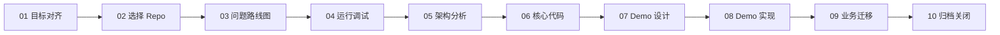
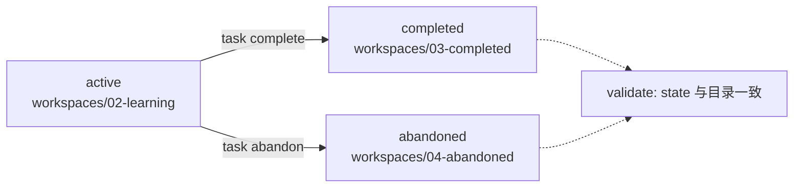
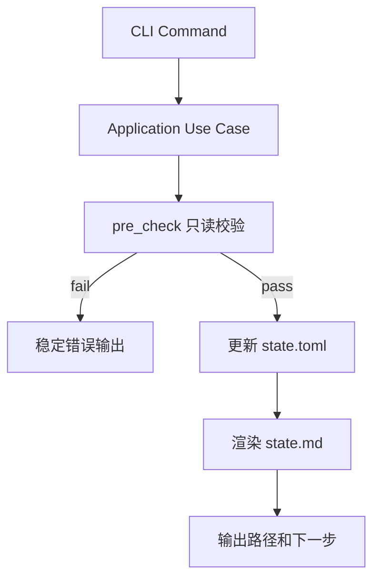

# daedalus

daedalus 是一个以“输出带动输入”为核心的深入学习教练 Agent。它依托文件系统和现代 AI IDE，帮助用户围绕 repo、书、课程、论文等学习材料完成从目标澄清、深度阅读、实作验证到知识库沉淀的闭环。

当前第一阶段聚焦代码仓库学习：先把 repo 深度学习流程跑通，再迁移到更通用的知识材料。repo 可以来自 GitHub、GitLab、内部 Git 服务、压缩包或本地文件系统。

## 核心理念

- 先解决现实问题，再选择学习材料。
- 先建立第一性原理和 trade-off 框架，再阅读代码细节。
- 先跑通核心链路，再分析架构和逐行阅读。
- 先实现 mini demo，再迁移到真实业务问题。
- 先沉淀可复用知识，再进入下一个学习任务。
- 长期上下文以文件系统为准，聊天记录只作为临时交互，不作为事实源。
- Agent 是学习教练，不是代工执行器：Agent 负责拆解、指导、排障和验收，用户负责关键实践、观察和手写笔记。

## Repo 学习流程

1. 对齐 Repo 学习目标，明确现实问题、输出物、验收标准和暂不学习范围。
2. 选择学习仓库，收敛到适合运行、阅读和抽取 mini demo 的 code repo。
3. 提出 Repo 递进问题，用问题驱动后续运行、架构分析和代码阅读。
4. 运行并调试 Repo，从入口走通核心链路。
5. 分析 Repo 架构，识别边界、数据流、控制流、扩展点和 trade-off。
6. 深读 Repo 核心代码，提取不变量、设计选择和可迁移模式。
7. 设计 Repo Mini Demo，保留原 repo 的关键架构决策。
8. 实现 Repo Mini Demo，用最小验证闭环复现核心能力。
9. 将 Repo 学习迁移到业务问题，形成可执行应用方案。
10. 闭环 Repo 学习任务，压缩上下文、归档知识并关闭 lifecycle。



## CLI 与 TUI

`crates/daedalus-cli` 提供两个可执行文件：

- `daedalus`：Agent-friendly CLI，负责初始化任务、确定性更新 `state.toml`、渲染 `state.md`、校验 workspace、关闭任务 lifecycle。
- `daedalus-tui`：human-friendly 只读 TUI。位于具体学习任务目录时直接展示任务 dashboard；位于 daedalus 其他子目录时扫描 `02-learning` / `03-completed` / `04-abandoned` 并进入任务选择页。

常用命令：

```bash
make build
daedalus init repo-learning <task-name>
daedalus validate <task-dir>
daedalus state render <task-dir>
daedalus state block 01-goal-aligner --task-dir <task-dir> --reason "<reason>"
daedalus state resume 01-goal-aligner --task-dir <task-dir> --reason "<reason>"
daedalus state complete 01-goal-aligner --task-dir <task-dir> --reason "<reason>"
daedalus task complete <task-dir> --reason "<reason>"
daedalus task abandon <task-dir> --reason "<reason>"
daedalus-tui
daedalus-tui <task-dir>
```

`daedalus` 只能在 daedalus 项目根目录或其子目录下运行。它会动态推导 repo root 和 task path；在非法目录运行时会拒绝服务并给出下一步建议。
`daedalus-tui` 也遵循同样的目录边界，并会根据任务所在 bucket 调整 UI 侧重点：进行中任务关注下一步，已完成任务关注归档复用，已放弃任务关注恢复判断。`01-backlog` 的任务语义尚未固化，暂不纳入 TUI 选择页。

## Workspace Lifecycle

学习任务的 lifecycle 以 `.daedalus/state.toml` 为唯一事实源，目录 bucket 是状态的文件系统投影：



关闭任务时，CLI 会先执行只读 pre-check，确认任务仍是 active、目标目录不冲突、reason 具体、必需产物满足规则；然后更新 `state.toml`、追加 `decision-log.md`、渲染 `state.md` 并移动目录。

## 学习任务结构

`daedalus init repo-learning <name>` 会生成：

```text
workspaces/02-learning/<name>/
  CLAUDE.md              Agent 恢复当前学习任务的入口
  .daedalus/
    task-card.md         学习目标、现实问题、验收标准和边界
    state.toml           机器可读事实源，由 CLI 使用 toml_edit 更新
    state.md             从 state.toml 渲染的 Agent 友好摘要
    todo.md              分层动态 todo，由 Agent 持续维护
    long-context.md      长期上下文压缩，不粘贴聊天记录
    artifact-index.md    学习产物索引和状态
    decision-log.md      关键决策、关闭原因和 lifecycle 记录
    validation-log.md    daedalus 教学引导效果与改进记录
  guides/
    .gitkeep             Agent 生成的行动指南、问题引导和验收清单
  source/
    .gitignore           默认忽略外部源码，避免仓库膨胀
    README.md            source 使用规则
    pull_source.sh       可复现拉取学习原材料
  demo/
    .gitkeep
  notes/
    .gitkeep
```

根目录 `CLAUDE.md` 会通过 `@.daedalus/state.md`、`@.daedalus/task-card.md` 等引用任务状态中心，让 Cursor、Claude Code、Codex 这类 Agent 能在打开 workspace 后快速恢复上下文。

`guides/` 与 `notes/` 要刻意分层：`guides/` 保存 Agent 给用户的行动指南，`notes/` 保存用户亲自实践和思考后的学习笔记。外部源码放入 `source/` 时默认不提交，通过 `pull_source.sh` 记录可复现来源。

## 目录结构

```text
crates/
  daedalus-cli/          Rust CLI/TUI，一 crate 两个 bin
  docs/                  项目设想、设计说明和开发文档
knowledge-base/         经过验证的长期知识库
system/
  bin/                  本地构建、启动和维护脚本
  config/               用户偏好与运行配置
  prompts/
    common/             跨学习材料复用的通用提示词
    repo/               代码仓库学习的分阶段提示词
  templates/            学习任务、上下文、看板等模板
workspaces/
  01-backlog/           待学习候选任务
  02-learning/          进行中的学习任务，WIP = 1
  03-completed/         已闭环归档任务
  04-abandoned/         已放弃或暂停任务
```

## 状态机与一致性

阶段流转通过 application 层状态机执行：



关键约束：

- `state.toml` 是 task lifecycle 的唯一事实源。
- `state.md` 是派生摘要，不手动编辑。
- `stage.status`、`transition.action`、`approval_source` 等枚举值在模板和渲染输出中显式列出。
- `--force` 只在用户明确批准或已有可追溯等价证据时使用，并必须记录 reason 与 approval source。
- `validate` 会检查必需文件、active stage 数量、current phase、required artifacts、lifecycle 与目录 bucket 是否一致。

## 开发与验证

```bash
make fmt
make check
make clippy
make test
make ci
make build
```

`make build` 会生成 release 版本的 `daedalus` 和 `daedalus-tui`，并输出完整可执行文件路径。

## 当前状态

repo-learning 的 CLI、模板、状态机、生命周期移动、TUI 总览和集成测试已经完成初版闭环。当前已经通过完整 dry run 验证：`init`、`validate`、阶段 block/resume/complete、task complete/abandon、WIP 释放、decision log 和本地时间戳都能协同工作。

下一步重点不是继续扩基础设施，而是在真实 Stage 01 学习过程中迭代 Agent 的教学引导质量。
