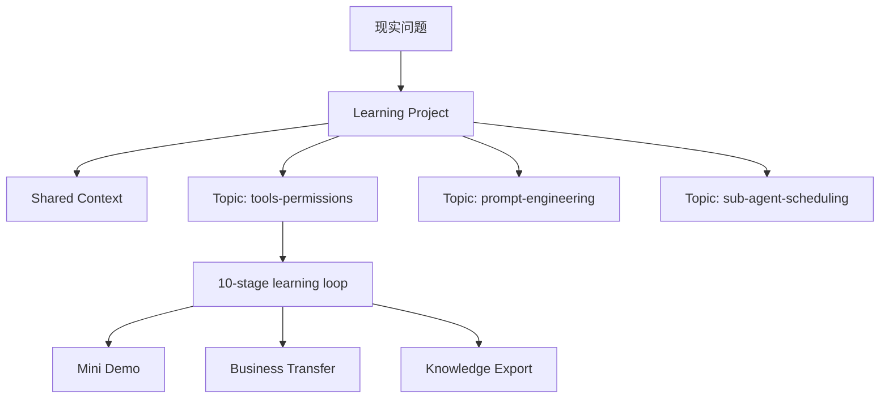
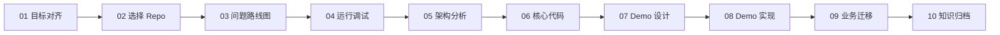
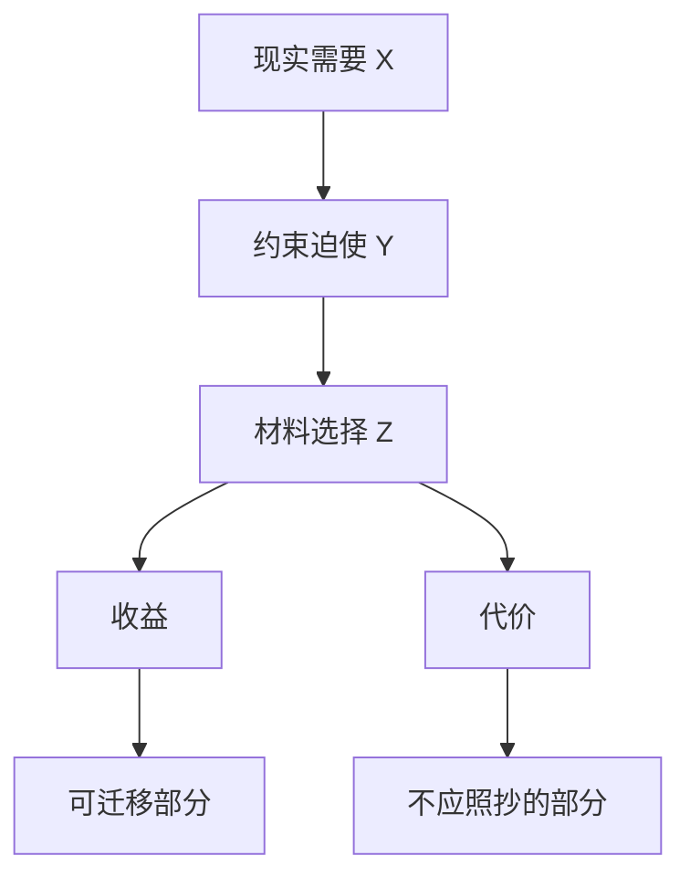
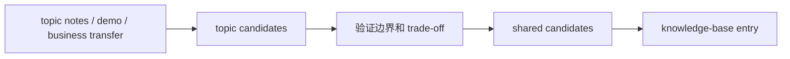

# daedalus

daedalus 是一个 filesystem-first 的深度学习 coach。它把一次真实学习/业务问题推进成可恢复、可验证、可迁移的文件系统产物：目标卡片、问题路线图、运行记录、源码证据、mini demo、业务迁移方案、复习计划和知识库条目。

当前最成熟的能力是 repo learning：围绕一个真实代码仓库建立长期学习 project，再把不同学习方向拆成多个 topic。每个 topic 都能独立完成 10-stage 闭环，同时复用 project 级 shared context。

## Why

很多源码学习会失败，不是因为读得不够多，而是因为缺少终点、证据和迁移目标：

- 不知道最终要产出什么。
- 不知道当前问题服务哪个产物。
- 很容易陷入源码细节沼泽。
- Agent 容易替用户总结，用户没有形成自己的理解。
- 学完后没有 demo、业务迁移和知识归档。

daedalus 的核心判断是：

```text
输出物决定输入路径。
学习不是泛读材料，而是围绕现实问题构建可迁移能力。
```

## Learning Model



- **Project**：长期学习同一个 repo、book、course 或 paper 的工作区。
- **Topic**：一个可闭环的专题，例如 Codex 的工具/权限系统。
- **Shared Context**：跨 topic 复用的 source index、runbook、architecture map、glossary、evidence registry 和 transfer patterns。
- **Knowledge Base**：只收纳已验证、能解释现实约束和 trade-off 的可迁移知识。

## Repo Learning Flow

每个 repo-learning topic 走同一条 10-stage 路线：



每一步都必须回答：

- 推进哪个最终产物？
- 填补哪个缺口？
- 需要什么证据？
- 完成后解锁什么？

核心产物：

```text
.daedalus/outcome-map.md     终点地图
.daedalus/todo.md            当前路径看板
guides/                      Agent 给用户的行动指南
notes/                       用户实践和思考后的学习证据
demo/                        可运行、可测试、可讲解的 mini demo
notes/09-biz-solver/         业务迁移方案
knowledge-base/              长期知识归档
```

## First Principles And Critical Lens

daedalus 不把学习材料当权威。每个 repo、book 或 project 都只是一个受约束的设计案例。



学习时要先忠实模仿核心机制，获得实现手感；然后再判断哪些应该 copy、simplify、improve 或 discard。

## Agent And User Boundary

daedalus 是 coach，不是替用户学习的代工器。

- Agent 写 `guides/`：问题引导、阅读路径、实现提示、验收清单。
- 用户写或确认 `notes/`：回答、观察、源码证据、实践结论。
- Agent 可以校准 notes，但不能把自己的推理伪装成用户已经掌握。
- 实现进度必须先看代码、测试和运行证据，再参考学习地图。
- 小闭环完成后要同步进度、提交代码并提示下一步。

## CLI And TUI

Rust crate 位于 `crates/daedalus-cli`，提供两个 binary：

- `daedalus`：Agent-friendly CLI，负责 project/topic lifecycle、stage flow、validate、review、knowledge、migration 和 IDE 派生配置。
- `daedalus-tui`：human-friendly 只读学习驾驶舱，用于恢复现场、查看下一步、阅读 todo/outcome/guide/detail。

构建：

```bash
make build
```

常用命令：

```bash
# 新建 repo-learning project，并创建初始 topic
daedalus init repo-learning <project-name> --topic <topic-slug> --title "<topic-title>"

# topic lifecycle
daedalus topic list --project-dir <project-dir>
daedalus topic new <topic-slug> --title "<topic-title>" --project-dir <project-dir>
daedalus topic activate <topic-slug> --project-dir <project-dir>
daedalus topic complete <topic-slug> --project-dir <project-dir> --reason "<reason>"

# stage flow，默认作用于 active topic
daedalus state enter 08-demo-coder --project-dir <project-dir> --reason "<reason>"
daedalus state complete 08-demo-coder --project-dir <project-dir> --reason "<reason>"
daedalus state rollback 06-code-reader --project-dir <project-dir> --reason "<reason>"
daedalus state render --project-dir <project-dir>

# validation
daedalus validate <project-dir>
daedalus validate <project-dir> --all-topics --reviews --knowledge

# review
daedalus review start --project-dir <project-dir> --topic <topic-slug> --goal "<goal>"
daedalus review session start --project-dir <project-dir> <review-id>

# knowledge
daedalus knowledge extract --project-dir <project-dir> --topic <topic-slug>
daedalus knowledge promote --project-dir <project-dir> --topic <topic-slug> --to shared
daedalus knowledge export --project-dir <project-dir> --to knowledge-base

# IDE
daedalus ide sync-rust-analyzer

# TUI
daedalus-tui
daedalus-tui <project-dir>
```

## Workspace Structure

```text
workspaces/
  current-project -> projects/<project>
  current-topic -> projects/<project>/topics/<topic>
  .daedalus/
    current.toml           当前学习现场的机器真相
    project-index.toml     project 索引
  backlog/                 候选学习任务，不承载 active learning state
  projects/                稳定 project 路径；状态变化不移动目录

workspaces/projects/<project-name>/
  CLAUDE.md
  .daedalus/
    state.toml             project lifecycle、active topic、topic list
    state.md               project 摘要，由 CLI 派生
    project-map.md
    topic-board.md
    long-context.md
  shared/
    source-index.md
    runbook.md
    architecture-map.md
    glossary.md
    evidence-registry.md
    transfer-patterns.md
    knowledge-system/
  source/
    pull_source.sh
  topics/
    <topic-slug>/
      .daedalus/
        state.toml         topic 10-stage 状态
        outcome-map.md
        todo.md
        artifact-index.md
        long-context.md
        reviews/
      guides/
      notes/
      demo/
```

Project/topic 的 `.daedalus/state.toml` 和 `workspaces/.daedalus/current.toml` 是事实源；`state.md` 与 `current-project/current-topic` 是派生视图，不手动编辑。

## Review And Knowledge System

Review 是挂载在 topic/project 上的独立生命周期，不重新打开 learning stage。它用于：

- 从第一性原理重建理解。
- 发现薄弱点。
- 生成复习 session。
- 更新 mastery map。

Knowledge extraction 是 promotion pipeline：



只有经过源码证据、demo、业务迁移或复习验证的结论，才应该进入 `knowledge-base/`。

## Current Verified Sample

第一个完整闭环样本是：

```text
workspaces/projects/openai-codex-cli-deep-learning
topic: tools-permissions
```

这个 topic 已完成：

- Codex CLI 工具/权限/沙箱源码阅读。
- 以 `CommandRequest -> ApprovalRequirement -> sandbox first -> retry -> event -> observation` 为核心的 mini demo。
- `SimulatedExecutionRunner` 状态机验证。
- macOS `sandbox-exec` backed `OsExecutionRunner`。
- `ratatui` Agent CLI REPL，支持 prompt、streaming transcript、approval once/session/reject 和无副作用 `echo approval-test` 验收。
- 业务迁移方案：安全本地命令执行模式。
- 知识库条目：[local-agent-command-execution.md](knowledge-base/02-ai-engineering/local-agent-command-execution.md)。

验证：

```bash
cargo test --manifest-path workspaces/projects/openai-codex-cli-deep-learning/topics/tools-permissions/demo/Cargo.toml -j 2
daedalus validate workspaces/projects/openai-codex-cli-deep-learning
```

最近结果：

```text
90 passed; 0 failed; 3 ignored
ok: workspace valid
```

完整项目复盘见：[docs/evolution/2026-06-10-first-repo-learning-retrospective.md](docs/evolution/2026-06-10-first-repo-learning-retrospective.md)。

## Development

```bash
make fmt
make check
make clippy
make test
make ci
make build
```

专项验证：

```bash
system/bin/audit-daedalus-agent-instructions .
daedalus validate workspaces/projects/openai-codex-cli-deep-learning --all-topics --reviews --knowledge
```

## Repository Layout

```text
crates/
  daedalus-cli/          Rust CLI/TUI，一 crate 两个 bin
docs/
  plan/                  技术方案
  changelog/             能力落地报告
  evolution/             学习系统演化复盘
knowledge-base/          长期知识库
system/
  bin/                   本地脚本
  prompts/               reusable learning prompts
  templates/             project/topic/review/knowledge templates
workspaces/              backlog / stable projects / current symlinks
```

## Status

daedalus 已完成第一轮真实 repo-learning 闭环。下一步重点不是盲目扩基础设施，而是基于 Codex 这次样本继续压缩指令复杂度、提升 coach 主动性，并开启新的 topic 或 review 来验证多 topic 学习模型。
