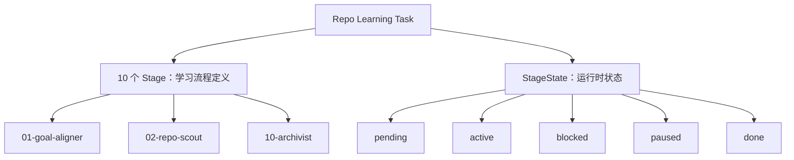
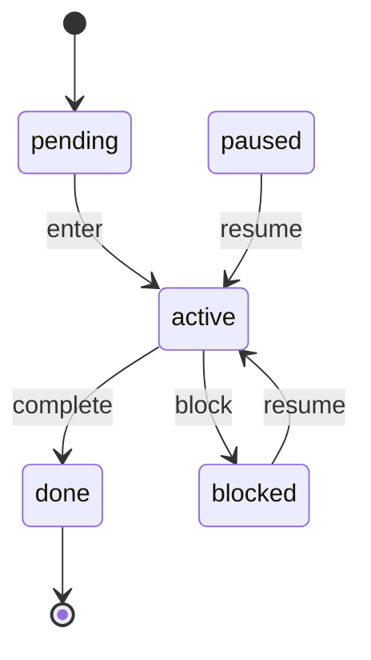
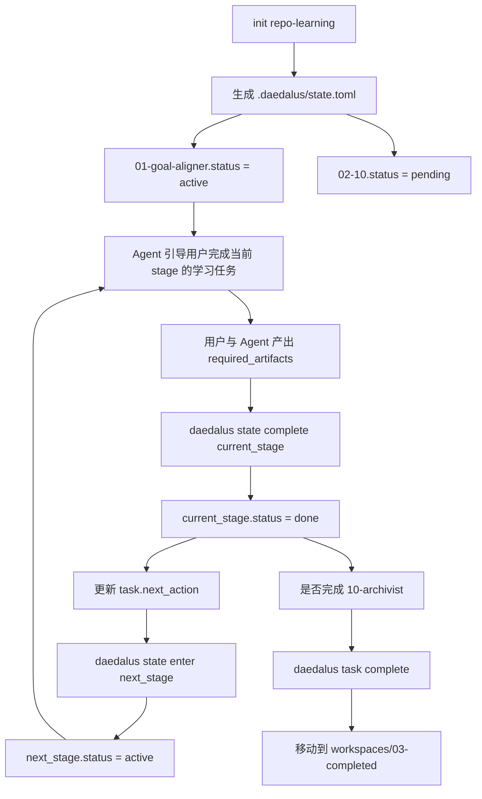
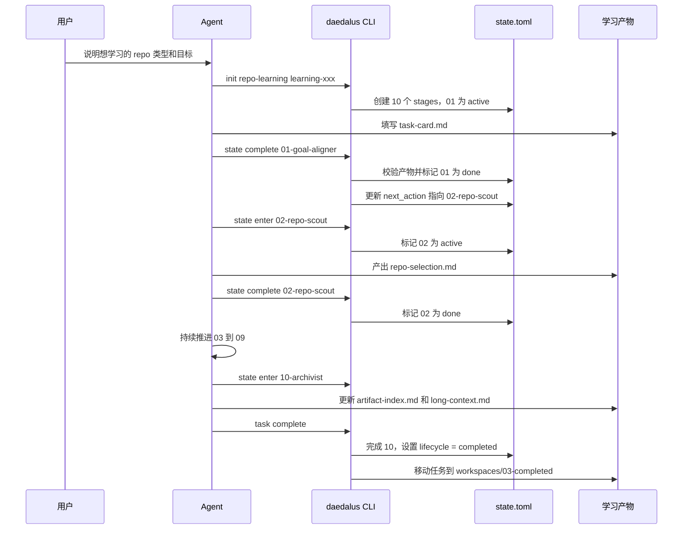
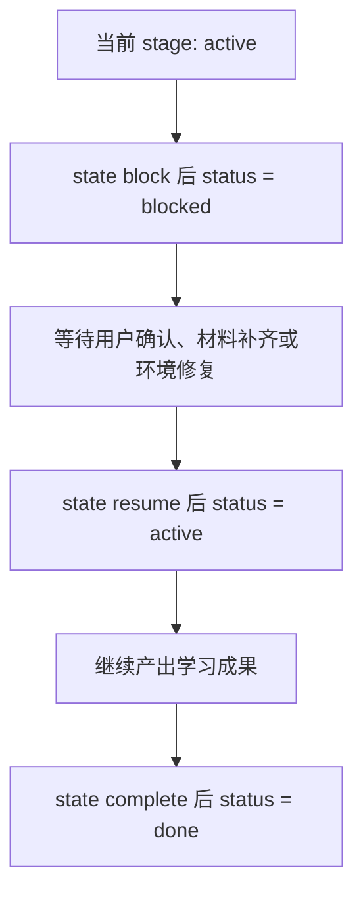
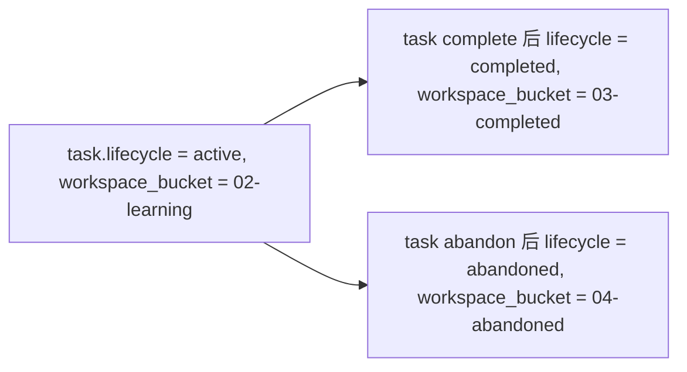
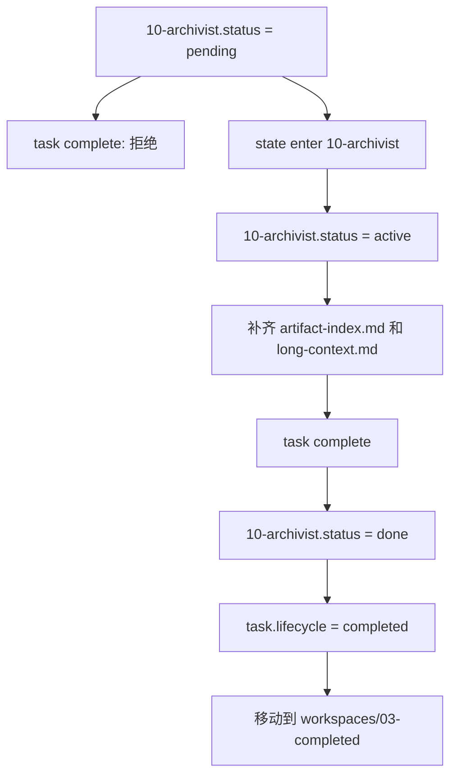

# Repo Learning 的 Stage 与 State 流转

本文解释 daedalus 当前实现中，repo learning 的 10 个 stage 和每个 stage 的 `status` 是如何配合起来，串成一个完整学习闭环的。

## 核心概念

repo learning 里有两层状态：

- **Stage**：学习流程骨架，表示“要经历哪些教学阶段”。例如 `01-goal-aligner`、`02-repo-scout`、`10-archivist`。
- **StageState**：某个 stage 在具体学习任务里的运行时状态，写在 `.daedalus/state.toml` 的 `status` 字段里。

也就是说，10 个 stage 是稳定的学习路径；`pending/active/blocked/paused/done` 是每个 stage 在执行过程中的状态。



## 10 个 Stage

repo learning 的 10 个 stage 来自 `system/templates/repo/.daedalus/state.toml`。初始化后，`01-goal-aligner` 默认是 `active`，其余 stage 默认是 `pending`。

```mermaid
flowchart LR
    s01["01-goal-aligner：对齐 Repo 学习目标"] --> s02["02-repo-scout：选择学习仓库"]
    s02 --> s03["03-socratic-coach：提出 Repo 递进问题"]
    s03 --> s04["04-debugger-guide：运行并调试 Repo"]
    s04 --> s05["05-arch-analyzer：分析 Repo 架构"]
    s05 --> s06["06-code-reader：深读 Repo 核心代码"]
    s06 --> s07["07-demo-architecture：设计 Repo Mini Demo"]
    s07 --> s08["08-demo-coder：实现 Repo Mini Demo"]
    s08 --> s09["09-biz-solver：将 Repo 学习迁移到业务问题"]
    s09 --> s10["10-archivist：闭环 Repo 学习任务"]
```



每个 stage 都会声明它完成前需要存在的产物，例如：

- `01-goal-aligner` 需要 [`.daedalus/task-card.md`](../../system/templates/repo/.daedalus/task-card.md)
- `02-repo-scout` 需要 `notes/repo-selection.md`
- `08-demo-coder` 需要 `demo/README.md`
- `10-archivist` 需要 `.daedalus/artifact-index.md` 和 `.daedalus/long-context.md`

这些产物不是装饰性文件，而是 daedalus 用来判断“学习是否真的发生了”的确定性证据。`complete` 某个 stage 时，CLI 会检查 required artifacts；缺失时拒绝完成，除非用户明确允许 `--force` 并提供可追溯的批准来源。

## StageState 状态机

`StageState` 是 Rust 领域模型中的强类型状态，对应 `.daedalus/state.toml` 里的 `stage.status`。

当前允许的状态只有：

- `pending`：阶段尚未开始。
- `active`：阶段正在进行。
- `blocked`：阶段被阻塞，等待用户、材料或外部条件。
- `paused`：任务关闭或归档时，原本 active 的阶段被暂停。
- `done`：阶段已完成，是阶段级终态。

合法状态流转如下：



这个状态机作用在“任意一个 stage”上。它不关心当前是 `02-repo-scout` 还是 `08-demo-coder`，只关心这个 stage 当前是否允许执行 `enter/complete/block/resume`。

## Stage 顺序与 State 流转如何配合

10 个 stage 提供学习顺序，`StageState` 保证每个 stage 的运行时变化合法。二者组合后形成这样的推进方式：



这里要注意两个边界：

- `complete` 不会把下一个 stage 自动设为 `active`。它只会把当前 stage 设为 `done`，并更新 `task.next_action`，提示 Agent 下一步应该进入哪个 stage。
- `enter` 某个 stage 时，会把其他 `active` stage 标记为 `blocked`，从而尽量保持“当前学习焦点”唯一。

## 一个典型学习闭环

下面以一次完整 repo learning 为例，说明 CLI、Agent 和文件系统如何协作。



## 阻塞与恢复

学习不会总是线性推进。某个 stage 可能因为材料缺失、环境问题、用户决策未定而被阻塞。



`block` 和 `resume` 都要求提供具体 reason。这样做是为了让 `[[transitions]]` 成为可审计的学习轨迹，而不是只记录机械状态。

如果在一个 stage 被 blocked 后，Agent 进入了另一个 stage，后续再 resume 原 stage 时，CLI 会把其他 active stage 标记为 blocked，避免出现多个 active 焦点。

## 任务生命周期闭环

stage 的 `status` 只描述阶段运行时状态；task 还有更外层的生命周期：

- `active`：任务位于 `workspaces/02-learning`
- `completed`：任务完成并移动到 `workspaces/03-completed`
- `abandoned`：任务放弃并移动到 `workspaces/04-abandoned`



完成任务时，`10-archivist` 必须已经是 `active`，然后才能被完成并关闭任务。这能避免 Agent 跳过最终归档阶段，直接把任务移动到 completed。



## 文件如何共同维护上下文

每个 repo learning task 的大脑和状态中心在任务目录下：

```text
learning-xxx/
  CLAUDE.md
  .daedalus/
    state.toml
    state.md
    task-card.md
    todo.md
    long-context.md
    artifact-index.md
    decision-log.md
  notes/
  demo/
  source/
```

其中：

- `state.toml` 是唯一事实中心，由 CLI 确定性更新。
- `state.md` 是从 `state.toml` 渲染出的 Agent-friendly 状态摘要，用于被 `CLAUDE.md` 通过 `@` 引用。
- `todo.md` 是 Agent 可调整的动态任务列表，服务于当前 stage。
- `artifact-index.md` 和 `long-context.md` 在 `10-archivist` 阶段沉淀学习成果。
- `decision-log.md` 记录关键决策，尤其是关闭、放弃、强制通过等需要审计的动作。

## 当前实现的关键约束

- Agent 不应该手改 `state.toml` 中的确定性字段，而应该调用 `daedalus` CLI。
- Agent 不应该发明新的 `stage.status` 枚举值；如需新增，必须同步修改 Rust 领域模型、模板和测试。
- `complete` 需要 required artifacts 存在；`--force` 只能在用户明确批准或存在等价证据时使用。
- `task complete` 和 `state complete 10-archivist` 都必须遵守最终阶段状态机，不能从 `pending` 直接关闭任务。
- `state.toml` 保留原始结构和注释，CLI 通过 `toml_edit` 更新，尽量避免破坏人工可读性。
