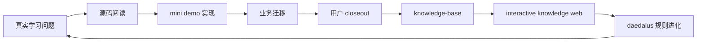
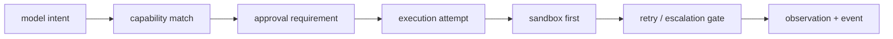
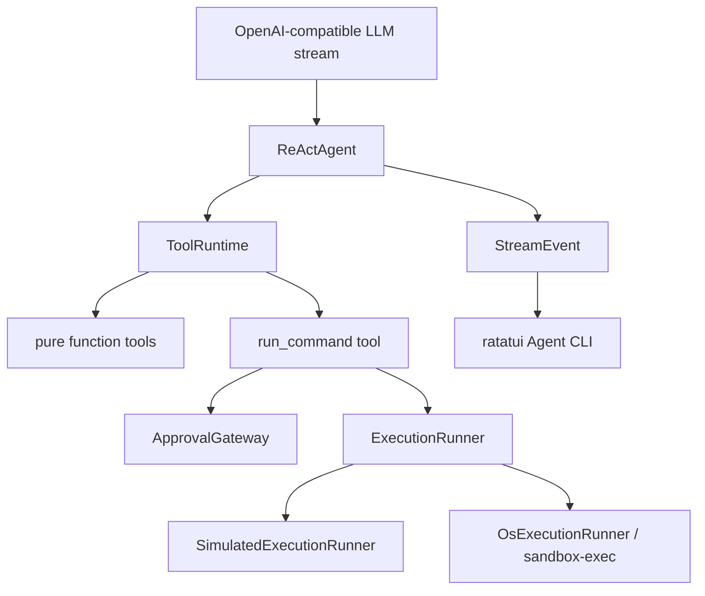

# 第一次 Repo Learning 闭环回顾：Codex 工具与权限系统

日期：2026-06-14
对象：`openai-codex-cli-deep-learning / tools-permissions`
状态：topic 已完成，已完成用户 closeout、knowledge-base 归档和知识网页策展。

## 总结

这次不是一次普通源码学习，而是 daedalus 第一次跑完整个深度学习闭环：



最终成果不是“读懂 Codex 的几份笔记”，而是同时完成了三件事：

- 学懂 Codex 工具、权限、sandbox、retry、事件和 ReAct loop 的核心机制。
- 通过 Rust mini demo 亲手实现安全本地命令执行链路、真实 OS sandbox 和 ratatui Agent CLI。
- 反过来升级 daedalus 的学习协议、closeout 流程、知识沉淀流程和知识网页标准。

## Codex Topic 学到什么

这个 topic 最核心的结论是：

```text
本地命令执行不是函数调用，而是受控副作用。
```

模型只能提出意图，Host 必须接管后续链路：



这条链路里有几个不变量：

- `Allow / Skip approval` 不等于 `bypass sandbox`。
- `approval accepted` 不等于 `NoSandbox`。
- `CommandFailed` 和 `SandboxDenied` 必须区分。
- sandbox denied 后不能自动裸跑，必须经过 retry policy 和必要审批。
- 用户授权必须绑定 scope，例如 command prefix、cwd、sandbox profile、network policy 和 persistence。
- 工具结果给模型，工具事件给外部观察者，两条线不能混。

## Demo 最终长什么样

demo 从模拟状态机推进到真实可用的 local Agent CLI：



几个关键实现闭环：

- `ToolRuntime` 先规划再执行，未知 tool fail closed。
- 同一轮多个 tool call 并发执行，结果按 index/call_id 稳定回灌。
- `ApprovalGateway` 支持 single-call 与 session scope 复用。
- `ExecutionRunner` 把 sandbox attempt 与 no-sandbox attempt 收敛为统一接口。
- `OsExecutionRunner` 使用 macOS `sandbox-exec` 验证真实 read-only / workspace-write 边界。
- `ratatui` CLI 支持 prompt、流式 transcript、approval panel、滚动和持续事件刷新。

## daedalus 在过程中如何进化

### 1. 从阶段流水线到产物驱动

早期 repo-learning 有阶段，但用户不知道“下一步要走到哪里”。后来引入 outcome map：

```text
每个学习动作必须说明：
  -> 推进哪个最终产物
  -> 填补哪个缺口
  -> 需要什么证据
  -> 完成后解锁什么
```

这让源码阅读从“继续读 Codex 权限系统”收敛成“补 demo/design.md 的某个设计决策”。

### 2. 从单 topic 到 project / topic 模型

用户指出同一个 repo 会有多个学习主题。daedalus 因此从单任务 workspace 升级为：

```text
projects/<repo>/
  shared/
  source/
  topics/<topic>/
    notes/
    guides/
    demo/
    reflection/
```

这让 Codex 的 `tools-permissions` 可以作为一个 topic 完整闭环，未来还能继续学习 sub-agent、prompt engineering、context engineering 等新 topic。

### 3. 从“Agent 总结”到“用户主动回顾”

最大的一次规则修正是：daedalus 不能替用户学习。

现在的分工是：

| 角色 | 责任 |
| --- | --- |
| 用户 | 写 notes、实践 demo、完成 closeout reflection、确认哪些理解可归档 |
| Agent | 写 guides、提问、challenge、查外部资料、组织链接、检查一致性 |
| knowledge-base | 只保存 reviewed human understanding |

`knowledge-base/` 不再是 Agent 从 notes 自动提取的摘要库，而是用户主动回顾后，经 challenge 和外部资料校准后的长期知识。

### 4. 从 closeout 之后才找知识，到滚动 candidate-map

后期发现：如果等到 10-reflection 才挖掘知识点，容易遗漏学习过程中的底层原理、Rust 技能和反复暴露的薄弱点。

因此新增 `reflection/candidate-map.md`：

- 01-09 阶段滚动维护候选。
- 10-reflection 阶段查漏补缺、降噪、确认状态。
- knowledge-base 阶段再判断每个候选应该新增、补充、修正、对比还是忽略。

### 5. 从 Markdown 知识库到交互式知识网页

Markdown 适合长期保存和深度阅读，但有些机制更适合用网页表达：

- 状态机
- 事件流
- 策略对比
- scenario walkthrough
- 代码落点与失败模式的并排查看

因此新增 `apps/knowledge-web`。它不是 Markdown 转 HTML，而是基于 knowledge-base、reflection 和 demo code 重新策展出的学习界面。

这次也暴露了一个教训：网页不能比 Markdown 更浅。后续规范已经要求：

```text
知识网页必须至少和 Markdown 一样有知识密度：
亮色可读、机制细节、Mermaid 图、决策表、交互、代码落点、失败模式、来源链接。
```

## 知识库归档结果

本 topic 最终沉淀了五篇 verified knowledge：

- `knowledge-base/ai-agents/safety-and-permissions/local-command-execution.md`
- `knowledge-base/ai-agents/tool-use/react-tool-runtime.md`
- `knowledge-base/computer-systems/operating-systems/sandbox.md`
- `knowledge-base/rust/async-runtime/streaming-agent.md`
- `knowledge-base/rust/cli-and-tui/terminal-agent-ui.md`

它们覆盖的不只是 Codex 本身，也包括学习过程中暴露出的可迁移底层能力：

- 本地命令执行安全
- ReAct 工具运行时
- sandbox 第一性原理
- Tokio / Future / Waker / Stream
- ratatui / crossterm / terminal event loop

## 方法论教训

### 学习材料不是权威

Codex 是高质量案例，但不是唯一真理。学习时要问：

```text
现实需求是什么？
约束是什么？
Codex 为什么这样做？
收益是什么？
代价是什么？
我的场景应该 copy、simplify、improve 还是 discard？
```

### 图不能贪心

closeout 画图时，用户指出一个重要原则：

```text
图负责建立空间感：层次、主方向、依赖关系。
文字负责建立判断力：关键分支、特殊情况、trade-off。
```

如果一张图试图讲完所有异常分支、事件、状态和依赖，它会很完整，但不可读。

### 实现进度必须以代码为准

多次进度误判来自只读 Markdown 地图。现在规则明确：

```text
判断实现状态：
  先看代码
  再看测试
  再看运行证据
  最后参考学习地图
```

学习地图是导航，不是事实本身。

### 长任务前要给学习者并行任务

当 Agent 要跑长检查、重构或提交时，应该先给学习者一个可并行思考的小任务，避免学习节奏断掉。这是 coach 体验的一部分。

## 当前验证证据

本次收尾验证包括：

```bash
make knowledge-web-check
git diff --check
```

浏览器验证包括：

- `apps/knowledge-web` 可以通过 Vite preview 打开。
- 页面为亮色主题。
- 5 个学习模块存在。
- Mermaid 图可以渲染。
- scenario / module / diagram 交互可用。
- 每个模块包含代码落点、失败模式和自测问题。
- 移动端宽度无横向溢出。

Topic lifecycle 当前状态：

```text
tools-permissions.lifecycle = completed
current_topic = ""
```

## 仍然保留的边界

- demo 保留核心机制，但不是生产级 shell parser。
- `sandbox-exec` 是 macOS 路径，跨平台需要 Linux/Windows 对应 runner。
- 知识网页已经比第一版深很多，但未来每个新 topic 更新网页时，仍必须按“不能比 Markdown 浅”的标准重新验收。
- daedalus 的 prompt / skill 仍要继续保持轻量，避免规则太多导致遵循率下降。

## 结论

这次闭环证明 daedalus 的核心不是“帮用户读完一个 repo”，而是：

```text
真实问题
  -> 深读材料
  -> 亲手实现
  -> 主动回顾
  -> 知识归档
  -> 交互式复习
  -> 方法论反哺系统
```

Codex tools-permissions topic 已经可以收尾。它完成了源码理解、demo 实践、业务迁移、用户 reflection、knowledge-base 归档和知识网页表达；更重要的是，它让 daedalus 自己也长出了一套更清晰的学习闭环。
