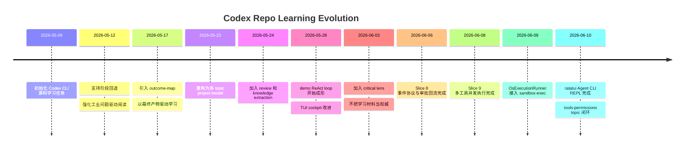

# 第一次 Repo Learning 闭环回顾：Codex 工具与权限系统

日期：2026-06-10
范围：`main..learning/codex`
对象：`openai-codex-cli-deep-learning / tools-permissions`

## Executive Summary

这次分支不是一次普通功能开发，而是 daedalus 的第一次完整实战闭环：

```text
学习一个真实 repo
  -> 暴露 coach 协议缺陷
  -> 修改 daedalus 自身
  -> 继续学习
  -> 实现 mini demo
  -> 迁移业务模式
  -> 归档知识
```

最终产物不是“读懂 Codex 的若干笔记”，而是一套已经被源码阅读、demo 实现、测试和 UI 验证过的学习工作流：

- repo-learning 从单任务模型升级为 project/topic 模型。
- 学习过程从阶段流水线升级为 outcome-driven map。
- demo 从模拟状态机推进到真实 OS sandbox 和 `ratatui` CLI。
- review / knowledge system 成为 learning 之后的独立能力。
- daedalus 自身指令被多次压缩、校准和强化，减少“Agent 替用户学习”的风险。

## Timeline



## What Changed In Daedalus

### 1. 从单任务学习升级为多专题项目

最初 repo-learning 更像一个 10-stage workspace。随着用户提出“同一个 repo 里会有多个学习 topic”，系统升级为：

```text
repo learning project
  -> shared/
  -> topics/<slug>/
       -> .daedalus/state.toml
       -> notes/
       -> guides/
       -> demo/
```

这个改动解决了两个问题：

- 同一个 repo 可以学习多个主题，例如工具权限、sub-agent、prompt engineering。
- topic 内产物可以闭环，shared 只保存跨 topic 可复用的 verified knowledge。

代价是状态模型更复杂，CLI/TUI/prompt 都必须区分 project state 和 topic state。

### 2. 从阶段导航升级为终点地图

用户指出早期学习缺少“我们要去哪里”的方向感。于是新增 `outcome-map.md`，并把学习协议改成：

```text
每个学习动作必须说明：
  -> 推进哪个最终产物
  -> 填补哪个缺口
  -> 需要什么证据
  -> 完成后解锁什么
```

这个改变直接减少了源码细节沼泽。Codex 权限系统没有继续泛读，而是收敛到三个 demo 缺口：

- Decision 合成
- Runtime request assembly
- Orchestrator retry

### 3. notes / guides 文件夹化

早期每个阶段一份 markdown，很快变成无法导航的大文件。后来改成：

```text
guides/<stage-id>/README.md
guides/<stage-id>/<topic>.md
notes/<stage-id>/README.md
notes/<stage-id>/<topic>.md
```

这个结构让阶段内部也有“地图 + 专题证据”，避免所有内容塞进一个 `code-reading.md`。

### 4. Review 和 Knowledge System 独立出来

用户提出“已经学完的 topic 或 repo 应该能随时启动复习计划”。于是 daedalus 增加：

- `daedalus review ...`
- `daedalus knowledge ...`
- review templates
- knowledge-system templates

重要设计是：review 不重新打开 learning stage，而是挂载在 completed topic/project 上，帮助从第一性原理重建理解、暴露薄弱点并更新 mastery map。

### 5. TUI 从状态摘要升级为学习驾驶舱

`daedalus-tui` 最初只是状态面板。用户指出 next action 被截断、信息无法完整阅读。升级方向变成：

```text
overview 第一屏负责定位
detail/read view 负责完整阅读
所有写操作仍走 daedalus CLI
```

这让 TUI 更像学习现场恢复工具，而不是漂亮但没用的状态页。

### 6. 指令从“越多越好”转向“轻量门禁”

在多次“为什么你没有主动更新进度/提交后同步下一步/长任务前给学习指令”的反馈后，daedalus 没有无限堆 prompt，而是增加了轻量协议：

- micro-checkpoint
- checkpoint lifecycle
- long-task learning handoff
- post-commit orientation
- critical lens
- implementation evidence first

关键经验：强制机制要短、稳定、可检查；太长的全局指令会降低遵循率。

## What Changed In The Demo

Codex mini demo 最终保留了一个核心不变量：

```text
model intent
  != host capability
  != approval requirement
  != execution attempt
  != retry decision
  != observable event
```

### Phase 1: 模拟状态机

Phase 1 使用 `SimulatedExecutionRunner`，先验证结构：

- `CapabilityRegistry`
- `ApprovalRequirement`
- `ApprovalGateway`
- `ExecutionRunner`
- `RetryDecision`
- `StreamEvent`
- `ToolRuntime`
- `ReActAgent`

这一步的价值是把安全链路变成可测状态机，而不是一开始陷入 OS sandbox 细节。

### Phase 2A: 真实 OS sandbox

Phase 2A 用 macOS `sandbox-exec` 实现 `OsExecutionRunner`：

- read-only sandbox 能读不能写。
- workspace-write sandbox 可在 cwd 写入。
- sandbox denied 映射为统一 `ExecutionFailure::SandboxDenied`。
- no-sandbox retry 仍走同一个 `ExecutionRunner` 接口。

这证明 Phase 1 的抽象不是纸上设计，可以承接真实执行。

### Phase 2B: 真实 Agent CLI UI

Phase 2B 用 `ratatui` 接入真实 `ReActAgent`：

- prompt 输入
- Codex-like transcript
- thinking/text delta 合并
- tool / command / approval events
- approval once/session/reject 面板
- event log 滚动
- `echo approval-test` 无副作用审批验收

一个关键 bug 是：早期 UI 只有用户输入时才继续吐 agent events。修复后主循环改为：

```text
keyboard input thread -> key_rx
agent stream task     -> ui_rx

run_event_loop:
  tokio::select!
    key_rx.recv()
    ui_rx.recv()
    sleep tick
```

这让一次 prompt 后事件能持续流到 `Completed`，不依赖键盘输入泵事件。

## Learning Protocol Lessons

### 1. Agent 不能替用户学习

早期 Agent 曾经主动代写学习记录或 demo 代码，违背了“用户亲手形成理解”的目标。后续规则明确：

- Agent 写 guides。
- 用户实践和回答进入 notes。
- Agent 可以校准 notes，但不能把自己推理伪装成用户掌握。

### 2. 学习材料不是权威，是设计案例

用户指出 Agent 过于把 Codex 当唯一事实。后续加入 critical lens：

```text
现实需要 X
约束迫使 Y
repo 选择 Z
Z 的收益是什么
Z 的代价是什么
业务迁移时哪些 copy / simplify / discard
```

这让学习从“复刻 Codex”变成“先忠实模仿核心机制，再判断迁移边界”。

### 3. 实现进度必须以代码为准

多次进度误判来自只读 markdown，不看当前代码。后来形成规则：

```text
判断实现进度或阶段完成时：
  先看代码
  再看测试
  再看运行证据
  最后参考学习地图
```

学习地图是导航，不是事实本身。

### 4. 小闭环后必须同步地图

用户多次指出完成一个结构推进后，daedalus 没有更新学习进度。最终形成 micro-checkpoint：

- 代码闭环
- 测试闭环
- notes/guides/todo/outcome-map 同步
- commit
- 提示下一步

### 5. 长任务前要给学习指令

如果 Agent 预计要工作较久，应先给用户一个可并行学习的小任务，避免用户空等导致节奏断裂。这是 coach 体验的一部分，不是礼貌性提示。

## Evidence

关键提交：

| Commit | 作用 |
| --- | --- |
| `b8cc7c1b` | 以终点产物重构学习流程 |
| `e1ae039e` | repo-learning 重构为多专题项目模型 |
| `73c39bd1` | 实现复习计划与知识体系 CLI |
| `eed0720c` | 升级学习驾驶舱详情阅读 |
| `6f6a28f6` | 加入批判性学习协议 |
| `d2c3d56a` | 收口 Slice 8 command 事件生命周期 |
| `d9df73e0` | 收口 Slice 9 多工具并发执行 |
| `b79d505f` | 实现 approval session 复用 |
| `b1c60d96` | 完成 OsExecutionRunner 并进入 Phase 2B |
| `8195efdb` | 接入 ratatui Agent CLI REPL |
| `b6b5c165` | 收口 Codex 工具权限专题 |

验证命令：

```bash
cargo test --manifest-path workspaces/02-learning/openai-codex-cli-deep-learning/topics/tools-permissions/demo/Cargo.toml -j 2
daedalus validate workspaces/02-learning/openai-codex-cli-deep-learning
```

最近验证结果：

```text
84 passed; 0 failed; 3 ignored
ok: workspace valid
```

## Remaining Risks

- `tools-permissions` topic 已完成，但整个 project 还没有移动到 completed bucket；是否关闭 project 取决于是否继续开新 topic。
- demo 的 shell parsing 仍然是学习用简化，不适合直接作为复杂 shell 安全边界。
- `ApprovalPolicy::OnRequest` 的显式 escalation request 尚未完整建模。
- `ratatui` CLI 已可验证核心逻辑，但不是生产级 Codex UI。
- daedalus 的指令体系仍需要继续瘦身，避免全局 prompt 过长导致遵循率下降。

## Conclusion

这次 repo learning 最大的成果，不只是学完 Codex 工具权限系统，而是证明 daedalus 可以在真实学习过程中自我改造：

```text
用户提出困惑
  -> coach 暴露协议缺陷
  -> daedalus 修改协议和工具
  -> 学习继续推进
  -> 产物验证新协议
```

这就是 daedalus 的核心产品形态：不是静态教程，也不是一次性代码生成器，而是一个能把学习过程、实践产物和方法论持续固化到文件系统中的深度学习 coach。
