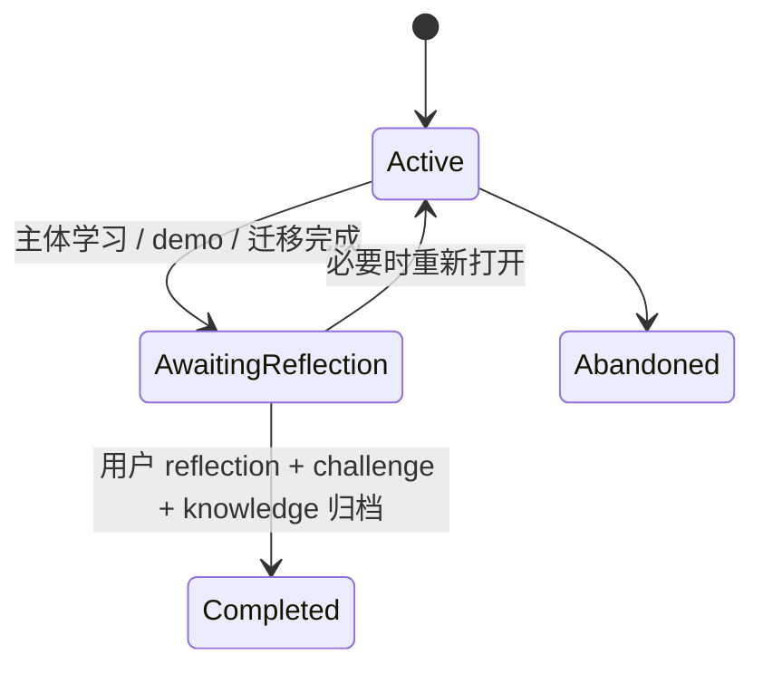
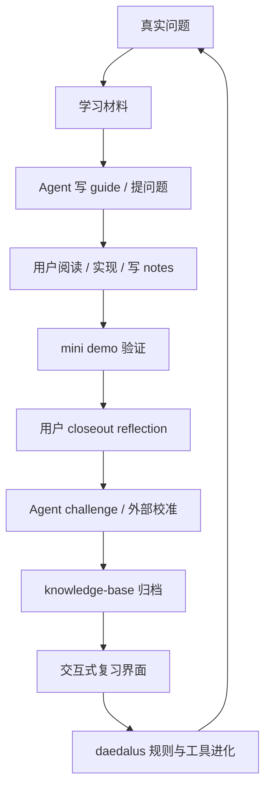

# Daedalus 第一个真实 Topic 后的系统进化报告

日期：2026-06-14
样本：`openai-codex-cli-deep-learning / tools-permissions`
对象：`daedalus`
状态：第一个 repo-learning topic 已完成主体学习、demo、reflection、knowledge-base 归档和知识网页策展。

## 这份报告在回答什么

这不是 Codex 的学习总结。Codex 只是第一个高强度压测样本。

这份报告总结的是：daedalus 在陪用户完成第一个真实 topic 的过程中，哪些设计被证明不够好，哪些能力被迫长出来，最后从一个 repo-learning 原型进化成了什么样的学习系统。

依据来自当前分支相对 `main` 的全部变更：

- 321 个文件变化。
- 约 5.5 万行新增。
- 覆盖 CLI、TUI、prompt、skill、workspace、topic lifecycle、reflection、knowledge-base、knowledge web、ignore 规则、模板和示例 workspace。

## 一句话结论

daedalus 的核心不再是“带用户读完一个 repo”，而是：

```text
用文件系统承载长期学习现场，
用真实 demo 验证理解，
用用户主动 reflection 完成认知闭环，
用知识库和网页把高价值理解转成可复习、可迁移的能力。
```

第一个 Codex topic 的价值，恰好在于它把 daedalus 的很多薄弱点暴露出来了。

## 进化总览

```mermaid
flowchart LR
    A["初始状态：单 repo-learning task"] --> B["产物驱动学习"]
    B --> C["Project / Topic 模型"]
    C --> D["代码与学习地图同步"]
    D --> E["human-owned notes"]
    E --> F["awaiting-reflection 生命周期"]
    F --> G["candidate-map 滚动候选"]
    G --> H["有机 knowledge-base"]
    H --> I["interactive knowledge web"]
    I --> J["更稳定的 agent context"]
```



这条线不是提前设计好的，而是在真实学习中一次次被问题推出来的。

## 1. 学习流程：从阶段流水线到终点产物驱动

### 暴露的问题

早期 repo-learning 有 10 个阶段，但用户经常会问：

```text
我现在在哪里？
下一步为什么要做？
这一步服务最终什么产物？
什么时候可以停止读源码？
```

这说明“阶段”只能告诉人走到了哪里，不能告诉人为什么要继续走。

### 进化结果

daedalus 引入 outcome map、todo path board、stage README 和 artifact dependency 的思路：

- 每轮学习都必须说明推进哪个最终产物。
- 代码阅读必须绑定 demo / business transfer / knowledge export 的缺口。
- 读源码不是读到“这个模块讲完”，而是读到“下一个设计决策不再被阻塞”。
- 当 demo invariant、data structure、state machine、acceptance tests 足够明确时，必须离开 code-reading。

### 落地位置

- `system/prompts/common/resume.md`
- `system/prompts/repo/phase2-learning/06-code-reader.md`
- `system/prompts/repo/phase3-practice/07-demo-architecture.md`
- `system/templates/repo-topic/.daedalus/outcome-map.md`
- `system/templates/repo-topic/.daedalus/todo.md`

## 2. Workspace：从单任务目录到稳定 Project / Topic 模型

### 暴露的问题

一个 repo 可以学习多个 topic。

Codex 先学了 `tools-permissions`，未来还可能学 sub-agent、prompt engineering、context engineering。旧结构把 project、topic 和 stage 混在一起，不适合长期积累。

另一个问题是 lifecycle 路径会误导 agent：如果 topic completed 后 project 被移动，后续新增 topic 又要搬回来，路径一致性会变差。

### 进化结果

daedalus 改成稳定 project、可变 topic：

```text
workspaces/projects/<project>/
  shared/
  source/
  topics/<topic>/
    guides/
    notes/
    demo/
    reflection/
```

Project 不再随着 topic 完成而移动。topic 自己拥有完整 10-stage 生命周期。顶层 workspace 只展示当前行动入口。

### 关键边界

- `workspaces/projects` 是稳定项目仓库。
- `workspaces/current-topic` 只在 active topic 存在时出现。
- `workspaces/closeout-topic` 指向等待用户回顾的 topic。
- `.archive/` 放废弃 topic，并通过各类 ignore 文件默认排除出 agent 上下文。

### 落地位置

- `crates/daedalus-cli/src/application/topic.rs`
- `crates/daedalus-cli/src/infrastructure/workspace_fs.rs`
- `system/templates/repo/`
- `system/templates/repo-topic/`
- `workspaces/.daedalus/current.toml`
- `.ignore` / `.cursorignore` / `.claude/settings.json` / `.aiderignore` 等

## 3. 状态机：从 active/completed 到 awaiting-reflection

### 暴露的问题

用户的学习节奏是工作日晚上 1-2 小时，完整 closeout 更适合周末大块时间。

如果 topic 主体学习已经完成，但 reflection 还没写，它不应该继续占用 active learning slot；但也不能直接算 completed。

### 进化结果

新增 `awaiting-reflection`：



这让 daedalus 可以同时满足两个要求：

- 日常只保留一个真正 active topic。
- 允许一个已经完成主体学习的 topic 等待周末 closeout。

### 落地位置

- `crates/daedalus-cli/src/domain/topic.rs`
- `crates/daedalus-cli/src/application/topic.rs`
- `crates/daedalus-cli/src/application/validate_workspace.rs`
- `system/prompts/common/closeout-flow.md`
- `system/templates/repo-topic/.daedalus/state.toml`

## 4. Coach 角色：从替用户总结到 human-owned notes

### 暴露的问题

早期 agent 会主动写 notes、总结知识点。用户明确指出：这会变成“AI 替我学习”。

真正让人变强的是用户自己回忆、组织、表达、修正。AI 可以帮助，但不能代替这个认知摩擦。

### 进化结果

daedalus 重新定义角色分工：

| 角色 | 责任 |
| --- | --- |
| 用户 | 写 notes、做 demo、完成 closeout、决定哪些理解值得归档 |
| daedalus | 写 guides、提问、challenge、找矛盾、补外部资料、组织链接和校验一致性 |
| knowledge-base | 保存经过用户主动回顾和校准后的长期知识 |

因此：

- 新 notes 不应由 agent 直接生成。
- 用户写完 notes 后，agent 才进入 review / challenge / organize。
- knowledge-base 不是自动摘要库，而是 reviewed human understanding。

### 落地位置

- `system/prompts/common/human-owned-notes.md`
- `system/prompts/common/coach-questioning.md`
- `.claude/skills/repo-learning-coach/SKILL.md`
- `AGENTS.md`
- `CLAUDE.md`

## 5. 批判性学习：从“源码即权威”到 constrained design case

### 暴露的问题

在学习 Codex 时，agent 有时会把 Codex 的实现当成唯一事实，缺少对局限性、trade-off 和不适合照搬之处的分析。

这会伤害迁移能力：学习优秀项目不是崇拜它，而是理解它在什么约束下做出了什么取舍。

### 进化结果

daedalus 增加 critical lens：

```text
需求是什么？
约束是什么？
Codex 为什么这样做？
收益是什么？
代价是什么？
我的场景应该 copy、simplify、improve 还是 discard？
```

同时保留“忠实模仿”的价值：demo 阶段可以模仿优秀项目的复杂性，甚至先感受它的缺点，再决定生产环境如何取舍。

### 落地位置

- `system/prompts/common/critical-lens.md`
- `system/prompts/common/first-principles.md`
- `system/prompts/repo/phase2-learning/06-code-reader.md`

## 6. 实现事实：从相信 Markdown 地图到代码优先

### 暴露的问题

多次学习进度误判来自只看 todo、outcome map 或 guide，没有先看真实代码、测试和运行结果。

学习地图会过期，代码和测试才是实现事实。

### 进化结果

新增规则：

```text
判断实现进度：
  先看代码
  再看测试
  再看运行证据
  最后参考学习地图
```

微闭环完成后必须同步学习地图。提交前做 learning-map sync check，提交后主动给出 post-commit orientation。

### 落地位置

- `system/prompts/common/micro-checkpoint.md`
- `system/prompts/common/checkpoint-lifecycle.md`
- `system/prompts/common/agent-operating-contract.md`
- `system/prompts/common/review-guidance.md`

## 7. CLI / TUI：从状态摘要到学习驾驶舱

### 暴露的问题

早期 TUI 只是展示 state 摘要。它告诉用户“缺哪些 artifact”，但不能帮用户恢复现场：

- 当前到底卡在哪里？
- 下一步为什么重要？
- 应该读哪个 guide？
- 长内容怎么完整阅读？

### 进化结果

TUI 升级为 read-only learning cockpit：

- 第一屏突出 Current Position 和 Next Action。
- 长文档进入完整 read view，不再塞在 overview 里截断。
- 支持 todo、outcome-map、current guide、review / knowledge focus 的入口。
- 支持滚动、翻页、返回和刷新。

同时 CLI 增强了 topic、review、knowledge、ide、validate 等能力，承担确定性状态管理和校验。

### 落地位置

- `crates/daedalus-cli/src/interfaces/tui/app.rs`
- `crates/daedalus-cli/src/interfaces/tui/screens.rs`
- `crates/daedalus-cli/src/interfaces/agent_cli/commands/topic.rs`
- `crates/daedalus-cli/src/interfaces/agent_cli/commands/review.rs`
- `crates/daedalus-cli/src/interfaces/agent_cli/commands/knowledge.rs`
- `crates/daedalus-cli/src/application/ide.rs`

## 8. Demo：从“理解源码”到“可运行的验证器”

### 暴露的问题

如果只读 Codex 源码，很多理解会停留在“我知道它这么做”。只有实现 mini demo，才会暴露真正的设计问题：

- approval 和 sandbox 是不是同一层？
- sandbox denied 后能不能直接裸跑？
- tool call 多个并发时如何回灌？
- approval persistence 的 session 边界在哪里？
- event 应该由谁统一发？
- terminal UI 如何持续消费流式事件？

### 进化结果

第一个 topic 产出了一个可运行 Rust mini demo：

- OpenAI-compatible 流式 LLM 接入。
- ReAct loop。
- pure function tool 与 command tool。
- ToolRuntime。
- ApprovalGateway。
- SimulatedExecutionRunner。
- macOS `sandbox-exec` OsExecutionRunner。
- 多 tool call 并发执行。
- ratatui Agent CLI。

demo 不是 daedalus 本体，但它验证了 daedalus 的学习方法：源码理解必须落到可运行机制上。

### 落地位置

- `workspaces/projects/openai-codex-cli-deep-learning/topics/tools-permissions/demo/`
- `workspaces/projects/openai-codex-cli-deep-learning/topics/tools-permissions/demo/README.md`
- `workspaces/projects/openai-codex-cli-deep-learning/topics/tools-permissions/demo/design.md`

## 9. Knowledge：从固定模板到有机知识树

### 暴露的问题

早期 knowledge-base 把内容拆成概念、技能、模式、问题等固定桶，结果每篇都像硬套模板，知识被切碎，读完很难形成完整理解。

另一个问题是：如果等 closeout 结束才开始挖掘知识点，学习过程中暴露的底层原理和薄弱点容易遗漏。

### 进化结果

daedalus 改成两层机制：

1. `reflection/candidate-map.md` 在 01-09 阶段滚动维护候选。
2. 10-reflection 阶段基于候选表查漏补缺、降噪、确认状态，再进入 knowledge-base。

knowledge-base 改成有机知识树：

```text
knowledge-base/
  ai-agents/
  computer-systems/
  rust/
  ...
```

单篇条目的质量标准也提升为：

```text
每篇都应该接近一篇可发布技术博客或一节技术课：
有问题背景、第一性原理、底层机制、图示、代码落点、工程取舍、失败模式和复习问题。
```

### 落地位置

- `system/prompts/common/candidate-map.md`
- `system/prompts/common/archive-knowledge.md`
- `system/templates/repo-topic/reflection/candidate-map.md`
- `knowledge-base/`
- `crates/daedalus-cli/src/application/knowledge.rs`

## 10. Knowledge Web：从 Markdown 归档到交互式复习界面

### 暴露的问题

Markdown 适合长期保存，但部分机制更适合交互式表达：

- 状态机。
- scenario walkthrough。
- 安全策略对比。
- 代码落点和失败模式并排阅读。

第一版网页又暴露了另一个问题：网页如果比 Markdown 浅，就只是漂亮封面，不是知识界面。

### 进化结果

新增 `apps/knowledge-web`：

- 亮色主题。
- 5 个知识模块。
- Mermaid 机制图。
- 命令安全 scenario simulator。
- 代码落点、失败模式、自测问题和来源链接。
- `make web` / `make knowledge-web-check`。
- `knowledge-web-curator` skill，用于约束后续每次网页迭代质量。

### 落地位置

- `apps/knowledge-web/`
- `.claude/skills/knowledge-web-curator/SKILL.md`
- `Makefile`
- `README.md`
- `knowledge-base/README.md`

## 11. Agent Context：从“希望 agent 记得”到环境强约束

### 暴露的问题

仅靠 prompt 约束 agent 容易失效。尤其是 workspace 重构后，如果 agent 仍然去根目录找 `.daedalus/state.toml`，就会误判当前进度。

### 进化结果

daedalus 把上下文入口写进 agent 原生加载机制：

- 根目录 `AGENTS.md`。
- 根目录 `CLAUDE.md`。
- project/topic 内部 `CLAUDE.md`。
- 各类 ignore 文件。
- `.claude/settings.json` deny `.archive/`。
- `workspaces/current-topic` 和 `workspaces/closeout-topic` 作为人和 agent 的行动入口。

这不是“提醒 agent 不要犯错”，而是让正确入口更显眼，让错误路径更难被加载。

### 落地位置

- `AGENTS.md`
- `CLAUDE.md`
- `.claude/settings.json`
- `.ignore` / `.cursorignore` / `.aiderignore` / `.continueignore` / `.geminiignore` 等
- `system/bin/audit-daedalus-agent-instructions`

## 12. 工程纪律：从随手提交到可校验协作协议

### 暴露的问题

长时间协作里出现过：

- commit message 不符合约定。
- 提交后没有主动同步进度。
- 长任务期间用户只能等待。
- 测试断言偶然文案，导致脆弱。

### 进化结果

daedalus 补齐了轻量工程协议：

- commit message hook：最初采用 `type(scope): 中文描述` 或 `type: 中文描述`，后续随 daedalus 从纯开发仓库演进为学习主题推进系统，更新为 `{topic}/{scope}: 中文描述`。
- 长任务前给学习者一个可并行思考的小任务。
- 微闭环后同步学习地图。
- 提交后主动输出当前位置和下一步。
- 单测优先断言稳定行为，不断言偶然字符串。
- Rust 开发优先功能正确性和代码简洁性，不把“少改动”当第一目标。

### 落地位置

- `system/bin/check-commit-msg`
- `.pre-commit-config.yaml`
- `system/prompts/common/checkpoint-lifecycle.md`
- `system/prompts/common/agent-operating-contract.md`
- `AGENTS.md`

## 当前验证证据

### daedalus 本体

本分支已经为 CLI / TUI / workspace / lifecycle / knowledge 增加了大量测试，主要覆盖：

- repo-learning 初始化。
- project/topic 生命周期。
- active topic 与 pending closeout 投影。
- review / knowledge 校验。
- workspace validate。
- workspace structure update。
- rust-analyzer linkedProjects 同步。

### knowledge web

最近一次验证：

```bash
make knowledge-web-check
```

并通过浏览器验证：

- 页面可打开。
- Mermaid 可渲染。
- 5 个模块存在。
- scenario / module / diagram 交互可用。
- inline code 不再裸露 Markdown 反引号。
- 移动端无横向溢出。

### 当前 topic 状态

```text
Project: openai-codex-cli-deep-learning
Topic: tools-permissions
Topic lifecycle: completed
Active topic: none
Pending closeout: none
```

## 还保留的边界

- daedalus 当前 repo-learning 闭环已经跑通，但 book / paper / course learning 还没有经过同等强度实战验证。
- knowledge web 目前是 Codex tools-permissions 的第一版 atlas，还不是通用知识库站点框架。
- `apps/knowledge-web` 目前内容是策展式页面，不是从 Markdown 自动生成整站。
- demo 使用 macOS `sandbox-exec` 验证 OS sandbox，跨平台 runner 仍需后续专题补齐。
- agent context 规则已经更稳，但仍需要靠 `validate` 和文件结构持续防止漂移。

## 真正的产品结论

第一个 topic 证明：daedalus 最重要的产品能力不是“生成学习笔记”，而是持续维护一个学习闭环：



这次进化里，Codex 是被学习的材料；真正被打磨出来的是 daedalus 自己。
