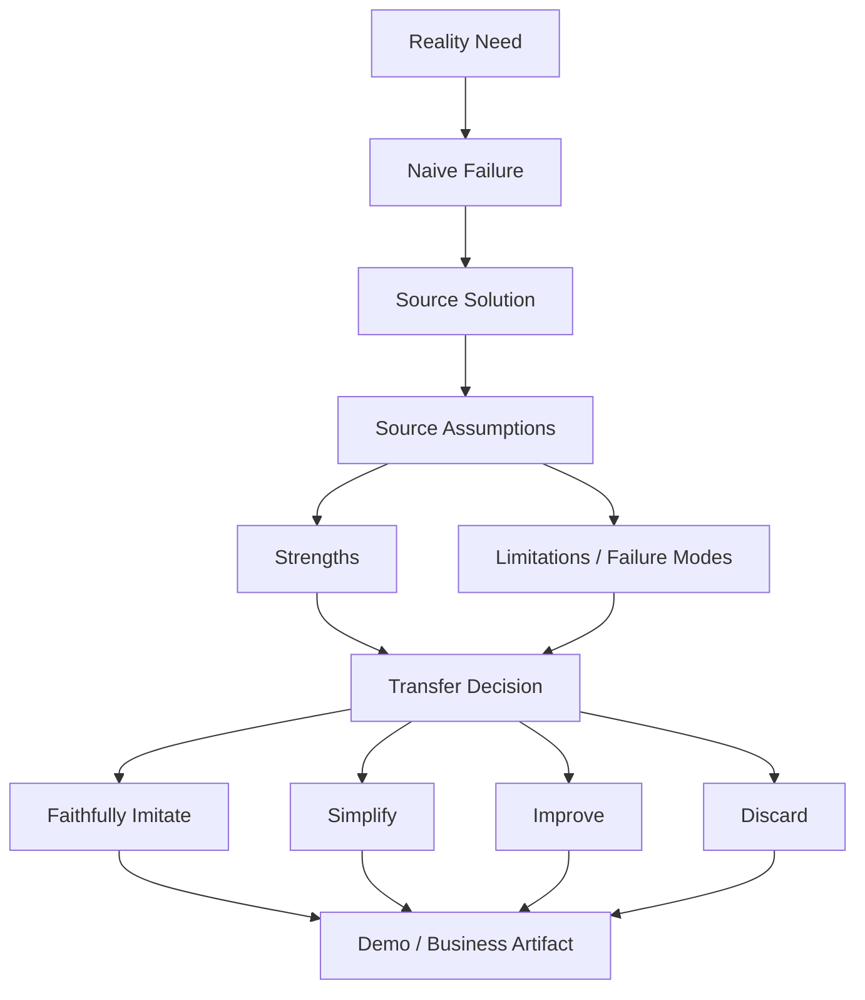
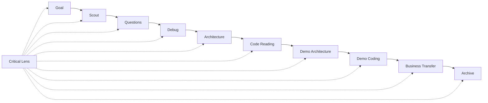

# Repo Learning 批判性学习协议升级方案

> Date: 2026-06-03
> Status: done (v1 implemented)

## Summary

daedalus 当前已经要求从第一性原理、现实约束和 trade-off 出发学习 repo，但这个要求仍然偏向“解释素材为什么这么做”。在实际学习过程中，Agent 容易把被学习的 repo、book、project 当成事实标准，沿着素材内部逻辑推进，而没有持续追问：

- 这个素材解决的是不是用户真正的问题？
- 这个方案成立依赖哪些现实约束？
- 它有哪些局限、失败模式和认知成本？
- 它哪些部分值得迁移，哪些部分只适合原项目？
- 我们的 mini demo 或业务迁移是否可以比素材更简单、更清晰？

本方案建议把“批判性学习”升级为横切协议，贯穿 goal alignment、repo scout、question roadmap、debug、architecture、code reading、demo、business transfer、review 和 knowledge extraction。

核心原则：

```text
素材是证据，不是权威。
源码是案例，不是教条。
demo 默认要忠实模仿核心机制，用实现手感理解 trade-off。
批判性不是反对模仿，而是防止无意识照搬，并帮助用户判断哪些 trade-off 值得迁移。
```

## Implementation Status

状态：已完成第一版落地。

已实现范围：

- 新增 `system/prompts/common/critical-lens.md`。
- 更新 `repo-learning-coach`，新增 `Critical Learning Gate`。
- 更新 `first-principles`、question roadmap、review、knowledge extraction、export knowledge 和 micro checkpoint。
- 更新 repo learning 01-10 阶段 prompt，让批判性贯穿目标、选 repo、问题路线、调试、架构、源码、demo、业务迁移和归档。
- 更新 topic outcome-map / todo 模板，以及 review / knowledge-system 相关模板。
- 对当前 Codex `tools-permissions` topic 做轻量迁移：增加 Critical Lens、Critical Checkpoint 和 Slice 8 Event Protocol Hardening guide。

验证结果：

- `git diff --check` 通过。
- `cargo test --manifest-path crates/Cargo.toml -p daedalus-cli` 通过。
- `cargo run --manifest-path crates/Cargo.toml -p daedalus-cli --bin daedalus -- validate workspaces/02-learning/openai-codex-cli-deep-learning` 通过。

## First Principles

### 1. 学习素材只是局部最优方案

一个成熟 repo 的设计通常来自一组具体约束：

```text
用户规模
安全边界
平台限制
历史包袱
团队偏好
生态依赖
性能要求
产品体验
```

因此它不是“唯一正确答案”，而是“在这些约束下足够好的答案”。如果 daedalus 只引导用户理解素材内部逻辑，用户会获得复述能力，但不一定获得判断能力。

### 2. 深度学习需要同时理解、质疑、迁移

repo learning 的主链路应该从：

```text
现实需求 -> naive 失败 -> repo 方案 -> trade-off -> transferable pattern
```

升级为：

```text
现实需求
  -> naive 失败
  -> repo 方案
  -> repo 方案成立的约束
  -> repo 方案的收益
  -> repo 方案的局限和失败模式
  -> 可替代方案
  -> 对当前 demo / 业务场景的迁移取舍
```

这不是为了“挑刺”，而是为了避免把材料权威化。

### 3. Demo 模仿是学习手段，不是最终教条

repo learning 的 mini demo 不是纯粹的“重新设计一个更好的系统”。它首先要让用户亲手感受优秀项目如何把现实约束压进类型、状态机、模块边界和测试里。

因此 demo 的默认策略应该是：

```text
先忠实模仿核心机制
  -> 保留必要的 trade-off 和实现摩擦
  -> 通过测试和运行感受设计成本
  -> 再判断哪些适合迁移、简化、改进或丢弃
```

这意味着，即便某些设计看起来笨重，只要它来自真实生产约束，demo 也可以临时模仿它。批判性要反对的是“把素材当成权威而无意识照搬”，不是反对“为了学习而有意识地复刻”。

### 4. 批判性必须轻量、频繁、可恢复

批判性如果只在最后总结一次，会太晚；如果每一步都写长篇反思，又会让学习变重。

所以 v1 采用轻量 checkpoint：

```text
完成一个源码专题
完成一个 demo slice
做出一个关键设计决策
准备进入下一阶段
准备沉淀知识库
```

每次只回答 3 个问题：

```text
1. 这个素材的做法在什么约束下成立？
2. 我们的目标是否具备同样约束？
3. 哪部分应该忠实模仿，哪部分应该简化、改进或丢弃？
```

### 5. 批判性要落到文件系统，而不是留在聊天里

daedalus 的承诺是 filesystem-first。批判性判断必须能从 artifacts 恢复，而不是只存在于某轮对话。

因此 notes、guides、outcome-map、knowledge candidates 都需要记录：

```text
source strength
source limitation
transfer boundary
not-to-copy
candidate improvement
```

## Target Protocol

新增一条全局学习不变量：

```text
Every learning material is a constrained design, not a final authority.
Every learning step must preserve a critical lens:
understand what the source does, why it works, where it fails, and what should or should not transfer.
```

### Critical Lens Frame

建议新增通用 prompt：

`system/prompts/common/critical-lens.md`

内容框架：

```markdown
# Critical Lens

## Core Frame

- Reality need:
- Source solution:
- Assumptions / constraints:
- Strengths:
- Limitations:
- Failure modes:
- Alternatives:
- Transfer boundary:
- What we should imitate faithfully:
- What we should simplify, improve, or discard:

## Question Pattern

这个素材的方案解决了什么现实问题？
它成立依赖哪些条件？
如果这些条件不存在，它会在哪里变复杂、失效或不值得？
迁移到我们的 demo / 业务场景时，哪些部分应该先忠实模仿，哪些部分应该重写？
```

### Stage-Level Embedding

批判性不作为独立阶段，而是嵌入每个阶段。

| Stage | Critical Lens 要求 |
| --- | --- |
| `01-goal-aligner` | 判断学习目标是否值得；避免因为素材流行而学习。 |
| `02-repo-scout` | 评估 repo 的学习密度、代表性、偏见和不适配点。 |
| `03-socratic-coach` | 问题不仅覆盖“它怎么做”，还覆盖“它为什么可能不是最佳方案”。 |
| `04-debugger-guide` | 调试主链路时记录运行体验、复杂度来源和可改进的开发者体验。 |
| `05-arch-analyzer` | 架构分析必须包含复杂度来源、替代架构和不应照抄的边界。 |
| `06-code-reader` | 每个源码专题 notes 必须包含 repo 局限、failure mode 和 demo 迁移取舍。 |
| `07-demo-architecture` | demo 设计必须说明哪里忠实模仿 repo，哪里刻意简化、改进或丢弃。 |
| `08-demo-coder` | 每个 slice closeout 必须做一次批判性 checkpoint。 |
| `09-biz-solver` | 业务迁移必须重新验证现实约束，不能默认 repo 方案成立。 |
| `10-archivist` | 知识条目必须包含 transfer boundary、failure mode 和 not-to-copy。 |

## Filesystem Changes

### 1. 新增 common prompt

新增：

```text
system/prompts/common/critical-lens.md
```

并在这些 prompt 中引用：

```text
system/prompts/common/first-principles.md
system/prompts/repo/phase1-exploration/02-repo-scout.md
system/prompts/repo/phase1-exploration/03-socratic-coach.md
system/prompts/repo/phase2-learning/05-arch-analyzer.md
system/prompts/repo/phase2-learning/06-code-reader.md
system/prompts/repo/phase3-practice/07-demo-architecture.md
system/prompts/repo/phase3-practice/08-demo-coder.md
system/prompts/repo/phase3-practice/09-biz-solver.md
system/prompts/repo/phase4-closing/10-archivist.md
system/prompts/common/review-guidance.md
system/prompts/common/knowledge-system-extraction.md
```

### 2. 更新 repo-learning-coach skill

更新：

```text
.claude/skills/repo-learning-coach/SKILL.md
```

新增 `Critical Learning Gate`，放在 `Outcome Pipeline` 和 `Evidence Grounding Gate` 之间。

建议规则：

```text
Do not treat the studied repo, book, course, or project as an authority.
For every major design, require:
1. source solution
2. constraints that make it reasonable
3. limitations and failure modes
4. transfer boundary
5. what the user should faithfully imitate, simplify, improve, or discard
```

### 3. 更新 notes / guides 模板约定

专题 notes 从：

```markdown
- 生产问题：
- naive 方案会怎样失败：
- 现实约束：
- 源码中的应对：
- 保护的不变量：
- 付出的代价：
- 可迁移模式：
- 不应照抄的部分：
```

升级为：

```markdown
- 生产问题：
- naive 方案会怎样失败：
- 现实约束：
- 素材中的应对：
- 素材方案成立的前提：
- 做得好的地方：
- 局限和失败模式：
- 保护的不变量：
- 付出的代价：
- 可替代方案：
- demo 中需要忠实模仿的部分：
- 对当前 demo / 业务场景的迁移取舍：
- 不应照抄的部分：
```

### 4. 更新 outcome-map

在 topic 的 `.daedalus/outcome-map.md` 模板中新增：

```markdown
## Critical Lens

- 当前素材中可能被过度神化的设计：
- 当前 demo 不应照抄的设计：
- 当前还没有验证的 repo 假设：
- 当前可以尝试优于 repo 的地方：
- 当前迁移到业务场景前必须重新验证的约束：
```

### 5. 更新 todo / closeout

在 `.daedalus/todo.md` 的当前行动闭环中加入轻量检查：

```markdown
## Critical Checkpoint

- 这个素材的做法在什么约束下成立？
- 我们是否具备同样约束？
- 本轮我们选择忠实模仿、简化、改进或丢弃什么？
```

在 `08-demo-coder` slice closeout 中也加入相同小节，避免 demo 变成无意识复刻；但如果某个复杂点正是核心 trade-off，也要明确记录“本轮选择忠实模仿”。

## Product Behavior

### Resume / Continue

恢复学习时，Agent 不只报告位置，还要报告当前批判视角：

```markdown
## Learning Navigation
- Final artifact:
- Current stage:
- Current gap:
- Evidence needed:
- After this:

## Critical Lens
- Source assumption under test:
- Possible source limitation:
- Current transfer decision:
```

### Code Reading

读源码前必须说明：

```text
我们要验证的不只是 repo 怎么做，还要验证这个做法是否适合当前 demo / 业务目标。
```

读完后必须归档：

```text
repo 做得好的地方
repo 的局限
我们要忠实模仿 / 简化 / 改进 / 丢弃的部分
```

### Demo Design

demo 不再只问“如何保留 repo 核心不变量”，还要明确区分“学习性复刻”和“迁移性取舍”：

```text
哪些机制必须忠实模仿，否则无法获得实现手感？
哪些 trade-off 即使有缺点，也应该先在 demo 中体验？
哪些复杂度来自 repo 的生产约束，而不是 demo 的真实需求？
哪些地方我们可以设计得更小、更清楚？
哪些地方必须忠于 repo，否则核心能力会失真？
```

### Knowledge Extraction

知识条目必须包含：

```text
best-practice comparison
failure mode
transfer boundary
not-to-copy
candidate improvement
```

如果一个候选知识点不能说明局限和迁移边界，就不能进入 knowledge-base。

## Mermaid Model





## Implementation Plan

### Step 1. Add common prompt

- 新增 `system/prompts/common/critical-lens.md`。
- 将 critical frame 写成短协议，避免 prompt 过长。
- 在 `first-principles.md` 中引用它或补充“素材不是权威”的原则。

### Step 2. Update repo-learning-coach

- 新增 `Critical Learning Gate`。
- 修改 resume / code-reading / demo-coder / knowledge extraction 的行为描述。
- 要求 major decision 和 slice closeout 后同步 critical checkpoint。

### Step 3. Update phase prompts

优先更新高影响 prompt：

```text
05-arch-analyzer
06-code-reader
07-demo-architecture
08-demo-coder
09-biz-solver
10-archivist
```

然后再补：

```text
01-goal-aligner
02-repo-scout
03-socratic-coach
04-debugger-guide
```

### Step 4. Update templates / generated artifacts

- 更新 outcome-map 模板。
- 更新 todo 模板。
- 更新 notes / guides 生成约定。
- 如果模板由 Rust CLI 生成，更新对应生成逻辑和测试。

### Step 5. Migrate current active Codex topic

对当前 Codex `tools-permissions` topic 做轻量迁移：

- 在 `.daedalus/outcome-map.md` 增加 `Critical Lens`。
- 在当前 `08-demo-coder` guide / todo 中加入 Slice 8 的 critical checkpoint。
- 不重写历史 notes，只在 README 或当前专题 notes 中建立“后续采用 critical lens”的说明。

### Step 6. Validate

- 运行 `cargo test -p daedalus-cli`。
- 检查当前 topic 的 TUI first screen 是否仍能恢复路径。
- 手动验证一次 resume：Agent 是否能同时输出 learning navigation 和 critical lens。

## Test Plan

### Prompt behavior tests

用人工验收即可，不需要为 prompt 本身写复杂自动化：

1. 用户说“继续学习”时，Agent 必须先定位路径，并指出当前素材假设或迁移风险。
2. 用户问“Codex 是怎么做的”时，Agent 不能只解释 Codex，还要区分源码事实、推断、局限和迁移取舍。
3. 用户做出 demo 设计决策时，Agent 必须检查是否是在照抄 repo 复杂度。
4. 用户准备进入下一 slice 或下一 stage 时，Agent 必须做一次 3 问 critical checkpoint。

### Artifact tests

1. 新建 repo-learning topic，确认 outcome-map 包含 `Critical Lens`。
2. 新建或更新 todo，确认当前行动闭环包含 critical checkpoint。
3. 生成 notes / guides 时，专题文件包含 `局限和失败模式`、`迁移取舍`、`不应照抄`。
4. 当前 Codex topic 能通过 `daedalus validate`。

### Regression tests

1. `cargo fmt --check`
2. `cargo clippy -p daedalus-cli --all-targets -- -D warnings`
3. `cargo test -p daedalus-cli`

## Risks And Mitigations

### Risk 1. 批判性变成形式主义

如果每轮都写很长的 critique，会降低学习流畅度。

Mitigation：

- 只在 closed loop、stage transition、major decision 触发强制 checkpoint。
- 平时只保留 1-2 句 critical lens。

### Risk 2. Agent 变成无根据反驳

批判不是为了否定素材。没有证据的批判会变成主观意见。

Mitigation：

- 批判性判断也要走 evidence grounding。
- 区分 `源码已证实`、`设计推断`、`迁移假设`。

### Risk 3. Prompt 变长导致遵循变差

如果每个 prompt 都塞完整 critical frame，会造成噪声。

Mitigation：

- 抽成 `common/critical-lens.md`。
- 阶段 prompt 只写本阶段的 1-2 条关键要求。

### Risk 4. 过度批判导致无法推进

如果每个设计都反复比较替代方案，学习会卡住。

Mitigation：

- critical checkpoint 的输出必须落到下一步行动：
  - copy
  - simplify
  - improve
  - discard
- 不能停留在开放式争论。

## Non-Goals

- 不要求每个历史 notes 全量重写。
- 不把 critique 做成独立第 11 阶段。
- 不要求每个小问题都写长篇替代方案分析。
- 不自动判定 repo 设计优劣；Agent 只能基于证据提出局限、假设和迁移风险。
- 不降低 evidence grounding 要求；批判性不能替代源码、测试和运行证据。

## Acceptance Criteria

- `system/prompts/common/critical-lens.md` 存在并被关键 repo-learning prompts 引用。
- `repo-learning-coach` 明确规定素材不是权威，major decision 必须有 critical lens。
- 新建 topic 的 outcome-map / todo 模板包含 critical lens。
- 当前 Codex topic 的 next action 能显示 Slice 8 的批判性视角。
- Agent 在恢复学习、源码阅读、demo 设计、知识萃取时，稳定区分：
  - source fact
  - source assumption
  - limitation
  - transfer decision
  - faithful imitation
  - not-to-copy
