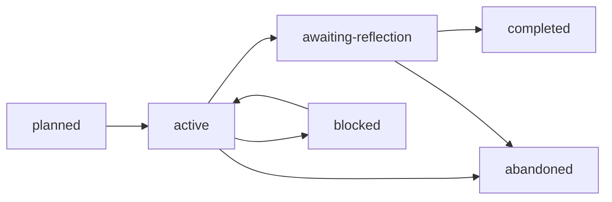

# Closeout Pending 专题生命周期改造方案

> 日期：2026-06-12
> 状态：已实施

> 验证：`cargo test -p daedalus-cli` 通过；`openai-codex-cli-deep-learning` 已迁移为 `awaiting-reflection` pending closeout。

## 背景

daedalus 当前把“还没完成 closeout reflection”的 topic 继续视为 active。这个模型过于僵硬：有些 topic 的主体学习、demo、业务迁移和测试已经完成，只剩下需要大块专注时间完成的主动回顾。此时如果仍然占用 active slot，会阻塞新的学习主题；如果直接标记 completed，又会绕过用户主动回顾和知识库归档门禁。

核心矛盾：

```text
保持专注不等于禁止开启新主题。
未完成 closeout 也不等于仍在日常学习推进中。
```

## 核心决策

把“日常学习 WIP”和“回顾归档债务”拆开。

```text
active topic
  当前正在消耗日常认知资源推进的学习主题。

awaiting-reflection topic
  主体学习已经完成，等待用户在大块时间里完成 closeout reflection。

completed topic
  用户 closeout、Agent challenge、用户确认和 knowledge-base 归档都已完成。
```

## 生命周期

新增 topic lifecycle：

```text
awaiting-reflection
```

推荐流转：



语义：

- `active`：还在读、跑、写 demo、做迁移、验证。
- `awaiting-reflection`：主体学习完成，不能再当作日常 active 推进，但 closeout 还没做完。
- `completed`：完成用户主动回顾、AI challenge、用户确认和知识库归档。
- `blocked`：学习推进被外部条件阻塞，不是“等周末回顾”。

## WIP 规则

新的约束：

- 最多一个 `active topic`。
- 最多一个 `awaiting-reflection topic`。
- `awaiting-reflection` 不阻塞开启新的 `active topic`。
- 如果已有一个 `awaiting-reflection topic`，新的 topic 不能再进入 `awaiting-reflection`，必须先处理旧 closeout。
- 当存在 `awaiting-reflection topic` 时，TUI、resume 和 post-commit orientation 都要提醒它，但不能把它当作当前学习主线。

这条规则保留 daedalus 的专注性，同时承认真实学习节奏：closeout 需要周末或连续时间，不应该挤占每天 1-2 小时的推进窗口。

## Workspace 指针

扩展 `workspaces/.daedalus/current.toml`：

```toml
schema_version = 1
current_project = "projects/<active-project>"
current_topic = "projects/<active-project>/topics/<active-topic>"
pending_closeout_project = "projects/<old-project>"
pending_closeout_topic = "projects/<old-project>/topics/<old-topic>"
```

新增人类入口：

```text
workspaces/closeout-topic -> projects/<old-project>/topics/<old-topic>
```

规则：

- `current.toml` 保存完整机器状态，包括 current project 和 pending closeout project。
- `current-project` / `current-topic` 只表示 active learning 入口；没有 active topic 时不展示。
- `current-topic` 表示今天要推进的 active 学习主题。
- `closeout-topic` 表示已经欠下的主动回顾；不再额外投影 `closeout-project`。
- Agent 恢复上下文时先读 `current-topic`，再提示 `closeout-topic`。
- 周末或用户明确说“做 closeout / 回顾 / 归档”时，优先进入 `closeout-topic`。

## CLI 行为

新增或调整命令：

```text
daedalus topic await-reflection <topic-slug> --reason <reason>
daedalus topic activate <topic-slug>
daedalus topic complete <topic-slug> --reason <reason>
```

行为：

- `topic await-reflection`：
  - 要求 01-09 阶段已完成，或用户显式给出等价证据。
  - 将 topic lifecycle 设为 `awaiting-reflection`。
  - 清空 project 的 `active_topic`。
  - 同步 `pending_closeout_topic` 和 `closeout-topic` symlink。
  - 如果 project 没有 active topic，则 project 可进入 `idle`，但不能丢失 pending closeout 指针。

- `topic activate`：
  - 允许在存在一个 `awaiting-reflection` topic 时开启新的 active topic。
  - 如果已有 active topic，仍然拒绝。
  - 如果已有 pending closeout，输出提醒，但不阻塞。

- `topic complete`：
  - 必须要求 `reflection/closeout.md` 存在并经过用户确认。
  - 必须确认 knowledge-base 归档已完成或明确不适用。
  - 完成后清空 `pending_closeout_topic` 和 `closeout-topic` symlink。

## Prompt 与 Agent 规则

更新根入口、repo-learning skill、resume、checkpoint lifecycle：

- 恢复时区分：
  - 当前学习主线：`current-topic`
  - 周末回顾债务：`closeout-topic`
- 不要把 `awaiting-reflection` 说成“还在学习中”。
- 不要把 `awaiting-reflection` 说成“已完成”。
- 当用户要开启新 topic 时，如果只存在 closeout pending，不要阻止；只提醒回顾债务。
- 当用户到了约定回顾时间，优先引导完成 closeout。

推荐恢复输出增加一行：

```text
Pending closeout: <topic>，建议在周末或连续时间完成 reflection。
```

## TUI 行为

学习驾驶舱需要显示两个焦点：

```text
Current Focus
  当前 active topic 和下一步学习动作。

Closeout Debt
  awaiting-reflection topic、约定回顾时间、closeout 入口。
```

如果没有 closeout debt，不显示空面板。

## 模板变化

更新 topic state 注释：

```text
topics.lifecycle 只能是：
planned、active、blocked、awaiting-reflection、completed、abandoned、skipped
```

更新 closeout template：

- 说明 `awaiting-reflection` 是正常状态，不是拖延失败。
- 提醒用户最好在周末或大块时间完成。
- 强调写完后 daedalus 会 review、challenge、补外部参照和整理链接。

## 当前 Codex Topic 迁移

当前 `tools-permissions` 应迁移为：

```text
lifecycle = "awaiting-reflection"
```

并设置：

```text
workspaces/closeout-topic -> projects/openai-codex-cli-deep-learning/topics/tools-permissions
```

它不再占用 daily active learning slot，但仍然不能 completed。等用户写完 `reflection/closeout.md` 并完成归档后，再进入 completed。

## 验收

- 有一个 `awaiting-reflection` topic 时，可以启动一个新的 active topic。
- 同时存在两个 active topic 会被拒绝。
- 同时存在两个 awaiting-reflection topic 会被拒绝。
- `daedalus validate` 能发现：
  - `pending_closeout_topic` 指向不存在路径。
  - closeout symlink 与 `current.toml` 不一致。
  - completed topic 缺少 `reflection/closeout.md` 或知识归档证据。
- TUI 能同时展示当前 active topic 和 closeout debt。
- `resume` 能正确回答：当前学习主线是什么，欠下的 closeout 是什么。

## 风险

- 状态变多后，Agent 可能再次混淆 active 和 awaiting-reflection；所以根入口和 resume prompt 必须把两者说清楚。
- 用户可能持续开启新 topic，导致 closeout debt 被长期忽略；所以最多只允许一个 pending closeout。
- `awaiting-reflection` 不能成为“逃避完成”的垃圾桶；进入该状态必须要求主体学习产物已经完成。

## 实施顺序

1. 扩展 `TopicLifecycle` 和 state/render/validate。
2. 扩展 `current.toml` 与 `closeout-topic` symlink。
3. 新增 `topic await-reflection` 命令。
4. 调整 `topic activate` 和 `topic complete` 规则。
5. 更新 root instructions、repo-learning skill、resume、checkpoint lifecycle。
6. 更新 TUI overview。
7. 迁移当前 Codex `tools-permissions` topic。
8. 补测试并运行 `cargo test -p daedalus-cli`。
