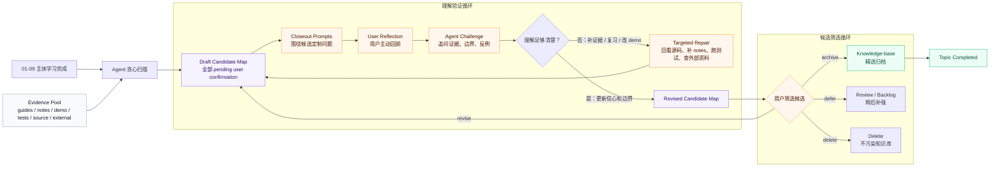

# Archivist 先挖掘后回顾改造方案

> 日期：2026-06-13
> 状态：计划中

## 背景

当前 `10-archivist` 的流程容易把 closeout 和 knowledge extraction 混在一起：

```text
用户写 closeout
-> Agent challenge
-> Agent 再从 closeout 里挖 knowledge candidate
-> 用户确认
-> 归档
```

这个顺序有两个问题：

- closeout 容易变成“盲写回顾”：用户只复习主线，漏掉学习过程中暴露的通用能力和基础薄弱点。
- Agent 容易挖得太浅：只看 closeout，而不是系统扫描 guides、notes、demo、测试、源码和外部补充资料。

但 closeout 也不能无限扩散。完整 topic 已经经历 01-09 阶段，如果 closeout 再把所有旁路知识都讲透，学习战线会被拉得过长，反馈节奏会变差。

因此需要把 `10-archivist` 拆成两种动作：

```text
knowledge draft mining: 贪心扫描，尽可能发现可迁移能力。
closeout reflection: 聚焦核心，由用户主动回顾、判断、确认理解。
```

## 核心原则

### 1. 先挖掘，再回顾

完成 01-09 后，Agent 不应立刻要求用户写 closeout。

它应该先扫描：

- 学习目标和 outcome map。
- `guides/`：Agent 引导过的阅读路径、实现切片、第一性原理解释。
- `notes/`：用户回答、纠正、争论、失败、设计决策。
- `demo/`：用户实际实现、简化、放弃或验证的机制。
- 测试和运行证据。
- 业务迁移材料。
- 用户要求补充的外部资料、底层原理和最佳实践。

然后生成一份 draft knowledge candidate map。

### 2. draft 不是知识库正文

draft candidate map 只是回顾地图，不是最终知识结论。

它可以由 Agent 贪心生成，因为它的职责是提醒用户：

- 这次 topic 里可能长出了哪些能力。
- 哪些点是核心主线。
- 哪些点是旁路技能。
- 哪些点暴露了基础薄弱。
- 哪些点需要用户确认、删掉或降级。

它不能直接进入 `knowledge-base/`。

### 3. closeout 聚焦核心，但要点名重要旁路

closeout 不追求穷尽所有知识点，但至少要覆盖：

- 从最初学习目标中学到了什么。
- demo 实现中做了哪些关键决策、trade-off 和简化。
- demo 的核心架构图是什么。
- 哪些结论有证据支撑。
- 哪些设计只是学习时忠实模仿，不能直接迁移。
- 学习和实现过程中暴露了哪些基础薄弱点。

基础薄弱点不需要在 closeout 中展开成教程，但必须被点名。

### 4. knowledge extraction 贪心，knowledge-base 归档克制

knowledge extraction 要贪心：

- 尽可能挖掘核心机制、旁路技能、底层原理、工程模式、失败修正、外部对比。
- 尽可能关联已有知识：新增、补充、修正、对比。
- 如果没有合适旧条目，明确写“暂无可关联条目”，不要强行关联。

knowledge-base 归档要克制：

- 用户最终筛选。
- 宁缺毋滥。
- 只保留高价值、可复习、可迁移、经过用户确认的条目。
- 被删掉的候选可以进入 backlog、复习计划或保持在 draft，不污染知识库。

## 新流程：循环而非线性

这不是一条单向流水线。真正有价值的是两个循环：

- `理解验证循环`：draft candidate map 驱动 closeout，closeout 和 challenge 反过来修正 candidate map；如果发现理解缺口，就回到 guides/notes/demo/source/external evidence 补证据。
- `候选筛选循环`：candidate 不会自动进入 knowledge-base；用户可以归档、延后、删除或要求重写，只有精选条目才进入知识库。



## 新状态

`10-archivist` 内部仍然可以采用 gate，但这些 gate 只是外层推进坐标，不代表内部没有循环。

```text
KnowledgeDraftReady
-> CloseoutPromptReady
-> ReflectionReviewLoop
-> CandidateMapRevised
-> UserSelectionConfirmed
-> KnowledgeArchived
-> TopicCompleted
```

`ReflectionReviewLoop` 可以重复多次：如果 challenge 发现理解缺口，就回到证据池补证据、补 notes、补测试或补外部资料，再修订 candidate map。

这些 gate 应同时体现在 prompt 协议、文件产物、CLI 校验和 TUI 展示中。prompt 负责引导，artifact 负责恢复现场，CLI 负责结构约束和一致性检查，TUI 负责让学习者看见当前循环位置。

## 新产物

建议新增：

```text
guides/10-archivist/01-knowledge-candidate-map.md
guides/10-archivist/02-closeout-prompts.md
```

其中 `01-knowledge-candidate-map.md` 是 Agent 生成的 draft，包含：

- `topic-core`：主题核心知识。
- `satellite-skill`：旁路但可迁移技能。
- `weak-foundation`：基础薄弱点。
- `engineering-pattern`：工程实现模式。
- `external-comparison`：外部资料和最佳实践对比。
- `learning-method`：可提升到 daedalus 全局的学习方法。

每个候选至少包含：

```text
title:
type:
why:
source:
status: 新增 / 补充已有 / 修正已有 / 对比已有 / 暂无可关联
confidence: 已吸收验证 / 需要用户确认 / 仅外部参照
scope: topic core / satellite skill / cross-topic method
suggested action: archive / defer / review / delete
```

`02-closeout-prompts.md` 基于 candidate map 生成，用来引导用户写 closeout。

它不应是通用问卷，而应贴合当前 topic，例如：

- 这个 topic 的主线问题是什么？
- demo 中最关键的三个设计选择是什么？
- 哪些候选知识你已经真正掌握？
- 哪些候选知识只是听过、做过一次，但还不稳？
- 哪些薄弱点在未来 topic 中应该重点复习？

## 对现有规则的改造点

### `closeout-flow.md`

把 `KnowledgeGate` 前移：

```text
ChallengeResolved 后才第一次挖 knowledge
```

改为：

```text
主体学习完成后先生成 draft candidate map
再用 candidate map 驱动 closeout
```

### `archive-knowledge.md`

明确三层区别：

```text
candidate map: Agent 贪心挖掘，全部 draft。
closeout: 用户主动回顾，验证理解。
knowledge-base: 用户确认后的精选归档。
```

### `human-owned-notes.md`

补充：

- Agent 可以生成 draft candidate map。
- Agent 不可以把 draft 当成用户理解。
- 用户 closeout 要围绕 draft 做确认、否定、补充和筛选。

### `reflection/closeout.md` 模板

增加一句：

```text
进入 closeout 前，daedalus 应先给你一份 draft knowledge candidate map。
你不需要照单全收；你要用 closeout 判断哪些真的成为了你的理解，哪些只是路过。
```

## 高频薄弱点机制

如果某个基础薄弱点在多个 topic 中反复出现，例如：

- Tokio / async runtime。
- sandbox / OS isolation。
- 网络协议。
- 数据库事务。
- 编译原理。
- Rust 生命周期和并发。

Agent 应标记为高频薄弱点，并建议：

- 进入 review plan。
- 进入 backlog。
- 补充已有 knowledge-base 条目。
- 启动独立 learning topic。

这能让 daedalus 不只是记录“学过什么”，还知道“用户反复卡在哪里”。

## 当前 Codex Topic 的迁移方式

`tools-permissions` 已经写完 closeout，所以不要求用户重写。

本次按新流程补做：

```text
1. 扫描 closeout / guides / notes / demo / tests / external references。
2. 生成 draft candidate map。
3. 用已经完成的 closeout 和对话 challenge 修订 candidate map。
4. 输出最终候选清单。
5. 用户筛选。
6. 只归档用户确认的高价值条目。
```

## 验收标准

- Agent 不再只从 closeout 提 1-3 个候选。
- 进入 closeout 前，能先生成 draft candidate map。
- closeout prompts 能引用 draft candidate map，而不是通用问卷。
- candidate map 能覆盖 topic core、satellite skill、weak foundation、engineering pattern、external comparison。
- 用户可以删除、延后或确认候选。
- knowledge-base 只写用户确认后的精选条目。
- 如果同一薄弱点重复出现，Agent 会标记为高频薄弱点。

## 风险

- draft 太大，反而增加用户压力。
  - 解决：candidate map 分层展示，先给总览，再展开细节。
- Agent 把 draft 写成结论。
  - 解决：所有 draft 文件必须显式标记 `draft / pending user confirmation`。
- knowledge-base 变胖。
  - 解决：最终归档前必须有用户筛选，默认宁缺毋滥。
- closeout 被 candidate map 带偏。
  - 解决：closeout prompts 仍围绕学习目标、demo 决策、trade-off、架构图和薄弱点，不让旁路盖过主线。

## 实施顺序

1. 更新 common prompts：`closeout-flow.md`、`archive-knowledge.md`、`human-owned-notes.md`。
2. 更新 `10-archivist.md`，把 10 阶段拆成 draft mining、closeout prompt、challenge、selection、archive。
3. 更新 `reflection/closeout.md` 模板。
4. 更新 topic 模板，初始化 `guides/10-archivist/` 的 candidate map 和 closeout prompt 入口。
5. 更新 CLI validate，检查 10 阶段的 draft candidate map、closeout reflection、selection 和 knowledge archival 证据。
6. 更新 TUI，让学习者能看到 `10-archivist` 当前循环位置、draft map、closeout prompts、selection 状态和下一步动作。
7. 为当前 Codex topic 生成 draft candidate map，并按新流程完成筛选和归档。
