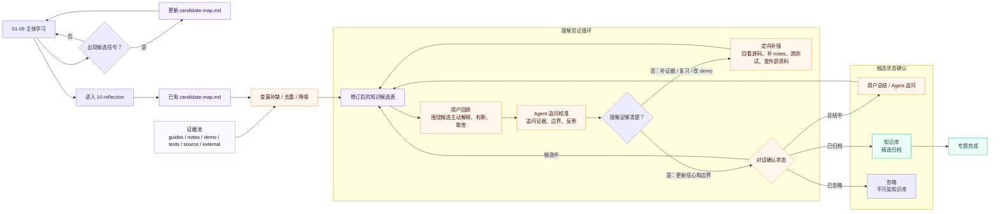

# Candidate Map 滚动积累与 Reflection 收口方案

> 日期：2026-06-13
> 状态：已实施

## 背景

当前 `10-reflection` 的流程容易把 回顾 和 知识挖掘 都推迟到最后：

```text
用户写 回顾
-> Agent 追问校准
-> Agent 再从 回顾 里挖 知识候选
-> 用户确认
-> 归档
```

这个顺序有两个问题：

- 回顾 容易变成“盲写回顾”：用户只复习主线，漏掉学习过程中暴露的底层原理和可迁移能力。
- Agent 容易挖得太浅：只看 回顾，而不是系统扫描 guides、notes、demo、测试、源码和外部补充资料。

但如果 `candidate-map` 只在 10 阶段才生成，它本身也会变成事后回忆。学习中真正暴露出来的 Rust stream、`async move`、Tokio spawn、sandbox、TUI event loop 等能力缺口，很容易因为聊天上下文压缩或阶段切换而被漏掉。

因此需要把 `candidate-map` 变成贯穿 01-09 的滚动产物：

```text
01-09：持续记录候选，捕捉可迁移能力和底层原理缺口。
10-reflection：基于已有候选表查漏补缺、去重、降噪、确认状态。
```

## 核心原则

### 1. 滚动积累，而不是最后回忆

Agent 不应等到 10 阶段才开始挖知识候选。

在 01-09 中，只要出现以下信号，就要检查是否更新 `reflection/candidate-map.md`：

- 用户反复追问某个底层原理。
- demo 实现暴露新的能力缺口。
- 用户修正错误理解或做出关键设计取舍。
- 源码阅读、测试或运行验证出可迁移的不变量、状态机或工程模式。
- 用户明确说某个点后面需要沉淀。

### 2. draft 不是知识库正文

知识候选表 只是回顾地图，不是最终知识结论。

它可以由 Agent 滚动维护，因为它的职责是提醒用户：

- 这次 专题 里可能长出了哪些能力。
- 哪些点是核心主线。
- 哪些点属于底层原理，值得后续复习或归档。
- 哪些点需要用户确认、删掉或降级。

它不能直接进入 `knowledge-base/`。

### 3. 回顾 聚焦核心，但要点名底层原理缺口

回顾 不追求穷尽所有知识点，但至少要覆盖：

- 从最初学习目标中学到了什么。
- demo 实现中做了哪些关键决策、trade-off 和简化。
- demo 的核心架构图是什么。
- 哪些结论有证据支撑。
- 哪些设计只是学习时忠实模仿，不能直接迁移。
- 学习和实现过程中暴露了哪些底层原理缺口。

底层原理缺口不需要在 回顾 中展开成教程，但必须被点名。

### 4. 知识挖掘 贪心，知识库 归档克制

知识挖掘 要贪心：

- 尽可能挖掘主题核心、底层原理、工程模式、失败修正和外部参照。
- 尽可能关联已有知识：新增、补充、修正、对比。
- 如果没有合适旧条目，明确写“暂无可关联条目”，不要强行关联。

知识库 归档要克制：

- 用户最终筛选。
- 宁缺毋滥。
- 只保留高价值、可复习、可迁移、经过用户确认的条目。
- 被删掉的候选可以进入 backlog、复习计划或保持在 draft，不污染知识库。

## 新流程：滚动候选 + 收口循环

这不是一条单向流水线。真正有价值的是两个循环：

- `滚动积累循环`：01-09 每个 micro-checkpoint 都有机会更新 `candidate-map.md`，避免候选只靠最后回忆。
- `理解验证循环`：10-reflection 用候选表驱动回顾，回顾和追问校准反过来修正候选表；如果发现理解缺口，就回到 guides/notes/demo/source/external evidence 补证据。
- `候选状态确认`：候选不会自动进入知识库；状态只使用 `候选中`、`总结中`、`已归档`、`已忽略`，只有精选条目才进入知识库。



## 10 阶段状态

`10-reflection` 内部仍然可以采用 gate，但这些 gate 只是外层推进坐标，不代表内部没有循环。

```text
CandidateMapReady
-> CandidateMapReviewed
-> CloseoutPromptReady
-> ReflectionReviewLoop
-> CandidateMapRevised
-> UserSelectionConfirmed
-> KnowledgeArchived
-> TopicCompleted
```

`candidate-map.md` 在 01-09 已经持续存在。`CandidateMapReviewed` 表示 10 阶段已经基于它查漏补缺、去重和降噪。`ReflectionReviewLoop` 可以重复多次：如果追问校准发现理解缺口，就回到证据池补证据、补 notes、补测试或补外部资料，再修订候选表。

这些 gate 应同时体现在 prompt 协议、文件产物、CLI 校验和 TUI 展示中。prompt 负责引导，artifact 负责恢复现场，CLI 负责结构约束和一致性检查，TUI 负责让学习者看见当前循环位置。

## 新产物

`reflection/` 只保留两个核心产物：

```text
candidate-map.md
closeout.md
```

其中 `candidate-map.md` 是 Agent 在整个学习过程中滚动维护的简洁候选表：先按类别起标题，再在每类下面列候选表格。

```markdown
| 候选 | 为什么值得看 | 证据 | 状态 |
| --- | --- | --- | --- |
```

不要再拆 `02-closeout-prompts.md`、`03-selection.md`、`04-archive-evidence.md`。候选状态由对话确认后更新；用户主动回顾继续写在 `closeout.md`。

候选状态只能使用：

- `候选中`：进入候选表，但还没有开始认真总结。
- `总结中`：正在被用户解释、复盘、接受 challenge。
- `已归档`：已进入 knowledge-base。
- `已忽略`：确认不值得归档，保留为历史判断。

## 对现有规则的改造点

### `closeout-flow.md`

把 `KnowledgeGate` 前移：

```text
ChallengeResolved 后才第一次挖知识
```

改为：

```text
主体学习过程中持续维护 candidate-map.md
10-reflection 基于已有候选表查漏补缺、去重、降噪
再用候选表驱动 回顾
```

### `archive-knowledge.md`

明确三层区别：

```text
知识候选表：Agent 滚动维护，全部是草稿。
回顾：用户主动回顾，验证理解。
知识库：用户确认后的精选归档。
```

### `human-owned-notes.md`

补充：

- Agent 可以滚动维护 知识候选表。
- Agent 不可以把 draft 当成用户理解。
- 用户 回顾 要围绕 draft 做确认、否定、补充和筛选。

### `reflection/closeout.md` 模板

增加一句：

```text
daedalus 会在整个学习过程中滚动维护 candidate-map.md。
你不需要照单全收；你要用回顾判断哪些真的成为了你的理解，哪些只是路过。
```

## 高频薄弱点机制

如果某个底层原理缺口在多个 专题 中反复出现，例如：

- Tokio / async runtime。
- sandbox / OS isolation。
- 网络协议。
- 数据库事务。
- 编译原理。
- Rust 生命周期和并发。

Agent 应标记为高频薄弱点，并建议：

- 进入 review plan。
- 进入 backlog。
- 补充已有知识库条目。
- 启动独立学习专题。

这能让 daedalus 不只是记录“学过什么”，还知道“用户反复卡在哪里”。

## 当前 Codex Topic 的迁移方式

`tools-permissions` 已经写完 回顾，所以不要求用户重写。

本次按新流程补齐：

```text
1. 扫描回顾 / guides / notes / demo / tests / external references。
2. 补齐当前缺失的 candidate-map.md 候选。
3. 用已经完成的 回顾 和对话 追问校准 修订 candidate-map.md。
4. 输出最终候选清单。
5. 用户在对话中确认候选状态。
6. 只归档用户确认的高价值条目。
```

## 验收标准

- Agent 不再只从 回顾 提 1-3 个候选。
- 01-09 过程中能滚动维护 candidate-map.md。
- 知识候选表能覆盖主题核心、底层原理和工程模式，分类之间尽量不重合。
- 用户可以把候选推进为 `候选中`、`总结中`、`已归档` 或 `已忽略`。
- 知识库 只写用户确认后的精选条目。
- 如果同一薄弱点重复出现，Agent 会标记为高频薄弱点。

## 风险

- draft 太大，反而增加用户压力。
  - 解决：知识候选表只保留分类标题和表格，不再展开多层字段。
- Agent 把 draft 写成结论。
  - 解决：所有 draft 文件必须显式标记 `draft / 待用户确认`。
- 知识库 变胖。
  - 解决：最终归档前必须由用户对话确认，默认宁缺毋滥。
- 回顾被知识候选表带偏。
  - 解决：closeout 仍围绕学习目标、demo 决策、trade-off、架构图和薄弱点，不让旁路盖过主线。

## 实施顺序

1. 更新 common prompts：`回顾-flow.md`、`归档-knowledge.md`、`human-owned-notes.md`。
2. 更新 `10-reflection.md`，让 10 阶段围绕候选表、closeout、追问校准和知识归档推进。
3. 更新 `reflection/回顾.md` 模板。
4. 更新专题模板，初始化 `reflection/` 的知识候选表和 closeout 入口。
5. 更新 CLI validate，只检查 10 阶段必需的知识候选表和 closeout。
6. 更新 TUI，让学习者能看到 `10-reflection` 当前候选表和下一步动作。
7. 为当前 Codex 专题生成知识候选表，并按新流程完成筛选和归档。
