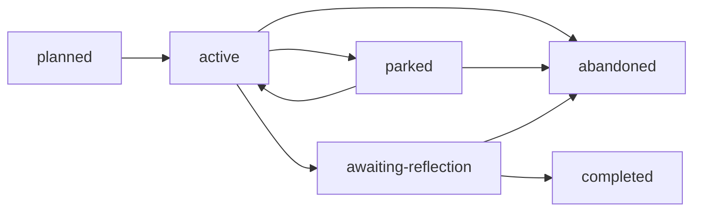

# 中途搁置专题生命周期方案

> 日期：2026-09-19
> 状态：已实施

## 背景

daedalus 已经把“日常推进”和“closeout 债务”拆开：`awaiting-reflection` 不占 active 槽，所以主体学完、只欠周末回顾时可以开下一题。

但真实节奏里还有第三种注意力状态：专题还在学，只是需要先放下，去开另一题。现在没有这条路径。

现存半成品不能当正式能力：

- `daedalus topic activate` 会把旧题在 project 登记里标成 `blocked`，却常常不改旧 topic 自己的 `state.toml`。
- Agent 合同和 gatekeeper 仍按 WIP = 1 拒绝换题。
- `blocked` 的语义是外部卡住，不是用户主动搁置。
- discovery `parked` / backlog `deferred` 只服务还没开题的候选。

核心矛盾：

```text
保持专注不等于禁止中途换题。
中途换题也不等于放弃，更不等于学完只欠回顾。
```

## 核心决策

把日常 WIP、中途搁置、closeout 债务拆成三条状态线。

```text
active
  今天正在消耗注意力推进的专题。

parked
  学到一半，用户主动搁置；进度保留，稍后接回。

awaiting-reflection
  主体学习完成，等待大块时间做 closeout。
```

`blocked` 只表示外部条件卡住，不再被 `activate` 拿来“挤走”上一题。

## 生命周期

新增 topic lifecycle：

```text
parked
```

推荐流转：



语义：

- `active`：当前日常推进主线。
- `parked`：用户主动暂停，进度、notes、demo、guides 留在原路径，不进 `.archive/`。
- `awaiting-reflection`：主体学完，只欠 closeout。
- `blocked`：外部条件卡住；不再作为换题的隐式副作用。
- `abandoned`：明确放弃。

进入 `parked` 必须满足：

- 当前 topic 是 `active` 或历史遗留的 `blocked`。
- 必须写具体 `--reason`。
- 必须保留恢复光标：当前 stage、原 `next_action`、未完成物。
- 将仍为 `active` 的 stage 标成 `paused`。
- 同步更新 project `[[topics]]` 和 topic 自己的 `state.toml`。

接回必须走 `daedalus topic activate`：把 `parked` 设回 `active`，把 `paused` stage 恢复为 `active`，并从 workspace parked 列表移除。

## WIP 规则

工作区级约束，跨 project 生效：

- 最多 1 个 `active` topic。
- 最多 1 个 `awaiting-reflection` topic。
- `parked` 个数可配置，默认 1，合法范围 1 到 3。
- `parked` 不阻塞开启新的 `active`。
- 已达 parked 上限时，必须先接回、完成或放弃，才能再 park。
- 已有 `active` 时，`activate` 另一题必须先被拒绝；正确路径是 `park` / `await-reflection` / `abandon`，再 `activate`。

上限写在工作区机器真相里，不是写死在命令里：

```toml
# workspaces/.daedalus/current.toml
max_parked_topics = 1
parked_topics = []
```

缺省按 1 解释。`daedalus topic park-limit <n>` 修改上限；若当前已 parked 数量大于新上限，拒绝下调。

## Workspace 指针

扩展 `workspaces/.daedalus/current.toml`：

```toml
schema_version = 1
current_project = "projects/<active-project>"
current_topic = "projects/<active-project>/topics/<active-topic>"
pending_closeout_project = "projects/<old-project>"
pending_closeout_topic = "projects/<old-project>/topics/<old-topic>"
max_parked_topics = 1
parked_topics = [
  "projects/<parked-project>/topics/<parked-topic>",
]
```

人类行动入口：

```text
workspaces/current-topic   今天要推进的 active
workspaces/closeout-topic  最近一条 closeout 债务
workspaces/parked-topic    最近一条 parked 债务
```

规则：

- `parked_topics` 是全部搁置专题的机器列表，跨 project。
- `parked-topic` symlink 指向列表最后一项，也就是最近一次 park。
- 没有 parked 时不展示 `parked-topic`。
- 同步 `current.toml` 时必须保留 closeout 和 parked 字段，不能重写成只有 current/closeout。
- topic-board 增加 `Parked Topics` 段，和未来选题用的 `Parking Lot` 分开。

## CLI 行为

```text
daedalus topic park <topic-slug> --reason <reason>
daedalus topic park-limit <n>
daedalus topic activate <topic-slug>
```

- `topic park`：
  - 要求具体 reason。
  - 将 project 与 topic lifecycle 都设为 `parked`。
  - 暂停仍为 active 的 stage。
  - 若该题是 active，清空 `active_topic` 和 `current-topic`。
  - 把相对路径追加到 `parked_topics`，刷新 `parked-topic`。
  - 已达上限则拒绝。
- `topic park-limit`：
  - 只接受 1、2、3。
  - 写入 `max_parked_topics`。
  - 已 parked 数量大于新上限则拒绝。
- `topic activate`：
  - 工作区里已有另一个 active topic 时拒绝，不再偷偷标 `blocked`。
  - 允许在存在 parked / awaiting-reflection 时激活新题或接回旧题。
  - 接回 parked 时恢复 paused stage，并从 `parked_topics` 移除。
- `topic abandon` / `topic complete`：若该题在 parked 列表中，必须同时清掉指针。

## Prompt 与 Agent 规则

更新根入口、repo/course skill、gatekeeper、resume、CLI contract：

- 用户要中途开下一题时，引导 `park` 再 `activate`，不要只输出 `defer`。
- 不要把 `parked` 说成失败、放弃或已完成。
- resume 要同时看见：当前主线、parked 债务、closeout 债务。
- 日常推进仍只跟 `current-topic`。

## TUI

驾驶舱增加 Parked Debt，和 Closeout Debt 分开。没有 parked 时不显示空面板。

## 校验

`daedalus validate` 必须能发现：

- project `[[topics]]` 与 topic `state.toml` 的 lifecycle 不一致。
- 工作区 parked 集合与 `current.toml` 的 `parked_topics` 不一致。
- parked 数量超过 `max_parked_topics`。
- `max_parked_topics` 不在 1 到 3。
- 存在 `parked-topic` symlink 但列表为空，或 symlink 不指向最近一项。
- 已有 active 时 `activate` 另一题被拒绝；测试覆盖这条，而不是旧的自动 `blocked`。

## 验收

- 学到一半可以 `park`，释放 `current-topic`，再 `activate` 新题。
- project 与 topic 两份 lifecycle 同时变成 `parked` / `active`。
- 默认只能搁置 1 题；`park-limit 3` 后最多搁置 3 题。
- `park-limit 4` 或 `0` 被拒绝。
- 已有 2 个 parked 时把上限改回 1 被拒绝。
- `activate` 不再把旧题标成 `blocked`。
- resume / TUI / topic-board 能看见 parked，但不把它当成今天的主线。
- 现有 `lora-feedback-loop` 不自动迁移；只有用户明确 park 才搁置。

## 风险

- 状态变多后，Agent 可能把 parked、blocked、awaiting-reflection 混为一谈；合同和 resume 必须写清。
- 可配置上限如果没有硬顶，会变成无限搁置；因此上限只能是 1 到 3。
- 旧的 `activate` 自动 `blocked` 测试和文档必须一起改掉，否则半残切换会回流。
