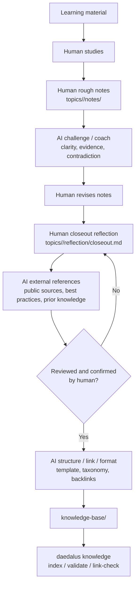

# Knowledge Base

这里保存经过用户主动回顾、AI challenge 和结构化校准后的可复用知识。workspace 是学习现场，knowledge-base 是能力系统。

## 归档流程

`knowledge-base/` 不是 Agent 从 notes 自动提取出来的总结。进入这里之前，用户必须先在 topic 的 `reflection/closeout.md` 中完成主动回顾；Agent 的职责是提问、challenge、搜索外部资料、补链接、检查一致性，并在用户确认后做结构化归档。

这个流程的核心边界：

- 用户负责 meaning：主动回顾、总结判断、表达理解。
- Agent 负责 structure：提问、挑战、外部参照、结构化、链接和校验。
- `notes/` 是过程证据，不是知识库来源的充分条件。
- `reflection/closeout.md` 是 topic 级闭环产物，是进入知识库前的必要条件。
- `knowledge-base/` 只保存 reviewed human retrospective understanding。

目录含义：

- `concepts/`：原子概念。
- `skills/`：能力条目。
- `patterns/`：可迁移模式。
- `problems/`：问题入口。
- `cases/`：案例证据。
- `source-maps/`：来源映射。
- `trees/`：技能树和学习路径。
- `drills/`：复习、迁移和批判练习。
- `index/`：人可读导航页。
- `site/`：可选前端投影。

归档时先选择主落点：

- 概念和底层原理进入 `concepts/`。
- 能被练习和验收的能力进入 `skills/`。
- 可迁移的架构、流程、状态机和取舍进入 `patterns/`。
- 能统领一组知识的现实难题进入 `problems/`。
- 一次学习、demo 或业务迁移的完整上下文进入 `cases/`。
- 从书、论文、repo、课程到知识条目的映射进入 `source-maps/`。
- 能力依赖、学习路径和薄弱点地图进入 `trees/`。
- 复习、迁移和批判问题进入 `drills/`。

同一个候选可以链接到多个目录，但必须有一个主落点。knowledge-base 要形成体系，而不是把候选表逐条搬进来。

机器索引见 `index.toml`，由 `daedalus knowledge index` 重建。
