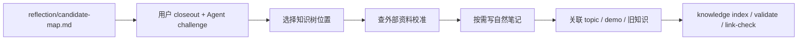

# Knowledge Base

这里保存经过用户主动回顾、AI challenge、外部资料校准和结构化整理后的可复用知识。

`knowledge-base/` 不是资料摘要库，也不是 Agent 从 notes 自动提取出来的结论。它保存的是 reviewed human understanding：用户已经在 topic closeout 中主动表达过，Agent 再帮助补资料、校准边界、组织链接。

## 核心原则

```text
用户负责生成理解
Agent 负责挑战、校准、链接和组织
知识库负责长期复习与迁移
```

知识库不使用固定模板，也不使用固定类型桶。每篇笔记按内容需要自然组织，但必须能回答：

- 它解决什么现实问题。
- 第一性原理是什么。
- 底层原理是什么。
- 现实约束和 trade-off 是什么。
- 它和学习过的项目、topic、demo 或源码有什么关系。
- 它参考了哪些外部资料。
- 未来如何复习、迁移或继续追问。

## 当前知识树

- [`ai-agents/`](ai-agents/)：Agent 工具体系、权限安全、ReAct runtime、上下文和可观察性。
- [`computer-systems/`](computer-systems/)：操作系统、网络、数据库、编译器等底层机制。
- [`rust/`](rust/)：Rust 异步、进程、CLI/TUI、类型系统和工程实践。

目录不是永久设计。新增学习内容时，可以新建、移动、合并或重命名目录，让知识树跟着真实理解一起演化。

## 归档流程



机器索引见 [`index.toml`](index.toml)，人可读入口见 [`index.md`](index.md)。
