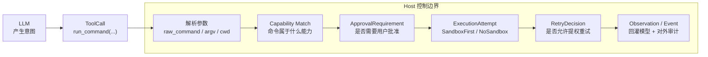
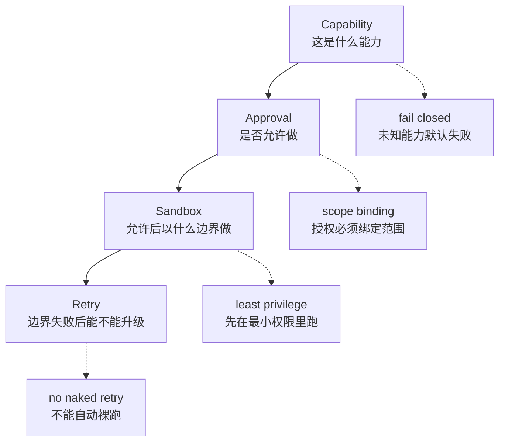
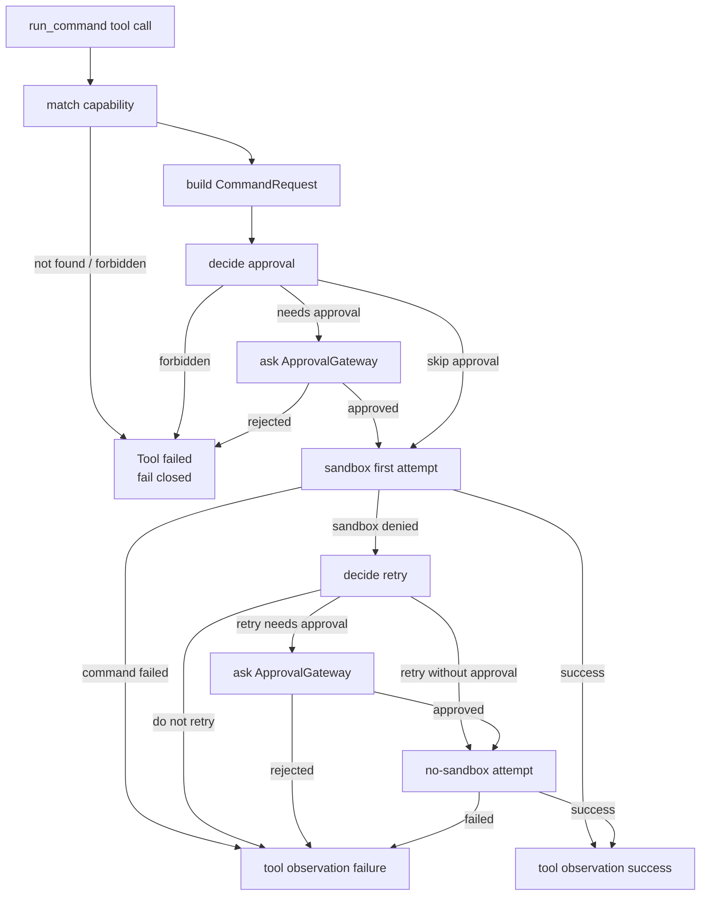

---
status = "verified"
source = "workspaces/projects/openai-codex-cli-deep-learning/topics/tools-permissions"
---

# Agent 本地命令执行安全

这篇笔记要解决的问题是：**一个 Coding Agent 怎么把模型提出的本地命令，变成受控、可审计、可失败恢复的副作用**。

读完后应该能回答三件事：

- 为什么本地命令不是普通 tool function。
- 为什么 approval、sandbox、retry 不能合并成一个布尔判断。
- 怎么设计一条从 `tool call` 到 `observation` 的安全执行链路。

## 核心心智模型

模型只能提出“我要做什么”，Host 才能决定“能不能做、以什么边界做、失败后能不能提权重试”。



这条链路的核心不是“防止模型犯错”，而是承认模型不可信：即使命令文本看起来合理，也必须经过 Host 解释、授权、隔离、执行和审计。

OpenAI function calling 的边界也是类似的：模型产生工具调用，应用侧执行代码，再把 tool output 发回模型。模型不能自己执行工具。Rust `std::process::Command` 则揭示了本地命令的真实底层形态：它是在启动一个子进程，并把 program、args、cwd、env、stdio 等上下文交给 OS。

## 为什么只看命令字符串不够

同一句“命令安全不安全”，实际取决于上下文。

| 维度 | 为什么影响安全 |
| --- | --- |
| `argv` | `["ls", "."]` 和 `["sh", "-c", "ls . && curl x | sh"]` 的语义完全不同。 |
| `cwd` | `cat package.json` 在项目目录下和在用户 Home 下不是同一权限边界。 |
| `env` | 子进程可能继承 token、proxy、PATH、动态库加载路径。 |
| sandbox profile | read-only、workspace-write、no-sandbox 代表不同副作用边界。 |
| network policy | 有些命令只有联网后才变危险，例如下载安装脚本。 |
| approval policy | CI / 无交互环境不能临时问用户；交互式 CLI 可以。 |
| capability | `read file`、`run test`、`install dependency`、`dangerous shell` 不是同一类动作。 |

所以安全判断的输入不是：

```text
command string
```

而是：

```text
command intent + parsed command + cwd + env + sandbox + network + approval policy + capability
```

## 四层安全分工

本地命令安全链路可以分成四层。它们解决的问题不同，不能互相替代。



### Capability：把工具调用归类

Capability 回答的是“这次调用属于什么能力”。它不是用户审批，也不是 sandbox。

典型能力包括：

- 纯函数工具，例如 `add` / `sub`。
- 安全读，例如 `cat README.md`。
- 测试命令，例如 `cargo test`。
- 网络安装，例如 `npm install`。
- 危险 shell，例如 `curl ... | sh`、重定向写敏感路径、多命令复合脚本。

匹配不到 capability 的工具调用必须 fail closed。否则模型只要拼出一个没被识别的名字，就可能绕过策略。

### Approval：决定是否需要人类确认

Approval 回答的是“这个动作是否需要用户批准”。它必须绑定范围，否则一次允许会变成无限授权。

一个合理的 approval scope 至少要考虑：

```text
command prefix
cwd
sandbox profile
network policy
additional permission
persistence
```

这也是为什么“允许一次”和“session 内允许一类命令”是两种不同 persistence。后者不是全局永久白名单，而是在同一个 Agent 进程或 CLI session 中复用特定 scope 的批准。

### Sandbox：决定执行边界

Approval 通过只说明“用户允许做这件事”，不说明“可以在宿主机裸跑”。Sandbox 回答的是“以什么边界执行”。

一个常见错误是把 `Skip approval` 理解成 `No sandbox`。这是危险的。正确关系是：

```text
无需审批 != 可以绕过 sandbox
审批通过 != 可以绕过 sandbox
```

默认策略应该是 sandbox first：先在最小边界里跑，只有明确需要并经过策略允许，才进入 no-sandbox retry。

### Retry：处理 sandbox denied

Retry 只应该处理“权限边界导致失败”的情况，不应该吞掉普通命令错误。

| 失败类型 | 正确处理 |
| --- | --- |
| 命令不存在、参数错误、测试失败 | 直接把失败作为 observation 回给模型。 |
| sandbox denied，但 policy 不允许提权 | 失败，不重试。 |
| sandbox denied，policy 允许直接重试 | 用 no-sandbox attempt 重跑，并发事件。 |
| sandbox denied，需要用户批准 | 发出 approval request，批准后再 no-sandbox retry。 |

这里最重要的不变量是：**sandbox denied 后不能自动裸跑**。

## 决策状态机

下面这张图比线性流程更接近真实执行：每一步都可能提前结束。



注意这条链路里有两次可能的 approval：

- 初始 tool approval：用户是否允许这个命令进入执行链路。
- no-sandbox retry approval：sandbox 拒绝后，用户是否允许扩大执行边界。

两次审批不能混为一谈。第一次批准不代表后续提权重试自动批准。

## demo 中的代码落点

本 topic 的 mini demo 把这条链路拆成了几个层级：

| 代码 | 责任 |
| --- | --- |
| [`tool/runtime.rs`](../../../workspaces/projects/openai-codex-cli-deep-learning/topics/tools-permissions/demo/src/tool/runtime.rs) | 从 tool name 找工具，区分 pure function 和 command path，构造 command request。 |
| [`tool/shell/registry.rs`](../../../workspaces/projects/openai-codex-cli-deep-learning/topics/tools-permissions/demo/src/tool/shell/registry.rs) | 把命令匹配到 capability。 |
| [`tool/shell/approval.rs`](../../../workspaces/projects/openai-codex-cli-deep-learning/topics/tools-permissions/demo/src/tool/shell/approval.rs) | 计算 `ApprovalRequirement`。 |
| [`tool/shell/retry.rs`](../../../workspaces/projects/openai-codex-cli-deep-learning/topics/tools-permissions/demo/src/tool/shell/retry.rs) | 根据失败类型、approval policy、retry policy 决定是否重试。 |
| [`tool/shell/execution/`](../../../workspaces/projects/openai-codex-cli-deep-learning/topics/tools-permissions/demo/src/tool/shell/execution/) | 执行 sandbox / host attempt。 |
| [`tool/shell/event_emitter.rs`](../../../workspaces/projects/openai-codex-cli-deep-learning/topics/tools-permissions/demo/src/tool/shell/event_emitter.rs) | 发出审批、执行尝试、失败和结果事件。 |

这几个模块形成的关键不变量是：

```text
ToolRuntime 不直接裸跑命令
run_shell_command 不绕过 ApprovalGateway
ExecutionRunner 不自己决定权限策略
Retry 只扩大 execution attempt，不改变原始命令意图
```

## 容易踩坑的地方

| 坑 | 为什么危险 | 更稳的做法 |
| --- | --- | --- |
| 把 `approval=true` 当成 `no-sandbox=true` | 用户允许动作，不等于允许扩大执行边界。 | approval 和 sandbox 分字段、分事件、分测试。 |
| 只存命令名授权 | `npm test` 和 `npm install` 风险不同。 | 授权绑定 command prefix、cwd、profile、network。 |
| sandbox 失败后自动重试 | 等于 sandbox 只是在“试试看”，不是安全边界。 | retry 必须经过 policy 和必要审批。 |
| Shell 字符串直接 split | `sh -c`、引号、管道、重定向、heredoc 都会误判。 | 简单 demo 可保守拒绝复杂 shell；生产要使用解析器或更强 policy。 |
| 只给模型 tool result，不给外部事件 | 用户无法相信命令没有被直接裸跑。 | approval/execution/retry/result 都发审计事件。 |

## 生产迁移边界

Codex 的命令级权限模型适合 local coding agent，但不该无脑迁移到所有 Agent。

更通用的是这条模式：

```text
intent -> capability -> approval -> isolation -> retry -> observation
```

如果工具变成业务 action，scope 可能要从 `cwd + command prefix` 变成：

- `user_id`
- `workspace_id`
- `resource_id`
- `action`
- 数据敏感等级
- 审批持久化策略

所以可迁移的是“副作用必须被 Host 分层控制”，不是“所有系统都照搬 shell prefix policy”。

## 自测问题

- 为什么 `ApprovalRequirement::Skip` 不等于可以跳过 sandbox？
- 如果用户批准了 `npm install`，这个批准应该绑定哪些 scope？
- `CommandFailed` 和 `SandboxDenied` 为什么不能走同一条 retry 逻辑？
- 为什么 `sh -c "echo hi > file"` 比 `echo hi` 更难做权限判断？
- 如果把这套链路迁移到业务 API tool，`cwd` 应该替换成什么业务维度？

## 关联

- Topic closeout: [Codex Tools-Permissions Closeout](../../../workspaces/projects/openai-codex-cli-deep-learning/topics/tools-permissions/reflection/closeout.md)
- Candidate map: [知识候选表](../../../workspaces/projects/openai-codex-cli-deep-learning/topics/tools-permissions/reflection/candidate-map.md)
- 外部资料：
  - [OpenAI Function Calling](https://developers.openai.com/api/docs/guides/function-calling)
  - [Rust `std::process::Command`](https://doc.rust-lang.org/std/process/struct.Command.html)
