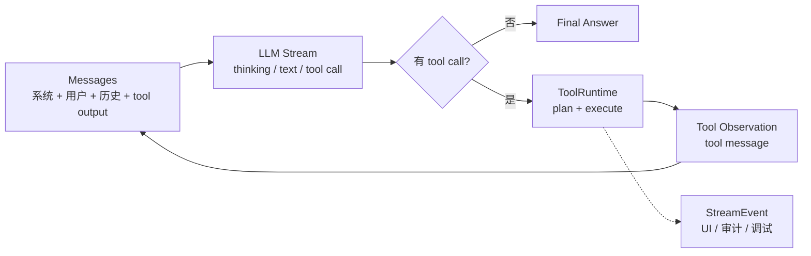
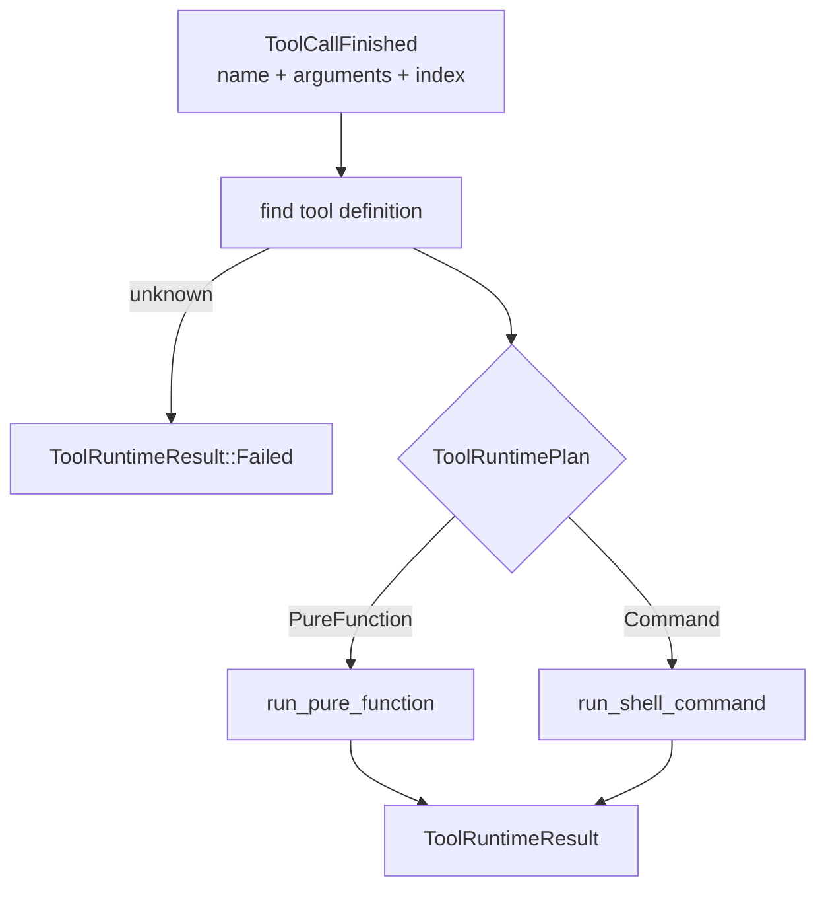
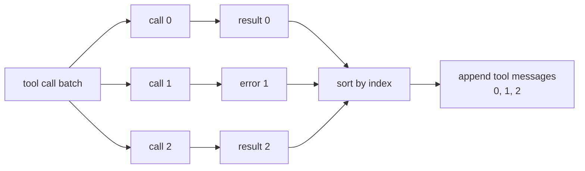
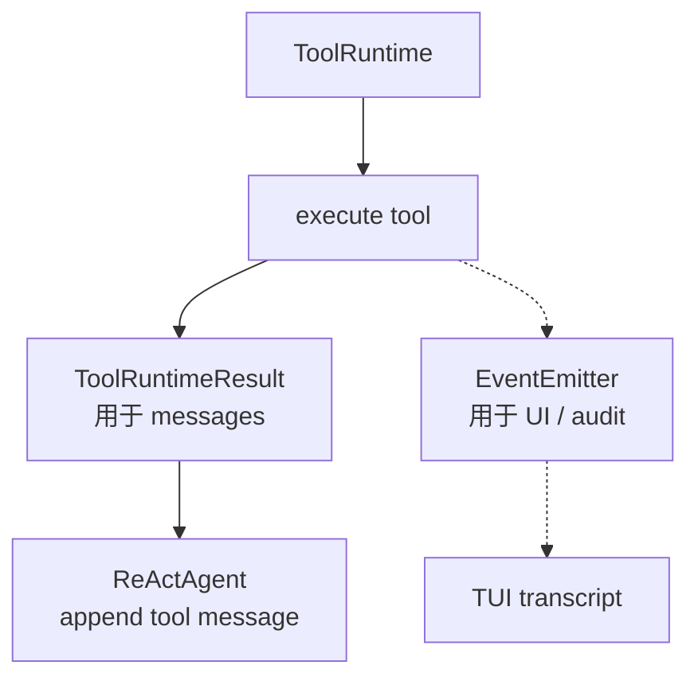

---
status = "verified"
source = "workspaces/projects/openai-codex-cli-deep-learning/topics/tools-permissions"
---

# ReAct 工具运行时

ReAct 工具运行时要解决的问题是：**模型如何通过工具和外部世界交互，又不让工具执行、消息历史、安全审批和 UI 事件搅成一团**。

读完后应该能分清：

- tool call、tool execution event、tool observation 三者的区别。
- 为什么工具结果必须回灌到 messages，而不是直接作为最终答案。
- 为什么 ToolRuntime 要先规划再执行。
- 多个 tool call 并发执行时，为什么结果仍要按 call index 回灌。

## ReAct 的核心闭环

ReAct 不是“模型会调用函数”这么简单。它的核心是 reasoning 和 acting 交替推进：模型先推理下一步，发起 action，环境返回 observation，模型再把 observation 纳入下一轮推理。



这张图里有一个关键分叉：

- `Tool Observation` 是模型下一轮推理的输入。
- `StreamEvent` 是给人、UI、日志和审计看的旁路事件。

把这两者混在一起，系统很快会失控：UI 事件可能污染模型上下文，模型 observation 又可能缺少必要结构。

## tool call、event、observation 的区别

| 概念 | 谁消费 | 作用 |
| --- | --- | --- |
| `ToolCall` | Host / ToolRuntime | 模型提出的动作请求。 |
| `ToolRunStarted` / `ToolRunFinished` | UI / 用户 / 日志 | 证明工具什么时候开始、以什么参数、在哪个 attempt 中执行。 |
| `ToolApprovalRequest` | 用户 / ApprovalGateway | 请求人类批准特定 scope 的副作用。 |
| `ToolObservation` | LLM messages | 工具结果的模型可读表示，驱动下一轮推理。 |

一个成熟 Agent 不能只做 `tool_call -> result`。它至少要同时维护两条输出线：

```text
给模型：tool observation
给外部：stream event
```

## 先规划再执行

demo 中 `ToolRuntime` 没有直接根据 `name` 调函数，而是先生成 plan：



这一步看起来多了一层，但它解决了三个工程问题：

1. **未知工具 fail closed**：模型生成一个不存在的工具名时，不能落到默认执行路径。
2. **工具类型分流**：纯函数、shell、MCP、浏览器、数据库 query 的安全边界不同。
3. **执行层收敛**：ReAct loop 只关心 tool call batch 和 observation，不关心每种工具内部如何审批、sandbox、retry。

## 并发工具调用的边界

同一轮 LLM response 里可能出现多个 tool call。一般情况下，同一批 tool call 不应该互相依赖：如果后一个依赖前一个结果，模型其实还没有得到前一个 observation，参数无法可靠生成。

所以 demo 选择了：

```text
同一批 tool call 并发执行
各自成功或失败
不因为一个失败取消其它工具
最后按 index 顺序回灌 messages
```



为什么不“一失败就取消其它工具”？

- 取消后模型只看到第一个失败，可能下一轮修复后又遇到第二个失败。
- 全部执行完，模型可以一次性看到多个问题，更利于自我修复。
- 只要每个 tool call 的副作用都经过独立安全链路，互不取消更符合批处理心智。

但这不适合所有系统。如果工具有强副作用、共享资源锁、事务一致性要求，就需要 batch-level policy。

## 事件不是 observation

这次 demo 中一个重要设计是：`EventEmitter` 负责对外吐事件，但事件不直接进入 messages。



这个分离能避免两个问题：

- 如果把所有事件都喂给模型，messages 会被 UI 噪音污染。
- 如果只给模型 observation，不给外部事件，用户无法知道审批、sandbox、retry 是否真的发生。

## demo 中的代码落点

| 代码 | 责任 |
| --- | --- |
| [`agent/react.rs`](../../../workspaces/projects/openai-codex-cli-deep-learning/topics/tools-permissions/demo/src/agent/react.rs) | ReAct loop：维护 messages、调用 LLM、收集 tool calls、回灌 tool messages。 |
| [`tool/runtime.rs`](../../../workspaces/projects/openai-codex-cli-deep-learning/topics/tools-permissions/demo/src/tool/runtime.rs) | 工具规划、并发执行、结果按 index 回收。 |
| [`tool/event_emitter.rs`](../../../workspaces/projects/openai-codex-cli-deep-learning/topics/tools-permissions/demo/src/tool/event_emitter.rs) | 工具生命周期事件出口。 |
| [`tool/shell/`](../../../workspaces/projects/openai-codex-cli-deep-learning/topics/tools-permissions/demo/src/tool/shell/) | command tool 的安全执行链路。 |
| [`agent/stream_event.rs`](../../../workspaces/projects/openai-codex-cli-deep-learning/topics/tools-permissions/demo/src/agent/stream_event.rs) | 对外流式事件协议。 |

## 失败模式

| 失败模式 | 表现 | 修正方向 |
| --- | --- | --- |
| tool result 直接当最终答案 | 模型不再基于结果继续推理，复杂任务断掉。 | 结果必须 append 为 tool message，进入下一轮 LLM。 |
| event 和 observation 混用 | UI 噪音进入模型上下文，或模型缺少结构化结果。 | 分两条管线：event 给外部，observation 给模型。 |
| 未知 tool 默认执行 | 模型拼错工具名也可能落到危险路径。 | `find_tool` miss 后 fail closed。 |
| 并发结果乱序回灌 | messages 与 call id/index 不匹配。 | 按 call index 或 call id 稳定排序。 |
| ToolRuntime 直接知道所有 UI 细节 | 工具层和展示层耦合，后续难以换 CLI/TUI。 | ToolRuntime 只发语义事件，不关心怎么渲染。 |

## 自测问题

- 为什么 tool execution event 不应该直接进入 LLM messages？
- 如果一个 LLM response 里有三个 tool call，为什么通常可以并发执行？
- 什么情况下同一批 tool call 不应该互不影响地并发？
- `ToolRuntimePlan` 这层抽象解决了什么耦合问题？
- 如果 tool call 成功了，为什么仍然不能直接把结果作为最终答案返回用户？

## 关联

- [Agent 本地命令执行安全](../safety-and-permissions/local-command-execution.md)
- [`agent/react.rs`](../../../workspaces/projects/openai-codex-cli-deep-learning/topics/tools-permissions/demo/src/agent/react.rs)
- 外部资料：
  - [ReAct paper](https://arxiv.org/abs/2210.03629)
  - [Google Research: ReAct](https://research.google/blog/react-synergizing-reasoning-and-acting-in-language-models/)
  - [OpenAI Function Calling](https://developers.openai.com/api/docs/guides/function-calling)
