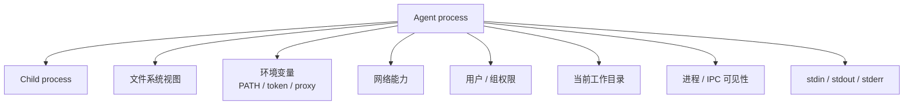
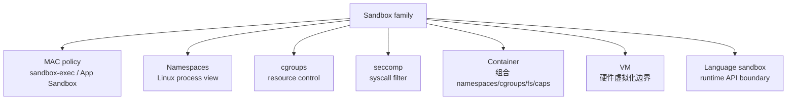
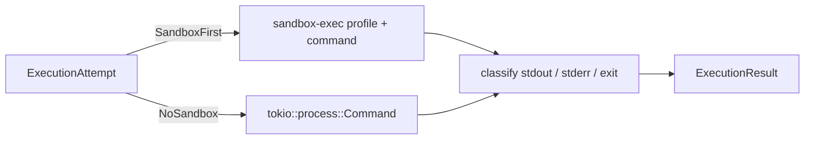
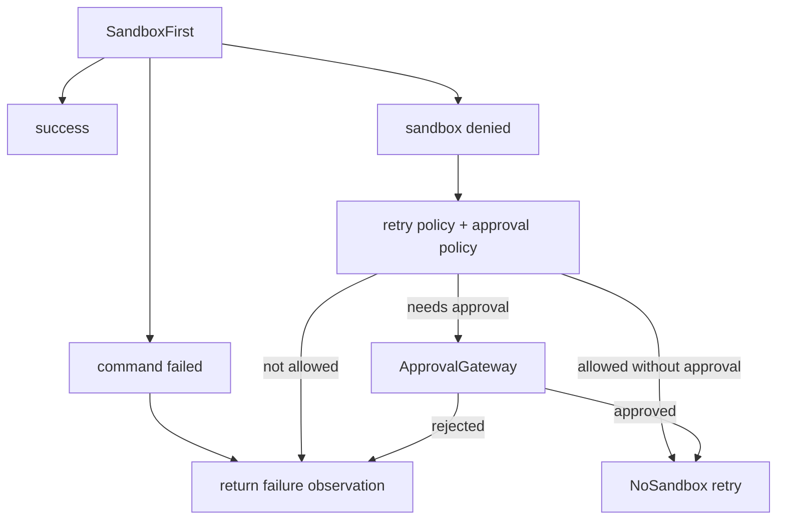

---
status = "verified"
source = "workspaces/projects/openai-codex-cli-deep-learning/topics/tools-permissions"
---

# Sandbox 的第一性原理

Sandbox 要解决的问题是：**当你必须运行一段不完全可信的代码时，如何限制它能观察的世界和能造成的副作用**。

读完后应该能分清：

- sandbox 和 approval 的边界。
- OS sandbox、container、VM、语言 sandbox 分别隔离什么。
- 为什么 local coding agent 要先 sandbox first，再考虑 no-sandbox retry。
- 为什么 demo 先模拟 sandbox，再接真实 `sandbox-exec` 是合理路径。

## 进程默认继承了什么

运行一个命令时，子进程不是在真空里执行。它默认继承宿主世界的一部分：



这就是为什么本地命令危险：它不是纯函数，而是获得了一组来自宿主的能力。

Sandbox 的第一性原理是缩小这个世界：

```text
不要先赌“这段代码会不会作恶”
而是让它即使作恶，也只能在被允许的边界里行动
```

Approval 是“人是否允许做”；sandbox 是“允许后以什么边界做”。两者不是一个层级。

## Sandbox 能限制哪些东西

Sandbox 不是单一技术，而是一组隔离维度。

| 维度 | 例子 | 解决的问题 |
| --- | --- | --- |
| 文件系统 | 只读、只允许 workspace 写、隐藏 Home | 限制读写路径和数据泄露。 |
| 网络 | 禁止联网、只允许特定 host | 防止下载脚本、上传数据、外联控制。 |
| 进程视图 | PID namespace、隐藏其它进程 | 防止探测或影响宿主进程。 |
| 用户权限 | user namespace、降低 uid/gid | 防止继承真实用户的全部权限。 |
| 系统调用 | seccomp、MAC policy | 禁止特定 kernel 能力。 |
| 资源 | cgroups、ulimit | 限制 CPU、内存、进程数、文件句柄。 |
| 语言能力 | 禁用模块、限制 API | 限制解释器内部能力。 |

一个 sandbox 方案通常只覆盖其中一部分。生产系统需要知道自己缺的是哪一层，而不是笼统地说“我有 sandbox”。

## 几类 sandbox 的机制差异



| 方案 | 隔离层级 | 适合场景 | 主要局限 |
| --- | --- | --- | --- |
| macOS `sandbox-exec` | OS policy，对单次进程施加 profile | CLI runner 临时限制命令 | 非跨平台，profile 语言不适合作为长期公共 API。 |
| macOS App Sandbox | App entitlement 长期权限模型 | 签名 macOS App | 不适合“每次命令动态生成 policy”。 |
| Linux namespaces | 改变进程看到的系统视图 | 容器、隔离执行环境 | 单独使用不限制资源，也不自动过滤 syscall。 |
| cgroups | 资源限制和统计 | 控制 CPU/内存/进程数 | 不改变文件系统或网络视图。 |
| seccomp | 系统调用过滤 | 降低 kernel attack surface | 需要理解 syscall 语义，策略难写。 |
| Container | 多机制组合 | 可复现隔离环境 | 启动成本、镜像管理、宿主挂载边界复杂。 |
| VM | 硬件虚拟化 | 强隔离、多租户 | 成本更高，和本地 CLI 体验距离更远。 |
| 语言 sandbox | 解释器 API 层限制 | 执行受限脚本 | 不能替代 OS 权限，native escape 风险高。 |

local coding agent 通常优先考虑 OS 进程级 sandbox，因为它要运行真实 shell、编译器、包管理器和测试命令。语言 sandbox 太窄，VM 又太重。

## `sandbox-exec` 的心智模型

macOS `sandbox-exec` 的基本形式是：

```text
sandbox-exec -p <profile> -- <program> <args...>
```

profile 描述允许或拒绝哪些能力。简化心智是：

```scheme
(version 1)
(deny default)
(allow process*)
(allow file-read*)
(allow file-write* (subpath "/allowed/workspace"))
```

demo 中 `OsExecutionRunner` 的职责不是“自己判断命令是否安全”，而是根据 `ExecutionAttempt` 选择如何执行：



这和权限判断层要分开。ExecutionRunner 只负责执行 attempt，不负责决定“是否允许 no-sandbox retry”。

## Sandbox denied 后为什么不能自动裸跑

如果 sandbox 失败后系统自动在宿主机再跑一次，sandbox 就只剩“试探”意义，不再是安全边界。

正确流程是：



这里必须区分：

- 命令本身失败：例如程序不存在、参数错误、测试失败。
- sandbox denied：命令可能正确，但被执行边界拦住。

只有后者才可能进入 retry。

## demo 中的演进路径

本 topic 没有一开始就做真实 OS sandbox，而是分两步：

1. `SimulatedExecutionRunner`：先验证 approval、retry、event、ReAct observation 的状态机。
2. `OsExecutionRunner`：再接入真实 `sandbox-exec`，暴露 argv、shell quoting、profile、stderr 分类等真实问题。

这个顺序是合理的，因为真实 sandbox 会引入很多 OS 细节。如果状态机还没稳定，直接接 OS runner 很容易把“策略问题”和“系统调用问题”混在一起。

相关实现：

- [`tool/shell/execution/os_execution_runner.rs`](../../../workspaces/projects/openai-codex-cli-deep-learning/topics/tools-permissions/demo/src/tool/shell/execution/os_execution_runner.rs)
- [`tool/shell/execution/simulated_execution_runner.rs`](../../../workspaces/projects/openai-codex-cli-deep-learning/topics/tools-permissions/demo/src/tool/shell/execution/simulated_execution_runner.rs)
- [`tool/shell/retry.rs`](../../../workspaces/projects/openai-codex-cli-deep-learning/topics/tools-permissions/demo/src/tool/shell/retry.rs)
- [sandbox-exec Rust 使用笔记](../../../workspaces/projects/openai-codex-cli-deep-learning/topics/tools-permissions/notes/08-demo-coder/11-slice-12-sandbox-exec-rust-usage.md)

## 设计 sandbox 方案时的检查表

| 问题 | 为什么重要 |
| --- | --- |
| 隔离对象是什么？ | shell command、app、container、脚本、业务 action 的边界不同。 |
| 要限制什么？ | 文件、网络、进程、资源、syscall、语言 API 不是一回事。 |
| 默认策略是什么？ | 默认允许再 deny，很容易漏；默认 deny 再 allow 更安全但更麻烦。 |
| 错误能不能分类？ | 不能区分 command failed 和 sandbox denied，就无法正确 retry。 |
| 能否解释给用户？ | 用户看到“失败”不够，必须知道是命令错还是权限边界。 |
| 和 approval 怎么组合？ | approval 允许动作，sandbox 限制边界，retry 扩大边界。 |
| 是否跨平台？ | macOS、Linux、Windows 的 sandbox 机制完全不同。 |

## 自测问题

- 为什么 approval 通过不等于可以 no-sandbox 执行？
- Linux namespace 和 cgroup 分别解决什么问题？
- 为什么语言 sandbox 不能替代 OS sandbox？
- 如果命令在 sandbox 中 exit code 非 0，如何判断是命令失败还是 sandbox denied？
- 为什么 demo 先做 simulated runner，再做 OS runner？

## 关联

- [Agent 本地命令执行安全](../../ai-agents/safety-and-permissions/local-command-execution.md)
- 外部资料：
  - [`sandbox-exec` man page](https://www.unix.com/man_page/osx/1/sandbox-exec/)
  - [Apple App Sandbox](https://developer.apple.com/documentation/security/app-sandbox)
  - [Configuring the macOS App Sandbox](https://developer.apple.com/documentation/xcode/configuring-the-macos-app-sandbox)
  - [Linux namespaces](https://man7.org/linux/man-pages/man7/namespaces.7.html)
  - [Docker user namespace isolation](https://docs.docker.com/engine/security/userns-remap/)
