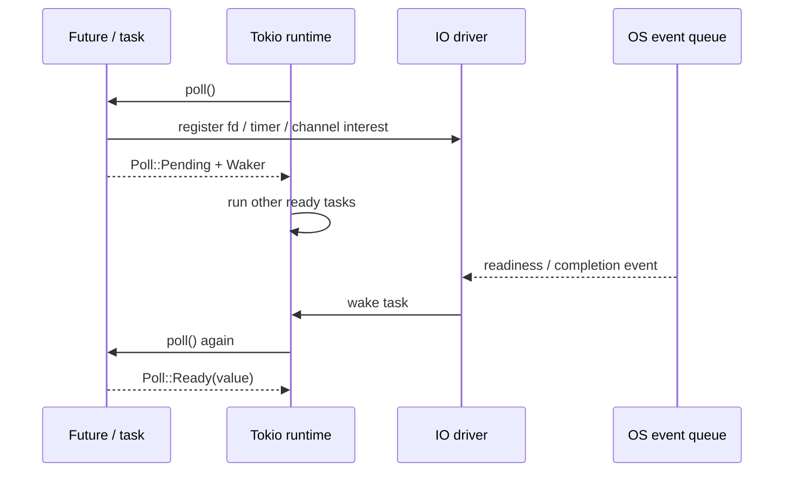
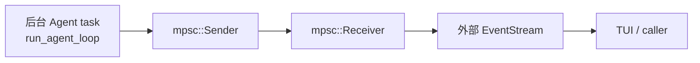
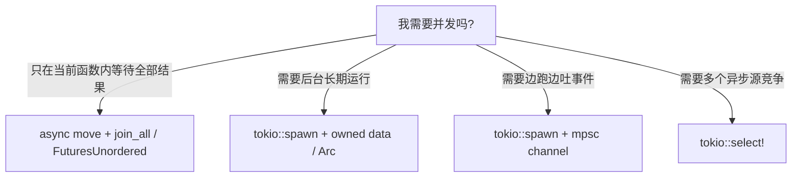
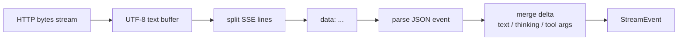

---
status = "verified"
source = "workspaces/projects/openai-codex-cli-deep-learning/topics/tools-permissions"
---

# Rust 流式 Agent 与 Tokio 运行时

这篇笔记要解决的问题是：**如何用 Rust async 构造一个能持续输出 LLM token、工具事件、审批事件和 UI 刷新的 Agent runtime**。

读完后应该能掌握：

- `Future`、`Stream`、`Waker` 在 Agent 流式系统里的位置。
- 为什么 `spawn + mpsc` 常常比把复杂逻辑塞进 `try_stream!` 更稳。
- `async move` 和 `tokio::spawn(async move)` 的所有权、生命周期和调度差异。
- OpenAI-compatible SSE 流如何变成内部 `StreamEvent`。

## 为什么 Agent 天然需要流式

普通 CLI 可以等函数执行完再打印结果，但 Agent 不行。一次对话里可能同时发生：

- 模型输出 thinking / text delta。
- 模型逐步拼出 tool call。
- 工具开始执行。
- 工具请求用户审批。
- 用户批准或拒绝。
- sandbox attempt 失败。
- retry attempt 开始。
- 工具结果回灌模型。
- TUI 要持续刷新。

如果把这些都做成“等待最终结果”，用户会看到一个长时间卡住的黑盒。流式 Agent 的目标是：

```text
内部可以并发等待
外部持续看到进展
模型最终拿到结构化 observation
```

## Rust async 的底层模型

Rust async 的核心不是线程，而是 `Future`。

一个 `Future` 被 poll 时只有两种结果：

```text
Poll::Ready(value)   计算完成
Poll::Pending        现在还不能完成，之后请再 poll 我
```

`Pending` 不是“睡眠”。它必须配合 `Waker`：当 I/O、timer、channel 或子进程状态变化时，runtime 通过 waker 把对应任务重新放回可调度队列。



所以 async 的第一性原理是：

```text
等待外部事件时，把当前任务挂起，让 runtime 去跑别的任务
外部事件就绪后，再用 waker 回来继续推进状态机
```

这和 OS 线程不同。线程阻塞时，线程被 OS 挂起；Future pending 时，当前 async task 让出执行权，但 runtime 线程还能继续跑其它 task。

## Stream：异步版 Iterator

Agent 输出不是一次性值，而是一串事件。`Stream` 就是 async 语境下的多次产出：

```text
poll_next -> Pending
poll_next -> Ready(Some(event))
poll_next -> Ready(Some(event))
poll_next -> Ready(None)
```

在 demo 里，`StreamEvent` 包括：

- LLM 开始和结束。
- thinking / text delta。
- tool call selected。
- tool run started / finished / failed。
- approval request / result。
- final output。

这也是为什么 `Vec<Event>` 不够：它只能在结束后一次性返回，不能在运行过程中让 UI 持续刷新。

## 为什么使用 `spawn + mpsc`

一开始很容易想用 `try_stream!`：

```rust
try_stream! {
    loop {
        let turn = run_one_turn(...).await?;
        yield event;
    }
}
```

小逻辑可以这么写，但 ReAct loop 变复杂后会遇到几个问题：

- `try_stream!` 宏内部语法提示差。
- 同时处理 LLM stream、tool batch、approval channel、错误传播会变得拥挤。
- 很难把“运行 Agent loop”和“对外消费事件”解耦。
- UI 侧可能需要用自己的节奏消费事件。

更稳定的结构是：



代码心智模型是：

```rust
let (tx, rx) = mpsc::channel(128);

tokio::spawn(async move {
    if let Err(err) = run_agent_loop(tx.clone()).await {
        let _ = tx.send(Err(err)).await;
    }
});

let stream = stream::unfold(rx, |mut rx| async {
    rx.recv().await.map(|event| (event, rx))
});
```

`mpsc` 的价值是把“生产事件”和“消费事件”解耦。bounded channel 还能提供 backpressure：如果消费者太慢，生产者最终会在 `send().await` 处等待，避免无限堆内存。

## `async move` vs `tokio::spawn(async move)`

这次 demo 并发执行 tool call 时，最容易混淆的是 `async move` 和 `spawn`。

| 写法 | 本质 | 生命周期要求 | 适用场景 |
| --- | --- | --- | --- |
| `async move { ... }` | 创建一个 Future | 可以借用当前作用域，只要 Future 不逃逸 | 当前函数内并发、`join_all`、`select` |
| `tokio::spawn(async move { ... })` | 把 Future 交给 runtime 独立调度 | 通常需要 `Send + 'static` | 后台任务、跨 await 生命周期、和调用方解耦 |

为什么 `spawn` 要求更高？

因为 spawn 后，任务可能在当前函数返回后还没结束，也可能被多线程 runtime 移动到其它 worker thread。它不能持有一个随当前栈帧消失的引用。



这解释了 demo 中的设计取舍：

- Tool batch 并发：可以用 async block / join_all，因为结果要在本轮收齐。
- Agent stream 输出：适合 `spawn + mpsc`，因为外部要边跑边读。
- TUI 同时处理键盘和 Agent 事件：适合 event loop + channel / select。

## OpenAI-compatible SSE 到内部事件

OpenAI streaming response 使用 Server-Sent Events。Agent 不能等 HTTP response 全部结束后再 parse，而要逐 chunk / line 处理：



这里有几个工程细节很关键：

| 问题 | 为什么容易错 | 正确心智 |
| --- | --- | --- |
| chunk 不等于 line | 网络 chunk 可能从任意位置切开。 | 需要 buffer，按 `\n` 切完整行。 |
| line 不等于完整语义 | 一个 tool call arguments 可能分多次 delta。 | 需要累计 tool call state。 |
| text delta 不等于 message 完成 | 模型还可能继续生成工具或最终回答。 | 事件流和 message state 分开维护。 |
| stream error 不等于 tool error | HTTP/SSE 错误和工具执行失败属于不同层。 | 错误类型要保留边界。 |

## demo 中的代码落点

| 代码 | 责任 |
| --- | --- |
| [`agent/llm/openai.rs`](../../../workspaces/projects/openai-codex-cli-deep-learning/topics/tools-permissions/demo/src/agent/llm/openai.rs) | 解析 OpenAI-compatible streaming response，合并 delta。 |
| [`agent/react.rs`](../../../workspaces/projects/openai-codex-cli-deep-learning/topics/tools-permissions/demo/src/agent/react.rs) | 把 LLM stream、tool call、tool observation 组织成 ReAct loop。 |
| [`tool/runtime.rs`](../../../workspaces/projects/openai-codex-cli-deep-learning/topics/tools-permissions/demo/src/tool/runtime.rs) | 并发执行 tool call batch，并按 index 回收结果。 |
| [`cli/event_loop.rs`](../../../workspaces/projects/openai-codex-cli-deep-learning/topics/tools-permissions/demo/src/cli/event_loop.rs) | 同时处理用户输入和 Agent stream event。 |

## 常见失败模式

| 失败模式 | 表现 | 修正方向 |
| --- | --- | --- |
| 把 bytes chunk 直接当 JSON | 解析偶发失败，取决于网络切包。 | 保留 buffer，只 parse 完整 SSE line。 |
| 每个 delta 都 append 新消息 | UI 上出现碎片化 thinking/text。 | 同类 delta 要合并成当前 block。 |
| `tokio::spawn` 捕获 `&self` | 生命周期或 `Send + 'static` 报错。 | 改用 `Arc` / owned data，或不用 spawn。 |
| channel 不设容量 | 事件生产过快时可能失控。 | 使用 bounded channel，接受 backpressure。 |
| 忽略 `send` 失败 | 消费者退出后后台任务继续做无意义工作。 | 关键路径要决定是否停止或记录错误。 |

## 自测问题

- 为什么 `async move` 不等于创建线程？
- 为什么 `tokio::spawn` 往往要求 `'static`？
- 如果 SSE 的一个 JSON 被拆成两个 TCP chunk，代码应该在哪里缓存？
- Agent TUI 卡住，只有按键后才刷新，通常说明 event loop 哪一层出了问题？
- 为什么 tool batch 并发可以不用 `spawn`，但 Agent stream 通常适合 `spawn + mpsc`？

## 关联

- [ReAct 工具运行时](../../ai-agents/tool-use/react-tool-runtime.md)
- 外部资料：
  - [Rust Async Book](https://rust-lang.github.io/async-book/)
  - [Rust Async Book: Streams](https://rust-lang.github.io/async-book/05_streams/01_chapter.html)
  - [Tokio `spawn`](https://docs.rs/tokio/latest/tokio/task/fn.spawn.html)
  - [Tokio spawning tutorial](https://tokio.rs/tokio/tutorial/spawning)
  - [Tokio mpsc](https://docs.rs/tokio/latest/tokio/sync/mpsc/index.html)
  - [OpenAI Streaming Responses](https://developers.openai.com/api/docs/guides/streaming-responses)
