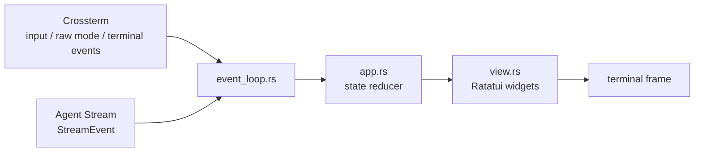
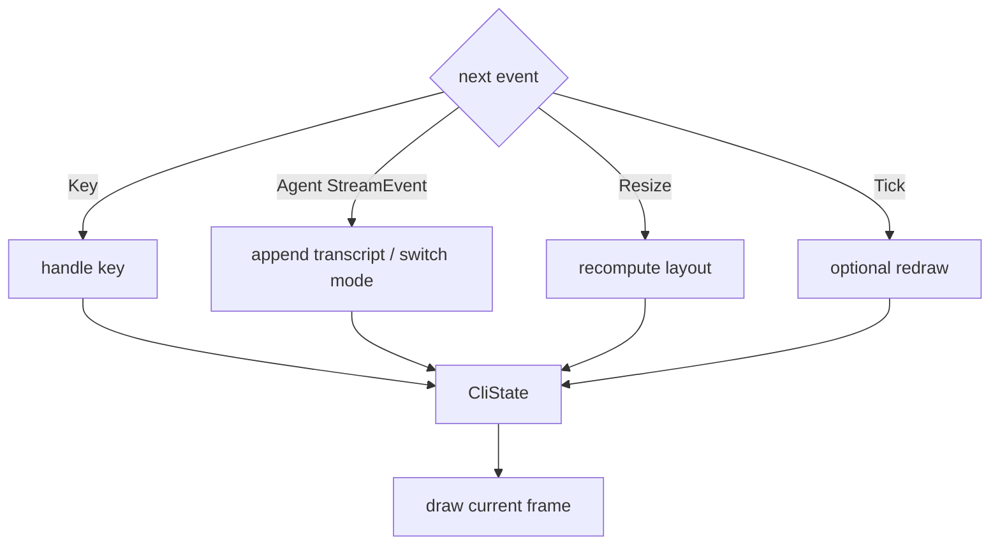
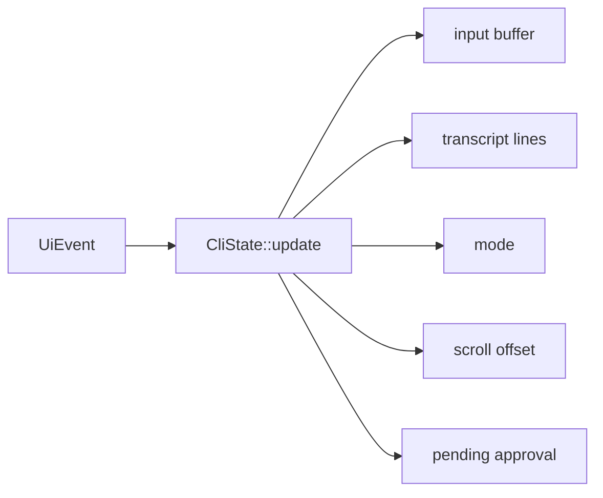
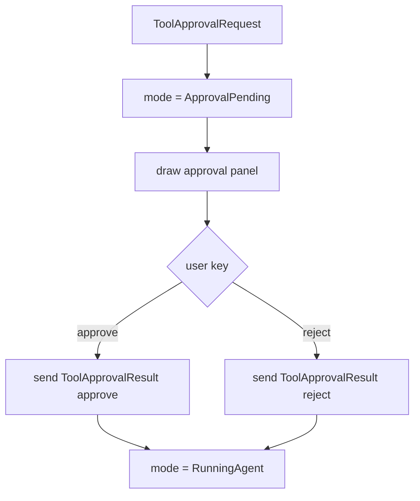

---
status = "verified"
source = "workspaces/projects/openai-codex-cli-deep-learning/topics/tools-permissions"
---

# 终端 Agent UI 的事件循环

这篇笔记要解决的问题是：**如何把用户输入、Agent 流式输出、工具审批和终端渲染组织成一个不会卡住、不会乱序、可维护的 CLI/TUI 架构**。

读完后应该能掌握：

- 为什么终端 UI 的核心是 event loop，而不是“print 几行文本”。
- Ratatui / Crossterm 分别负责什么。
- 为什么 Agent stream 和 key event 必须进入统一状态归约。
- prompt、running、approval 等 UI mode 如何避免互相打架。

## 终端 UI 的第一性原理

浏览器 UI 有 DOM、事件系统和布局引擎。终端 UI 没有这些。终端本质上是一块字符网格，程序要自己决定：

```text
读什么事件
如何更新状态
何时重绘屏幕
光标在哪里
输入模式是什么
```

Ratatui 的职责是“根据当前 state 画一帧”；Crossterm 的职责是“读取键盘、鼠标、resize 等终端事件，并操作终端模式”。应用自己的职责是维护 event loop 和 state。



所以 TUI 的核心不是 draw，而是：

```text
把多个异步事件源归并成稳定状态，再根据状态渲染
```

## 为什么不能靠用户按键驱动刷新

demo 早期遇到过一个典型问题：Agent 事件没有吐完，必须继续输入东西才刷新。

这说明 event loop 只有在 key event 到来时才推进 UI，而没有独立处理 Agent stream event。

错误心智：

```text
read key -> update -> draw
```

正确心智：

```text
key event / agent event / resize / tick
-> update state
-> draw
```



这也是为什么 TUI 通常需要 `select` 或 channel：不是用户输入才驱动程序，而是任何事件源都能驱动一次状态更新。

## 状态层比渲染层更重要

一个 Agent CLI 至少有几种 mode：

| mode | 含义 | 输入行为 |
| --- | --- | --- |
| `EditingPrompt` | 用户正在输入 prompt | 字符进入 input buffer，Enter 提交。 |
| `RunningAgent` | Agent 正在流式输出 | 普通输入不应触发新 prompt；滚动键仍可用。 |
| `ApprovalPending` | 等待用户批准工具 | `a` / `r` / `s` 等键表示审批决定。 |
| `Quit` | 退出 | 清理 terminal mode。 |

如果没有明确 mode，UI 很容易出现这些 bug：

- Agent running 时用户还能提交新 prompt。
- approval request 出现后，Enter 仍然被当作 prompt submit。
- 事件结束后没有从 running 回到 ready。
- transcript 自动滚动和手动滚动互相覆盖。

状态层应该像 reducer：



渲染层只读取 state，不应该反过来改变业务状态。

## Transcript 不是普通日志

Agent transcript 同时承载几类内容：

- 用户 prompt。
- assistant text / thinking。
- tool selected / started / finished。
- command execution attempt。
- approval request / result。
- final answer。

这些内容对阅读者的价值不同，所以不能全部 `println!("{:?}")`。

一个可用 transcript 至少要做到：

| 能力 | 为什么重要 |
| --- | --- |
| 合并 text delta | 否则每个 token 一行，无法阅读。 |
| 合并 thinking delta | 否则 thinking 变成碎片噪音。 |
| 工具事件压缩显示 | 工具参数可能很长，需要摘要而不是淹没对话。 |
| 支持滚动 | 历史输出不能被截断。 |
| 跟随尾部 | Agent running 时默认看到最新内容。 |
| 手动滚动时不抢回 | 用户查看历史时不要自动跳到底。 |

这就是为什么 demo 的 `view.rs` 需要处理 markdown、table、wrapped row count、scroll offset 等细节。

## Approval UI 是一种状态，不是普通 prompt

审批请求是 Agent CLI 和普通聊天 CLI 的关键差别。

审批时用户不是在输入自然语言，而是在对一个具体 scope 做安全决策。UI 必须清楚展示：

- 工具名。
- 命令或参数。
- 为什么需要审批。
- approval scope。
- 允许一次还是 session 内允许。
- 拒绝会发生什么。



如果 approval UI 只是普通输入框，用户很容易不知道自己批准的到底是什么。

## demo 中的代码落点

| 代码 | 责任 |
| --- | --- |
| [`cli/event_loop.rs`](../../../workspaces/projects/openai-codex-cli-deep-learning/topics/tools-permissions/demo/src/cli/event_loop.rs) | 合并 key event 和 Agent stream event，驱动状态更新。 |
| [`cli/app.rs`](../../../workspaces/projects/openai-codex-cli-deep-learning/topics/tools-permissions/demo/src/cli/app.rs) | 保存 input、transcript、mode、approval pending、scroll offset。 |
| [`cli/view.rs`](../../../workspaces/projects/openai-codex-cli-deep-learning/topics/tools-permissions/demo/src/cli/view.rs) | 根据 state 渲染 header、transcript、prompt/approval、footer。 |
| [`agent/stream_event.rs`](../../../workspaces/projects/openai-codex-cli-deep-learning/topics/tools-permissions/demo/src/agent/stream_event.rs) | Agent 对外事件协议。 |
| [`agent/react.rs`](../../../workspaces/projects/openai-codex-cli-deep-learning/topics/tools-permissions/demo/src/agent/react.rs) | 产生流式 Agent event。 |

这次学到的架构边界是：

```text
Agent 不直接 print
UI 不直接跑工具
event loop 汇合事件
state reducer 归约状态
view 只负责表达
```

## 常见失败模式

| 失败模式 | 表现 | 修正方向 |
| --- | --- | --- |
| 阻塞等待键盘 | Agent stream 只有按键后才刷新。 | key event 和 agent event 都进入 event loop。 |
| view 修改业务状态 | 渲染顺序影响行为，难以测试。 | view 只读 state。 |
| approval 用普通输入框 | 用户不知道批准范围。 | 单独 mode 和 approval panel。 |
| 不计算 wrapped row | 长行换行后滚动位置错误。 | 用视觉行数而不是逻辑事件数计算 scroll。 |
| 不合并 markdown delta | assistant 输出难读，表格变形。 | 在 transcript block 层合并，再渲染。 |
| tool 参数原样铺满屏幕 | 关键对话被长 JSON 淹没。 | 对工具事件做摘要和可读格式化。 |

## 自测问题

- Ratatui 为什么不负责读取输入？
- 为什么 event loop 不能只阻塞在 `read key`？
- `CliState` 应该保存哪些东西，哪些东西应该只在 view 里临时计算？
- approval pending 时 Enter 应该提交 prompt 吗？
- 为什么 transcript 的滚动要按 wrapped row 计算？

## 关联

- [Rust 流式 Agent 与 Tokio 运行时](../async-runtime/streaming-agent.md)
- [ReAct 工具运行时](../../ai-agents/tool-use/react-tool-runtime.md)
- 外部资料：
  - [Ratatui FAQ](https://ratatui.rs/faq/)
  - [Crossterm event module](https://docs.rs/crossterm/latest/crossterm/event/index.html)
  - [Crossterm `read`](https://docs.rs/crossterm/latest/crossterm/event/fn.read.html)
