# Codex Agent Loop 架构结论

## 1. 核心流程 Loop 总览

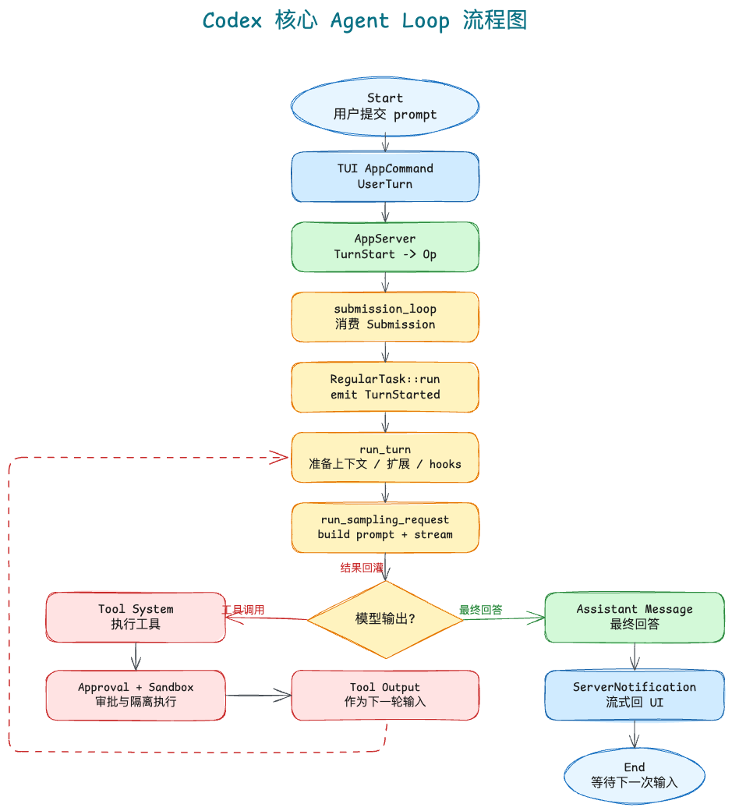

Excalidraw 源文件：[`diagrams/codex-core-agent-loop-flow.excalidraw`](diagrams/codex-core-agent-loop-flow.excalidraw)

Codex 的核心不是 TUI loop，而是 core session 中的 agent turn loop。TUI 只把用户意图送进 core；真正的模型请求、工具调用、权限审批和沙箱执行都发生在 core 侧。

主路径：

```text
用户输入
-> TUI App / AppCommand
-> AppServer / ClientRequest
-> Core Op / Submission
-> submission_loop
-> RegularTask::run
-> run_turn
-> run_sampling_request
-> Model stream
-> Tool System
-> ServerNotification
-> TUI 渲染
```

关键结论：

- `App::run` 是 UI 事件循环，不是 agent loop。
- `submission_loop` 是 core 的 `Op` 消费入口。
- `RegularTask::run` 才进入常规 agent turn。
- 模型只要产生工具调用，工具结果就会回灌给下一轮模型请求。
- 权限审批和沙箱不是散落在 TUI 或模型层，而是收敛在 tool system 内。

## 2. 架构分层

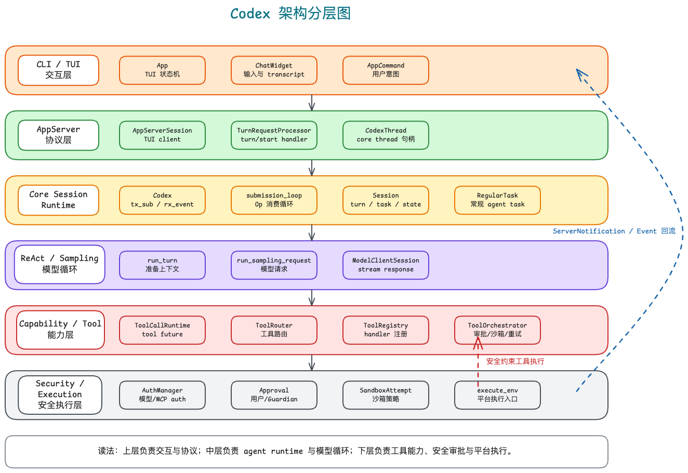

Excalidraw 源文件：[`diagrams/codex-architecture-layers.excalidraw`](diagrams/codex-architecture-layers.excalidraw)

Codex 可以按四层理解：

| 层 | 核心职责 | 关键对象 |
| --- | --- | --- |
| CLI / TUI | 收集输入、展示 transcript、处理审批 UI | `App`、`ChatWidget`、`AppCommand` |
| AppServer | 协议边界，把 TUI request 转成 core `Op` | `AppServerSession`、`TurnRequestProcessor`、`CodexThread` |
| Core Session | 真正的 agent runtime，负责 turn、模型请求、工具结果回灌 | `Codex`、`submission_loop`、`Session`、`RegularTask`、`run_turn`、`run_sampling_request` |
| Tool System | 工具路由、审批、沙箱、执行、失败重试 | `ToolCallRuntime`、`ToolRouter`、`ToolRegistry`、`ToolHandler`、`ToolOrchestrator`、`ToolRuntime` |

这组边界是 Codex 最值得学习的地方：TUI 不知道工具如何执行，模型 loop 不知道 shell 如何审批，具体工具 runtime 不知道 UI 如何渲染。

## 3. 核心模块解析

### 3.1 输入与任务启动

用户输入不是直接进入模型，而是先变成协议对象：

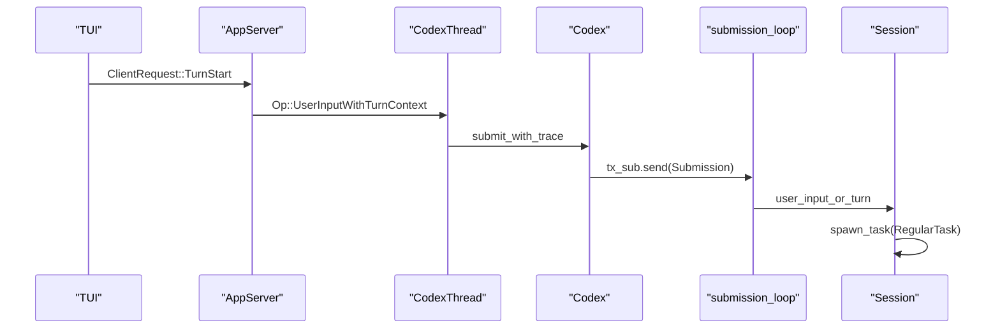

```text
AppCommand::UserTurn
-> ClientRequest::TurnStart
-> Op::UserInputWithTurnContext
-> Submission
-> submission_loop
```

`submission_loop` match 到用户输入类 `Op` 后进入：

```text
user_input_or_turn
-> user_input_or_turn_inner
-> sess.new_turn_with_sub_id
-> sess.steer_input
-> sess.spawn_task(..., RegularTask::new())
```

核心判断在 `sess.steer_input`：如果当前没有 active turn，就返回 `NoActiveTurn`，随后启动 `RegularTask`。

源码入口：

- `app-server/src/request_processors/turn_processor.rs`
- `core/src/session/handlers.rs`
- `core/src/session/mod.rs`
- `core/src/tasks/regular.rs`

### 3.2 ReAct Loop

`RegularTask::run` 是常规 agent turn 的外层循环：

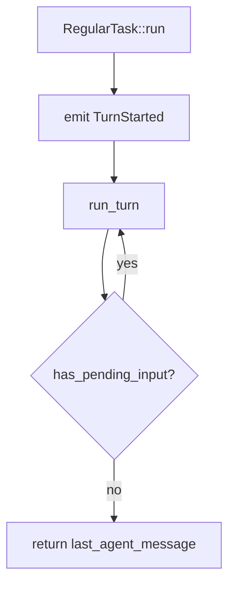

```text
emit TurnStarted
-> loop
   -> run_turn
   -> 如果 session 有 pending input，继续 loop
   -> 否则返回 last_agent_message
```

`run_turn` 是每轮模型请求前的准备层，负责上下文、模型信息、skills、plugins、MCP tools、connectors、hooks 和 pending input。

`run_sampling_request` 是模型请求和工具系统的连接点：

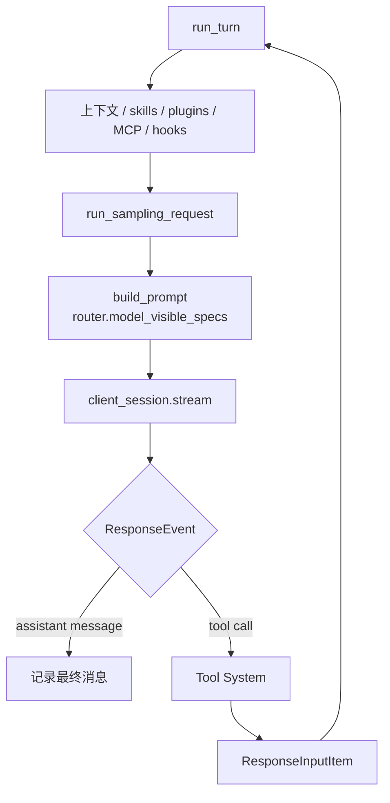

```text
built_tools -> ToolRouter
ToolCallRuntime::new
build_prompt(..., tools: router.model_visible_specs())
try_run_sampling_request -> client_session.stream
```

模型请求完成不代表 turn 完成。只有当模型不再产生工具调用，并输出最终 assistant message，turn 才结束。

源码入口：

- `core/src/tasks/regular.rs`
- `core/src/session/turn.rs`
- `core/src/stream_events_utils.rs`

### 3.3 Tool System

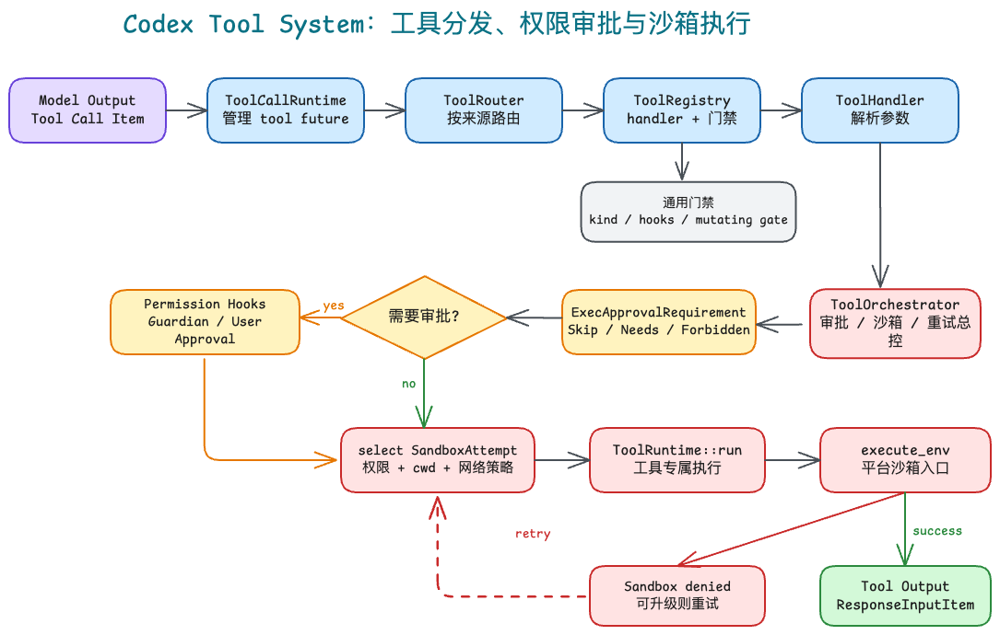

Excalidraw 源文件：[`diagrams/codex-tool-approval-sandbox.excalidraw`](diagrams/codex-tool-approval-sandbox.excalidraw)

模型流出现工具调用时，进入工具系统：

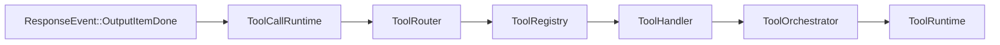

```text
ResponseEvent::OutputItemDone
-> handle_output_item_done
-> ToolCallRuntime
-> ToolRouter
-> ToolRegistry
-> ToolHandler
-> ToolOrchestrator
-> ToolRuntime
```

分工：

- `ToolCallRuntime`：接住模型工具调用，管理 tool future，把结果回填给模型 loop。
- `ToolRouter`：把模型输出转成 `ToolCall`，按工具来源路由。
- `ToolRegistry`：找到 handler，并执行通用前置门禁。
- `ToolHandler`：解析具体工具参数，构造 runtime request。
- `ToolOrchestrator`：统一处理审批、沙箱选择、执行尝试、失败重试。
- `ToolRuntime`：具体工具的策略和实际执行，例如 shell、apply patch、unified exec。

源码入口：

- `core/src/tools/parallel.rs`
- `core/src/tools/router.rs`
- `core/src/tools/registry.rs`
- `core/src/tools/handlers/`
- `core/src/tools/orchestrator.rs`
- `core/src/tools/runtimes/`

### 3.4 Auth 与 Approval

Codex 里要区分两类权限。

第一类是账号 / 模型访问 auth：

```text
login crate
-> AuthManager
-> Session
-> ModelClient / MCP manager
```

它解决“能不能访问模型、账号、MCP 服务”。

第二类是工具执行 approval：

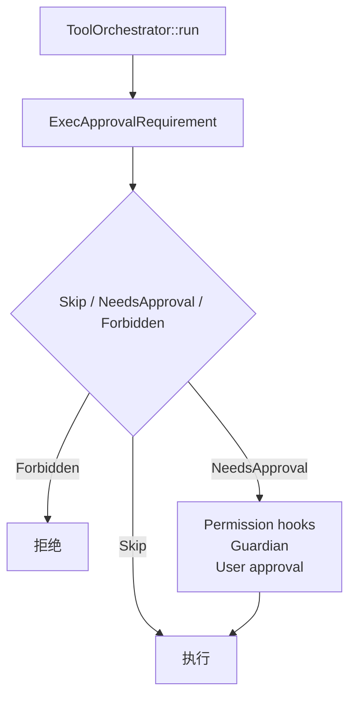

```text
ToolOrchestrator::run
-> ToolRuntime::exec_approval_requirement
-> Skip / NeedsApproval / Forbidden
-> Permission hooks / Guardian / User approval
```

工具审批发生在 `ToolOrchestrator::run`，具体审批细节由 `ToolRuntime` 的 `Approvable` 实现提供。用户审批结果会以 `Op::ExecApproval` / `Op::PatchApproval` 回到 `submission_loop`，再通知等待中的工具执行。

源码入口：

- `login/`
- `core/src/session/session.rs`
- `core/src/session/mod.rs`
- `core/src/session/handlers.rs`
- `core/src/tools/orchestrator.rs`
- `core/src/tools/sandboxing.rs`
- `core/src/guardian/`
- `tui/src/approval_events.rs`
- `tui/src/app_server_approval_conversions.rs`

### 3.5 Sandbox

沙箱不在 `run_turn` 里执行，而是在工具 runtime 执行阶段使用。

以 shell 为例：

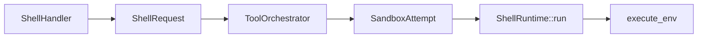

```text
ShellHandler
-> ShellRequest
-> ToolOrchestrator::run
-> select SandboxAttempt
-> ShellRuntime::run
-> build_sandbox_command
-> SandboxAttempt::env_for
-> sandboxing::execute_env
```

`ToolOrchestrator` 负责选择 `SandboxAttempt`。`ToolRuntime` 负责在这个 attempt 下真正执行。沙箱失败后，`ToolOrchestrator` 可以根据 policy 决定是否请求升级审批，并用无沙箱或升级策略重试。

源码入口：

- `core/src/tools/orchestrator.rs`
- `core/src/tools/sandboxing.rs`
- `core/src/tools/runtimes/shell.rs`
- `core/src/tools/runtimes/mod.rs`
- `core/src/landlock.rs`
- `sandboxing/src/manager.rs`
- `sandboxing/src/seatbelt.rs`
- `sandboxing/src/landlock.rs`

### 3.6 Event 回流

Core 不同步返回完整字符串，而是持续发事件：

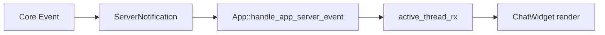

```text
Core Event
-> ServerNotification
-> App::handle_app_server_event
-> active_thread_rx
-> ChatWidget render
```

这支持模型文本流式输出、工具调用开始/结束展示、shell 输出增量展示、文件变更展示、审批请求插入当前 turn，以及 turn 完成后恢复输入态。

## 4. 核心 Struct 关系速查

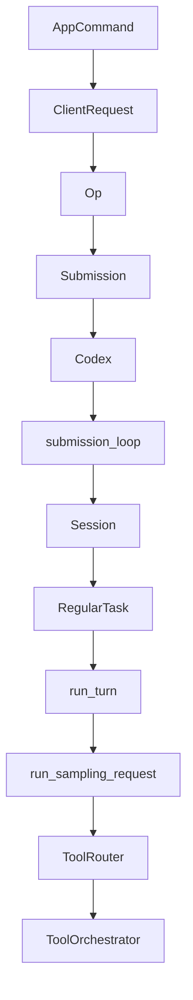

```text
AppCommand
-> ClientRequest
-> Op
-> Submission
-> Codex
-> submission_loop
-> Session
-> RegularTask
-> run_turn
-> run_sampling_request
-> ToolRouter
-> ToolOrchestrator
```

一句话定位：

- `AppCommand`：TUI 内部用户意图。
- `ClientRequest`：TUI 到 app-server 的协议请求。
- `Op`：app-server 到 core 的操作协议。
- `Codex`：core session 门面，负责提交 `Submission` 和暴露事件流。
- `submission_loop`：core 的 `Op` 消费循环。
- `Session`：管理 turn、任务、上下文、事件和审批状态。
- `RegularTask`：常规 agent turn 的执行任务。
- `run_turn`：每轮采样前的上下文准备与控制。
- `run_sampling_request`：模型 stream 与 tool system 的连接点。
- `ToolOrchestrator`：工具审批、沙箱、执行和重试的总控。

## 5. 最终心智模型

Codex 的生产级 Agent CLI 设计可以压缩成一句话：

> TUI 负责交互，AppServer 负责协议，Core Session 负责 agent loop，Tool System 负责有权限和沙箱约束的外部行动。

真正值得迁移的模式不是某个函数，而是这组边界：交互层、协议层、Agent Runtime、能力层、安全层彼此解耦，因此 Codex 可以同时支持流式 UI、长任务、工具调用、用户审批、沙箱隔离、上下文压缩和多 thread 交互。
