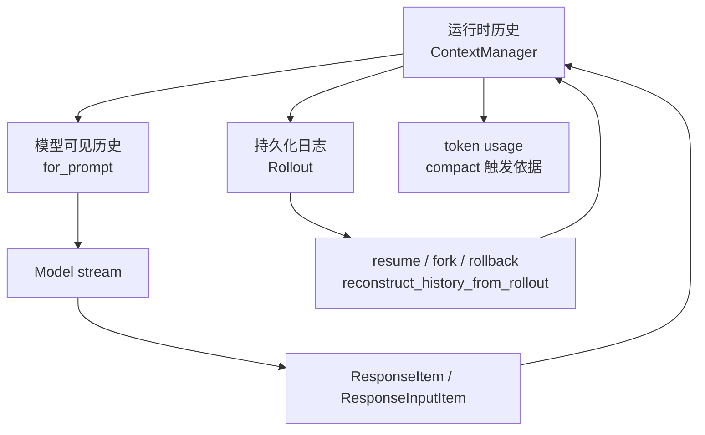
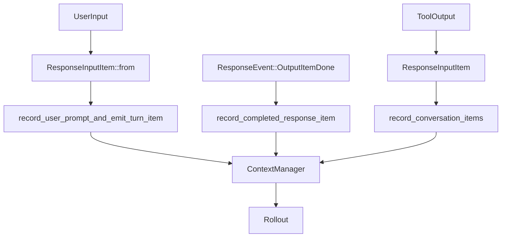
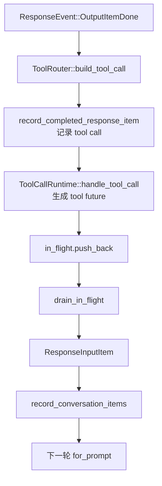
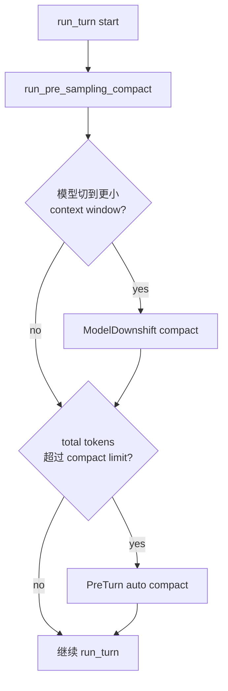
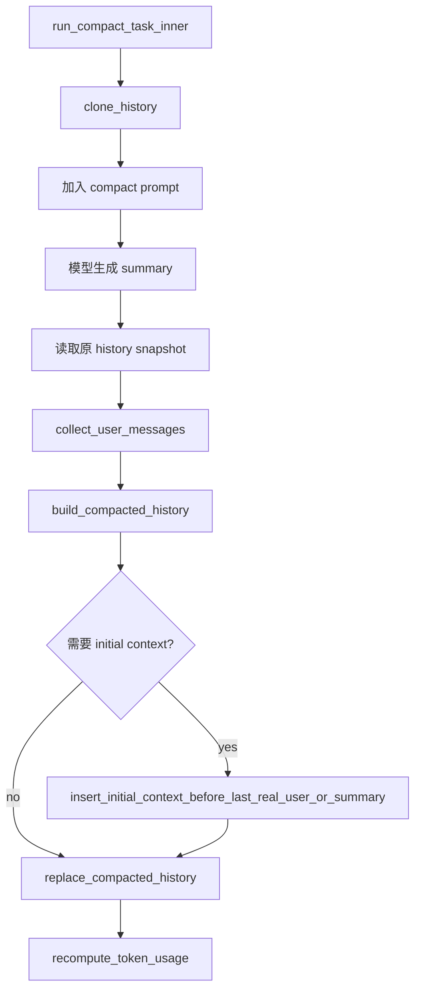

# Codex 上下文管理与压缩机制

## 1. 核心结论

Codex 的上下文管理不是维护一个无限 append 的 `messages` 列表，而是把长期会话拆成三层：



一句话心智模型：

> `ContextManager` 维护当前可继续推理的模型历史，`Rollout` 维护可恢复的事实日志，`compact` 在 token 压力下用 summary + 最近用户消息 + 必要 initial context 替换 history。

它解决三个现实约束：

- 模型 context window 有上限，长任务必须压缩。
- 工具调用结果必须回到下一轮模型请求，否则 ReAct loop 断裂。
- CLI 会话要支持 resume/fork/rollback，不能只依赖内存 history。

## 2. 核心对象

- `ContextManager`：内存中的 conversation history，保存 `ResponseItem`，负责记录 API message、估算 token、生成 prompt 前的 normalize 版本。
- `SessionState.history`：session 级别持有 `ContextManager`。
- `ResponseItem`：模型输出、用户输入、工具调用、工具结果等 API 级历史项。
- `ResponseInputItem`：准备写回模型输入的 item，工具结果会先转成它，再进入 history。
- `TokenUsageInfo`：记录模型返回 token usage，并估算新增 history token，用于触发 auto compact。
- `Rollout`：持久化事件和 response item，用于恢复、fork、rollback 和 replay。
- `CompactedItem.replacement_history`：compact 后的替代 history，是恢复时的 checkpoint。

## 3. History 与 Prompt

用户输入、模型输出、工具调用和工具结果最终都会进入 `ContextManager`。



关键代码：

- `core/src/context_manager/history.rs`
- `core/src/session/mod.rs`
- `core/src/stream_events_utils.rs`

`ContextManager::record_items` 只记录 API message，并会过滤/处理 item：

```text
record_items
-> is_api_message
-> process_item
-> items.push(processed)
```

它保护的边界是：history 中只保留后续模型请求需要理解的 API item，而不是 UI 事件、turn 展示事件或其他运行时元数据。

每次采样前，`run_turn` 会 clone 当前 history，再生成本次模型可见输入：

```text
sess.clone_history()
-> ContextManager::for_prompt(input_modalities)
-> run_sampling_request
-> build_prompt
```

`for_prompt` 接收 `self`，所以 normalize 发生在 cloned history 上，不直接改写 session 内的原始 history。这样 Codex 可以针对当前模型能力生成“模型可见版本”，同时保留 runtime history 的完整语义。

## 4. `normalize_history` 的不变量

`for_prompt` 会调用 `normalize_history`：

```rust
fn normalize_history(&mut self, input_modalities: &[InputModality]) {
    normalize::ensure_call_outputs_present(&mut self.items);
    normalize::remove_orphan_outputs(&mut self.items);
    normalize::strip_images_when_unsupported(input_modalities, &mut self.items);
}
```

它保护三个 API 级不变量：

- 每个 function/custom call 都有对应 output。
- 每个 output 都有对应 call。
- 当模型不支持图片时，从 message 和 tool output 中移除 image content。

核心原因是：模型下一轮必须看到完整、合法、可继续推理的 ReAct 因果链。孤立的 tool output 或没有 output 的 call 都会让模型协议或语义上下文断裂。

## 5. 工具结果如何回到下一轮

模型输出 tool call 后，Codex 先记录 call 本身，再异步执行工具，最后把工具结果写回 history。



关键路径：

```text
handle_output_item_done
-> ToolRouter::build_tool_call
-> ToolCallRuntime::handle_tool_call
-> AnyToolResult::into_response
-> ToolOutput::to_response_item(call_id, payload)
-> record_conversation_items
```

以 MCP 工具结果为例，`to_response_item` 会保留 `call_id`：

```rust
fn to_response_item(&self, call_id: &str, _payload: &ToolPayload) -> ResponseInputItem {
    ResponseInputItem::McpToolCallOutput {
        call_id: call_id.to_string(),
        output: self.clone(),
    }
}
```

这里的核心不变量是：工具结果必须能和前面的 tool call 一一对应，否则下一轮模型请求无法恢复这段 ReAct 链路。

## 6. 为什么工具调用用 future

Codex 不在 `handle_output_item_done` 中同步阻塞执行工具，而是把工具执行包成 future 放进 `in_flight`：

```text
handle_output_item_done
-> output_result.tool_future
-> in_flight.push_back(tool_future)
...
drain_in_flight(&mut in_flight, sess, turn_context)
```

这样做拆开了三件事：

- 模型 stream 可以继续被消费，不被单个工具调用阻塞。
- 工具执行可以并发、可取消，并由 `ToolCallRuntime` 统一管理。
- 工具结果在 stream 结束后统一 drain，再写入 session history。

顺序不会乱的关键是 `FuturesOrdered`：

- `push_back` 按模型输出 tool call 的顺序入队。
- `next().await` 按入队顺序产出结果，而不是谁先完成谁先写入。
- 所以工具可以并发执行，但 history 中的工具结果顺序仍和模型 tool call 顺序一致。

并发边界由 `ToolCallRuntime` 内部控制：支持并行的工具拿 read lock，不支持并行的工具拿 write lock。

源码入口：

- `core/src/stream_events_utils.rs`
- `core/src/session/turn.rs`
- `core/src/tools/parallel.rs`
- `core/src/tools/registry.rs`

## 7. Compact 触发时机

Codex 有三类 compact 入口。

### 手动 compact

用户触发 `/compact` 等操作时，会进入 `CompactTask`：

```text
CompactTask::run
-> remote compact 或 local compact
```

主要代码：

- `core/src/tasks/compact.rs`
- `core/src/compact.rs`
- `core/src/compact_remote.rs`
- `core/src/compact_remote_v2.rs`

### Pre-Turn Compact

`run_turn` 刚开始会先执行 `run_pre_sampling_compact`。

它主要处理两类情况：

- 模型切换到更小 context window，需要先用旧模型上下文压缩。
- 当前 total usage 已经超过 `auto_compact_token_limit`。



### Mid-Turn Compact

模型采样后，如果刚发生工具调用、还需要继续 follow-up，但上下文已经到达限制，就会触发 mid-turn compact：

```text
token_limit_reached && needs_follow_up
-> run_auto_compact(
     InitialContextInjection::BeforeLastUserMessage,
     CompactionReason::ContextLimit,
     CompactionPhase::MidTurn,
   )
```

mid-turn compact 更危险，因为 compact 发生在同一个 turn 的中间。它必须保住当前用户请求、模型刚发出的 tool call、工具结果、下一轮 follow-up 和上下文 baseline 的连续性。

## 8. Compact 如何改写 History

本地 compact 的主流程：



compact prompt 位于：

- `core/templates/compact/prompt.md`

核心要求是让模型生成一份 handoff summary，帮助另一个 LLM 接续任务。它要求包含：

- 当前进展和关键决策。
- 重要上下文、约束或用户偏好。
- 剩余工作和下一步。
- 继续任务所需的关键数据、例子或引用。

压缩后的 history 不是任意摘要，而是有结构：

```text
可选 initial context
-> 最近若干 user messages
-> summary message
```

`build_compacted_history` 会从旧 history 中倒序保留最近用户消息，最多约 `20_000` tokens，然后把 summary 作为最后一条 user message 放进去。

## 9. `InitialContextInjection`

`InitialContextInjection` 决定 compact 后是否把 initial context 立即放回 replacement history。

```text
DoNotInject
-> replacement history 不含 initial context
-> reference_context_item = None
-> 下一次 regular turn 会完整 reinject initial context

BeforeLastUserMessage
-> replacement history 里插入 initial context
-> reference_context_item = current TurnContextItem
-> mid-turn 继续采样时不会丢上下文
```

这解释了 pre-turn 和 mid-turn 的差异：

- pre-turn：compact 后可以等下一轮 regular turn 正常重新注入上下文。
- mid-turn：compact 后马上要继续模型请求，必须把 initial context 插回 history，避免同一个 turn 中途丢失任务背景。

## 10. Rollout 如何支持恢复

`Rollout` 是持久化事实源。恢复时不是读取最后一份内存 snapshot，而是 replay rollout item，重新计算“下一次模型应该看到什么 history”。

核心路径：

```text
Session::reconstruct_history_from_rollout
-> 反向扫描 RolloutItem
-> 找最新 surviving CompactedItem.replacement_history
-> 只 replay 之后的 suffix
-> 重建 ContextManager
```

反向扫描阶段做三件事：

- 找最近有效的 `replacement_history` checkpoint。
- 处理 rollback：如果有回滚，就跳过最近的用户 turn segment。
- 恢复 `previous_turn_settings` 和 `reference_context_item`。

随后从 checkpoint 后面的 suffix 正向 replay：

- 普通 `ResponseItem` 追加进 history。
- 新的 `Compacted` 用 replacement history 替换当前 history。
- `ThreadRolledBack` 从 history 末尾删除对应用户轮次。
- `TurnContext`、`TurnStarted`、`TurnComplete` 等元数据不直接变成聊天消息，但用于恢复状态。

最终产物：

```rust
RolloutReconstruction {
    history,
    previous_turn_settings,
    reference_context_item,
}
```

源码入口：

- `core/src/session/rollout_reconstruction.rs`
- `core/src/rollout.rs`
- `rollout/src/recorder.rs`
- `core/src/thread_rollout_truncation.rs`

## 11. 关键 Trade-Off

Codex 的 compact 策略偏保守：它保留最近用户消息和 summary，必要时插入 initial context，而不是保留“最近 N 对 user/assistant 对话”。

这个选择的收益：

- 实现简单，结构稳定。
- 更容易保证 prompt 合法和可恢复。
- 与 rollout checkpoint 机制配合清晰。

它的代价：

- 摘要质量会影响恢复质量。
- 最近 assistant/tool 的细节可能被 summary 折叠掉。
- 对 coding agent 来说，todo、关键决策、当前文件状态等信息需要 summary 可靠承载。

对自己的 Agent/CLI 项目来说，可以借鉴 Codex 的分层：`runtime history`、`prompt view`、`durable log`、`compact checkpoint` 分离；但 compact 保留策略可以更产品化，例如显式保留当前任务、todo、最近关键 tool output 和业务约束。

## 附录 A：问题引导记录

### A.1 为什么不能无限 append messages？

- 用户回答：硬性原因是 LLM 上下文有限；软性原因是上下文增多后注意力被稀释，模型可能无法专注在最重要的事情上。
- Agent 校准：成立；还要考虑成本/延迟上升，以及旧上下文可能与当前目标冲突。
- 验证路径：`core/src/context_manager/history.rs`、`core/src/session/turn.rs`。
- 验证状态：已验证。

### A.2 工具调用结果应该如何回到下一轮？

- 用户回答：以 `role=tool` message 追加，并携带与前面 AI message 对应的 `tool_call_id`。
- Agent 校准：常见 Chat Completions API 是这样；Codex 抽象为 `ResponseInputItem`，例如 `FunctionCallOutput`、`McpToolCallOutput`。核心不变量仍是 call/output 对齐。
- 验证路径：`core/src/stream_events_utils.rs`、`core/src/tools/registry.rs`、`core/src/tools/context.rs`。
- 验证状态：已验证。

### A.3 什么时候 compact？

- 用户回答：用户主动触发；请求前 token/message 达到阈值；也可参考 micro compact 删除已消费 tool result。
- Agent 校准：Codex 验证到 pre-turn compact、model downshift compact、mid-turn compact；它更偏 summary + replacement history，不是简单 removed tool result。
- 验证路径：`core/src/session/turn.rs`、`core/src/compact.rs`。
- 验证状态：已验证。

### A.4 compact 后应该保留什么？

- 用户回答：当前核心任务、最近 5 对 AI/User messages、关键决策、todo、当前输入和附件。
- Agent 校准：这是更产品化的理想策略。Codex local compact 更保守：最近用户消息 + summary + 必要 initial context。
- 验证路径：`core/src/compact.rs`。
- 验证状态：已验证。

### A.5 为什么 mid-turn compact 更危险？

- 用户回答：同一个 turn 在 compact 前后行为容易差异较大。
- Agent 校准：成立；更具体是不能破坏当前用户请求、tool call、tool output、follow-up 和 context baseline 的连续性。
- 验证路径：`core/src/session/turn.rs`、`InitialContextInjection::BeforeLastUserMessage`。
- 验证状态：已验证。

### A.6 内存 history 和持久化日志是什么关系？

- 用户回答：内存 history 是当前上下文投影，可随 resume/fork/rollback 裁剪；持久化日志是落地事实，理论上可以通过移动游标恢复。
- Agent 校准：成立；Codex 中 `replacement_history` 让恢复不必从头 replay，而是从最近 checkpoint 加 suffix 重建。
- 验证路径：`core/src/session/rollout_reconstruction.rs`。
- 验证状态：已验证。

## 附录 B：已验证源码问题

1. `ContextManager` 为什么保存 `ResponseItem`，而不是 UI `TurnItem`？
   - 因为它维护的是模型 API 级历史，不是 UI 展示历史。

2. `for_prompt` 为什么 clone 后 normalize？
   - 因为 prompt view 与 runtime history 是两层；normalize 针对本次模型能力，不应污染原始 history。

3. Codex 为什么区分 pre-turn compact 和 mid-turn compact？
   - pre-turn 可以等下一轮 regular turn 重新注入上下文；mid-turn compact 后马上继续采样，所以必须主动插回 initial context。

4. compact 为什么需要 `replacement_history`？
   - 因为它是恢复用 checkpoint；resume/fork/rollback 可以从最近 compact 后的替代 history 加 suffix 重建，而不必从头 replay 全量日志。

5. 工具 future 如何保证顺序？
   - `FuturesOrdered` 按入队顺序产出结果；工具可并发执行，但写回 history 的顺序与模型 tool call 顺序一致。

## 附录 C：重点掌握

这份笔记不需要记住所有函数名，重点掌握 5 件事。

1. 三层上下文模型：`ContextManager` 是运行时 history，`for_prompt` 是本次模型可见 history，`Rollout` 是可恢复的持久化日志。不要把它们混成一个 `messages` 列表。

2. ReAct 因果链不变量：tool call 和 tool output 必须一一对应。`normalize_history`、`call_id`、`ResponseInputItem` 本质上都在保护这个链路不断。

3. Prompt view 不等于 runtime history：Codex 在采样前 clone history 再 normalize，说明“发给模型的上下文”是一个派生视图，不应该随便污染原始会话状态。

4. Compact 不是简单摘要：它是一次 history rewrite。关键不是“总结得短”，而是 compact 后还要能继续任务、保留当前 turn 因果链、支持恢复，所以需要 `replacement_history`、`InitialContextInjection`、rollout replay 这些配套机制。

5. Future 工具执行的设计意图：工具异步/并发执行，但结果通过 `FuturesOrdered` 按模型 tool call 顺序写回 history。这里体现的是 Agent loop 的工程化：模型流、工具执行、history 写入被解耦，但顺序和因果关系仍被保护。

真正要带走的一句话：

> 一个可靠的 CLI Agent 不能只有 append-only messages；它需要把“运行时历史、模型可见历史、可恢复日志、压缩 checkpoint、工具调用因果链”分开设计。
