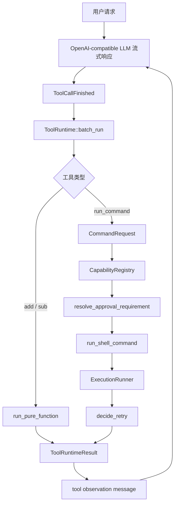
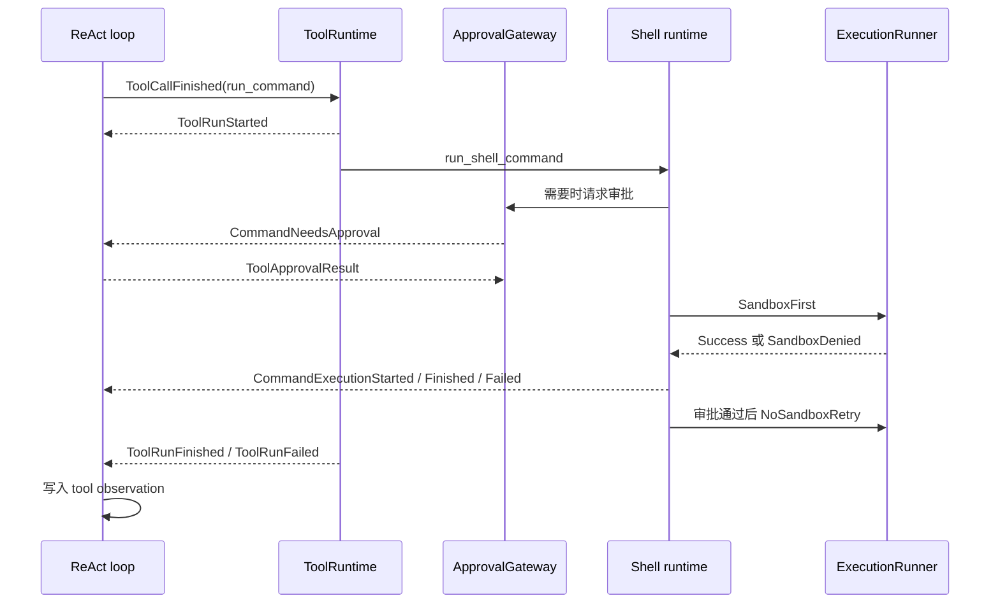
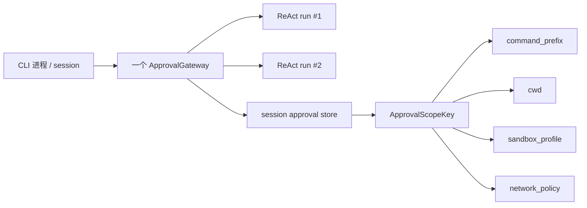

# Codex 工具与权限系统 Mini Demo

这个 demo 用一个最小 ReAct agent 验证 Codex 本地命令执行链路的核心不变量：

```text
工具调用
  -> 能力匹配
  -> 审批需求
  -> 沙箱优先执行
  -> 受控重试
  -> 可观察事件
  -> 工具结果回灌给 LLM
```

Phase 1 不做真实 OS sandbox，也不做完整 CLI UI。它用 `SimulatedExecutionRunner` 跑通权限、沙箱、重试、事件和 observation 回灌，目标是让设计可解释、可测试、可迁移。

## 这个 Demo 证明什么

- 模型只能请求 `run_command`，不能直接指定 capability、cwd、sandbox 或 network policy。
- Host 侧用 `CapabilityRegistry` 把命令映射到 `safe-read`、`safe-test`、`network-install`、`dangerous-shell`。
- `Allow` 只表示不用先问用户，不表示跳过 sandbox。
- `NeedsApproval` 必须带 `ApprovalScope`，scope 绑定 command prefix、cwd、sandbox、network 和 persistence。
- sandbox denied 不能自动裸跑，必须进入 retry gate。
- `ApprovalPersistence::Session` 只在当前 `ApprovalGateway` 生命周期内复用。
- 同一轮多个 tool calls 可以并发执行，失败和拒绝互不影响，observation 按原始 index 回灌。

## 架构



命令执行会对外透出事件：



## 能力策略

| 能力 | 命令前缀示例 | 初始决策 | 首次执行 | 网络策略 | sandbox denied 后重试 |
| --- | --- | --- | --- | --- | --- |
| `safe-read` | `cat`, `ls` | `Allow` | `ReadOnly` sandbox | `Deny` | `Never` |
| `safe-test` | `npm test` | `Allow` | `WorkspaceWrite` sandbox | `Deny` | `WithApproval` |
| `network-install` | `npm install` | `Prompt` | `WorkspaceWrite` sandbox | `Prompt` | `WithApproval` |
| `dangerous-shell` | `curl | sh` | `Forbidden` | 不执行 | `Deny` | `Never` |

## 审批 Session 范围

`ApprovalGateway` 按 CLI 进程 / CLI session 初始化一次，并被多个 ReAct runs 共享。



`ApprovalScopeKey` 故意不包含 `session_id`：在这个 local CLI demo 中，`ApprovalGateway` 的生命周期就是 session 边界。如果未来变成云端或共享服务，需要增加外层命名空间，例如 `user_id / session_id / workspace_id`，或者把 store 拆成 per-session store。

复用规则：

- `Approved(Session)` 写入 store。
- `Approved(Once)` 不写入 store。
- `Rejected` 不写入 store。
- 相同 command prefix、cwd、sandbox、network 可以复用。
- cwd、sandbox、network 任一变化都必须重新审批。

## 运行 Demo

进入 demo 目录：

```bash
cd workspaces/02-learning/openai-codex-cli-deep-learning/topics/tools-permissions/demo
cargo test
```

预期结果：

```text
72 passed; 0 failed; 3 ignored
```

默认测试是确定性的，不会调用外部 API。

## 真实 LLM 冒烟测试

真实 LLM 测试通过 `OpenAiCompatibleLlm` 调用 DeepSeek 的 OpenAI-compatible Chat Completions API。

先设置 API key：

```bash
export DEEPSEEK_API_KEY="..."
```

运行完整 ReAct 冒烟测试：

```bash
cargo test react_agent_should_work -- --ignored --nocapture
```

这个测试验证：

- 真实 OpenAI-compatible streaming 可以工作。
- 模型可以在同一轮输出多个 tool calls。
- `run_command` 会走 `SimulatedExecutionRunner`。
- command execution events 会被流式透出。
- tool results 会作为 observations 回灌给模型。
- 模型可以继续发起后续 tool call，并给出最终回答。

最近一次验证过的 trace 形态：

```text
run_command("cat package.json")
add(999, 666)
sub(321, 123)
  -> observations 回灌
add(1665, 198)
  -> final answer: 1863
```

更底层的 OpenAI-compatible 冒烟测试：

```bash
cargo test openai_compatible_llm_should_work -- --ignored --nocapture
cargo test run_stream -- --ignored --nocapture
```

## 关键测试覆盖

运行全部确定性测试：

```bash
cargo test
```

常用聚焦测试：

```bash
cargo test approval_gateway
cargo test session_approval
cargo test run_command_network_install_should_finish_after_retry
cargo test react_agent_should_reuse_session_approval_across_runs
cargo test batch_run_should_surface_all_approval_requests_before_any_is_approved
```

最重要的行为门槛：

- safe read 不需要审批，但仍在 sandbox 内执行。
- dangerous shell 在执行前被拒绝。
- network install 先请求审批，在 sandbox 内失败后，再经过审批执行 no-sandbox retry。
- command failure 不进入 retry。
- `RetryPolicy::Never` 会阻止 sandbox denied 后的 retry。
- session approval 只在相同 `ApprovalScopeKey` 下复用。
- 同一轮多个 tool calls 独立执行，互不拖累。

## 当前 Phase 1 边界

已经实现：

- OpenAI-compatible streaming client。
- 用于单测的 deterministic fake LLM。
- 带 max-turn guard 的 ReAct loop。
- 纯函数工具：`add`、`sub`。
- 命令工具：`run_command`。
- capability registry。
- approval requirement 和 approval gateway。
- session approval persistence。
- simulated sandbox runner。
- retry gate。
- command 和 tool lifecycle events。
- tool observation feedback。

Phase 1 暂不实现：

- 真实 OS sandbox。
- 复杂 shell 命令 parser。
- 多 command segment 的 policy composition。
- 面向真人审批的 CLI UI。
- 持久化 approval policy 文件。
- host-level network approval。
- MCP 或插件化 tool registry。

## Phase 2 方向

Phase 2 应该只替换 runner：

```text
SimulatedExecutionRunner -> OsExecutionRunner
```

这些契约应保持稳定：

- `CommandRequest`
- `ApprovalRequirement`
- `ApprovalScope`
- `RetryDecision`
- `StreamEvent`
- `ToolRuntime`
- `run_shell_command`

目标是在不重写 approval / retry / event model 的前提下，让 demo 从“可解释模型”走向“可用工具”。如果 `OsExecutionRunner` 需要平台相关处理，应该藏在 `ExecutionRunner` 后面，并把平台错误映射回统一的 `ExecutionFailure`。

## 迁移提醒

把这个设计迁移到业务 Agent 前，需要重新审视这些 trade-off：

- Session approval 改善体验，但会扩大一次点击的影响范围。
- No-sandbox retry 在更严格的环境中可能不可接受。
- Prefix matching 易解释，但不足以安全处理复杂 shell 语法。
- Simulated sandbox 很适合测试状态机，但不能证明 OS 隔离能力。
- 多工具独立执行更利于一次性纠错，但可能比 fail-fast 消耗更多资源。

真正可迁移的不是某几个 enum，而是这组分离：

```text
模型意图
  != host capability
  != approval requirement
  != execution attempt
  != retry decision
  != observable event
```
