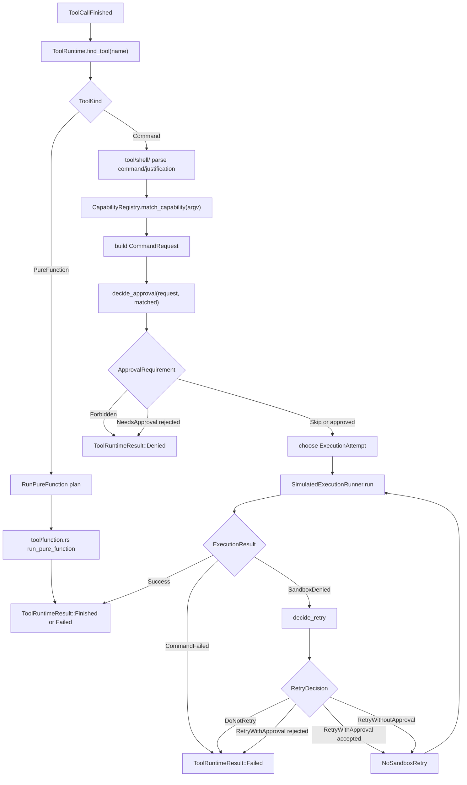

# Tool Runtime Data Relationships

> Status: historical design guide. `ToolRuntime` pure function path and `run_command` command path have both been implemented and tested. Current closeout and next slices are tracked in [`06-slice-6-closeout-and-next-slices.md`](06-slice-6-closeout-and-next-slices.md).

这份 guide 基于当前最新代码结构，回答 Slice 6 的核心实现问题：

```rust
pub fn run(&self, call: &ToolCallFinished) -> ToolRuntimeResult
```

它解释 `ToolCallFinished`、tool module、`CapabilityDescriptor`、`ApprovalPolicy`、`ApprovalRequirement`、`CommandRequest` 和 runner/retry 之间的关系。

## Learning Navigation

- Final artifact: [`../../demo/README.md`](../../demo/README.md)
- Current stage: `08-demo-coder`
- Current slice: Slice 6 Agent Orchestrator
- Current code shape:
  - [`react.rs`](../../demo/src/agent/react.rs)：ReAct loop 和 message 回灌。
  - [`tool/mod.rs`](../../demo/src/tool/mod.rs)：tool module 入口。
  - [`tool/function.rs`](../../demo/src/tool/function.rs)：`add/sub` pure function tools。
  - [`tool/runtime.rs`](../../demo/src/tool/runtime.rs)：`ToolRuntime`。
  - [`tool/shell/`](../../demo/src/tool/shell)：`run_command` command tool 的内部实现模块。
- Current gap: 已完成。`run_command` command path 已进入 `CommandRequest -> ApprovalRequirement -> ExecutionRunner -> RetryDecision`，当前规划见 `06-slice-6-closeout-and-next-slices.md`。

## First Principle

`ToolCallFinished` 只是模型输出的“工具调用请求”。它还不是可执行计划，也不能直接等价为 command capability。

正确分层应该是：

```text
ToolCallFinished
  -> ToolRuntime finds tool by name
  -> ToolRuntime builds a plan by tool kind
  -> ToolRuntime executes the plan
  -> ToolRuntimeResult becomes event + role=tool observation
```

关键原因：

```text
add/sub
  -> pure function tool
  -> no argv/cwd/sandbox/network

run_command
  -> command tool
  -> needs argv/cwd/capability/approval/sandbox/retry

future MCP
  -> external tool
  -> may need approval, but not necessarily local command sandbox
```

所以不要让 `call.name` 直接映射到 `CapabilityDescriptor`。先映射到 tool definition，再由 command tool path 去匹配 command capability。

## Current Module Responsibilities

### `agent/react.rs`

`react.rs` 的职责是 agent turn orchestration：

```text
LLM stream
  -> collect ToolCallFinished
  -> append assistant tool_calls message
  -> execute tool calls
  -> append role=tool observations
  -> next LLM turn
```

它不应该长期知道 approval、sandbox、retry 的细节。

已完成的短期目标是：

```text
react.rs
  -> ToolRuntime::run(call)
```

已完成的后续目标是：

```text
react.rs
  -> ToolRuntime::run(call)
  -> command path: approval / sandbox / retry
```

### `tool/function.rs`

`function.rs` 只负责 pure function tools：

```text
add
sub
run_pure_function(name, arguments)
tool specs generated by openai_tool
```

这里不应该引入 `CommandRequest`。`add/sub` 已经进入统一 runtime，但它们进入的是 pure function path。

### `tool/runtime.rs`

`runtime.rs` 是 Slice 6 的 tool execution 边界。

它应该成为这几类逻辑的边界：

```text
find tool
plan call
execute pure function
execute command tool
map result to event/observation
```

当前已经接入 pure function path 和 command path；后续 hardening 不应继续堆在 `ToolRuntime`，而应下沉到 shell policy / event protocol。

### `tool/shell/`

`tool/shell/` 是 `run_command` command tool 的内部实现模块。

它应该逐步承担：

```text
parse run_command tool arguments
derive argv from command
use runtime cwd
match CapabilityRegistry
build CommandRequest
```

真正的 approval/sandbox/retry orchestration 可以先放在 `ToolRuntime`，等逻辑稳定后再决定是否拆出 command-specific helper。

## Existing Type Meanings

### `CapabilityDescriptor`

`CapabilityDescriptor` 是 command capability，不是通用 tool capability。

适合描述：

```text
cat package.json
npm test
npm install vite
curl ... | sh
```

它回答：

```text
这条本地命令属于哪类能力？
默认允许、询问还是禁止？
首次 sandbox 应该是什么？
网络策略是什么？
失败后 retry 策略是什么？
```

它只应该出现在 command tool path，也就是 `run_command` 这条路径。

### `ApprovalPolicy`

`ApprovalPolicy` 是 runtime 全局交互策略，不是工具能力。

它回答：

```text
当前运行模式能不能问用户？
```

例如：

```text
Never
  -> 需要审批时 fail closed

OnFailure
  -> sandbox denied 后可以考虑请求 no-sandbox retry

OnRequest
  -> 只有明确请求提权时才问用户
```

因此它应该来自 runtime context，而不是来自 `ToolCallFinished` 或 tool definition。

### `ApprovalRequirement`

`ApprovalRequirement` 是一次调用的判断结果。

它回答：

```text
这一次具体 command call 应该 skip、ask，还是 forbidden？
```

它通常由：

```text
CommandRequest
+ MatchedCapability
+ runtime approval policy
-> ApprovalRequirement
```

所以它不应该预先绑定在 tool definition 上。

## Suggested Runtime Types

当前 `tool/runtime.rs` 已经承接 pure function path 和 `run_command` command path。`add/sub` 保持 pure function，不改造成 command。

```rust
pub struct ToolRuntime {
    context: ToolRuntimeContext,
}

pub struct ToolRuntimeContext {
    pub cwd: PathBuf,
    pub approval_policy: ApprovalPolicy,
    pub registry: CapabilityRegistry,
    pub execution_runner: Arc<dyn ExecutionRunner + Send + Sync + 'static>,
    pub approval_decider: Arc<dyn ApprovalDecider + Send + Sync + 'static>,
}

pub enum ToolKind {
    PureFunction,
    Command,
}

pub struct ToolDefinition {
    pub name: &'static str,
    pub kind: ToolKind,
}
```

`ToolDefinition` 回答：

```text
这个工具名是否已注册？
它是哪类工具？
```

不要让 `ToolDefinition` 直接存 `ApprovalRequirement`。

## Suggested Plans

`run(call)` 可以先把调用变成 plan：

```rust
enum ToolRuntimePlan {
    RunPureFunction {
        name: String,
        arguments: String,
    },
    RunCommand {
        request: CommandRequest,
        matched_capability: MatchedCapability,
    },
    Fail {
        error: String,
    },
}
```

这样 `run` 不会变成一整坨状态机。当前设计里 `ToolRuntimePlan` 只表达“准备如何执行”，不表达安全拒绝结果：

```text
RunPureFunction = 已识别为 pure function tool
RunCommand      = 已识别为 command tool，并已构造 CommandRequest
Fail            = tool arguments / command request 不合法，没能形成有效计划
```

`Denied` 应该出现在执行结果层，而不是 plan 层：

```text
capability matched but approval decision is Forbidden
  -> RunCommandResult::Denied

user rejects approval / retry approval
  -> RunCommandResult::Denied

previous tool caused hard denial, later calls are not attempted
  -> ToolRuntimeResult::Skipped
```

如果以后希望 unknown command 展示成 denied，不要重新加 `ToolRuntimePlan::Deny`；更好的方式是在 registry 层显式匹配到 `unsupported` / `dangerous-shell` capability，再由 approval policy 产出 `Denied`。

```rust
impl ToolRuntime {
    pub fn run(&self, call: &ToolCallFinished) -> ToolRuntimeResult {
        let definition = self.find_tool(&call.name)?;
        let plan = self.plan_call(definition, call)?;
        self.execute_plan(plan)
    }
}
```

拆分建议：

```text
find_tool(name)
plan_call(definition, call)
plan_command_call(call)
execute_plan(plan)
execute_command(request, matched)
execute_command_attempt(request, attempt)
maybe_retry(request, failure, scope)
```

## Data Flow



## ToolRuntimeResult Shape

`ToolRuntimeResult` 需要同时服务两个消费者：

1. `StreamEvent`
2. 下一轮 LLM 的 `role=tool` observation

因此不要只返回 `String`。

候选结构：

```rust
pub enum ToolRuntimeResult {
    Finished {
        output: String,
    },
    Failed {
        error: String,
    },
    Denied {
        reason: String,
    },
    Skipped {
        reason: String,
    },
}
```

映射：

```text
Finished
  -> ToolRunFinished
  -> role=tool content = output

Failed
  -> ToolRunFailed
  -> role=tool content = tool failed: ...

Denied
  -> ToolRunFailed or future ToolRunDenied
  -> role=tool content = tool denied: ...

Skipped
  -> ToolRunFailed or future ToolRunSkipped
  -> role=tool content = tool skipped: ...
```

Phase 1 可以暂时不新增 `ToolRunDenied` / `ToolRunSkipped`，但 `ToolRuntimeResult` 内部最好先区分语义。

## Answer To The Current Question

> tool 要绑定哪个权限类型？`CapabilityDescriptor`、`ApprovalPolicy` 还是 `ApprovalRequirement`？

都不是直接绑定。

更准确是：

```text
ToolDefinition
  -> 绑定 ToolKind

Command ToolDefinition
  -> 运行时根据 argv 匹配 CapabilityDescriptor

ApprovalPolicy
  -> 来自 ToolRuntimeContext

ApprovalRequirement
  -> 来自 decide_approval 的一次性输出
```

一句话：

```text
tool 绑定工具类型；
command tool 在运行时绑定 command capability；
approval requirement 是当前上下文算出来的执行决定。
```

## Minimal Next Step

历史实现顺序是先完成三个最小闭环：

1. `ToolRuntime` 能识别 `add/sub`，并通过 `tool/function.rs` 执行。
2. 未知 tool 返回 `Denied` 或 `Failed`，不 panic。
3. `run_command` tool 能 parse 出 command/justification，派生 argv，并通过 `CapabilityRegistry` 得到 `MatchedCapability`。

这三个小闭环已经通过，并已接入：

```text
decide_approval
  -> SimulatedExecutionRunner
  -> decide_retry
```
