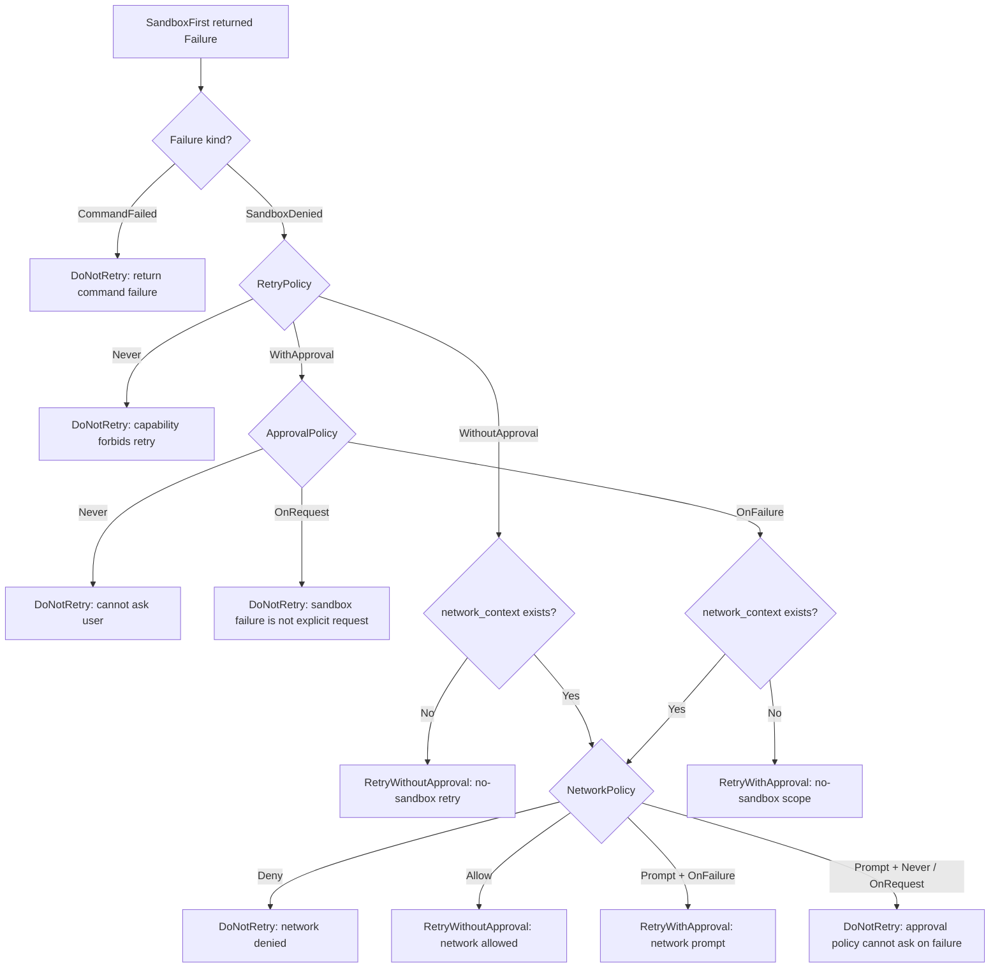

# Slice 7 Policy Composition

## Learning Navigation

- Final artifact: `demo/README.md` and event trace explanation
- Current stage: `08-demo-coder`
- Current slice: Slice 7 completed
- Current gap: make `RetryPolicy`, `ApprovalPolicy`, and `NetworkPolicy` readable as one decision system
- Evidence needed: `tool/shell/retry.rs`, `tool/shell/mod.rs`, and Slice 7 tests
- After this: Slice 8 can expose the same decisions as agent events

## Core Idea

Slice 7 的关键不是多加一个枚举判断，而是把三个问题分层：

| Policy | 它回答的问题 | 不回答的问题 |
| --- | --- | --- |
| `RetryPolicy` | 这个 capability 在 sandbox denied 后有没有 retry 资格？ | 当前运行模式能不能问用户 |
| `ApprovalPolicy` | 当前运行模式允不允许因为失败去问用户？ | 这个 capability 本身是否值得 retry |
| `NetworkPolicy` | 这次失败如果涉及网络，网络能不能放行或询问？ | 非网络 sandbox denied 是否可 retry |

所以组合顺序是：

```text
failure kind
  -> capability-level RetryPolicy
  -> global ApprovalPolicy
  -> request-level NetworkPolicy when network context exists
```

## Full Retry Gate



## Why `OnRequest` Does Not Retry After Sandbox Failure

`ApprovalPolicy::OnRequest` 只表示：初始 tool/capability 明确要求审批时，可以问用户。

它不表示：运行中遇到 sandbox denied 后，可以自动再问一次 no-sandbox retry。

这条边界很重要：

```text
OnRequest
  -> initial capability prompt can ask
  -> sandbox failure escalation cannot ask automatically

OnFailure
  -> sandbox failure can ask for no-sandbox retry
```

当前 demo 还没有建模 `requested_escalation` 或 `require_no_sandbox`，所以 `OnRequest` 的完整语义被记录为后续 hardening。

## Test Map

| Decision branch | Representative test |
| --- | --- |
| `CommandFailed -> DoNotRetry` | `command_failed_does_not_retry` |
| `already_retried -> DoNotRetry` | `already_retried_does_not_retry_again` |
| `RetryPolicy::Never -> DoNotRetry` | `safe_read_retry_policy_never_does_not_retry_after_sandbox_denied` |
| `RetryPolicy::Never` wired through registry/runtime | `safe_read_sandbox_denied_does_not_retry_because_capability_retry_policy_is_never` |
| `WithApproval + OnFailure + no network -> RetryWithApproval` | `sandbox_denied_without_network_retries_with_no_sandbox_approval` |
| `WithApproval + OnRequest -> DoNotRetry` | `sandbox_denied_with_on_request_policy_does_not_auto_retry` |
| `NetworkPolicy::Prompt + OnFailure -> RetryWithApproval` | `sandbox_denied_with_network_prompt_retries_with_no_sandbox_approval` |
| `NetworkPolicy::Deny -> DoNotRetry` | `sandbox_denied_with_network_deny_does_not_retry` |
| `WithoutApproval + non-network -> RetryWithoutApproval` | `retry_policy_without_approval_allows_direct_retry_for_non_network_sandbox_denial` |
| `WithoutApproval` does not bypass network deny | `retry_policy_without_approval_does_not_override_network_deny` |

## Reading Rule

When the retry path feels confusing, ask these questions in order:

1. Did the command itself fail, or did the sandbox deny it?
2. Does this capability allow retry at all?
3. If retry needs approval, does the global approval mode allow asking because of failure?
4. If the failure has network context, does the network policy allow, deny, or prompt?
5. If retry happens, is the approval scope changed to `SandboxProfile::NoSandbox`?

This prevents treating `ApprovalPolicy::OnFailure` as a universal retry permission, and prevents treating `RetryPolicy::WithoutApproval` as a way to bypass network policy.
