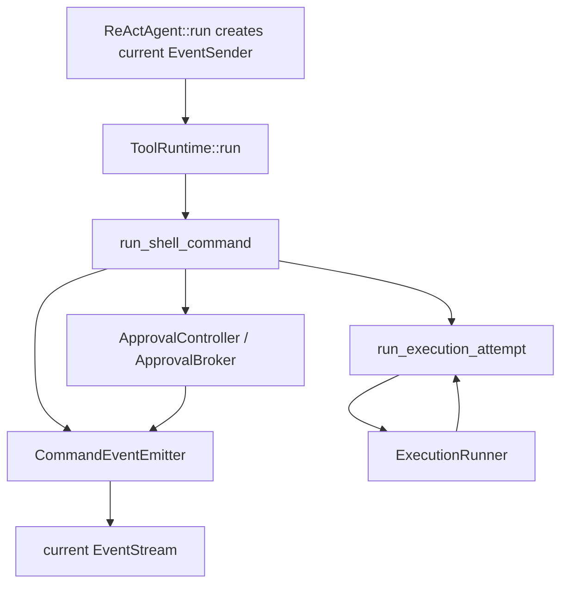

# Slice 8 Command Event Emitter Refactor

## Learning Navigation

- Final artifact: [`../../demo/README.md`](../../demo/README.md) 中的可解释 command event trace。
- Current stage: `08-demo-coder`
- Current slice: Slice 8 Event Protocol Hardening
- Current gap: command 事件已经能透出，但事件发送分散，且 approval request sender 不是 run-scoped。
- Paired note: [`../../notes/08-demo-coder/06-slice-8-event-outlet-review.md`](../../notes/08-demo-coder/06-slice-8-event-outlet-review.md)
- After this: Slice 8 可以用稳定 trace tests 收口，再进入 multi-tool hard-deny / skipped semantics。

## North Star

把事件透出从“到处手写 `tx.send(StreamEvent::...)`”改成：

```text
run_shell_command
  -> policy / approval / retry control flow
  -> CommandEventEmitter emits command-level observation
  -> ExecutionRunner only runs attempts
```

目标不是引入复杂框架，而是把横切事件协议集中到一个小边界里。

## Target Shape

### 1. Add `CommandEventEmitter`

它应该持有当前 run 的 event sender 和当前 tool call context：

```rust
pub struct CommandEventEmitter<'a> {
    tx: &'a EventSender,
    context: ToolCallContext,
}
```

建议先提供这些领域方法：

```rust
impl CommandEventEmitter<'_> {
    async fn needs_approval(
        &self,
        approval_id: String,
        reason: String,
        scope: ApprovalScope,
    ) -> anyhow::Result<()>;

    async fn execution_started(&self, attempt: &ExecutionAttempt) -> anyhow::Result<()>;

    async fn execution_finished(
        &self,
        attempt: &ExecutionAttempt,
        output: String,
    ) -> anyhow::Result<()>;

    async fn execution_failed(
        &self,
        attempt: &ExecutionAttempt,
        error: String,
    ) -> anyhow::Result<()>;

    async fn retry_evaluated(&self, decision: &RetryDecision) -> anyhow::Result<()>;
}
```

这样 `index / call_id / name` 只在 emitter 内部填一次。

### 2. Wrap one execution attempt

新增一个 helper 专门保证 attempt event lifecycle：

```rust
async fn run_execution_attempt(
    request: &CommandRequest,
    attempt: ExecutionAttempt,
    runner: &dyn ExecutionRunner,
    events: &CommandEventEmitter<'_>,
) -> anyhow::Result<ExecutionResult> {
    events.execution_started(&attempt).await?;
    let result = runner.run(request, &attempt);

    match &result {
        ExecutionResult::Success { stdout } => {
            events.execution_finished(&attempt, stdout.clone()).await?;
        }
        ExecutionResult::Failure(failure) => {
            events.execution_failed(&attempt, render_failure(failure)).await?;
        }
    }

    Ok(result)
}
```

它保护一个关键不变量：

```text
Started(attempt)
  -> Finished(attempt) or Failed(attempt)
```

`run_sandbox_first_flow` 之后不再自己散落发送 started / failed / finished。

### 3. Make approval request run-scoped

不要让 `ApprovalBroker` 长期持有外部 stream sender。

推荐当前 slice 的最小改法：

```rust
#[async_trait]
pub trait ApprovalController: Send + Sync {
    async fn request_approval(
        &self,
        req: ToolApprovalRequest,
        events: &CommandEventEmitter<'_>,
    ) -> UserApprovalDecision;
}
```

`ApprovalBroker` 仍然可以负责：

- 生成 `approval_id`
- 建立 pending oneshot
- 等待 `ToolApprovalResult`

但 `CommandNeedsApproval` 应通过当前 run 的 `CommandEventEmitter` 发出。这样外部消费者从 `agent.run()` 返回的 stream 里一定能看到审批请求。

如果 `events.needs_approval(...)` 发送失败，当前 demo 建议 fail closed：

```text
remove pending approval
return Rejected
```

不要 panic，也不要继续执行命令。

## Refactor Order

### Step 1: Extract emitter without changing behavior

先只把重复的 event construction 搬进 `CommandEventEmitter`，保持现有测试通过。

验收：

```text
cargo test --manifest-path workspaces/02-learning/openai-codex-cli-deep-learning/topics/tools-permissions/demo/Cargo.toml
```

### Step 2: Introduce `run_execution_attempt`

把 `SandboxFirst`、`NoSandboxFirst`、`NoSandboxRetry` 都改成通过同一个 helper 执行。

这一步要改测试期望：retry 成功路径应该包含 `CommandExecutionFailed(SandboxFirst)`。

最重要的新测试：

```text
network install retry success trace:
  CommandExecutionStarted(SandboxFirst)
  CommandExecutionFailed(SandboxFirst)
  CommandRetryEvaluated(RetryWithApproval or RetryWithoutApproval)
  CommandExecutionStarted(NoSandboxRetry)
  CommandExecutionFinished(NoSandboxRetry)
```

### Step 3: Move approval event emission to current run

让 `ApprovalBroker` 不再持有 `EventSender`，而是通过 `CommandEventEmitter` 发出 `CommandNeedsApproval`。

验收场景：

```text
agent.run(...)
  -> returned EventStream contains CommandNeedsApproval
  -> test / UI sends ToolApprovalResult with same approval_id
  -> run_shell_command continues or denies
```

### Step 4: Keep ReAct layer focused

`react.rs` 继续只负责：

- `ToolCallFinished`
- `ToolRunStarted`
- `ToolRunFinished`
- `ToolRunFailed`
- tool observation 回灌

它不应该理解 command attempt、retry policy、sandbox profile 的细节。

## Mermaid Sketch



## Tests To Add Or Adjust

- Approval request appears in the same `EventStream` returned by `agent.run()`.
- Approval event send failure fails closed instead of panicking.
- Sandbox retry success closes `SandboxFirst` with `CommandExecutionFailed`.
- Safe read success still emits exactly one `SandboxFirst` started / finished pair.
- Dangerous shell denied still does not run execution attempts.

## Stop Rules

- 不引入宏来隐藏事件发送。
- 不让 `ExecutionRunner` 直接知道 `StreamEvent`。
- 不把 `ToolApprovalResult` 加回外部 `StreamEvent`。
- 不在本 slice 处理 session approval persistence。
- 不在本 slice 处理 multi-tool hard-deny / skipped propagation。
