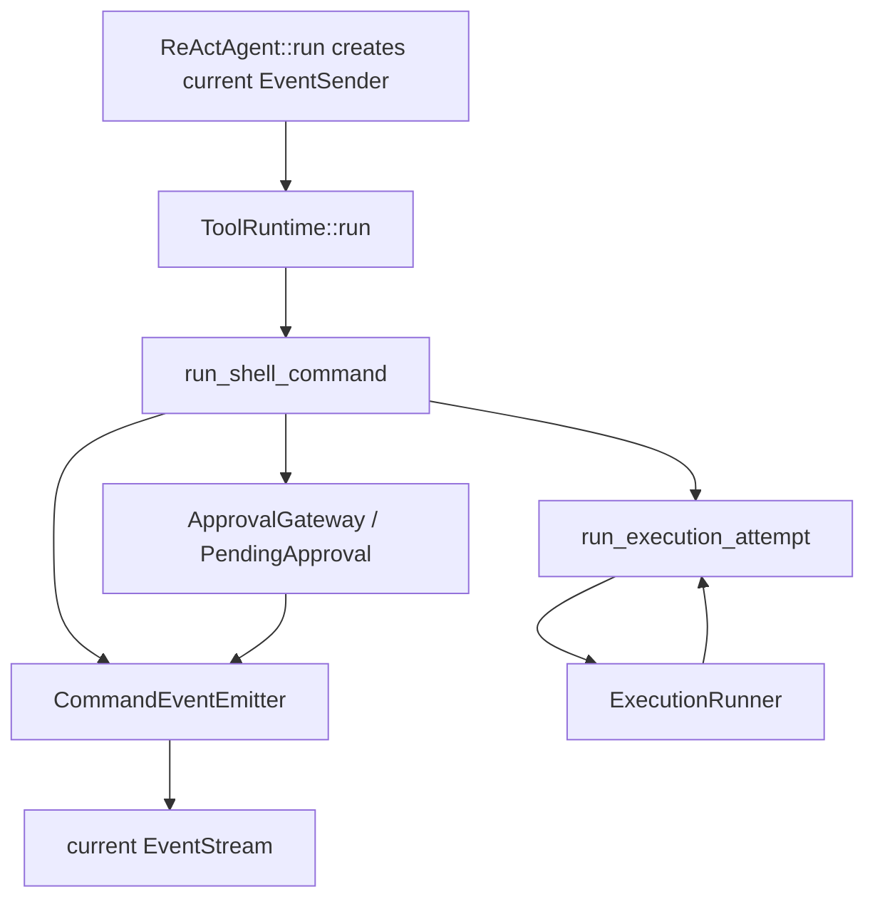

# Slice 8 Command Event Emitter Refactor

## Learning Navigation

- Final artifact: [`../../demo/README.md`](../../demo/README.md) 中的可解释 command event trace。
- Current stage: `08-demo-coder`
- Current slice: Slice 8 Event Protocol Hardening
- Current gap: 已完成。command 事件已经能透出，approval request 已通过当前 run stream 发送，`CommandEventEmitter` 已抽取，`run_execution_attempt` 已集中保护 attempt lifecycle。
- Paired note: [`../../notes/08-demo-coder/06-slice-8-event-outlet-review.md`](../../notes/08-demo-coder/06-slice-8-event-outlet-review.md)
- After this: Slice 8 已可以收口；下一步进入 multi-tool hard-deny / skipped semantics。

## North Star

把事件透出从“到处手写 `tx.send(StreamEvent::...)`”改成：

```text
run_shell_command
  -> policy / approval / retry control flow
  -> CommandEventEmitter emits command-level observation
  -> ExecutionRunner only runs attempts
```

目标不是引入复杂框架，而是把横切事件协议集中到一个小边界里。

## Target Shape

### 1. Add `CommandEventEmitter`

它已经持有当前 run 的 event sender clone 和当前 tool call context：

```rust
pub struct CommandEventEmitter {
    tx: EventSender,
    context: ToolCallContext,
}
```

当前先提供这些领域方法：

```rust
impl CommandEventEmitter {
    async fn needs_approval(
        &self,
        approval_id: String,
        reason: String,
        scope: ApprovalScope,
    ) -> anyhow::Result<()>;

    async fn execution_started(&self, attempt: &ExecutionAttempt);

    async fn execution_finished(
        &self,
        attempt: &ExecutionAttempt,
        output: String,
    );

    async fn execution_failed(
        &self,
        attempt: &ExecutionAttempt,
        error: String,
    );

    async fn retry_evaluated(&self, decision: RetryDecision);
}
```

这样 `index / call_id / name` 只在 emitter 内部填一次。

### 2. Wrap one execution attempt

新增一个 helper 专门保证 attempt event lifecycle：

```rust
async fn run_execution_attempt(
    request: &CommandRequest,
    attempt: ExecutionAttempt,
    runner: &dyn ExecutionRunner,
    events: &CommandEventEmitter,
) -> anyhow::Result<ExecutionResult> {
    events.execution_started(&attempt).await;
    let result = runner.run(request, &attempt);

    match &result {
        ExecutionResult::Success { stdout } => {
            events.execution_finished(&attempt, stdout.clone()).await;
        }
        ExecutionResult::Failure(failure) => {
            events.execution_failed(&attempt, render_failure(failure)).await;
        }
    }

    Ok(result)
}
```

它保护一个关键不变量：

```text
Started(attempt)
  -> Finished(attempt) or Failed(attempt)
```

`run_sandbox_first_flow` 之后不再自己散落发送 started / failed / finished。

### 3. Keep approval request run-scoped

当前代码已经不再让 approval gateway 长期持有外部 stream sender。

当前形态应保持为：

```text
ApprovalGateway
  -> create_pending_approval(request)
  -> wait ToolApprovalResult by approval_id

run_shell_command
  -> emit CommandNeedsApproval through current run EventSender
  -> await PendingApproval
```

`ApprovalGateway` 负责：

- 生成 `approval_id`
- 建立 pending oneshot
- 等待 `ToolApprovalResult`

但 `CommandNeedsApproval` 继续由当前 run 发出。这样外部消费者从 `agent.run()` 返回的 stream 里一定能看到审批请求。

如果发送 `CommandNeedsApproval` 失败，当前 demo 已选择 fail closed：

```text
remove pending approval
return Rejected
```

不要 panic，也不要继续执行命令。

## Refactor Order

### Step 1: Extract emitter without changing behavior

状态：已完成。重复的 event construction 已搬进 `CommandEventEmitter`，现有测试保持通过。

验收：

```text
cargo test --manifest-path workspaces/02-learning/openai-codex-cli-deep-learning/topics/tools-permissions/demo/Cargo.toml
```

### Step 2: Introduce `run_execution_attempt`

状态：已完成。`SandboxFirst`、`NoSandboxFirst`、`NoSandboxRetry` 都已经通过同一个 helper 执行。

这一步不需要改变当前测试期望；现有 retry 成功路径已经要求包含 `CommandExecutionFailed(SandboxFirst)`，重构后必须继续通过。

最重要的新测试：

```text
network install retry success trace:
  CommandExecutionStarted(SandboxFirst)
  CommandExecutionFailed(SandboxFirst)
  CommandRetryEvaluated(RetryWithApproval or RetryWithoutApproval)
  CommandExecutionStarted(NoSandboxRetry)
  CommandExecutionFinished(NoSandboxRetry)
```

### Step 3: Preserve approval event emission in current run

这一步已经完成：`ApprovalGateway` 不持有 `EventSender`，`run_shell_command` 使用当前 run 的 sender 发出 `CommandNeedsApproval`。

如果继续引入 `CommandEventEmitter`，只需要把现有发送逻辑从 `request_approval(...)` 迁移到：

```text
events.needs_approval(...)
```

验收场景：

```text
agent.run(...)
  -> returned EventStream contains CommandNeedsApproval
  -> test / UI sends ToolApprovalResult with same approval_id
  -> run_shell_command continues or denies
```

### Step 4: Keep ReAct layer focused

`react.rs` 继续只负责：

- `ToolCallFinished`
- `ToolRunStarted`
- `ToolRunFinished`
- `ToolRunFailed`
- tool observation 回灌

它不应该理解 command attempt、retry policy、sandbox profile 的细节。

## Mermaid Sketch



## Tests To Add Or Adjust

- [x] Approval request appears in the same `EventStream` returned by `agent.run()`.
- [x] Approval event send failure fails closed instead of panicking.
- [x] Sandbox retry success closes `SandboxFirst` with `CommandExecutionFailed`.
- [x] Safe read success still emits exactly one `SandboxFirst` started / finished pair.
- [x] Dangerous shell denied still does not run execution attempts.
- [x] 引入 `CommandEventEmitter` 后，现有 trace tests 仍全部通过。

## Stop Rules

- 不引入宏来隐藏事件发送。
- 不让 `ExecutionRunner` 直接知道 `StreamEvent`。
- 不把 `ToolApprovalResult` 加回外部 `StreamEvent`。
- 不在本 slice 处理 session approval persistence。
- 不在本 slice 处理 multi-tool hard-deny / skipped propagation。
