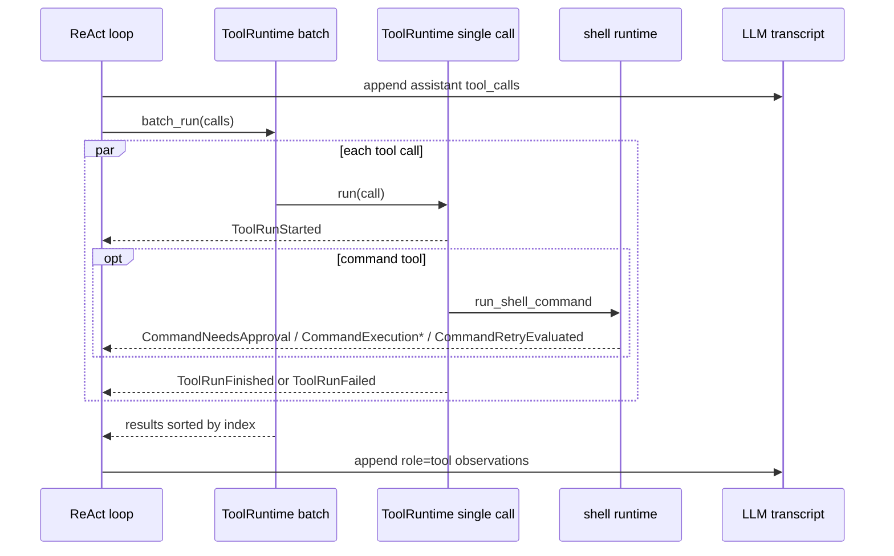

# Slice 9 Multi-Tool Independent Execution

## Learning Navigation

- Final artifact: `demo/README.md`
- Current stage: `08-demo-coder`
- Current slice: Slice 9 Multi-Tool Independent Execution
- Current status: implemented and verified
- After this: enter Slice 10 approval persistence, or write `demo/README.md` traces for multi-tool execution.

## North Star

同一轮多个 tool calls 应该独立执行、完整回传、稳定写回：

```text
LLM emits multiple tool_calls
  -> each call runs through ToolRuntime independently
  -> success / failure / denial stay local to that call
  -> every call returns a tool observation
  -> observations are appended by original index
```

## Current Implementation

- `agent/react.rs`
  - 收集当前 turn 的 `ToolCallFinished`。
  - 将 assistant `tool_calls` message 写入 transcript。
  - 调用 `ToolRuntime::batch_run`。
  - 把返回结果转成下一轮 LLM 可见的 `role=tool` messages。

- `tool/runtime.rs`
  - `batch_run` 按 `index` 排序 calls。
  - 每个 call 用 `tokio::spawn` 独立执行。
  - `JoinError` 映射为当前 call 的 `ToolRuntimeResult::Failed`。
  - 返回结果保持 index 顺序。

- `tool/event_emitter.rs`
  - 单 call 开始时发 `ToolRunStarted`。
  - `Finished` 发 `ToolRunFinished`。
  - `Failed` 和 `Denied` 发 `ToolRunFailed`。

## Event And Observation Contract



要点：

- event 顺序服务外部观察者，反映真实执行生命周期。
- observation 顺序服务模型输入，必须稳定按 index 写回。
- 不要用 `ToolRunStarted` 的出现顺序断言 index 顺序；并发调度下它不是稳定契约。

## Acceptance

- 同批 `add/sub` 都执行并回灌。
- 同批 success / failed / denied 都有 observation。
- 一个 tool call 失败不会阻止其他 call。
- `ToolRuntimeResult::Skipped` 不存在；当前没有 batch-level hard stop。
- approval-blocked tools 能并发进入 pending approval，而不是第一个卡住后才启动第二个。
- demo tests 通过：65 passed，3 ignored。

## Stop Rules

- 不在 Slice 9 实现 approval persistence。
- 不在 Slice 9 接真实 OS sandbox。
- 不在 Slice 9 做多命令 shell parser。
- 不提前设计复杂 scheduler；等出现 `supports_parallel`、限流、取消或优先级需求时再升级。

## Tokio Reference

并发调度原理见 [`11-tokio-runtime-scheduling.md`](11-tokio-runtime-scheduling.md)。当前实现使用 `tokio::spawn`，因为 batch task 需要独立推进并能在审批 pending 时让其他 tool call 继续启动。
