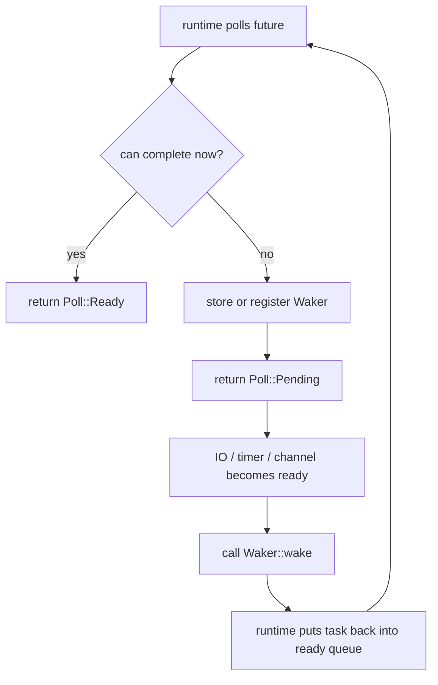
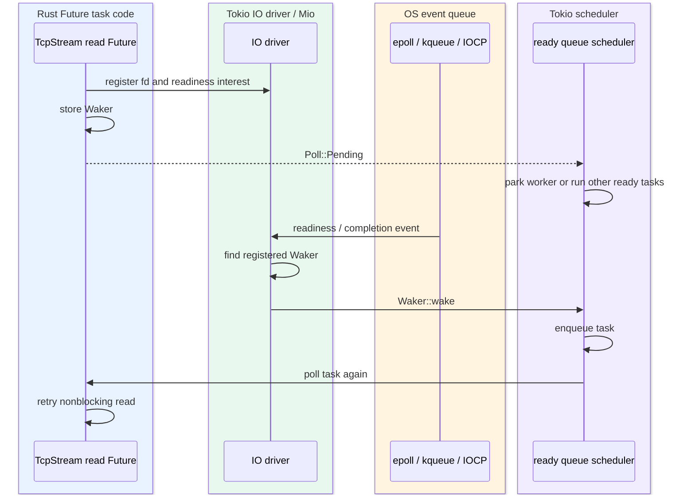
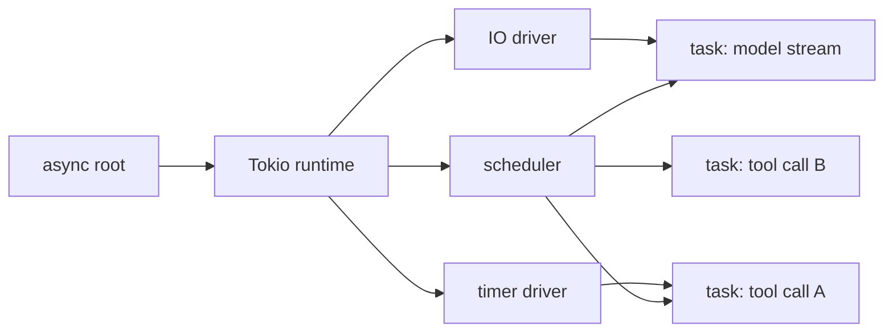
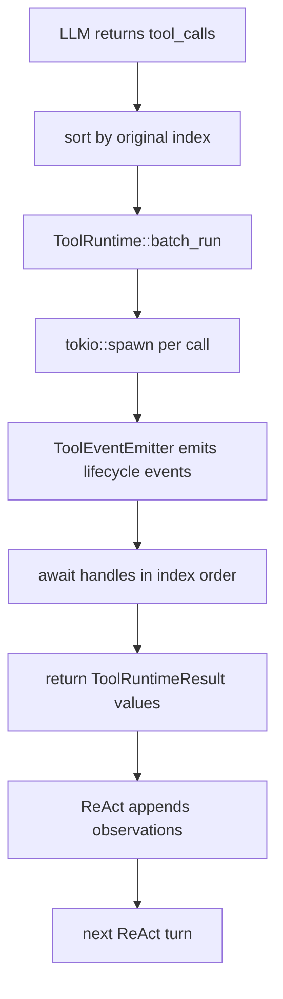

# Tokio Runtime Scheduling And Waiting

## Learning Navigation

- Final artifact: `demo/README.md`
- Current stage: `08-demo-coder`
- Current slice: Slice 9 Multi-Tool Independent Execution
- Read with: [`10-slice-9-multi-tool-independent-execution.md`](10-slice-9-multi-tool-independent-execution.md)
- Current decision: 同批 tool call 独立执行，全部收集结果，再按原始 index 回灌 observations。
- Goal: 理解 Tokio 的底层调度和等待语义，足够判断什么时候用 `join_all`、`join!`、`select!`、`FuturesUnordered`、`tokio::spawn`、`JoinSet`。

## Core Question

Slice 9 的问题不是“怎样写一个看起来异步的 loop”，而是：

```text
多个 tool call 同时开始后，
runtime 如何推进它们，
我们如何等待全部结果，
失败和取消如何影响其他 call，
最终如何把 completion order 转回 model 需要的 stable observation order。
```

这要求先把 Tokio 的几个层次拆开：

```text
Future::poll
  -> Waker
  -> OS / in-memory readiness source
  -> Tokio task
  -> runtime scheduler
  -> waiting combinators
  -> cancellation and error propagation
```

## 1. `async fn` 生成的是 `Future` 状态机

Rust 的 `async fn` 被调用时不会立刻执行完整函数体，而是返回一个匿名 `Future`。真正推进这个 future 的入口是 `Future::poll`：

```rust
pub trait Future {
    type Output;

    fn poll(
        self: std::pin::Pin<&mut Self>,
        cx: &mut std::task::Context<'_>,
    ) -> std::task::Poll<Self::Output>;
}
```

`poll` 只有两个合法结论：

```text
Poll::Ready(value)
  -> future 已经完成，value 是最终结果。

Poll::Pending
  -> future 当前不能完成，稍后需要再次 poll。
```

`async fn` 里的每个 `.await` 都会变成状态机里的一个暂停点。future 被 poll 时，会从当前状态继续跑，直到：

- 产生最终值，返回 `Ready`；
- 碰到还没完成的子 future，返回 `Pending`；
- panic；
- 被外部 drop，直接取消后续执行。

关键约束：

- `poll` 应该快速返回，不能长时间阻塞线程。
- future 返回 `Pending` 后，必须安排未来某个时刻唤醒自己，否则 executor 没理由再 poll 它。
- future 被 `Ready` 后，调用方通常不应继续 poll 它。

## 2. `Waker` 是 Pending Future 的重新入队协议

`poll` 参数里的 `Context` 持有一个 `Waker`。当 future 发现当前还不能完成时，需要保存或转交这个 waker，让资源就绪时可以调用 `wake`。

典型过程：



几个容易写错的点：

- 返回 `Pending` 但没有注册 waker，future 可能永远挂起。
- waker 被触发不代表结果一定 ready；再次 poll 时必须重新检查条件。
- Tokio 允许 spurious wakeup，也就是 task 可能在没有显式 wake 的情况下被 poll，所以 future 的 `poll` 必须是可重复检查的状态机。
- waker 只表达“请再 poll 一次”，不携带业务结果。

在我们的 demo 中，`ApprovalGateway` 如果等待用户审批，内部本质上依赖 channel future；channel receiver pending 时由 Tokio 注册 waker，sender 发消息后唤醒等待中的 task。

### `Waker` 和 OS 多路复用的关系

你的直觉是对的，但需要分层说清楚：

```text
Waker
  -> Rust async/executor 层的“重新 poll 我”协议

OS event queue
  -> 操作系统层的“这个 fd / handle 现在可读、可写或完成了”通知机制

Tokio IO driver / Mio
  -> 把 OS event queue 的 readiness/completion 事件映射成对应 task 的 wake
```

所以更准确的链路如下。图中用 Mermaid `sequenceDiagram` 表达跨层时序，用 `box` 区分职责边界。



不同操作系统的底层机制不一样：

| OS | 常见底层机制 | 模型 |
| --- | --- | --- |
| Linux / Android | `epoll` | readiness |
| macOS / BSD / iOS | `kqueue` | readiness + event filters |
| Windows | `IOCP` | completion |

Mio 给 Tokio 提供跨平台 IO event queue 抽象。对使用者来说通常看到的是“这个 socket 可读/可写了”，但 Windows 的 IOCP 底层更接近“某个异步 IO 操作完成了”。Mio/Tokio 会把这些平台差异收敛到 Rust async 能消费的 readiness/future 语义里。

这也解释了为什么 `Waker` 不能简单等同于 epoll：

- socket readiness 通常会经过 epoll/kqueue/IOCP。
- `tokio::sync::mpsc` / `oneshot` 的 wake 来自内存里的队列状态变化和原子操作，不需要 OS fd readiness。
- `tokio::time::sleep` 的 wake 来自 Tokio timer driver，不是每个 sleep 都对应一个独立 OS timer fd。
- `tokio::fs` 很多平台上会走 blocking thread pool，因为普通磁盘文件并不总能用 epoll/kqueue 以统一方式做真正异步 IO。
- `spawn_blocking` 的完成由 blocking worker 把结果送回 async task，也不是 epoll 事件。

因此可以把底层唤醒来源分成四类：

```text
IO readiness/completion
  -> epoll / kqueue / IOCP
  -> socket, pipe, 部分 process/signal integration

timer readiness
  -> Tokio timer driver 管理 deadline，runtime poll/park 时考虑最近 deadline

in-memory readiness
  -> channel sender/receiver 改变队列状态，直接 wake 对端 task

blocking completion
  -> blocking pool worker 完成后，把结果交回 async scheduler
```

对 Phase 2 `OsExecutionRunner` 的启发是：真实命令执行不能只说“Future 会被 wake”。必须明确 stdout/stderr pipe、child wait、timeout、kill 这些 OS 资源分别由什么机制驱动，取消 future 时是否真的清理了子进程。

## 3. Tokio Runtime 由 Scheduler、IO Driver、Timer Driver 组成

标准库定义了 `Future` 和 `Waker` 协议，但不自带生产级 async runtime。Tokio runtime 负责提供：

- scheduler：调度 task，反复调用 future 的 `poll`。
- IO driver：监听 socket、pipe 等 IO readiness，并唤醒对应 task。
- timer driver：管理 sleep、timeout、interval 等时间事件。
- blocking pool：承接 `spawn_blocking` 这类不能放在 async worker 上跑的阻塞任务。

`#[tokio::main]` 和 `#[tokio::test]` 会创建 runtime。手动创建 runtime 时，如果没有启用 IO 或 time driver，使用网络和定时器 API 会失败。

Runtime 与 task 的关系：



Tokio 常见 runtime 配置：

| Runtime | 线程模型 | 适合场景 |
| --- | --- | --- |
| current-thread | 所有 task 在当前线程被驱动 | 测试、嵌入式、小工具、需要 `!Send` local task |
| multi-thread | 多个 worker thread 调度 task，支持 work stealing | 大多数服务端和 agent runtime |

多线程 runtime 上用 `tokio::spawn` 时，spawn 出去的 future 通常需要 `Send + 'static`，因为任务可能被移动到其他 worker thread，且任务生命周期不能借用当前栈帧。

## 4. Tokio Task 是 Runtime 调度单元，不等于 OS Thread

`tokio::spawn(async move { ... })` 创建的是 Tokio task。task 被放入 runtime 的 ready queue，runtime 在 worker thread 上 poll 它。

Task 调度的关键语义：

- `spawn` 后任务可以开始执行，但推进速度由 runtime 调度决定。
- `.await` 到 pending future 时，当前 task 让出 worker，runtime 可以 poll 其他 task。
- Tokio 调度是 cooperative 的：长时间不 `.await` 的同步代码会占住 worker。
- `yield_now().await` 可以显式让出一次调度机会，但不保证精确公平顺序。
- 真正阻塞线程的代码应放进 `spawn_blocking`，否则会阻塞 async worker。

对 demo 的直接影响：

- 当前 `ToolRuntime::batch_run` 使用 `tokio::spawn`，让 approval pending 的 tool call 不阻塞同批其他 call 启动。
- 如果 Phase 2 接真实 OS command，runner 应该使用 Tokio process API 或专门的执行层，不能在 async task 里直接做长期阻塞等待。
- 如果工具内部可能跑重 CPU，需要单独标记并走 blocking pool，而不是让它拖住 async worker。

## 5. 等待多个 Future 的 API 差异

Slice 9 最容易混淆的是：并发等待不一定等于 spawn 多个 task。

| API | 是否 spawn task | 完成条件 | 结果顺序 | 失败语义 | 适合 Slice 9 吗 |
| --- | --- | --- | --- | --- | --- |
| `.await` | 否 | 单个 future 完成 | 单个结果 | 由 future 自己决定 | 不够，需要多个 |
| `tokio::join!` | 否 | 所有分支完成 | 宏参数顺序 | 不 fail-fast | 固定数量可用 |
| `futures::future::join_all` | 否 | 所有 future 完成 | 输入顺序 | 不 fail-fast | 适合轻量 future batch |
| `try_join!` | 否 | 全部成功或第一个错误 | 宏参数顺序 | fail-fast | 不适合当前策略 |
| `select!` | 否 | 第一个分支完成 | 单个 winner | loser 被 drop | 不适合收集全部 |
| `FuturesUnordered` | 否 | 可逐个取完成结果 | 完成顺序 | 由 item 决定 | 适合边完成边处理 |
| `tokio::spawn` + `JoinHandle` | 是 | await handle | handle 顺序取决于你怎么收 | 有 `JoinError` | 需要 `'static` / `Send` |
| `JoinSet` | 是 | `join_next` 逐个完成 | 完成顺序 | 有 `JoinError` | 适合动态 spawned task group |

### `join_all`

`join_all` 接收一组 future，当前 task 会负责 poll 它们。它不创建新的 Tokio task，也不会自动把 future 移到其他 worker thread。

它适合轻量 future batch，因为：

- 同批 tool call 数量小。
- 我们需要等全部 call 完成后再按 index 回灌。
- 单个 tool 的业务失败应该作为 `ToolRuntimeResult::Failed` 返回，而不是让整个 batch fail-fast。
- 不需要处理 `JoinError`、`Send + 'static`、detached task 等额外复杂度。

基本形态：

```rust
use futures::future::join_all;

let futures = calls.into_iter().map(|call| async move {
    let result = runtime.run(call.clone()).await;
    ToolRunOutcome { call, result }
});

let mut outcomes = join_all(futures).await;
outcomes.sort_by_key(|outcome| outcome.call.index);
```

注意：`join_all` 是并发 poll，不是保证多核并行。只要这些 future 经常 `.await`，它们就能在同一个 task 内交错推进；如果某个 future 长时间同步阻塞，其他 future 也会被拖住。

### `tokio::spawn` 和 `JoinSet`

`tokio::spawn` 会创建独立 task，runtime 可以单独调度它。`JoinSet` 是一组 spawned tasks 的管理容器，可以 `join_next` 按完成顺序取结果，drop `JoinSet` 时会 abort 它管理的任务。

`JoinSet` 适合以后这些需求：

- tool call 数量较多，希望真正让 runtime 独立调度。
- 需要某个 tool 完成后立刻 emit event，而不是等全 batch。
- 需要集中取消同一批 spawned task。
- 需要隔离单个 task panic，把它映射为该 tool call 的失败。

基本形态：

```rust
use tokio::task::JoinSet;

let mut set = JoinSet::new();

for call in calls {
    let runtime = Arc::clone(&runtime);
    set.spawn(async move {
        let result = runtime.run(call.clone()).await;
        ToolRunOutcome { call, result }
    });
}

let mut outcomes = Vec::new();

while let Some(joined) = set.join_next().await {
    match joined {
        Ok(outcome) => outcomes.push(outcome),
        Err(join_error) => {
            // task panic / task aborted
            // 需要映射成对应 tool call 的 Failed。
            // 为了做到这一点，spawn body 里最好不要 panic；
            // 或者 task 外层额外携带 call metadata。
        }
    }
}

outcomes.sort_by_key(|outcome| outcome.call.index);
```

如果要让 `JoinError` 也能携带 `call_id`，当前 demo 的做法是在 `batch_run` 外层把 `(call, JoinHandle)` 一起保存。这样即使 task panic，外层仍然知道是哪一个 call 失败，并能返回该 call 的 `ToolRuntimeResult::Failed`。

## 6. Completion Order 和 Observation Order 是两件事

并发执行后，两个顺序会分离：

```text
completion order
  -> runtime 实际完成顺序
  -> 适合发实时事件

observation order
  -> 回灌给 model 的工具消息顺序
  -> 应保持同批 tool call 的原始 index 顺序
```

对 ReAct loop 来说，稳定 observation order 更重要。否则同一批 tool calls 的消息顺序会随着调度时机变化，测试和模型上下文都更不稳定。

推荐规则：

```text
event stream:
  可以按真实完成顺序发出，表达现实执行过程。

model messages:
  按 ToolCallFinished.index 排序后 append，保证上下文稳定。
```

## 7. Cancellation Semantics 必须显式设计

Rust async 的取消通常由 drop 表达：

- 没有 spawn 的 future 被 drop，后续状态机不再 poll，相当于取消。
- `select!` 中未命中的分支通常会被 drop，所以 loser future 会被取消。
- drop `JoinHandle` 不等于停止 task；它通常只是 detach，task 仍可能继续跑。
- 对 spawned task 要停止执行，需要 `JoinHandle::abort`、`JoinSet::abort_all`，或业务层 `CancellationToken`。
- abort 是在 task 下次到达可取消点时生效；如果 task 正在同步阻塞，abort 不能立刻打断底层阻塞调用。

对 command runner 尤其重要：

```text
取消 async future
  不一定等于杀掉 OS 子进程
```

Phase 2 如果接真实 OS command，`ExecutionRunner` 必须明确处理 child process lifecycle：timeout、kill、wait、stdout/stderr 收集、退出码映射。不能只依赖 drop future。

Slice 9 当前选择“互不影响，全部执行完再回灌”，所以不需要 fail-fast cancellation。不要用 `try_join!` 或 `select!` 来抢第一个错误。

## 8. Error Model：业务失败和值返回，Task 失败才是 JoinError

我们需要区分两层错误：

```text
ToolRuntimeResult::Failed / Denied
  -> 工具业务层结果
  -> 应作为 observation 给 model

JoinError
  -> Tokio task 层错误
  -> task panic 或被 abort
  -> 应映射为该 tool call 的 Failed observation
```

Slice 9 目标是让模型一次性看到完整错误面，所以业务失败不能让 batch 提前返回 `Err`：

```rust
// 不推荐
async fn run_one(call: ToolCallFinished) -> anyhow::Result<ToolRuntimeResult>;

// 推荐
async fn run_one(call: ToolCallFinished) -> ToolRunOutcome;
```

如果 `ToolRuntime::run` 内部确实可能返回 `Result`，也应在 per-call 边界把它降级成该 call 的 `ToolRuntimeResult::Failed`，避免破坏同批其他 call。

## 9. Current Slice 9 Recommendation

当前 demo 的实现路径：



具体选择：

- 用 `tokio::spawn + JoinHandle`，不需要 `JoinSet`。
- `batch_run` 保存 `(call, JoinHandle)`，不要丢失 call metadata。
- per-call 失败转成 `ToolRuntimeResult::Failed` 或 `Denied`。
- batch 不因为单个失败短路。
- `ToolRunStarted / Finished / Failed` 在 single-call runtime 内发出。
- `batch_run` 返回前按 `index` 稳定收集结果。
- 后续如果要“完成一个 tool 就立即吐一个 observation event”，再考虑 `FuturesUnordered` 或 `JoinSet`。

## 10. When To Upgrade Beyond Current Spawn Handles

`tokio::spawn + Vec<(call, JoinHandle)>` 是当前 slice 的最小正确实现。出现以下需求时再升级：

| 需求 | 更合适的工具 |
| --- | --- |
| 同批 call 数量很多，需要完成一个处理一个 | `JoinSet` 或 `FuturesUnordered` |
| 需要统一取消整批 spawned tasks | `JoinSet` |
| 需要管理一组 spawned tasks 的 join / abort | `JoinSet` |
| 需要 first-result-wins | `select!` |
| 需要任一失败立即停止 | `try_join!` 或 `select!` + cancellation |
| 需要取消 OS command | runner 层显式 kill child process |

当前我们已经明确：Slice 9 不做 fail-fast，不因一个失败取消其他 tool。

## References

- Rust `Future::poll`: <https://doc.rust-lang.org/std/future/trait.Future.html>
- Rust `Waker`: <https://doc.rust-lang.org/std/task/struct.Waker.html>
- Tokio runtime: <https://docs.rs/tokio/latest/tokio/runtime/>
- Tokio spawning tutorial: <https://tokio.rs/tokio/tutorial/spawning>
- Tokio `select!` tutorial: <https://tokio.rs/tokio/tutorial/select>
- Tokio `JoinSet`: <https://docs.rs/tokio/latest/tokio/task/struct.JoinSet.html>
- Mio `Poll`: <https://docs.rs/mio/latest/mio/struct.Poll.html>
