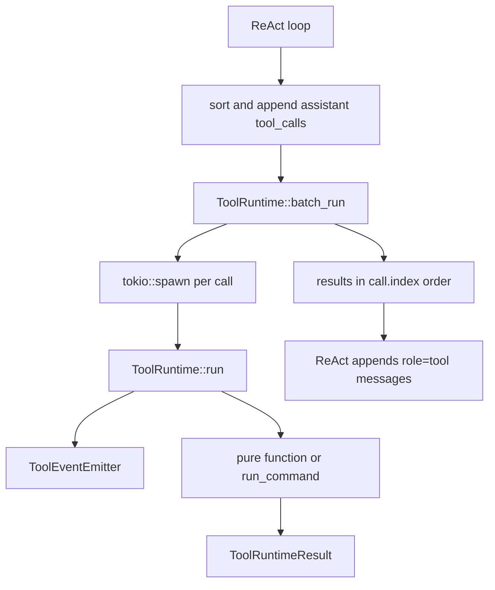

# Slice 9 Batch Boundary

## Learning Navigation

- Final artifact: `demo/README.md`
- Current stage: `08-demo-coder`
- Current slice: Slice 9 Multi-Tool Independent Execution
- Current status: batch boundary is implemented in `ToolRuntime::batch_run`
- After this: proceed to Slice 10 approval persistence unless new review findings appear.

## Boundary Decision

当前不单独新增 `ToolBatchRunner` 类型。

`ToolRuntime::batch_run` 已经是足够清晰的 batch boundary：

```text
ReAct loop
  owns turns and transcript

ToolRuntime::batch_run
  owns batch scheduling and result ordering

ToolRuntime::run
  owns single tool planning and execution

ToolEventEmitter
  owns tool-level lifecycle events

tool::shell
  owns command approval / execution / retry
```

只有当 batch policy 继续变复杂时，再把 `batch_run` 提升为独立结构：

- tool-level `supports_parallel`
- cancellation
- concurrency limit
- priority scheduling
- richer task failure policy

## Current Flow



## Why This Is Enough

- ReAct loop 不再发 terminal tool events。
- ReAct loop 不再处理 join error。
- ReAct loop 不再决定 batch 并发方式。
- runtime 层保留 call metadata，所以 JoinError 也能映射为当前 call 的 failure。
- observation 写回仍留在 ReAct loop，因为它维护 LLM transcript。

这个边界比单独抽 `ToolObservation` 更简单：当前 `Finished / Failed / Denied` 到 `role=tool` message 的映射只有一个地方，不需要额外类型。

## Review Checklist

继续修改 Slice 9 时，只检查这些不变量：

- 每个 `ToolCallFinished` 都有一个 `ToolRuntimeResult`。
- `ToolRunStarted` 在单 call runtime 开始时发出。
- `ToolRunFinished / ToolRunFailed` 在单 call runtime 结束时发出。
- command 内部事件位于 tool started 和 terminal tool event 之间。
- `batch_run` 返回结果按 index 排序。
- ReAct append observations 时不重新改变顺序。
- 不因为 `Denied` 取消同批其他 tool call。

## Tests To Keep

- `react_agent_should_run_multiple_tool_calls_in_index_order`
- `react_agent_should_observe_every_result_in_mixed_tool_batch`
- `react_agent_should_stream_command_execution_events_before_tool_observation`
- `batch_run_should_surface_all_approval_requests_before_any_is_approved`

这些测试覆盖了 Slice 9 最重要的风险：并发启动、结果完整、trace 可观察、transcript 稳定。
