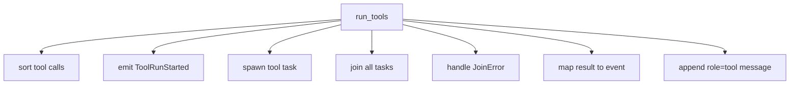
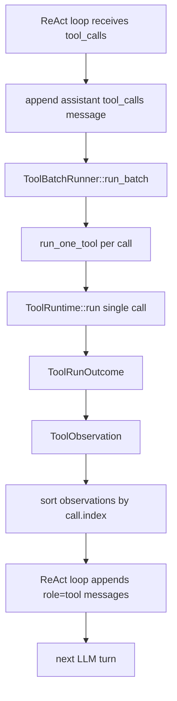

# Slice 9 Tool Batch Runner Refactor

## Learning Navigation

- Final artifact: `demo/README.md`
- Current stage: `08-demo-coder`
- Current slice: Slice 9 Multi-Tool Independent Execution
- Current gap: `run_tools` 第一版功能正确，但 ReAct loop 承担了过多 tool batch 职责。
- After this: 可以把 multi-tool 调度收口成可测试、可扩展的 `ToolBatchRunner`，再进入 Slice 10 approval persistence 或 demo README。

## North Star

ReAct loop 不应该知道太多 tool batch 的细节。它的理想职责是：

```text
collect model tool calls
  -> append assistant tool_calls message
  -> ask ToolBatchRunner to run the batch
  -> append returned observations
  -> start next model turn
```

也就是：ReAct loop 管“轮次和 transcript”，ToolRuntime 管“单个工具怎么执行”，中间应该有一个 batch runner 管“同批工具怎么调度、观察和收集”。

## Why Current Code Feels Long

当前 `run_tools` 同时在做：



这些职责属于三个不同层次：

| 职责 | 应放位置 | 原因 |
| --- | --- | --- |
| 轮次、assistant message、tool observation 回灌 | ReAct loop | 它维护 LLM transcript |
| 同批 tool call 的并发/串行策略 | ToolBatchRunner | 它理解 batch 语义 |
| 单个 tool 的 capability / approval / execution | ToolRuntime | 它是单 call runtime 边界 |
| command approval / sandbox / retry event | command runtime | 它知道 command attempt |

## Proposed Shape

### Step 1: 引入 ToolRunOutcome

先给 `(call, result)` 一个名字：

```rust
struct ToolRunOutcome {
    call: ToolCallFinished,
    result: ToolRuntimeResult,
}
```

这个类型的意义是：并发调度层不应该只返回 `ToolRuntimeResult`，因为 observation 回灌还需要 `call_id`、`index`、`name`。

### Step 2: 抽出单 call runner

把“发 started、跑 runtime、把结果带回 call metadata”收敛成一个函数：

```rust
async fn run_one_tool(
    call: ToolCallFinished,
    runtime: Arc<ToolRuntime>,
    tx: EventSender,
) -> ToolRunOutcome
```

这个函数可以负责发 `ToolRunStarted`。是否在这里发 `ToolRunFinished / Failed` 是一个设计选择：

- 如果 terminal event 放这里：事件更实时，但事件顺序按完成时间。
- 如果 terminal event 放 batch 收集后：事件顺序稳定，但不够实时。

推荐下一步采用：

```text
terminal event 按完成时间发出
transcript observation 仍按 index 排序
```

这样 UI 能实时看到 tool 完成，模型输入仍保持稳定。

### Step 3: 抽出 observation writer

把 `ToolRuntimeResult -> StreamEvent + role=tool message` 收敛到一个地方：

```rust
fn tool_observation(call: &ToolCallFinished, result: ToolRuntimeResult) -> ToolObservation
```

候选类型：

```rust
struct ToolObservation {
    event: StreamEvent,
    message: serde_json::Value,
}
```

这样 `Finished / Failed / Denied` 的映射不会散落在 ReAct loop 里。

### Step 4: ToolBatchRunner 只返回稳定 observations

第一版可以这样：

```rust
struct ToolBatchRunner {
    runtime: Arc<ToolRuntime>,
    tx: EventSender,
}

impl ToolBatchRunner {
    async fn run_batch(&self, calls: Vec<ToolCallFinished>) -> anyhow::Result<Vec<ToolObservation>>;
}
```

调用方只做：

```rust
let observations = batch_runner.run_batch(pending_tool_calls).await?;
messages.extend(observations.into_iter().map(|o| o.message));
```

## Parallelism Policy

当前 demo 第一版直接 spawn 所有 tool call 是可以接受的，因为：

- `add/sub` 是 pure function。
- `run_command` 还在 `SimulatedExecutionRunner` 上。
- Slice 9 目标是先验证 independent observation。

但 Phase 2 接 `OsExecutionRunner` 前，需要补 tool-level parallel capability：

```rust
struct ToolDefinition {
    name: &'static str,
    kind: ToolKind,
    supports_parallel: bool,
}
```

再借鉴 Codex：

```text
supports_parallel = true  -> 可并发
supports_parallel = false -> 需要串行化
```

Codex 对应源码：

- [`../../source/codex/codex-rs/core/src/tools/parallel.rs`](../../source/codex/codex-rs/core/src/tools/parallel.rs)
- [`../../source/codex/codex-rs/core/src/tools/router.rs`](../../source/codex/codex-rs/core/src/tools/router.rs)

## Refactor Target Flow



## Tests To Keep

重构后必须保留这些行为测试：

- 同批 `add/sub` 成功，observations 按 index 回灌。
- 同批 success / failed / denied 混合，所有 `tool_call_id` 都有 observation。
- command 内部 `CommandExecution*` 事件仍然在 `ToolRunStarted` 和 terminal tool event 之间。
- `max_turns` 仍能阻止无限循环。

不要对错误文案做精确断言，除非文案是公开协议。

## Stop Rules

- 不在这一步实现 approval persistence。
- 不在这一步接真实 OS sandbox。
- 不为所有 future tool 提前设计复杂 scheduler；先让当前 ReAct / ToolRuntime 边界变清楚。
