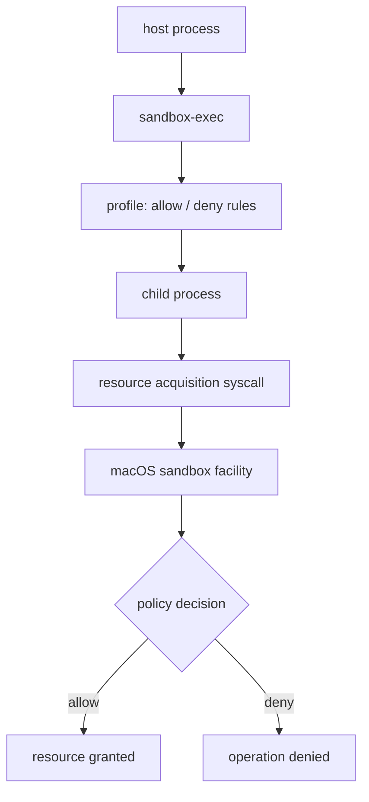

# Sandbox First Principles

> Status: 原理 guide。配合 [`14-slice-12-os-execution-runner.md`](14-slice-12-os-execution-runner.md) 阅读，用来理解为什么 Phase 2A 先用 `sandbox-exec`，以及它和其他 sandbox 方案的本质差异。

## Learning Navigation

- Final artifact: [`../../demo/README.md`](../../demo/README.md)
- Current stage: `08-demo-coder`
- Current phase: Phase 2A
- Current question: `sandbox-exec` 的底层原理是什么？它和 namespace、seccomp、chroot、container、VM 的第一性原理差异是什么？
- After this: 实现 `OsExecutionRunner` 时能判断哪些能力应该由 runner 负责，哪些必须留给 approval / policy 层。

## Sandbox 的第一性原理

Sandbox 的本质不是“让命令安全”，而是：

```text
在进程与系统资源之间插入一个强制边界，
让进程只能获取被允许的资源能力。
```

这里有三个核心对象：

```text
Subject: 谁在执行？
  -> process / thread / user / container / VM

Object: 访问什么资源？
  -> file / network / process / syscall / device / env / credential

Policy: 允许什么动作？
  -> read / write / exec / connect / fork / ioctl / mount / signal
```

不同 sandbox 技术的差别，不是“有没有隔离”，而是它们把边界放在哪里：

```text
语言运行时边界
系统调用边界
文件系统视图边界
进程命名空间边界
内核 MAC policy 边界
虚拟硬件边界
```

边界越靠近内核或硬件，隔离通常越强，但成本也越高。

## macOS sandbox-exec 是什么

`sandbox-exec` 是 macOS 的命令行工具，用指定 profile 启动一个受限进程：

```bash
sandbox-exec -p '<profile>' command args...
```

本机 `man sandbox-exec` 明确写了：

```text
sandbox-exec is DEPRECATED
```

所以它适合 mini demo，不应被包装成生产推荐方案。

`sandbox(7)` 对 macOS sandbox facility 的描述很关键：

```text
应用可以自愿限制自己对 OS 资源的访问。
限制通常在获取 OS 资源时生效。
它不是其他 OS access control 的替代品。
```

这意味着：

- sandbox 是进程能力收窄，不是权限系统的全部。
- 主要拦截“新资源获取”，例如打开文件、连接网络。
- 如果进程在进入 sandbox 前已经拿到某些 file descriptor，sandbox 不一定能撤销这些已获得能力。
- 子进程通常继承父进程 sandbox。

## sandbox-exec 的工作模型

可以这样理解：



它不是在 Rust 代码里拦截函数调用，而是在 OS 资源访问层面让被执行进程受限。

一个极简 profile：

```scheme
(version 1)
(deny default)
(allow process*)
(allow file-read*)
```

含义是：

- 默认拒绝。
- 允许进程相关基础操作。
- 允许读文件。
- 不允许写文件。

注意：真实 profile 语法和可用 operation 名称会受 macOS 版本影响，错误文本也不稳定。demo 测试应该断言“失败类别”，不要断言完整 stderr。

## 和其他 Sandbox 方案的第一性原理区别

| 方案 | 边界放在哪里 | 主要限制什么 | 优点 | 代价 / 局限 |
| --- | --- | --- | --- | --- |
| `sandbox-exec` / macOS App Sandbox | macOS 内核资源 policy | 文件、进程、网络等资源获取 | 接近 OS 层，适合 macOS demo | `sandbox-exec` deprecated；macOS 专属；profile 细节不稳定 |
| `chroot` | 文件系统路径根目录 | 进程看到的路径空间 | 概念简单，成本低 | 不是完整安全边界；不能限制 syscall、网络、进程等 |
| Linux namespaces | 内核命名空间 | mount、pid、network、user、ipc 等视图 | 容器基础能力，隔离视图强 | 单独 namespace 不等于完整安全；配置复杂 |
| seccomp-bpf | syscall 过滤层 | 允许哪些系统调用 | 直接收窄内核攻击面 | 不懂业务资源语义；规则难写；容易误杀 |
| cgroups | 资源配额层 | CPU、内存、IO、进程数 | 控制资源消耗 | 不负责访问权限 |
| Docker / OCI container | namespaces + cgroups + capabilities + seccomp 等组合 | 文件系统、网络、进程、资源、capabilities | 工程生态成熟 | 启动成本和镜像管理更重；仍共享宿主内核 |
| VM / microVM | 虚拟硬件边界 | 整个 OS 级隔离 | 隔离强，边界清晰 | 启动、资源、镜像成本最高 |
| 语言运行时 sandbox | 解释器 / runtime API 层 | 语言可见 API | 轻量、可嵌入 | 逃逸面取决于 runtime；很难限制 native code |

## 关键差异一：限制资源还是限制系统调用

资源型 sandbox 问：

```text
这个进程能不能读 / 写这个路径？
能不能连接这个网络目标？
```

系统调用型 sandbox 问：

```text
这个进程能不能调用 openat / connect / fork / execve？
```

区别是：

- 资源型 policy 更贴近产品语义，例如“只能读工作区”。
- syscall policy 更贴近内核攻击面，例如“不能调用 mount”。
- 一个成熟 sandbox 往往需要两者组合。

在我们的 demo 中，`ApprovalScope` 更接近资源型 policy：

```text
command_prefix + cwd + sandbox_profile + network_policy
```

而 `sandbox-exec` 是把这些产品语义落到 macOS 的资源访问规则上。

## 关键差异二：隔离视图还是禁止动作

namespace / chroot 更像“改变进程看到的世界”：

```text
进程看不到宿主完整文件系统 / pid / network namespace
```

seccomp / sandbox-exec 更像“看得到也不一定能做”：

```text
进程尝试访问资源时被内核拒绝
```

容器通常两者都用：

```text
namespace 改变视图
seccomp / capabilities / LSM 限制动作
cgroups 限制资源消耗
```

所以不要把 Docker 简化成“一个 sandbox 技术”。它是多种内核机制的工程组合。

## 关键差异三：同内核隔离还是跨内核隔离

`sandbox-exec`、namespace、seccomp、Docker 都共享宿主内核。

VM / microVM 则有虚拟硬件和独立 guest kernel：

```text
container:
  process boundary + shared kernel

VM:
  virtual machine boundary + guest kernel
```

这就是为什么 VM 隔离更强，但成本更高。

对 Agent CLI 来说：

- 本地开发工具通常更偏向同内核轻量 sandbox。
- 不可信代码执行平台更偏向容器 / microVM。
- 高风险多租户场景通常不应该只靠 `sandbox-exec` 或本地进程 sandbox。

## 对 Agent CLI 的启发

Agent 执行本地命令时，不能只问：

```text
这个命令字符串安全吗？
```

更应该问：

```text
谁发起的命令？
它在哪个 cwd 执行？
它要访问哪些资源？
首次是否必须 sandbox？
sandbox denied 后能不能重试？
重试前要不要用户批准？
批准能复用多久？
```

这也是我们的 demo 为什么把链路拆成：

```text
CapabilityRegistry
  -> ApprovalRequirement
  -> ExecutionAttempt
  -> ExecutionRunner
  -> RetryDecision
  -> StreamEvent
```

`ExecutionRunner` 只负责执行边界，不负责安全决策本身。

## 为什么 Phase 2A 选择 sandbox-exec

选择它不是因为它完美，而是因为它适合当前学习目标：

- 本机可用：`/usr/bin/sandbox-exec` 存在。
- 接入成本低：可以直接 wrap 现有 argv。
- 能真实触发文件读写限制。
- 能验证 `ExecutionRunner` 抽象是否足够稳定。

同时要明确它的局限：

- 已被 macOS 标记 deprecated。
- 不跨平台。
- 不等于完整生产安全方案。
- 网络和复杂权限控制可能不够精细。

因此 Phase 2A 的目标不是“选定最终 sandbox 技术”，而是验证：

```text
真实 OS sandbox 接入后，
Phase 1 的 approval / retry / event 状态机还能不变。
```

## 选择 Sandbox 技术的判断框架

可以按四个问题判断：

```text
1. 信任边界在哪里？
   本地用户自己的命令？团队共享机器？云端多租户？

2. 要限制的资源是什么？
   文件？网络？进程？CPU/内存？系统调用？设备？

3. 失败后要如何恢复？
   直接失败？请求审批？切到 no-sandbox retry？换隔离环境？

4. 可接受的成本是多少？
   毫秒级启动？容器镜像？VM 启动？跨平台维护？
```

对应选择：

- 本地 CLI mini demo：`sandbox-exec` / 简单 OS sandbox。
- 本地开发工具生产化：平台专属 sandbox + 明确 approval policy。
- CI / 单租户任务：container + seccomp/cgroups。
- 多租户不可信代码：microVM / VM + 网络隔离 + 资源配额。
- 浏览器内执行：语言 runtime sandbox / WASM sandbox。

## Stop Rules

- 不把 `sandbox-exec` 当成长期生产推荐。
- 不在 Slice 12 同时引入 Docker / VM。
- 不为了追求真实 sandbox 而绕开 `ApprovalGateway`、`RetryDecision` 和 `StreamEvent`。
- 不把 sandbox failure 的具体 stderr 当成稳定契约。
- 不把“能限制文件写入”误解成“命令已经完全安全”。
