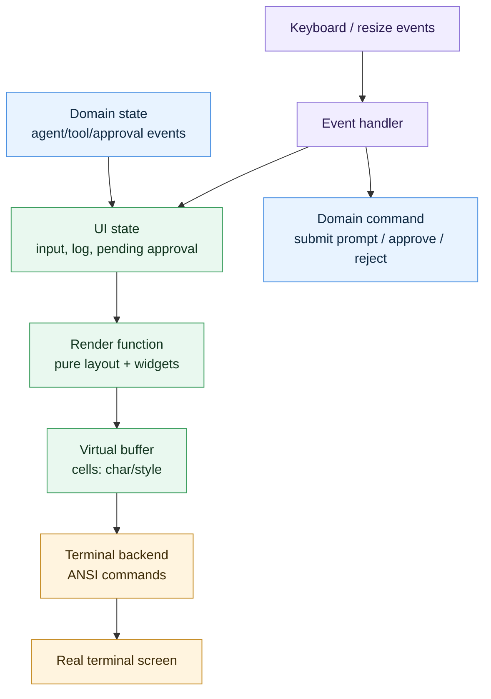
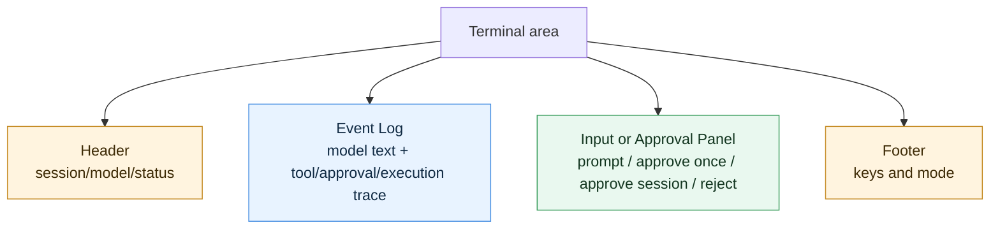
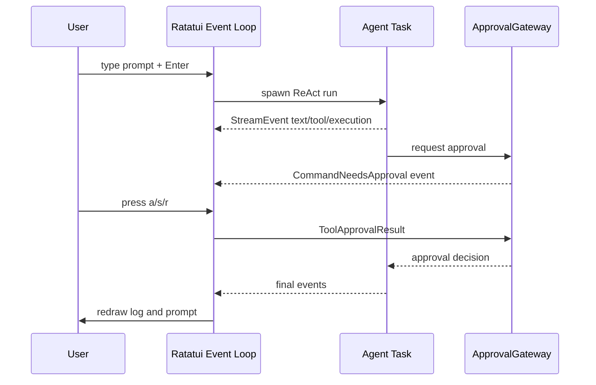
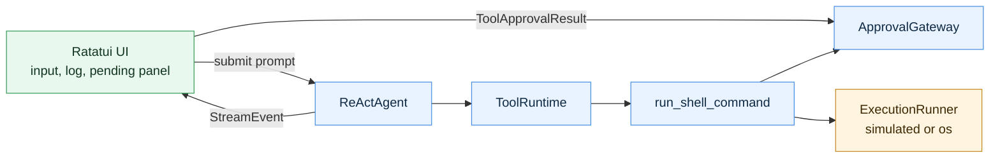

# Ratatui First Principles

> Status: background guide for Slice 13. 这篇不是行动清单，而是帮助你快速理解 `ratatui` 以及终端 UI 库的通用底层模型。

## Learning Navigation

- Final artifact: [`../../demo/README.md`](../../demo/README.md)
- Current stage: `08-demo-coder`
- Current phase: Phase 2B
- Read with: [`16-slice-13-ratatui-agent-cli-repl.md`](16-slice-13-ratatui-agent-cli-repl.md)
- Current decision: demo 要用 `ratatui` 做一个真实 Agent CLI REPL，但 UI 层不能复制 approval / retry / execution 逻辑。
- Goal: 理解 TUI 的渲染、输入、状态和事件循环，足够设计一个可维护的 Agent REPL。

## Core Question

我们不是为了“学一个 UI 框架”而学 `ratatui`。Phase 2B 的真实问题是：

```text
Agent 在终端里持续产生模型输出、tool events、approval request 和 final answer，
用户也会持续输入 prompt 或 approval decision。
如何在一个终端窗口里稳定管理这些输入、输出和状态？
```

`ratatui` 解决的是其中的“终端绘制”部分。它不负责业务状态机，也不负责 async task orchestration。

```text
Agent / ToolRuntime / ApprovalGateway
  -> produce domain events
  -> UI state reducer
  -> ratatui render function
  -> terminal screen

terminal key input
  -> UI event handler
  -> prompt submit / approval result
  -> Agent / ApprovalGateway
```

## 1. TUI 的第一性原理

普通终端本质上不是一个 GUI canvas，而是一个字符设备。程序向 stdout 写入字节，终端解释这些字节：

- 普通字符：显示文本。
- 控制字符：换行、退格、清屏。
- ANSI escape sequence：移动光标、设置颜色、隐藏光标、切换备用屏幕等。
- 键盘输入：终端把按键编码成字节或事件交给程序。

所以 TUI 库的底层任务可以拆成四件事：

1. 把终端切到适合应用控制的模式。
2. 把业务状态转换成一组终端单元格。
3. 尽量少地把变化写回终端。
4. 读取键盘 / 鼠标 / resize 事件并更新状态。



这也是为什么 TUI 程序通常会有固定结构：

```text
init terminal
loop:
  draw current state
  read input or internal event
  update state
restore terminal
```

## 2. `ratatui` 和 `crossterm` 分工

在这个 repo 里，`daedalus-tui` 用的是：

```toml
ratatui = "0.29"
crossterm = "0.29"
markdown-tui = "0.1.3"
```

它们的分工不同：

| Layer | 负责什么 | 在代码里常见类型 |
| --- | --- | --- |
| `crossterm` | 终端控制和输入事件 | `enable_raw_mode`, `EnterAlternateScreen`, `event::poll`, `Event`, `KeyCode` |
| `ratatui` backend | 把 buffer 写到终端 | `CrosstermBackend` |
| `ratatui` terminal | 管理 draw 生命周期和 diff flush | `Terminal` |
| `ratatui` layout/widgets | 把状态描述成界面 | `Layout`, `Block`, `Paragraph`, `List`, `Gauge`, `Frame` |
| app state | 业务相关 UI 状态 | `input`, `log`, `pending_approval`, `running` |

一个容易混淆的点：

```text
crossterm 更接近“终端驱动”。
ratatui 更接近“声明式绘制层”。
```

`ratatui` 不直接替你设计 event loop；event loop 仍然要由你的程序组织。

## 3. 终端初始化：raw mode 和 alternate screen

TUI 启动时通常会做两件事：

```rust
enable_raw_mode()?;
execute!(stdout, EnterAlternateScreen)?;
```

### raw mode

默认终端通常处于 canonical mode：用户输入一整行并回车后，程序才读到内容；`Ctrl+C`、退格、方向键等也可能被终端提前处理。

raw mode 的意思是：

- 按键尽快交给程序。
- 回车、退格、方向键等由程序解释。
- 终端不再帮你做行编辑。

这就是为什么 TUI 程序退出前必须恢复：

```rust
disable_raw_mode()?;
```

否则用户的 shell 会变得很奇怪。

### alternate screen

备用屏幕是一块临时屏幕缓冲区。进入后，TUI 可以全屏绘制；退出后，用户原来的 shell 内容还在。

```rust
execute!(stdout, EnterAlternateScreen)?;
// run app
execute!(terminal.backend_mut(), LeaveAlternateScreen)?;
```

这不是 `ratatui` 独有的能力，而是终端协议的一部分。

## 4. `Terminal::draw`：每帧重画，不是手动 patch DOM

`ratatui` 的核心使用方式是：

```rust
terminal.draw(|frame| {
    draw_ui(frame, frame.area(), &app);
})?;
```

你每次都根据当前 `app state` 描述完整界面。`ratatui` 内部维护 buffer，并尽量只把变化 flush 到真实终端。

这带来一个重要设计原则：

```text
render function 应该尽量是纯函数：
Frame + area + app state -> widgets
```

不要在绘制函数里：

- 调 API。
- 运行 tool。
- 修改 approval store。
- 等待 channel。
- 推进 ReAct loop。

绘制层只负责“状态长什么样”。

## 5. Layout、Widget、Style 的心智模型

`ratatui` 不像浏览器有 CSS flow layout。它更像在一个固定矩形网格里切区域。

核心类型：

| 类型 | 心智模型 |
| --- | --- |
| `Rect` | 一块终端区域，包含 x/y/width/height |
| `Layout` | 把一个 `Rect` 切成多个子 `Rect` |
| `Constraint` | 子区域尺寸规则，例如固定高度、百分比、最小值 |
| `Block` | 边框、标题、padding |
| `Paragraph` | 多行文本 |
| `List` | 列表 |
| `Line` / `Span` | 一行里的不同样式片段 |
| `Style` | 前景色、背景色、bold 等 |

典型绘制形状：

```rust
let root = Layout::default()
    .direction(Direction::Vertical)
    .constraints([
        Constraint::Length(3),
        Constraint::Min(10),
        Constraint::Length(3),
    ])
    .split(area);

frame.render_widget(header, root[0]);
frame.render_widget(body, root[1]);
frame.render_widget(footer, root[2]);
```

对 Agent CLI REPL 来说，第一版可以这样切：



## 6. Event Loop：TUI 程序的心脏

同步 TUI 的最小 event loop 长这样：

```rust
loop {
    terminal.draw(|frame| draw_ui(frame, &app))?;

    if event::poll(Duration::from_millis(200))? {
        if let Event::Key(key) = event::read()? {
            match key.code {
                KeyCode::Char('q') => break,
                KeyCode::Char(c) => app.input.push(c),
                KeyCode::Backspace => {
                    app.input.pop();
                }
                KeyCode::Enter => {
                    // submit input
                }
                _ => {}
            }
        }
    }
}
```

但 Agent REPL 比普通表单复杂，因为它有两类事件源：

```text
user input
  -> key events

agent output
  -> StreamEvent from ReActAgent
```

所以更好的结构是把它们统一成 UI event：

```rust
enum UiEvent {
    Key(KeyEvent),
    Agent(StreamEvent),
    AgentFinished,
    Tick,
}
```

然后 UI 只处理 `UiEvent`：

```text
UiEvent
  -> reducer updates CliState
  -> draw current CliState
```

这样不会让 `ratatui` 绘制代码和 agent 执行代码纠缠在一起。

## 7. Async Agent 和 TUI 怎么接

`crossterm::event::poll` 是同步接口；Agent stream 是 async。当前 demo 不需要先做 plain stdout 过渡，直接上 `ratatui`，但要把 async agent 和 terminal event loop 的边界拆清楚。

推荐结构是：

```text
ratatui event loop
  -> 负责 draw / key input / ui state

agent background task
  -> 负责 ReActAgent::run
  -> 通过 channel 把 StreamEvent 发回 UI

approval result channel
  -> UI 在 pending approval 时发送 approve once / approve session / reject
  -> ApprovalGateway 接收结果并恢复 command execution
```

也就是：

```text
keyboard input
  -> TUI loop

ReActAgent::run(...)
  -> spawned async task
  -> mpsc::Sender<UiEvent>
  -> TUI loop

approval key a/s/r
  -> TUI loop
  -> ApprovalGateway
```

这个结构的重点不是“绕开 async”，而是把职责分开：

- `ratatui` loop 不直接 await 完整 agent run，否则 UI 会卡住。
- agent task 不直接绘制 UI，否则 domain 和 presentation 会耦合。
- channel 只传 `UiEvent` / approval result，不传 UI widget。

后续如果要把 keyboard event 也改成 async stream，再用 `tokio::select!` 统一调度也可以。但当前学习目标是完成一个可读、可控的 `ratatui` Agent CLI，不需要先引入更抽象的 async event loop。



## 8. Agent REPL 的推荐边界

不要让 UI 层变成第二套 orchestrator。推荐边界如下：



UI 可以知道：

- 当前是否 running。
- 当前 input 是什么。
- event log 有哪些行。
- 当前是否有 pending approval。
- 用户按下了 `a/s/r`。

UI 不应该知道：

- 某个 command 为什么匹配某个 capability。
- retry policy 如何合成。
- session approval scope key 如何比较。
- sandbox denied 如何分类。

这些属于已经完成的 Phase 1 / Phase 2A domain logic。

## 9. Approval UI 的最小设计

出现 `CommandNeedsApproval` 后，UI state 进入 pending mode：

```rust
pub enum UiMode {
    EditingPrompt,
    Running,
    PendingApproval,
}
```

pending panel 至少展示：

```text
command
reason
cwd
sandbox profile
network policy
approval choices
```

按键映射：

```text
a -> approve once
s -> approve session
r -> reject
```

然后 UI 发送：

```rust
StreamEvent::ToolApprovalResult {
    approval_id,
    decision,
}
```

注意：approval result 是一个 domain event / command，不是纯 UI 行。它必须回到 `ApprovalGateway`，不能只写进 log。

## 10. 常见坑

### 坑 1：忘记恢复终端

如果中途 `?` 返回，可能导致 raw mode 没关。应该用 guard 或确保 cleanup 一定执行。

当前 `daedalus-tui` 的 `run_tui` 是手动 cleanup。以后如果 REPL 复杂起来，可以抽 `TerminalGuard`。

### 坑 2：绘制函数里做业务

绘制函数被频繁调用。如果在里面做异步、IO 或状态修改，会导致难复现的问题。

更好的拆法：

```text
event handler mutates state
draw reads state
```

### 坑 3：把 log 存成已经排版好的字符串

第一版可以这么做，但长期最好保留结构化事件，再映射成 UI line。否则后面想过滤、折叠、着色、导出 trace 都会很痛。

推荐：

```rust
enum UiLine {
    ModelText(String),
    ToolStarted { name: String },
    CommandStarted { command: String, in_sandbox: bool },
    ApprovalNeeded { command: String, reason: String },
    Error(String),
}
```

### 坑 4：阻塞 TUI loop

不要在按下 Enter 后直接 await 完整 agent run，再回到 UI。这样用户看不到流式事件，也不能处理中途 approval。

正确方向：

```text
Enter
  -> spawn agent run
  -> UI loop continues
  -> events arrive incrementally
```

### 坑 5：把 terminal resize 当成边角问题

终端大小会变。`ratatui` 每次 draw 都会拿到当前 area，所以 layout 应该能适应小窗口。

对当前 demo，先保证：

- 小窗口不 panic。
- event log 可以滚动或保留最近 N 行。
- pending approval panel 不被完全挤掉。

## 11. 和 GUI / Web UI 的本质区别

TUI、GUI、Web UI 都是在做：

```text
state -> view
event -> state update
```

区别在于渲染目标和输入模型：

| UI 类型 | 渲染目标 | 输入模型 | 布局特点 |
| --- | --- | --- | --- |
| Web | DOM / CSS layout | browser events | flow / flex / grid |
| GUI | native widgets / canvas | OS event loop | widget tree / retained mode |
| TUI | terminal cell grid | terminal key events | fixed cells / manual split |

`ratatui` 更接近 immediate-mode UI：每一帧重新描述界面。它不是浏览器，不要期待 CSS 自动布局；也不是纯 stdout log，不要把所有东西直接 `println!`。

## 12. 当前 Demo 的最小落地路线

结合 Slice 13，建议顺序是：

1. 定义 `CliState`、`UiMode`、`UiEvent` 和 `UiLine`。
2. 写 `apply_event(state, event)`，把 `StreamEvent` / key event 映射到 UI state。
3. 建立 `ratatui` terminal guard：raw mode、alternate screen、cleanup。
4. 写第一版 `draw_ui`：header / event log / input or pending approval panel / footer。
5. 在 Enter 时 spawn `ReActAgent::run`，把 agent stream 转成 `UiEvent::Agent`。
6. 在 pending approval mode 下处理 `a/s/r`，发送 approval result。
7. 验证 approve session 后，同一个 CLI session 的后续 run 可以复用授权。
8. 最后再考虑滚动、颜色、help footer、markdown 等体验。

验收标准不是“界面好看”，而是：

```text
用户能在终端中看见 agent 为什么要执行命令，
能看见它是否在 sandbox 里执行，
能明确 approve once / approve session / reject，
并且 UI 层没有复制安全策略。
```
