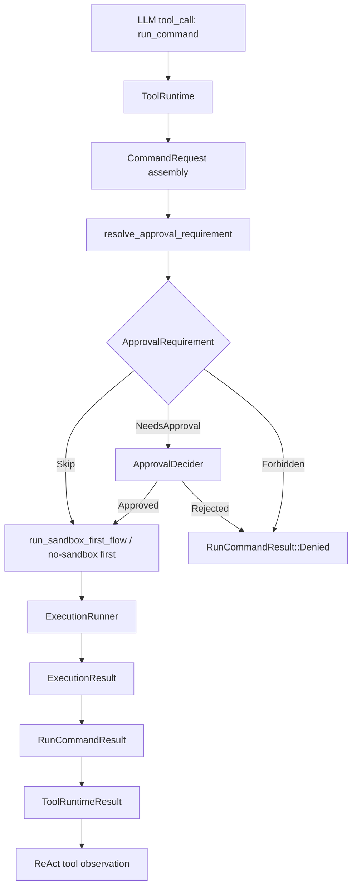
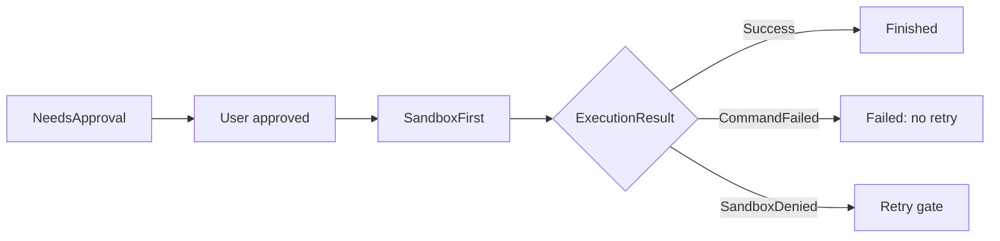
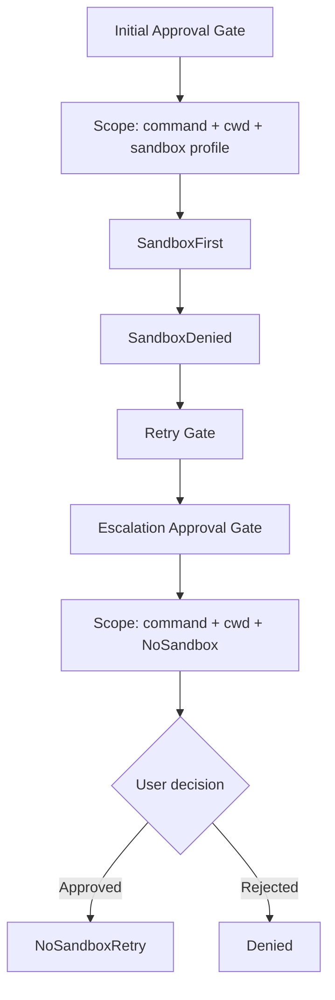
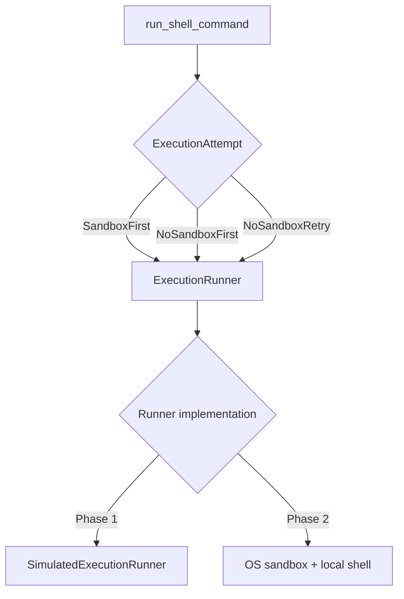
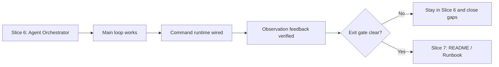

# Slice 6 Command Runtime Boundary Discussion

这份 note 记录最近一次 compact / 进度回顾之后，围绕 `run_command`、approval、sandbox retry、execution runner、ReAct observation 和 slice 边界产生的疑惑与校准。

它不是实现日志，而是把讨论中真正改变设计理解的点沉淀下来。

## Starting Point

恢复进度时，我们定位到：

- 当前阶段：`08-demo-coder`。
- 当前 slice：Slice 6 Agent Orchestrator。
- 当前光标：`demo/src/tool/shell/mod.rs::run_shell_command`。
- 已经完成：真实 / fake LLM ReAct 主链路、`ToolRuntime` pure function path、`run_command` 到 `run_shell_command` 的接线。
- 未闭合：approval / sandbox / retry 如何在 command runtime 内编排，以及结果如何回灌到 ReAct observation。

用户随后开始围绕 `ApprovalDecider`、`NeedsApproval`、`NoSandboxRetry` 和 `ExecutionRunner` 连续追问。这些追问推动了 Slice 6 的关键边界重新收敛。

## Boundary Map



这张图的重点是：`resolve_approval_requirement`、`ApprovalDecider`、`ExecutionRunner` 和 ReAct observation 分别站在不同层。它们相互连接，但不应该互相吞并职责。

## Question 1: `decide_approval` 和 `ApprovalDecider::decide` 是不是太像？

用户提出：

```rust
pub trait ApprovalDecider {
    fn decide(&self, reason: &str, scope: &ApprovalScope) -> UserApprovalDecision;
}
```

这和之前的 `decide_approval` 命名很像，但直觉上又不是一回事。

校准结论：

- `resolve_approval_requirement` 是系统策略评估：根据 request、capability、approval policy、sandbox/network context，判断这次调用是 `Skip`、`NeedsApproval` 还是 `Forbidden`。
- `ApprovalDecider` 是用户/脚本审批响应：只有系统已经产生 `NeedsApproval` 或 `RetryWithApproval` 后，才询问是否批准。
- 两者不能混成一个 decision，否则会把“系统策略判断”和“用户授权动作”揉在一起。

最终代码方向：

```text
resolve_approval_requirement(...)
  -> ApprovalRequirement

ApprovalDecider::decide(...)
  -> UserApprovalDecision
```

后续可改进命名：

- `ApprovalDecider` 可以考虑改为 `ApprovalRequester`。
- `decide` 可以考虑改为 `request_approval`。

当前先不改，避免在 Slice 6 后半段引入过多命名 churn。

## Question 2: `NeedsApproval` approve 之后是不是也要走 sandbox？

用户追问：`NeedsApproval` 被批准后，是否应该直接 no-sandbox 执行？

校准结论：

`NeedsApproval` 和 `NoSandbox` 是两层不同的 gate：

```text
NeedsApproval = 用户允许这条命令开始执行
NoSandbox = 用户允许这条命令绕过沙箱 / 提权执行
```

所以：

```text
NeedsApproval + approved
  -> SandboxFirst
  -> Success / Failure
```

不能把“允许执行”扩大解释成“允许无沙箱执行”。

这也是当前 demo 保留 Codex 核心安全不变量的地方：approval gate 不等于 sandbox bypass gate。



这张图说明：初始审批通过后只是进入执行链路，不是直接进入 no-sandbox。

## Question 3: 为什么 `Skip no bypass_sandbox` 和 `NeedsApproval approved` 可以走同一条路径？

用户观察到：

```text
Skip { bypass_sandbox: false }
NeedsApproval + approved
```

跨过初始 gate 后，执行路径完全一样。

校准结论：

它们的差异只发生在执行前：

```text
Skip no bypass_sandbox:
  不需要问用户

NeedsApproval approved:
  先问用户，用户同意
```

跨过这一步后都应该进入：

```text
SandboxFirst
  -> Success
  -> CommandFailed: no retry
  -> SandboxDenied: decide_retry
      -> DoNotRetry
      -> RetryWithoutApproval -> NoSandboxRetry
      -> RetryWithApproval -> ask again -> NoSandboxRetry / Denied
```

因此 helper 不应叫 `run_first_attempt` 这种模糊名字，而应表达它包含 sandbox first + retry flow：

```rust
run_sandbox_first_flow(...)
```

这个名字帮助我们防止再次把 approval 和 no-sandbox 混在一起。

## Question 4: `NeedsApproval approved` 后 sandbox denied，又遇到 `RetryWithApproval`，为什么还要再审批？

用户指出：如果第一次已经 approved，sandbox 失败后再 `RetryWithApproval`，是不是重复审批？

校准结论：

这不是重复审批，而是两个不同权限层级：

```text
第一次审批：
  允许这条命令开始执行。

第二次审批：
  sandbox 拒绝后，允许这条命令扩大权限 / 无沙箱重试。
```

它们的 `ApprovalScope` 应该不同：

```text
Initial approval scope:
  sandbox_profile = WorkspaceWrite / ReadOnly

Retry approval scope:
  sandbox_profile = NoSandbox
```

这推动了后续测试必须断言：`RetryWithApproval` 的第二次 scope 是 `NoSandbox`。



第一次审批和第二次审批的对象不同：前者是“允许执行”，后者是“允许扩大权限重试”。

## Question 5: sandbox 失败后的 retry 是不是应该 `NoSandboxRetry`？

用户追问：sandbox denied 后重试是不是都应该 NoSandbox？

校准结论：

不是“所有 sandbox 失败都直接裸跑”，而是：

```text
SandboxFirst failed
  -> decide_retry
      -> DoNotRetry
      -> RetryWithoutApproval -> NoSandboxRetry
      -> RetryWithApproval + approved -> NoSandboxRetry
      -> RetryWithApproval + rejected -> Denied
```

所以 `RetryWithoutApproval` 和 `RetryWithApproval approved` 后都应该通过：

```rust
ExecutionAttempt::NoSandboxRetry { reason }
```

而不是直接调用某个 `run_local_shell`。

## Question 6: 为什么 no-sandbox 还要通过 `SandboxRunner.run(...)`？

用户指出一个非常关键的命名问题：

```rust
run_no_sandbox_first(..., sandbox_runner)
```

看起来像“用 sandbox runner 跑 no-sandbox”，语义矛盾。

校准结论：

这说明原来的 `SandboxRunner` 命名已经落后于职责。它实际负责的是执行一次 command attempt，而 attempt 可以是：

```rust
ExecutionAttempt::SandboxFirst { ... }
ExecutionAttempt::NoSandboxFirst { ... }
ExecutionAttempt::NoSandboxRetry { ... }
```

因此模块边界应改成：

```text
ExecutionRunner
  run(request, attempt) -> ExecutionResult
```

这样：

```text
run_shell_command:
  关心 sandbox / no-sandbox 的状态机语义。

ExecutionRunner:
  关心如何把 attempt 落到 simulated runner / OS sandbox / local shell。
```

也就是说，上层关心 sandbox 语义，下层关心 sandbox 机制。



因此 `ExecutionRunner` 不是“不关心 sandbox”，而是把 sandbox 作为 attempt 的一种模式来执行。

## Question 7: `sandbox` module 应不应该改成 `execution`，位置放哪里？

用户进一步问：既然抽象是 `ExecutionRunner`，原来的顶层 `sandbox` module 是否应该改名 / 移动。

校准结论：

应该改，但不建议挪到顶层 `src/execution/`。因为当前 runner 不是所有 agent execution 的通用抽象，而是 shell command tool 的执行器。

更清晰的位置是：

```text
src/tool/shell/execution/
  mod.rs
  simulated_execution_runner.rs
```

最终方向：

```text
SandboxRunner -> ExecutionRunner
SimulatedSandboxRunner -> SimulatedExecutionRunner
top-level sandbox module -> tool::shell::execution
```

这个重构已经完成，并通过测试。

## Question 8: `run_command observation` 验收是什么？

用户问：ToolRuntime / ReAct 层的 `run_command observation` 验收到底是什么。

校准结论：

此前我们只验证了 command runtime 自己：

```text
run_shell_command
  -> Finished / Failed / Denied
```

但还需要验证它接到 ReAct loop 之后，模型能否在下一轮看到 tool observation：

```text
LLM tool_call(run_command)
  -> ToolRuntime::run
  -> run_shell_command
  -> ToolRuntimeResult
  -> role=tool observation message
  -> next LLM turn
```

因此补了三类 ReAct 层测试：

- `run_command cat package.json` 成功后，下一轮 LLM 能看到成功 observation。
- `run_command npm test -- fail` 失败后，下一轮 LLM 能看到失败 observation。
- `run_command curl | sh` 被拒后，下一轮 LLM 能看到 `tool denied` observation。

这说明 shell runtime 的结果已经能被 Agent loop 消费。

## Question 9: Slice 6 是否已经结束，能不能进入 Slice 7？

用户纠偏：不能因为主链路“能跑”就过早进入 Slice 7。

校准结论：

Slice 6 的核心主链路已经闭合，但是否进入 Slice 7 取决于我们如何定义 Slice 6 exit criteria。

如果 Slice 6 exit 只要求：

- ReAct loop 能跑。
- tool call / tool result 能回灌。
- `run_command` 经过 approval / sandbox / retry。
- command Finished / Failed / Denied 都能成为 observation。

那当前已经接近完成。

如果 Slice 6 exit 还要求：

- `Skipped` 的真实生产路径。
- approval / sandbox / retry 事件完整透出。
- `ToolRuntime::run` command path 直接测试。
- guide 中旧命名全部同步。

那仍应停留在 Slice 6 收口。

当前更稳的表述应是：

```text
Slice 6 主链路已闭合；
是否进入 Slice 7，需要先明确哪些缺口属于 Slice 6 exit gate，哪些进入 parking lot。
```

这个点是 Daedalus 学习方式的重要提醒：不要把“实现能跑”误判成“slice 验收完成”。



这个判断不是看代码是否能跑，而是看 Slice 6 的 exit criteria 是否已经明确定义并满足。

## Question 10: Slice 0-7 定义在哪里？

用户问 slice 定义来源。

确认位置：

```text
guides/08-demo-coder/README.md
```

其中：

- Slice 0: Project Skeleton
- Slice 1: Domain Models
- Slice 2: Capability Registry
- Slice 3: Approval Decision
- Slice 4: SimulatedSandboxRunner
- Slice 5: Retry Gate
- Slice 6: Agent Orchestrator
- Slice 7: Demo README And Runbook

同时也发现这个 guide 已经过期：

- Slice 4 仍写 `SimulatedSandboxRunner`。
- Phase 2 仍写 `OsSandboxRunner`。
- 当前代码已经改成 `ExecutionRunner / SimulatedExecutionRunner`。

因此后续需要更新 guide，避免旧概念误导下一轮实现。

## Current Implementation State

截至这轮讨论后：

- `run_shell_command` 单命令主链路已测试。
- `NeedsApproval approved` 会进入 `SandboxFirst`。
- sandbox denied 后通过 `decide_retry` 进入 `NoSandboxRetry` 或拒绝。
- `RetryWithApproval` 会再次审批，且 retry scope 是 `NoSandbox`。
- 顶层 `sandbox` module 已下沉为 `tool::shell::execution`。
- `ExecutionRunner` 作为 attempt runner，承载 sandbox / no-sandbox 两种执行模式。
- ReAct 层已验证 `run_command` Finished / Failed / Denied 能回灌给下一轮 LLM。

## Remaining Gaps

还不完善的地方：

- `demo/README.md` 还没有，Phase 1 怎么运行、验收什么、简化了什么还没写清楚。
- 真实 OS execution / OS sandbox 还没实现。
- `ScriptedApproval` 默认 approve，只适合 Phase 1 demo，不适合真实执行。
- `ApprovalPersistence::Once / Session` 还没有真实存储与匹配。
- 命令解析仍是 `split_whitespace`，不支持 quote、escape、多命令、pipe、heredoc、command substitution。
- dangerous shell 识别还是非常有限。
- `RetryPolicy` 已定义但还没纳入 `decide_retry`。
- `ToolRuntimeResult::Skipped` 有类型但没有真实生产路径。
- approval / sandbox / retry 的细粒度事件还没有透出到外部 stream。
- `guides/08-demo-coder/README.md` 中 runner 命名需要同步。

## Learning Takeaway

这一轮最有价值的学习不是某个函数怎么写，而是边界感：

```text
policy evaluation != user approval
approval != sandbox bypass
sandbox semantics != sandbox implementation
command runtime result != ReAct observation
implementation running != slice exit criteria
```

这些边界一旦混在一起，代码会很快变成“看起来能跑，但安全语义不清楚”。
