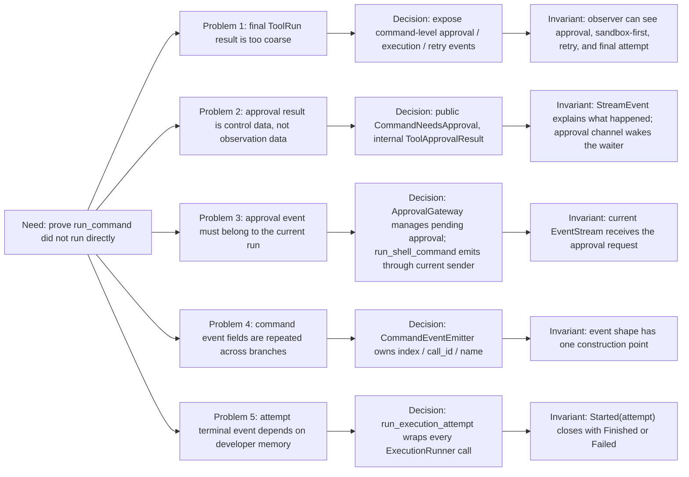
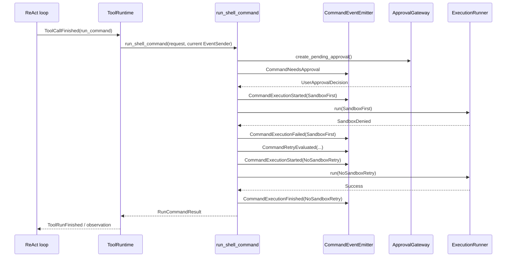

# Slice 8 Event Protocol Refactor Retrospective

## Learning Navigation

- Final artifact: [`../../demo/README.md`](../../demo/README.md) 中的一次 command 安全执行 trace。
- Current stage: `08-demo-coder`
- Covered slice: Slice 8 Event Protocol Hardening。
- Source files: [`../../demo/src/agent/stream_event.rs`](../../demo/src/agent/stream_event.rs)、[`../../demo/src/tool/shell/approval.rs`](../../demo/src/tool/shell/approval.rs)、[`../../demo/src/tool/shell/event_emitter.rs`](../../demo/src/tool/shell/event_emitter.rs)、[`../../demo/src/tool/shell/mod.rs`](../../demo/src/tool/shell/mod.rs)。
- Result: Slice 8 已收口；下一步进入 Slice 9 multi-tool hard-deny / skipped semantics。

## Why This Refactor Existed

最初的问题不是“多发几个 event”，而是一个信任问题：

```text
外部观察者为什么相信 tool call 没有被直接执行？
```

如果 `run_command` 只返回最终成功或失败，外部只能看到结果，看不到它是否真的经过：

```text
approval -> sandbox first -> retry decision -> optional no-sandbox retry
```

这对安全执行链路不够。我们的 demo 目标是学习 Codex 的核心不变量，所以事件协议必须能证明“安全关卡被访问过”，而不是把 tool call 简化成普通函数调用。

## Refactor Decision Map



这张图比线性 timeline 更准确：我们不是“按顺序加了几个类”，而是在同一个核心需求下，分别解决了五类结构性问题。

## Decision 1: Keep Public Events And Control Messages Separate

我们曾经讨论过审批结果要不要也是 `StreamEvent`。最后决定不要。

对外事件只表达观察事实：

```text
CommandNeedsApproval
CommandExecutionStarted
CommandExecutionFinished
CommandExecutionFailed
CommandRetryEvaluated
```

审批结果是内部控制消息：

```text
ToolApprovalResult {
  approval_id,
  decision,
}
```

原因是二者的职责不同：

- `CommandNeedsApproval` 是 runtime 告诉 UI / observer：“这里需要用户审批。”
- `ToolApprovalResult` 是 UI / test 回传给 runtime：“这个 approval_id 的决定是什么。”
- `UserApprovalDecision` 是 `ApprovalGateway` 唤醒 `run_shell_command` 后得到的业务结果。

如果把审批结果也放进对外事件流，会把“观察协议”和“控制协议”混在一起。短期看起来统一，长期会让 event stream 同时承担 UI 展示、业务唤醒、测试同步三个职责，边界会变脏。

## Decision 2: Approval Must Be Run-Scoped

旧方向里有一个危险点：`ApprovalBroker` 如果在初始化时捕获一个 `EventSender`，它可能不是当前 `agent.run()` 返回的 stream。

这个问题本质上是 stream ownership：

```text
ReActAgent::run()
  -> creates current EventSender / EventStream

ApprovalBroker created earlier
  -> may hold an old EventSender
```

如果审批请求发到旧 sender，当前调用方就看不到 `CommandNeedsApproval`，但 runtime 仍可能在等审批结果。这会造成体验和安全双重问题。

所以我们改成：

```text
run_shell_command
  -> use current run EventSender to emit CommandNeedsApproval
  -> wait PendingApproval

ApprovalGateway
  -> create approval_id
  -> hold pending oneshot
  -> receive ToolApprovalResult by approval_id
```

这个设计把两个职责拆开：

- 当前 run 负责发出当前 run 的事件。
- gateway 负责管理 pending approval，不长期持有外部 stream。

## Decision 3: Approval Event Send Failure Must Fail Closed

如果 `CommandNeedsApproval` 发不出去，系统不能继续执行命令，也不能 panic 后丢失上下文。

我们选择：

```text
cannot publish approval request
  -> cancel pending approval
  -> treat as Rejected
```

原因很简单：审批请求无法被外部观察到，就等价于无法获得有效授权。安全链路里，无法授权应该拒绝，而不是继续跑。

这也是一个可迁移原则：

```text
permission request delivery failure
  -> deny by default
```

## Decision 4: Use CommandEventEmitter To Centralize Event Shape

当 `run_shell_command` 开始发很多事件时，代码迅速变丑：

```text
index
call_id
name
attempt
decision
```

这些上下文字段在每个分支里重复填，容易漏、容易错，也让业务逻辑和事件协议混在一起。

所以我们抽出 `CommandEventEmitter`：

```text
CommandEventEmitter
  -> needs_approval(...)
  -> execution_started(...)
  -> execution_finished(...)
  -> execution_failed(...)
  -> retry_evaluated(...)
```

这个 decision 的核心不是“封装 tx.send”，而是把 command-level event 的领域语言集中到一个地方。`run_shell_command` 只说“现在需要审批 / 开始执行 / retry decision 已产生”，不关心 `StreamEvent` 的字段拼装。

## Decision 5: Use run_execution_attempt To Protect Lifecycle

仅有 emitter 还不够。因为 emitter 只能减少重复字段，不能保证业务分支一定记得发 terminal event。

旧风险是：

```text
CommandExecutionStarted(SandboxFirst)
CommandRetryEvaluated(...)
CommandExecutionStarted(NoSandboxRetry)
CommandExecutionFinished(NoSandboxRetry)
```

这里缺少：

```text
CommandExecutionFailed(SandboxFirst)
```

于是我们引入 `run_execution_attempt`：

```text
run_execution_attempt
  -> emit CommandExecutionStarted(attempt)
  -> runner.run(request, attempt)
  -> emit CommandExecutionFinished(attempt) or CommandExecutionFailed(attempt)
  -> return ExecutionResult
```

它保护的不变量是：

```text
Started(attempt)
  -> Finished(attempt) or Failed(attempt)
```

这个 helper 很小，但价值很大：它把“希望开发者记得发事件”变成了“调用 runner 的唯一合理路径已经包含事件闭合”。

## Final Shape



## What We Deliberately Did Not Do

1. 没有把所有内部状态都变成 event。

   事件不是 debug log。当前只暴露足以解释安全链路的节点。

2. 没有让 `ApprovalGateway` 直接持有 public event sender。

   gateway 负责 pending approval，不负责当前 run 的事件输出。

3. 没有把 `ToolApprovalResult` 留在 `StreamEvent`。

   它是内部控制消息，不是外部观察事实。

4. 没有在 Slice 8 解决 multi-tool hard-deny / skipped。

   Slice 8 的目标是单个 command tool 的安全 trace 闭合；同轮多工具策略留给 Slice 9。

## Verification

当前验证结果：

```text
cargo test --manifest-path workspaces/02-learning/openai-codex-cli-deep-learning/topics/tools-permissions/demo/Cargo.toml
-> 63 passed, 3 ignored

cargo fmt --manifest-path workspaces/02-learning/openai-codex-cli-deep-learning/topics/tools-permissions/demo/Cargo.toml --check
-> passed

git diff --check
-> passed
```

关键测试覆盖：

- safe read 只产生一个 `SandboxFirst` started / finished pair。
- sandbox denied retry success 产生闭合 trace：

```text
CommandExecutionStarted(SandboxFirst)
CommandExecutionFailed(SandboxFirst)
CommandRetryEvaluated(...)
CommandExecutionStarted(NoSandboxRetry)
CommandExecutionFinished(NoSandboxRetry)
```

- dangerous shell denied 不进入 execution attempt。
- ReAct 层能在 tool observation 前透出 command execution / retry events。

## Transferable Lessons

1. 安全链路的事件不是日志，而是可审计证据。

2. public event stream 和 internal control channel 要分开设计。

3. 涉及当前请求生命周期的 event sender 应该 run-scoped，不应被长期 broker 捕获。

4. 横切事件字段可以用 emitter 集中，但生命周期不变量需要 helper / state machine 结构化保证。

5. 小 demo 可以忠实模仿 Codex 的分层安全思想，但不必复刻完整 UI、MCP elicitation 或跨平台 sandbox 细节。
