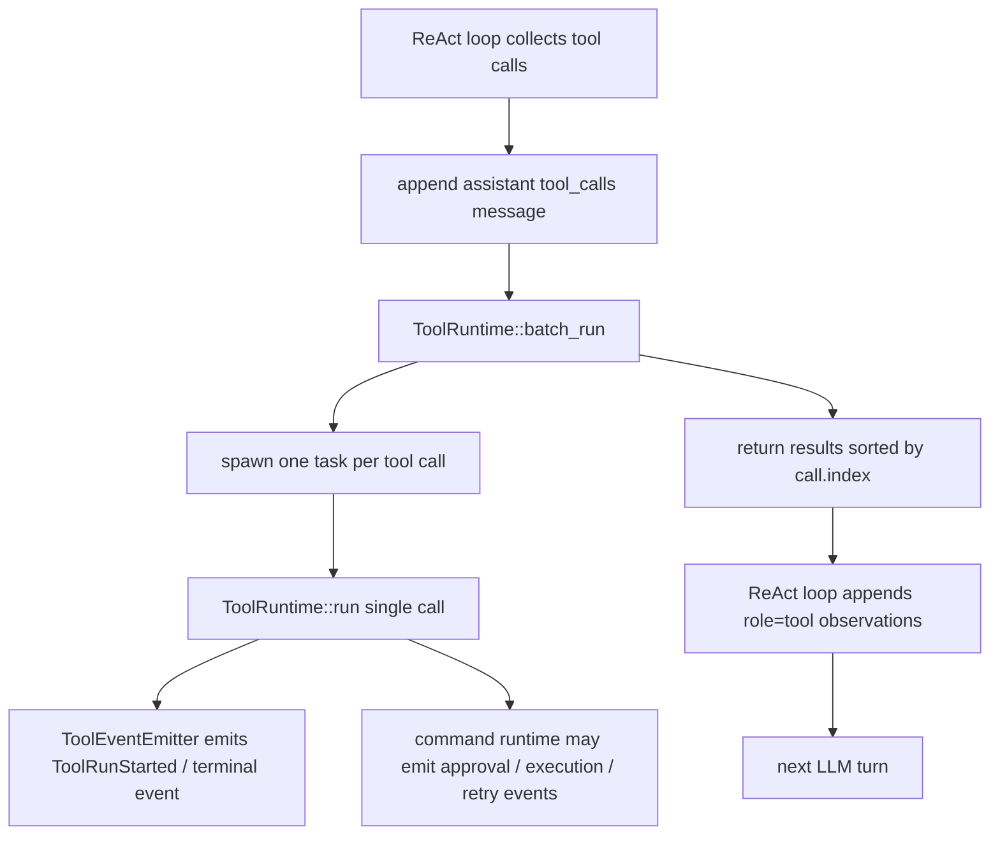

# Slice 9 Parallel Tool Runtime Review

## Learning Navigation

- Final artifact: `demo/README.md`
- Current stage: `08-demo-coder`
- Current slice: Slice 9 Multi-Tool Independent Execution
- Current implementation: `ToolRuntime::batch_run` handles batch scheduling; `ToolEventEmitter` handles tool-level terminal events; `react.rs` handles transcript observation.
- Result: 当前实现可以作为 Slice 9 checkpoint。

## Current Boundary



职责划分是清楚的：

- `react.rs`：维护 model turns、assistant message 和 `role=tool` observation。
- `ToolRuntime::batch_run`：同批 tool call 的并发调度和稳定结果收集。
- `ToolRuntime::run`：单个 tool call 的 plan / execute。
- `ToolEventEmitter`：统一发送 `ToolRunStarted`、`ToolRunFinished`、`ToolRunFailed`。
- `tool::shell`：处理 command approval、execution attempt、retry decision。

## Semantics

- 同批 tool calls 互不影响，一个失败或被拒不会取消其他 call。
- 所有 call 都会得到模型可见 observation。
- tool run start / finish events 反映真实 runtime 生命周期，不要求按 index 顺序出现。
- `batch_run` 返回值按 `call.index` 稳定排序，保证下一轮 LLM 看到的 tool observations 可预测。
- `Denied` 对外表现为 `ToolRunFailed` event，并在 observation 中写成 `tool denied: ...`。

## Tests

当前测试覆盖：

- pure function success / invalid args / unknown tool。
- `run_command` safe read、network install retry、command failure、dangerous denied、invalid JSON、unmatched capability。
- ReAct 层 mixed batch：success / failed / denied 都独立回灌。
- ReAct 层 tool observations 按 index 写入下一轮 request。
- command trace 顺序：`ToolRunStarted -> CommandExecution* -> ToolRunFinished/Failed`。
- runtime 层并发审批验证：两个 approval-blocked `run_command` 在任一审批通过前都能先透出 `CommandNeedsApproval`。

验证命令：

```bash
cargo test --manifest-path workspaces/02-learning/openai-codex-cli-deep-learning/topics/tools-permissions/demo/Cargo.toml
```

最新结果：65 passed，3 ignored。

## Review Result

没有发现阻塞提交的问题。

当前暂不强制新增独立 `ToolBatchRunner` 类型。`ToolRuntime::batch_run` 已经把 batch 调度从 ReAct loop 中收口，保持了足够清晰的边界。后续只有出现更多 batch policy，例如 `supports_parallel = false`、取消、限流、优先级调度时，再把它提升为独立结构。

## Remaining Risk

- 当前所有 tool 默认可并发；Phase 2 接入真实 OS execution 前，需要重新评估 `run_command` 是否应默认串行或增加 `supports_parallel`。
- `ToolEventEmitter::end` 当前忽略 terminal event send failure；这是 demo 可接受的取舍，不把 UI receiver drop 放大成工具执行失败。
- `split_whitespace` 仍只是 Phase 1 单命令简化；多命令 parser 不属于 Slice 9。
