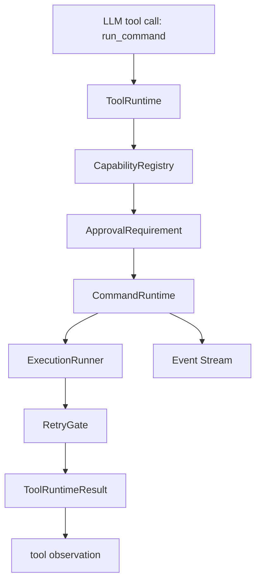

# 09 Business Transfer: 安全本地命令执行模式

## Learning Navigation

- Final artifact: business transfer note + knowledge-base entry
- Source evidence: Codex tool / approval / sandbox 源码阅读，mini demo Phase 1/2 实现与测试
- Current result: 将 `tools-permissions` topic 的学习结果迁移为自有 Agent/CLI 的安全命令执行设计

## Reality Problem

业务 Agent 一旦具备本地命令执行能力，就不再只是“生成文本”。它开始能读文件、写文件、访问网络、安装依赖、启动进程，甚至破坏用户工作区。

因此真实问题不是：

```text
如何给命令做黑白名单？
```

而是：

```text
如何让模型提出的本地动作，经过 host 可解释、可审批、可隔离、可回滚、可观察的执行链路？
```

## First Principles

### 1. 模型意图不等于执行权限

模型只能表达“我想调用 `run_command` 执行某个命令”。它不能直接决定：

- 这个命令属于什么 capability。
- 是否需要审批。
- 是否可以跳过 sandbox。
- sandbox 失败后是否能提权重试。
- 用户一次允许能复用多久。

这些必须由 host runtime 决定。

### 2. 命令风险不只来自字符串

风险判断至少需要这些上下文：

- `argv / command segments`
- `cwd`
- capability policy
- global approval policy
- sandbox profile
- network policy
- retry policy
- approval persistence
- command parsing confidence

这也是为什么“简单字符串黑白名单”不够。

### 3. 默认应 sandbox-first

只要没有明确策略允许绕过，命令应该先在受限环境执行。`Allow` 只表示“初始不用问用户”，不表示“可以裸跑”。

### 4. sandbox failure 不是自动提权

sandbox 失败后要区分：

- 命令本身失败：直接把失败 observation 回给 Agent。
- 权限不足：进入 retry gate。
- retry gate 不允许：结束。
- retry gate 允许但需要审批：暂停，等待用户决定。
- retry gate 允许且无需审批：执行 no-sandbox retry。

### 5. 事件流是信任界面

外部观察者要相信 tool call 没有被偷偷执行，就必须看到关键节点：

```text
ToolCallFinished
ToolRunStarted
CommandNeedsApproval
CommandExecutionStarted
CommandExecutionFinished / Failed
CommandRetryEvaluated
ToolRunFinished / Failed
```

这些事件不只是 UI 装饰，而是安全链路的可验证证据。

## Transfer Design

建议业务 Agent/CLI 采用以下分层：



核心接口：

```text
CommandRequest {
  raw_command
  argv
  cwd
  capability
  approval_policy
  sandbox_profile
  network_policy
  justification
}

CapabilityDescriptor {
  command_prefixes
  default_decision
  first_attempt_sandbox
  network_policy
  retry_policy
}

ApprovalScope {
  command_prefix
  cwd
  sandbox_profile
  network_policy
  persistence
}
```

## Minimal Adoption Plan

### Step 1: 只开放少量 capability

先支持：

- `safe-read`: `ls`, `cat`
- `safe-test`: `cargo test`, `npm test`
- `approval-test`: `echo approval-test`

不要一开始开放任意 shell。

### Step 2: sandbox-first execution

把执行抽成 `ExecutionRunner`：

```text
ExecutionRunner::run(CommandRequest, ExecutionAttempt) -> ExecutionResult
```

本地开发可以先用 simulated runner 验证状态机，再接 OS sandbox。

### Step 3: approval scope 绑定执行上下文

用户点击一次允许时，不只绑定命令名，还要绑定：

- command prefix
- cwd
- sandbox profile
- network policy
- persistence

### Step 4: 把 events 当成 API

UI、日志、测试都消费同一套事件。不要让 UI 自己猜测内部状态。

### Step 5: 再考虑复杂命令解析

多命令、pipe、heredoc、shell expansion 不应该一开始就靠 `split_whitespace` 扛住。等单命令链路稳定后，再引入 command segment parser 和 complex parsing fallback。

## What To Copy

- 模型意图与 host capability 分离。
- `Allow != bypass sandbox`。
- approval scope 必须绑定执行上下文。
- sandbox denied 后走 retry gate，而不是自动裸跑。
- session approval 用 runtime 生命周期承载。
- tool events 和 command events 分层透出。

## What To Simplify

- 初期不做跨平台 OS sandbox。
- 初期不做 host 级网络审批。
- 初期不做持久化 approval policy 文件。
- 初期不做完整 TUI/MCP elicitation。

## What Not To Copy Blindly

- 不要把 Codex 的所有 policy 组合一次性搬进业务系统。
- 不要因为 Codex 支持 no-sandbox retry，就默认业务场景也允许。
- 不要把 prefix matching 当成复杂 shell 的最终安全边界。
- 不要把 session approval 做成跨用户、跨 workspace 的全局缓存。

## Business Checklist

- [ ] 哪些命令是业务必需的？
- [ ] 每类命令最低需要什么文件权限？
- [ ] 哪些命令需要网络？
- [ ] 用户是否能理解 approval scope？
- [ ] session approval 是否会扩大风险？
- [ ] sandbox 失败后是否允许 no-sandbox retry？
- [ ] 事件流是否足够解释每一次执行？
- [ ] 失败 observation 是否能帮助 Agent 自我修复？

## Acceptance Criteria

业务迁移方案只有在以下条件满足时才算可用：

- Agent 不能绕过 host runtime 执行本地命令。
- 未匹配 capability 的命令 fail closed。
- 需要审批的命令能暂停并等待用户决定。
- 用户拒绝后命令不会执行。
- sandbox denied 不会自动裸跑。
- 所有关键安全节点都能在 UI / logs / tests 中观察到。

## Transfer Boundary

当前 demo 证明的是“安全执行链路的结构”。它不证明：

- `split_whitespace` 足以安全解析复杂 shell。
- macOS `sandbox-exec` 能覆盖所有平台。
- 当前 UI 已达到生产级可用性。
- 所有业务场景都应该允许 session approval 或 no-sandbox retry。

迁移时要保留结构，不要照搬所有局部策略。
