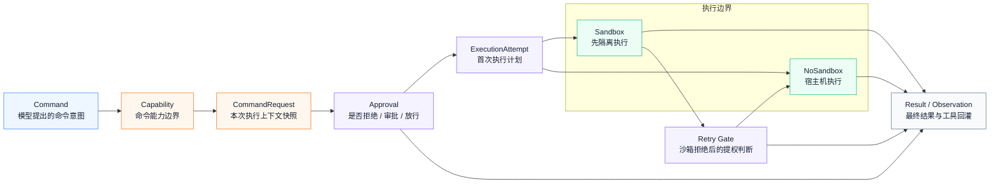
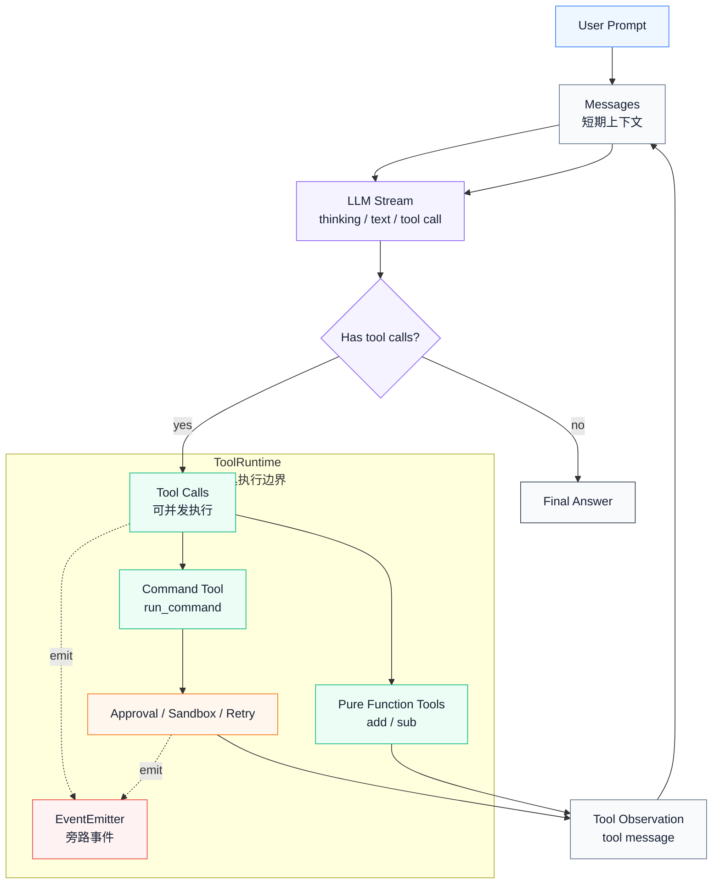
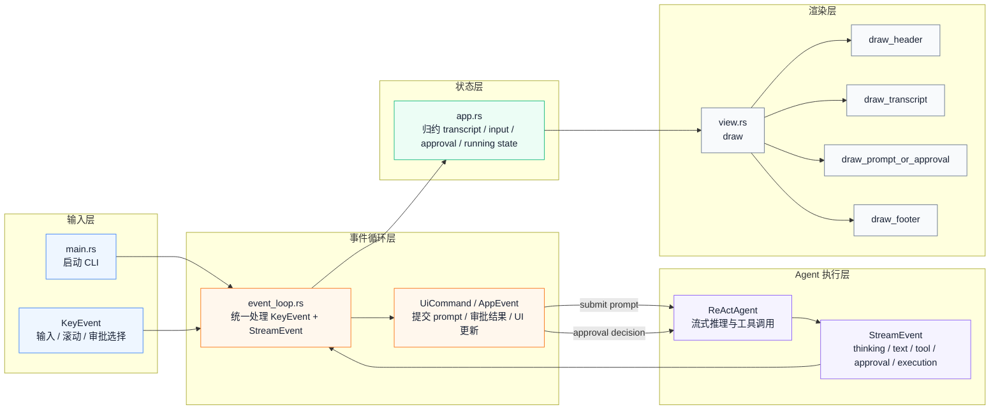

# Codex Tools-Permissions Closeout

这次学习最初想解决的问题是：Agent 为什么不能直接把模型生成的 `command string` 拿去执行？现在我的理解是，本地命令执行不是一个“调用函数”的问题，而是一个“受控副作用”的问题。

命令一旦进入本机环境，就会带上很多现实约束：它在哪个 `cwd` 执行、会不会读写文件、会不会联网、是否可能安装依赖、是否可能扩大权限、失败后能不能重试、用户有没有真的授权。只看命令字符串是不够的，必须把命令和上下文一起判断。

## 我现在理解的核心链路

我会把这条链路重建成：

```text
tool call
-> capability match
-> approval requirement
-> sandbox first
-> retry / escalation
-> observation / event
```

每一步存在的原因不一样：

- `tool call`：模型只表达“我要调用什么工具、参数是什么”，不能直接拥有执行权。
- `capability match`：Host 要把工具请求映射成能力边界。它要知道这是安全读、普通命令、危险 shell，还是未知能力。未知能力应该 fail closed。
- `approval requirement`：判断这次调用是直接拒绝、需要用户审批，还是可以免审批继续。
- `sandbox first`：审批和沙箱不是一个层级。允许执行不等于允许裸跑；即使不需要审批，也可能仍然要先在沙箱中尝试。
- `retry / escalation`：沙箱失败后不能自动裸跑，要区分是命令自身错误，还是权限边界导致失败；只有符合策略时，才允许请求用户批准后提权重试。
- `observation / event`：外部必须能看到审批、执行、沙箱、重试、结果这些关键节点，否则用户无法相信工具没有被绕过执行。

## 我会保留的设计不变量

如果我要给自己的 Agent/CLI 设计本地命令执行链路，我会忠实保留这些不变量：

- 模型只产生意图，Host 才能做权限判断。
- 工具调用必须先匹配 capability，匹配不到就不能默认放行。
- `Allow / Skip approval` 不等于 `bypass sandbox`。
- 沙箱失败不能自动裸跑，必须经过 retry policy 和 approval gate。
- 用户授权必须绑定 scope，至少要考虑命令范围、`cwd`、sandbox、network、persistence。
- 关键安全事件必须对外可观测，包括 approval、run started、run failed、retry decision、tool observation。

## 我不会无脑照搬的部分

Codex 的设计非常适合 local coding agent，因为它面对的是本地 shell、文件系统、网络、安装依赖这些高风险能力。但我的很多 Agent 场景可能是线上服务，工具不是任意 shell，而是更明确的业务 action。

所以我不会直接照搬 Codex 的“命令级权限模型”到所有场景。真正要迁移的是它的思想：

- 权限判断要由 Host 做，而不是由模型自己声明。
- 审批要尽量准确，既不能太宽，也不能频繁打扰用户。
- 授权 scope 要和现实风险绑定，而不是只绑定工具名。
- 事件要服务信任、调试和 UI，而不是为了“看起来很完整”。

换成线上 Agent 时，权限粒度可能更适合绑定到用户、workspace、业务资源、业务 action，而不是绑定到 shell prefix。Codex 给我的启发不是“所有系统都要长成这样”，而是：只要 Agent 能产生副作用，就必须有 capability、approval、isolation/retry 和 observability 这几类边界。

## Demo 和生产的边界

这次 demo 里有些东西是为了学习而简化，不代表生产环境不需要。

比如复杂 shell parser、真实 OS sandbox、完整 TUI/MCP 细节、跨 session 的权限持久化、多 workspace / 多用户隔离，这些在 demo 阶段可以暂缓，但如果进入生产环境，就必须重新评估。

所以我的结论是：demo 不是生产实现，但 demo 必须保留核心不变量。它要让我真正感受到 Codex 为什么这么分层，以及这些分层在现实系统里解决了什么问题。

## Closeout 图

这次画图最大的体会是：图不能贪心。

如果一张图试图同时表达完整逻辑、异常分支、事件流、依赖关系和状态回灌，它很快就会变得很高级、很细节，但也很难读。更好的方式是：

```text
图负责建立空间感：有哪些层、主方向怎么流动、谁依赖谁。
文字负责建立判断力：为什么要这样分层、关键分支在哪里、哪些点不能误解。
```

所以我希望 closeout 里的图优先表达分层和方向；关键决策点、特殊分支和 trade-off，则放在图后的文字里解释。

### 工具 & 权限系统

这张图表达的是：本地命令不是从模型直接进入执行器，而是先被 Host 接管，经过 capability、approval、sandbox、retry 之后，才形成最终结果。



这张图只画主方向，几个容易误解的决策点用文字说明：

- `Approval` 和 `Sandbox` 不是一个层级。`Allow / Skip approval` 不等于 `NoSandbox`。
- `Sandbox` 成功或普通命令失败都直接进入 `Result`，只有 sandbox 边界导致的拒绝才进入 `Retry Gate`。
- `Retry Gate` 不是自动提权，它仍然要受 retry policy、approval policy 和用户审批结果约束。
- `StreamEvent` 是旁路观测，不是执行主链路；它服务的是信任、调试和 UI。

### ReAct Loop

这张图表达的是：ReAct 不是一次性调用工具，而是通过 `messages` 形成循环。工具执行结果不会直接变成最终答案，而是先回灌为 tool message，再交给模型进入下一轮推理。



这张图只保留 ReAct 的主闭环：

- ReAct 的核心不是“模型调用工具”，而是 `messages -> LLM -> tool calls -> observations -> messages`。
- 工具结果不会直接变成最终答案，而是先变成 `tool message`，再让模型基于新上下文继续推理。
- `ToolRuntime` 内部可以包含 pure function、command、approval、sandbox、retry、event，但这些不应该抢走 ReAct 主循环的注意力。
- `EventEmitter` 是旁路，它服务 UI 和可观测性；真正驱动下一轮推理的是 `Tool Observation -> Messages`。

### Demo CLI 分层

这张图表达的是：CLI 不直接 print Agent 输出，而是把用户输入和 Agent 事件统一交给事件循环，再归约成状态，最后由 view 渲染。



关键点是：CLI 的核心不是终端输出，而是事件驱动。用户操作和 Agent 流式事件都先进入事件循环，再更新状态，再由渲染层稳定展示。
